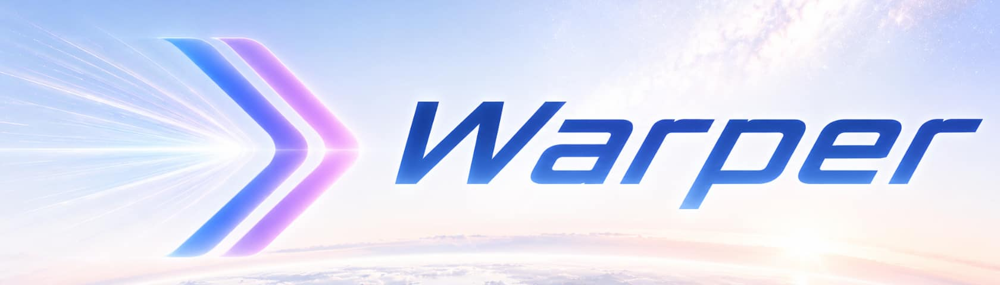

<p align="center">
  <picture>
    <source media="(prefers-color-scheme: dark)" srcset="public/warper_banner_dark.jpg">
    <source media="(prefers-color-scheme: light)" srcset="public/warper_banner_light.jpg">
    
  </picture>
</p>

> **warper** /ˈwɔːpə(r)/ *adj.* — comparative form of *warp*; more warp than the thing being compared to.
> 
> **example:** *"I just wanted a terminal. But warper."*
> 
> **antonym:** *a terminal that asks for your email before it lets you `cd`.*

<p align="center">
  
</p>

<p align="center"><sub>Warper is a hard fork of <a href="https://www.warp.dev">Warp</a>. It keeps the terminal and drops the platform that grew around it.</sub></p>

---

## Why this exists

Warp is a good terminal that picked up a lot of other product over time. We didn't want any of it, so we forked, removed it, and rewired the AI hook to OpenRouter.

---

## What's in

### Terminal

Native Rust app with blocks, panes, tabs, session restoration, command history, shell integration, command palette, themes, keybindings, launch configs, local workflows, and a background image picker.

### AI (optional, BYOK, BYOA)

Small scope: generate or explain a shell command, explain an error, suggest a safer variant of a risky command, summarise selected output. OpenRouter is the supported provider, configurable in Settings or via `OPENROUTER_API_KEY` and `OPENROUTER_MODEL`.

Type `codex` and Warper notices you're running Codex; same for `claude`, `gemini`, and others. It adds a status indicator, optional rich input, and a finish notification, but doesn't try to wrap the agent CLI in its own UI. The shell already does that job.

---

## What's out

If a feature needs an account, a server, a billing entitlement, a team object, a shared session, or any Warp.dev infrastructure, it's out of scope. Specifically removed:

- Accounts, sign-up, sign-in, SSO, anonymous cloud users, subscriptions
- Billing, plans, credits, usage limits, upgrade prompts
- Warp Drive, team drives, shared-with-me, cloud trash
- Teams, enterprise admin, ACLs, roles, audit, hosted workspaces
- Session sharing, remote control, RTC presence, link collaboration
- Oz, cloud agents, and hosted task orchestration
- Telemetry upload, hosted crash reporting, RudderStack, Sentry, Warp-hosted autoupdate

These are deleted from the product surface, not toggled off behind a flag.

---

## Local data

Settings live in files on disk. API keys live in your keychain. Nothing is uploaded by default. On macOS:

| Thing | Location |
|---|---|
| OpenRouter key and model | Keychain, service `dev.warper.Warper`, account `AiApiKeys` |
| User settings | `~/.warp-oss/settings.toml` |
| Runtime state, cache, DB | `~/Library/Application Support/dev.warper.Warper/` |
| Logs | `~/Library/Logs/warper.log` |

---

## Building locally

```bash
./script/bootstrap
./script/run
```

Useful checks:

```bash
./script/presubmit
./script/warper_offline_local_smoke
./script/check_warper_static_denylist all-runtime
```

On macOS, `./script/run` produces `target/debug/bundle/osx/Warper.app`. Engineering notes inherited from upstream live in [WARP.md](WARP.md).

---

## Upstream, license, and credits

This project is independent from Warp.dev. The names "Warp" and "Warp.dev", the related marks, and the hosted services belong to their respective owners. Warper exists because the Warp team released enough of their code to make a fork like this possible. Please don't report Warper-specific bugs against upstream Warp unless they also reproduce there.

The upstream licensing structure is preserved:

- `warpui_core` and `warpui` are MIT-licensed. See [LICENSE-MIT](LICENSE-MIT).
- Everything else in this repository is AGPL v3. See [LICENSE-AGPL](LICENSE-AGPL).

Downstream users and contributors should preserve upstream notices and comply with the applicable licenses.

A few of the load-bearing open-source dependencies inherited from Warp:

- [Tokio](https://github.com/tokio-rs/tokio)
- [NuShell](https://github.com/nushell/nushell)
- [Fig Completion Specs](https://github.com/withfig/autocomplete)
- [Warp Server Framework](https://github.com/seanmonstar/warp)
- [Alacritty](https://github.com/alacritty/alacritty)
- [Hyper](https://github.com/hyperium/hyper)
- [FontKit](https://github.com/servo/font-kit)
- [Core Foundation Rust bindings](https://github.com/servo/core-foundation-rs)
- [Smol](https://github.com/smol-rs/smol)

Thanks to all of them.

---
