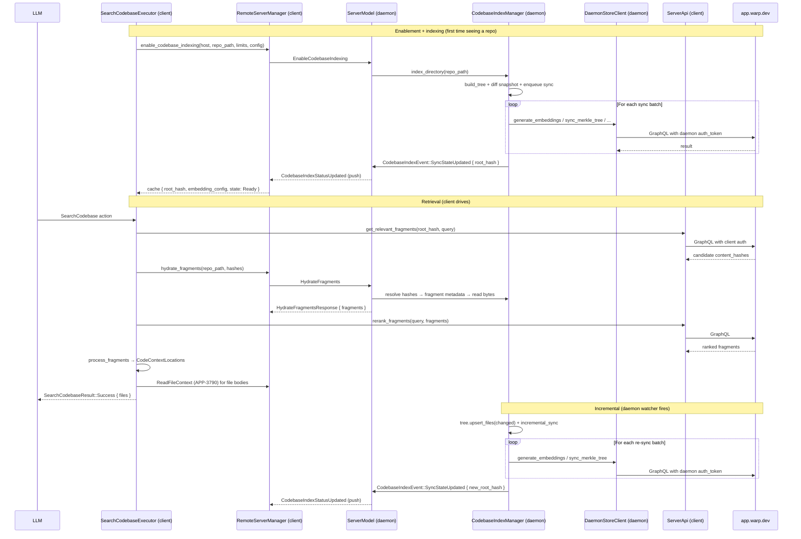

# APP-3792: Remote Codebase Indexing — TECH.md

Behavior is specified in `specs/APP-3792/PRODUCT.md`. This document plans the implementation: what moves to the remote-server daemon, what stays on the client, the protocol surface, and the porting audit for the indexing crate.

## 1. Context

### Dependencies

This plan assumes the following have landed before work starts:

- **APP-3801** — per-daemon authentication. The daemon holds a Warp bearer token in `ServerModel::auth_token`, populated by `Initialize` and refreshed via `Authenticate`. Its explicit goal is letting daemon handlers make authenticated upstream calls to `app.warp.dev` on the user's behalf. Firewalled-egress reachability has been confirmed acceptable by 2 enterprise customers.
- **APP-4068** — daemon topology with socket paths partitioned by Warp identity (`~/.warp/remote-server/{identity_key}/server.sock`). Each Warp user gets their own daemon process; ~10-minute grace period after last disconnect.
- **APP-3790** — `ReadFileContext` RPC for batch file reads. Retrieval reuses this for final file-content hydration.

### Current indexing architecture (client-side)

All of this lives under `crates/ai/src/index/full_source_code_embedding/` and is wired up as a singleton in `app/src/lib.rs` via `CodebaseIndexManager::new`.

- `crates/ai/src/index/full_source_code_embedding/manager.rs:167` — `CodebaseIndexManager`; `HashMap<PathBuf, ModelHandle<CodebaseIndex>>`, build queue, snapshot persistence, `BulkFilesystemWatcher` subscription.
- `crates/ai/src/index/full_source_code_embedding/codebase_index.rs:147` — `CodebaseIndex`; per-repo merkle tree, sync state machine, retrieval.
- `crates/ai/src/index/full_source_code_embedding/sync_client.rs:141` — `CodebaseIndexSyncOperation`; full and incremental sync, `sync_merkle_tree` → `generate_embeddings` → `update_intermediate_nodes`.
- `crates/ai/src/index/full_source_code_embedding/store_client.rs` — `StoreClient` trait, the auth-requiring seam.
- `crates/ai/src/index/full_source_code_embedding/snapshot.rs:172` — snapshot I/O rooted at `warp_core::paths::secure_state_dir()`.
- `crates/ai/src/index/full_source_code_embedding/chunker.rs:92` — tree-sitter-semantic-with-naive-fallback chunker.
- `app/src/server/server_api/ai.rs:2126` — `impl StoreClient for ServerApi`; the 7 authenticated GraphQL calls.
- `app/src/ai/blocklist/action_model/execute/search_codebase.rs` — `SearchCodebaseExecutor`; dispatches retrieval through `GetRelevantFilesController`, then hydrates via `read_local_file_context`.
- `app/src/ai/get_relevant_files/controller.rs:190` — `GetRelevantFilesController::send_request`; calls `CodebaseIndexManager::retrieve_relevant_files`.
- `app/src/ai/agent/api/impl.rs:170-192` — `get_supported_tools`; `SearchCodebase` currently excluded from `WarpifiedRemote { host_id: Some(_) }`.

### Remote-server plumbing already in place

- `crates/remote_server/proto/remote_server.proto` — `ClientMessage`/`ServerMessage` envelopes; `NavigatedToDirectory`, `ReadFileContext`, etc.
- `app/src/remote_server/server_model.rs` — `ServerModel`; dispatch, `spawn_request_handler` pattern, `pending_file_ops` pattern.
- `crates/remote_server/src/manager.rs:113` — `RemoteServerManager` singleton; `client_for_session`, event subscription.
- `app/src/remote_server/mod.rs:23` — headless daemon entry; already registers `DirectoryWatcher`, `DetectedRepositories`, `RepoMetadataModel`, `FileModel`, `ServerModel`.

## 2. Architectural choice: split-retrieval (A-prime)

The pipeline has two logical halves that don't both belong on the same side of the SSH boundary:

- **Filesystem-local work** — tree build, chunking, fragment reads, filesystem watching, snapshot persistence. Must run on the daemon, where the files live.
- **Authenticated backend work** — the 7 `StoreClient` calls. Must run somewhere that has the user's auth token.

APP-3801 lets the daemon make authenticated calls, which unblocks running the sync path on the daemon (no fragment bytes over SSH during the heavy initial-sync phase). But for retrieval specifically, once the client knows the current root hash, it can skip the daemon hop entirely and call `get_relevant_fragments` and `rerank_fragments` directly to the backend from the user's machine, using the existing `ServerApi` it already has.

The resulting split:

- **Daemon owns sync.** `CodebaseIndexManager`, `CodebaseIndex`, `sync_client`, and a daemon-side `StoreClient` impl all run in `ServerModel`. All `generate_embeddings` / `sync_merkle_tree` / `update_intermediate_nodes` / `codebase_context_config` / `populate_merkle_tree_cache` traffic goes daemon → `app.warp.dev`.
- **Client drives retrieval.** Client holds `{enabled, root_hash, embedding_config}` per `(host_id, repo_path)`. `SearchCodebaseExecutor` routes remote searches through the client's existing `ServerApi`, hitting `get_relevant_fragments` and `rerank_fragments` directly. The daemon only participates in retrieval via a narrow "hydrate these content hashes into fragment bytes" RPC.
- **Filesystem stays on the daemon.** Tree building and watcher reuse `Repository::build_tree` + `BulkFilesystemWatcher` exactly as local indexing does today.
- **Snapshots persist on remote disk**, scoped by Warp identity (inheriting APP-4068's socket-path partitioning).

Rejected alternatives:

- *Pure daemon-driven retrieval:* daemon orchestrates `get_relevant_fragments` → `rerank_fragments` → `CodeContextLocation`s and returns to client. Costs one SSH round trip per retrieval that the split approach avoids (~50–200 ms on typical links), for no benefit — the backend calls are small and the client can make them directly.
- *Client-driven sync:* all `StoreClient` calls on the client, daemon serves fragment bytes on demand. Requires shipping every leaf fragment's bytes over SSH during initial sync (~10s of MB for a 5k-file repo). Loses the whole point of APP-3801.

## 3. Proposed changes

### 3.1 Extract `codebase_index` crate

`crates/ai` pulls in `warp_multi_agent_api`, `warp_terminal`, `rmcp`, and other client-only concerns via its `agent/` and `skills/` modules. Bringing all of `ai` into the daemon would double its binary footprint for no benefit.

Create `crates/codebase_index/`, containing exactly:

- `crates/ai/src/index/full_source_code_embedding/` (all 13 modules)
- `crates/ai/src/workspace.rs` (the Diesel bridges feature-gated)
- `crates/ai/src/index/locations.rs`
- The `AITelemetryEvent` portion of `crates/ai/src/telemetry.rs`

Re-export from `ai` so existing client call sites are unchanged. Daemon depends only on `codebase_index`.

Dependency footprint of the new crate: `warpui`, `warp_core`, `warp_graphql`, `warp_util`, `repo_metadata`, `persistence` (feature-gated), `arborium` + `languages` + `syntax_tree`, `ignore`, `notify-debouncer-full`, `watcher`, `chrono`, `sha2`, `bincode`, `priority-queue`, `string-offset`. All daemon-compatible.

### 3.2 Module-by-module porting audit

| Module | Portability | Changes needed |
|---|---|---|
| `manager::CodebaseIndexManager` | Portable | Constructor takes a daemon-side store-client + persistence backend. `persisted_index_metadata` comes from a JSON store (§3.4) rather than SQLite. `handle_active_session_changed` becomes a no-op on the daemon; build-queue priority on an index is driven by `EnableCodebaseIndexing` RPC arrival. |
| `codebase_index::CodebaseIndex` | Portable as-is | Pure logic over `Repository` + `MerkleTree` + `StoreClient`. |
| `sync_client` | Portable as-is | Pure state machine. |
| `store_client::StoreClient` | Trait stays | Net-new impl (§3.3). |
| `snapshot` | Portable w/ param | `snapshot_dir()` takes an explicit base dir. Daemon passes the identity-scoped path. Client keeps its existing `secure_state_dir`-rooted behavior. `migrate_snapshots_to_secure_dir_if_needed` stays client-only. |
| `merkle_tree` | Portable as-is | Pure datastructure. |
| `chunker` | Portable as-is | Tree-sitter grammars + rayon threadpool init. Adds ~5 MB to daemon binary; acceptable. |
| `fragment_metadata`, `priority_queue`, `changed_files` | Portable as-is | None. |
| `workspace::WorkspaceMetadata` | Portable w/ feature gate | `From<persistence::model::*>` conversions gated behind a `sqlite_persistence` feature; daemon doesn't enable it. |
| `AITelemetryEvent` | Portable w/ transport | `send_telemetry_from_ctx!` has no path on the daemon today. Push events through a new `RemoteTelemetryEvent` message; client re-emits them into its pipeline. Follow-up: daemon-direct telemetry. |

Feature-flag call sites (`FeatureFlag::FullSourceCodeEmbedding`, `CodebaseIndexPersistence`, `CrossRepoContext`) can't read user preferences on the daemon. The client serializes flag state into `EnableCodebaseIndexing`'s `IndexingConfig` payload (§3.5); daemon-side call sites read from that config instead of `is_enabled()`. Roughly 6 call sites across `manager.rs` + `codebase_index.rs`.

### 3.3 Daemon-side `StoreClient` implementation

Net-new, ~300 lines. A minimal HTTP + cynic client with no `AuthState` / `ServerApi` dependency.

Lives at `app/src/remote_server/codebase_store_client.rs`:

```rust path=null start=null
pub struct DaemonStoreClient {
    http: Arc<http_client::Client>,
    server_root: Url,
    auth_token: Arc<parking_lot::RwLock<Option<String>>>,
}

impl DaemonStoreClient {
    async fn send_graphql<Op>(&self, op: Op) -> Result<Op::ResponseData, Error> {
        let token = self.auth_token.read()
            .clone()
            .ok_or(Error::Unauthenticated)?;
        self.http.post(self.server_root.join("/graphql/v2"))
            .bearer_auth(token)
            .json(&op)
            .send()
            .await?
            .json()
            .await
    }
}

#[async_trait]
impl StoreClient for DaemonStoreClient {
    // 7 methods, each constructing the cynic op the client uses today and
    // calling send_graphql.
}
```

The `auth_token` slot is the same `RwLock<Option<String>>` that `ServerModel` writes to on `Initialize`/`Authenticate`. Shared by `Arc`, so rotation is transparent.

Errors are coarse on day 1: `Unauthenticated`, `TransportError`, `ServerError { code, message }`. Granular surfacing (e.g. distinguishing "upstream unreachable" from "backend returned 500") goes in follow-up.

### 3.4 Daemon-side persistence

Snapshots: `~/.warp/remote-server/{identity_key}/codebase-indexes/snapshot_<hash(repo_path)>`, using the existing `snapshot.rs` serialization format. Dropping per-repo index clears its snapshot.

Metadata (the SQLite `codebase_index_metadata` equivalent): `~/.warp/remote-server/{identity_key}/codebase-indexes/metadata.json`. Trivial schema — a single JSON object of `{ repo_path: { navigated_ts, modified_ts, queried_ts } }`. Read on daemon startup into `CodebaseIndexManager::new`'s `persisted_index_metadata` arg. Written on every `WorkspaceMetadataEvent` emit. Atomic replace (tmp + rename) to prevent partial writes.

APP-4068's daemon-identity partitioning gives per-user isolation for free — a second Warp user on the same host has their own `{identity_key}` directory and sees no shared state.

### 3.5 Protocol additions

Five new RPCs plus two push messages on `crates/remote_server/proto/remote_server.proto`.

```protobuf path=null start=null
// ── Client → server ─────────────────────────────────────────────

message EnableCodebaseIndexing {
  string repo_path = 1;
  IndexingLimits limits = 2;
  IndexingConfig config = 3;
}

message IndexingLimits {
  optional uint32 max_indices = 1;
  uint32 max_files_per_repo = 2;
  uint32 embedding_generation_batch_size = 3;
}

message IndexingConfig {
  bool full_source_code_embedding_enabled = 1;
  bool codebase_index_persistence_enabled = 2;
  bool cross_repo_context_enabled = 3;
}

message GetIndexStatus { string repo_path = 1; }

message DropIndex { string repo_path = 1; }

message RetryIndexing { string repo_path = 1; }

message HydrateFragments {
  string repo_path = 1;
  repeated ContentHashProto content_hashes = 2;
}

// ── Server → client (responses) ──────────────────────────────────

message EnableCodebaseIndexingResponse {}  // Ack; status flows via push.

message GetIndexStatusResponse {
  optional IndexStatus status = 1;
}

message DropIndexResponse {}
message RetryIndexingResponse {}

message HydrateFragmentsResponse {
  repeated FragmentProto fragments = 1;
  repeated ContentHashProto missing_hashes = 2;
}

// ── Shared ───────────────────────────────────────────────────────

message IndexStatus {
  IndexState state = 1;  // Indexing, Ready, Stale, Failed, Disabled
  optional SyncProgressProto progress = 2;
  optional string failure_reason = 3;
  optional NodeHashProto root_hash = 4;
  optional EmbeddingConfigProto embedding_config = 5;
}

message FragmentProto {
  string content = 1;
  ContentHashProto content_hash = 2;
  FragmentLocationProto location = 3;
}

// ── Server → client (push messages) ──────────────────────────────

message CodebaseIndexStatusUpdated {
  string repo_path = 1;
  IndexStatus status = 2;
}

message RemoteTelemetryEvent {
  string event_name = 1;
  bytes payload_json = 2;
}
```

`EnableCodebaseIndexing` is abortable via the existing `Abort` pattern but is intended to kick off long-running work. `HydrateFragments` is a synchronous request/response using `spawn_request_handler` like `ReadFileContext`. `CodebaseIndexStatusUpdated` is pushed as the daemon's `CodebaseIndexManager` subscription fires events.

### 3.6 Daemon wiring

`app/src/remote_server/mod.rs` registers the new singleton and its dependencies:

```rust path=null start=null
AppBuilder::new_headless(...).run(|ctx| {
    // existing singletons: DirectoryWatcher, DetectedRepositories,
    //   RepoMetadataModel, FileModel, ServerModel
    ctx.add_singleton_model(|ctx| {
        let auth_token = ServerModel::handle(ctx)
            .as_ref(ctx)
            .auth_token_slot();
        let store_client = Arc::new(DaemonStoreClient::new(auth_token));
        CodebaseIndexManager::new(
            load_persisted_metadata(),
            /* limits populated from config RPC on enable */ Default::default(),
            store_client,
            ctx,
        )
    });
})?;
```

`ServerModel::handle_message` gets new arms for each RPC, dispatching to `CodebaseIndexManager::handle(ctx).update(...)`. `ServerModel` subscribes once to `CodebaseIndexManagerEvent` and fans out:

- `RetrievalRequestCompleted` / `RetrievalRequestFailed` — not wired (daemon doesn't handle retrieval).
- `SyncStateUpdated`, `IndexMetadataUpdated` — translated to `CodebaseIndexStatusUpdated` push.
- `NewIndexCreated` — translated to a `CodebaseIndexStatusUpdated` with `state: Indexing`.

### 3.7 Client-side changes

- `app/src/ai/agent/api/impl.rs` — add `ToolType::SearchCodebase` to the `WarpifiedRemote { host_id: Some(_) }` arm, gated on `FeatureFlag::RemoteCodebaseIndexing` and on the corresponding repo having a `Ready` index status.
- `app/src/ai/get_relevant_files/controller.rs` — `RequestHandle` gains a `RemoteRetrieval { host_id, retrieval_id }` variant. `send_request` branches on session type; the remote path uses the cached root hash and embedding config to call `ServerApi::get_relevant_fragments` directly.
- `app/src/ai/blocklist/action_model/execute/search_codebase.rs` — after retrieval, file-body hydration for remote results uses the APP-3790 `ReadFileContext` path instead of `read_local_file_context`.
- New `RemoteCodebaseIndexModel` (singleton on client) — subscribes to `RemoteServerManagerEvent::CodebaseIndexStatusUpdated`, maintains `HashMap<(HostId, PathBuf), RemoteIndexState>` where `RemoteIndexState = { state, root_hash, embedding_config, progress }`. The `Retrieval` path reads from here; settings UI reads from here.
- `app/src/settings_view/code_page.rs` — settings page learns to show remote entries. Add "Enable automatic indexing on remote hosts" toggle.
- `app/src/ai/blocklist/codebase_index_speedbump_banner.rs` — extend with a remote-badge variant and wire opt-in to dispatch `RemoteServerClient::enable_codebase_indexing` instead of the local `CodebaseIndexManager::index_directory`.

### 3.8 Dispatch flow for retrieval

Keeping `RemoteCodebaseIndexModel` as the single source of truth for "is this remote repo ready":

1. `SearchCodebaseExecutor::execute` reads `active_session.session_type(ctx)`.
2. If `WarpifiedRemote { host_id: Some(_) }` and `FeatureFlag::RemoteCodebaseIndexing.is_enabled()`:
    a. Look up the repo's `RemoteIndexState` via `RemoteCodebaseIndexModel`. If not `Ready`, return `SearchCodebaseResult::Failed { reason: IndexSyncing | IndexFailed }` with the appropriate message.
    b. Call `ServerApi::get_relevant_fragments(root_hash, query, embedding_config, repo_metadata)` from the client. Returns `Vec<ContentHash>`.
    c. Call `RemoteServerClient::hydrate_fragments(repo_path, hashes)` over SSH. Returns `Vec<Fragment>` with content + locations.
    d. Call `ServerApi::rerank_fragments(query, fragments)`. Returns ranked fragments.
    e. Run `process_fragments` locally to produce `HashSet<CodeContextLocation>`.
    f. Dispatch the locations into `read_file_context` via the APP-3790 `ReadFileContext` path (not `read_local_file_context`).
    g. Return `SearchCodebaseResult::Success { files }` to the LLM.
3. Otherwise, existing local path unchanged.

### 3.9 Feature flag and rollout

`FeatureFlag::RemoteCodebaseIndexing`, added via the standard recipe in `crates/warp_features/src/lib.rs` and `app/src/lib.rs`. Off by default. Promoted to `DOGFOOD_FLAGS` once the daemon wiring is stable end-to-end, then to `PREVIEW_FLAGS`.

Checked only in:

- `get_supported_tools` / `get_supported_cli_agent_tools` — determines whether `SearchCodebase` is advertised to the LLM in remote sessions.
- `SearchCodebaseExecutor::execute` — dispatch gate.
- Speedbump banner remote branch — determines whether remote repos are offered for indexing.

The daemon doesn't read the flag. If an `EnableCodebaseIndexing` RPC arrives, it acts on it. This decouples daemon rollouts from client flag state — a shipped daemon keeps working when the client flag is toggled on/off.

## 4. End-to-end flow



## 5. Testing and validation

- **Unit tests** in the new `codebase_index` crate: all existing `codebase_index_tests.rs`, `sync_client_tests.rs`, `snapshot_tests.rs`, `chunker/*_tests.rs`, `merkle_tree/*_test.rs` move with the crate and run unchanged. Validates Behavior §16 (persistence), §17 (incremental re-sync), §20 (filesystem permissions — existing tests already exercise `is_file_parsable`).

- **`DaemonStoreClient` unit tests**: each of the 7 `StoreClient` methods constructs the correct cynic operation, handles `Unauthenticated` when the token slot is empty, propagates `TransportError` on network failure. Validates Behavior §22 / §23 (firewalled host error reporting) by injecting network failures.

- **`ServerModel` RPC handler tests**: headless `ServerModel` with a fixture `auth_token` and a mock `DaemonStoreClient`. Drive each RPC (`EnableCodebaseIndexing`, `GetIndexStatus`, `HydrateFragments`, `DropIndex`, `RetryIndexing`); assert correct responses and that `CodebaseIndexStatusUpdated` pushes fire on state changes. Validates Behavior §7, §8, §9, §17.

- **Client dispatch test**: mock `RemoteServerClient` + mock `ServerApi`. Drive `SearchCodebaseExecutor::execute` with a `WarpifiedRemote` session; verify remote path calls `get_relevant_fragments` → `hydrate_fragments` → `rerank_fragments` → `ReadFileContext` in order, and that local path is untouched. Validates Behavior §11, §12, §15, §25, §26.

- **Status-state test**: drive `RemoteCodebaseIndexModel` through `Indexing → Ready → Stale → Ready → Failed → Ready` transitions via pushed events; assert that `SearchCodebaseExecutor` gates correctly at each state. Validates Behavior §13, §14.

- **Per-user scoping test**: two `DaemonStoreClient` instances with different auth tokens; assert they never cross-pollinate state. `{identity_key}` path partitioning is already exercised by APP-4068 tests. Validates Behavior §19, §20, §32.

- **Feature-flag matrix**: `cargo nextest` with and without `full_source_code_embedding` feature on the extracted crate, and with `RemoteCodebaseIndexing` on/off on the client. Validates Behavior §27, §30, §31.

- **WASM build regression**: `cargo clippy --target wasm32-unknown-unknown` on the extracted `codebase_index` crate. WoW builds must still compile after the extraction.

- **Manual verification on two target environments**:
    1. Open-egress cloud dev VM (e.g. standard GCE instance). SSH in, navigate to a checked-out repo, verify speedbump offers indexing with remote badge, confirm indexing progress pushes update live in the settings page, invoke agent `SearchCodebase`, assert retrieval latency is within ~200 ms of local for the same query. Validates §1, §6, §7, §11, §15.
    2. Firewalled host (use a dev VM with explicit iptables DROP on outbound 443 to non-allowlist). Repeat the flow; verify status lands in `Failed` with a user-readable reason and a working retry affordance. Validates §22, §23, §24.

## 6. Risks and mitigations

- **Daemon binary size.** Adding `warp_graphql` + tree-sitter grammars + `http_client` costs ~15–20 MB. Acceptable given remote-server binaries are cached per-version on the host. Mitigation: measure before landing; strip debug symbols in release builds.

- **Daemon telemetry gap.** `AITelemetryEvent` uses `send_telemetry_from_ctx!` which has no daemon-side transport. Push-through-client loses per-host attribution but otherwise preserves all events. Follow-up: daemon-side telemetry transport.

- **Feature-flag disagreement between client and daemon.** The daemon trusts the `IndexingConfig` payload the client sends. If the client's flag state is stale when the RPC is sent, the daemon acts on stale config for that indexing job. Mitigation: flags in `IndexingConfig` are experiment hooks, not security boundaries; the authoritative gate (whether to index at all) is whether the client dispatches `EnableCodebaseIndexing` in the first place.

- **Initial-sync cost on a new repo.** The daemon reads every file, chunks, and uploads embeddings over its own egress. For a 5k-file repo, expect ~30–60 seconds of work dominated by `generate_embeddings`. UX: `Indexing` status is clearly communicated with progress; users can continue working.

- **Snapshot corruption or version skew.** If the daemon's on-disk snapshot format becomes incompatible (e.g. after a crate update), `read_snapshot` returns `SnapshotParsingFailed`, the existing cleanup path deletes the snapshot and a full rebuild runs. Matches local behavior.

- **Push-message loss during connection drop.** A `CodebaseIndexStatusUpdated` that was in flight when SSH drops never arrives at the client. On reconnect, the client calls `GetIndexStatus` for each known remote repo to resync its cache. This is cheap and robust.

## 7. Follow-ups

- **Client-proxied `StoreClient` fallback.** If real firewalled deployments need it, add reverse-RPCs so the daemon can proxy `StoreClient` calls through the client's `ServerApi`. The APP-3801 `auth_token` stays unused in that mode. Not planned unless reports come in.

- **Daemon-direct telemetry transport.** Replace `RemoteTelemetryEvent` push-through with a daemon-direct telemetry pipeline once the per-host attribution loss becomes worth the investment.

- **Snapshot sharing across Warp users on the same host.** Current design is per-user. If a shared cache becomes desirable (performance optimization), it requires a cross-user authz story that respects OS-level file-read permissions per fragment — not a trivial follow-up.

- **Cross-repo context on remote.** `FeatureFlag::CrossRepoContext` treats multiple repos as searchable together. First version keeps each remote `repo_path` standalone; the cross-repo path works within a host but not across hosts.

- **Retrieval caching / deduplication.** Identical repeated queries within a session could skip the `get_relevant_fragments` → `hydrate` → `rerank` round trip. Not planned for v1.
