# Mermaid Render Test
This file is meant to exercise a broad variety of Mermaid diagram types in Warp.
Most of the examples below are adapted from `crates/mermaid_to_svg/samples`.

## Flowchart: shapes
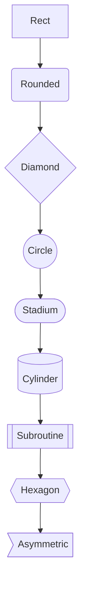

## Flowchart: styles
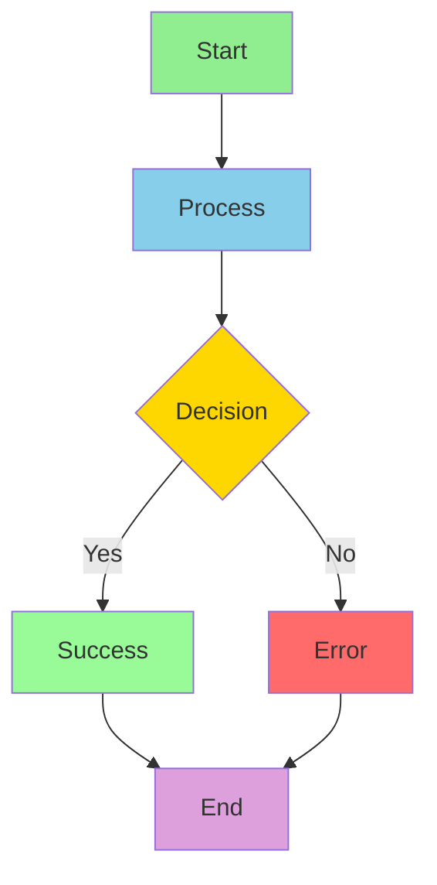

## Sequence diagram
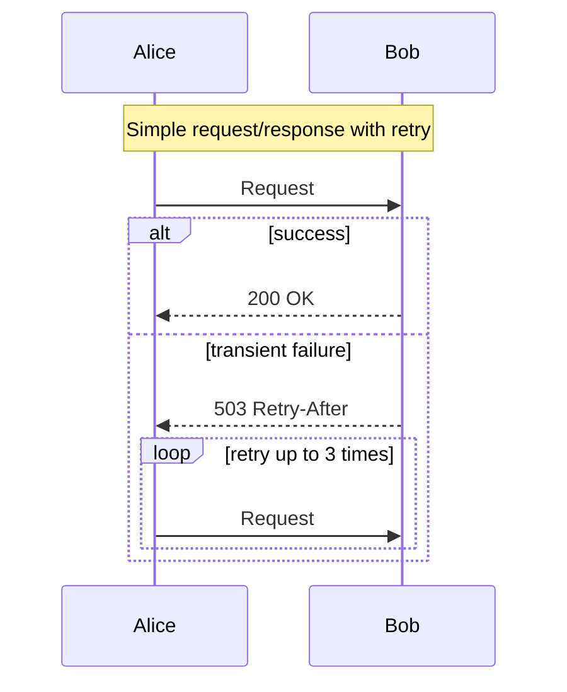

## Class diagram
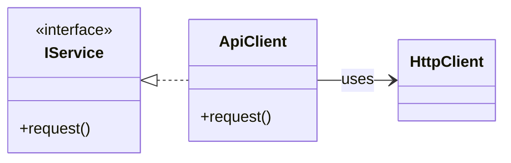

## Entity relationship diagram
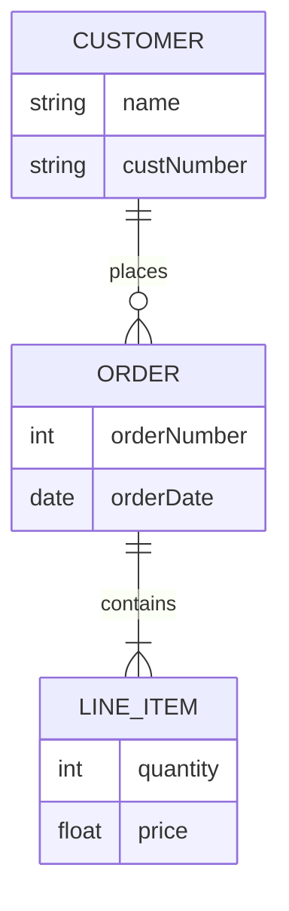

## State diagram
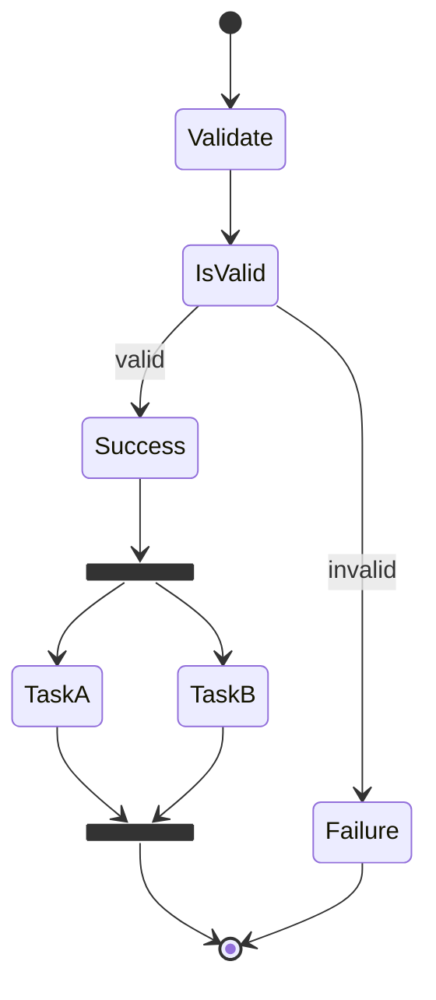

## Journey diagram
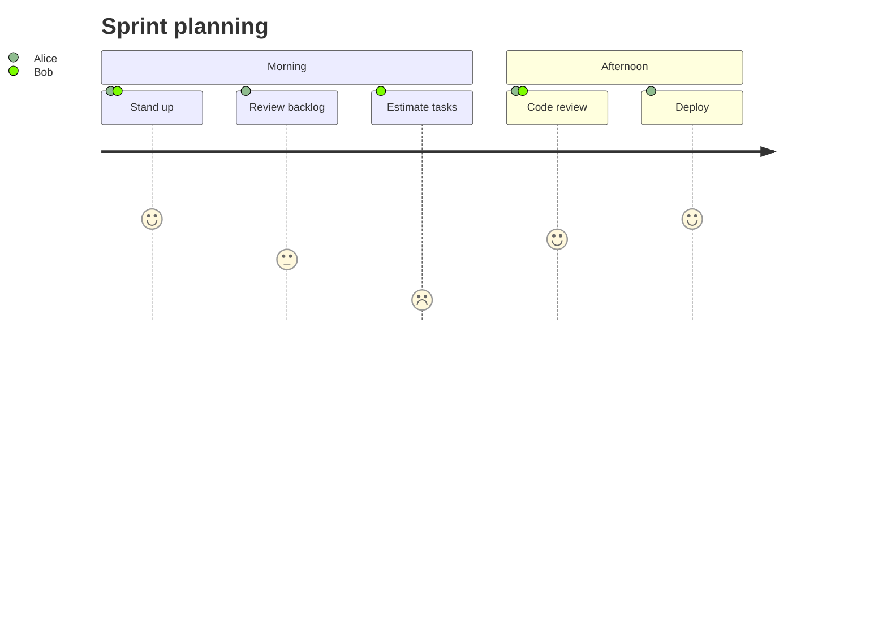

## Gantt chart
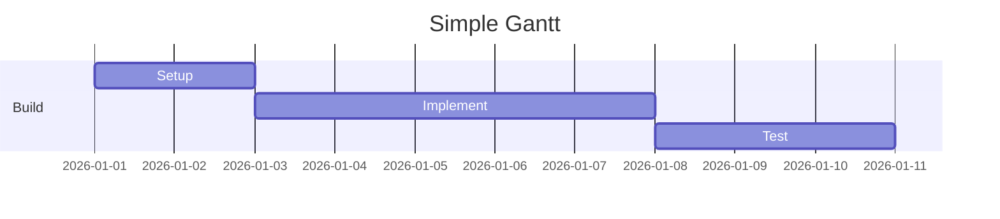

## Pie chart
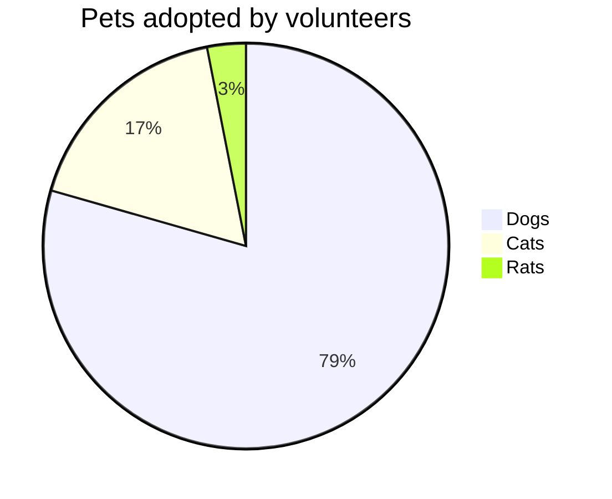

## Quadrant chart
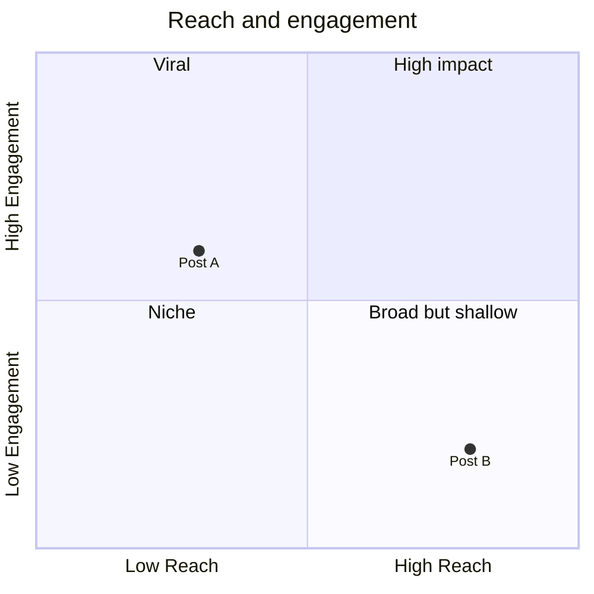

## Timeline
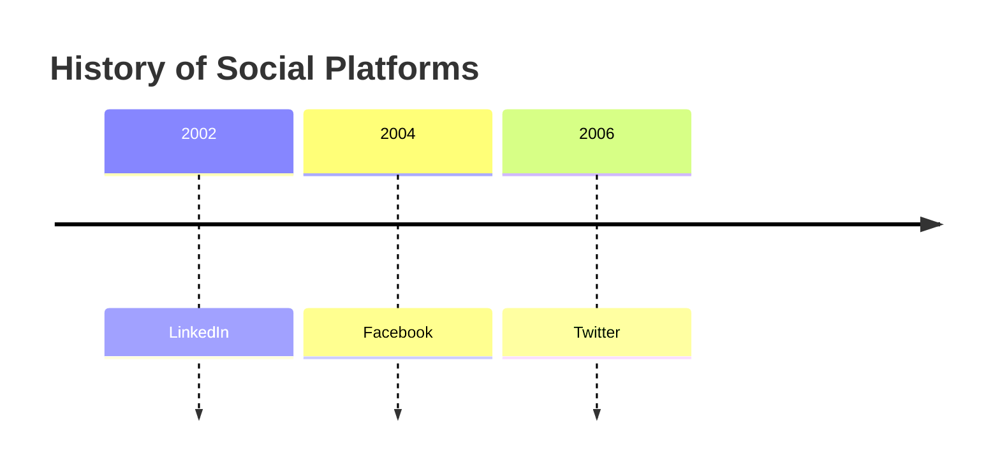

## Mindmap
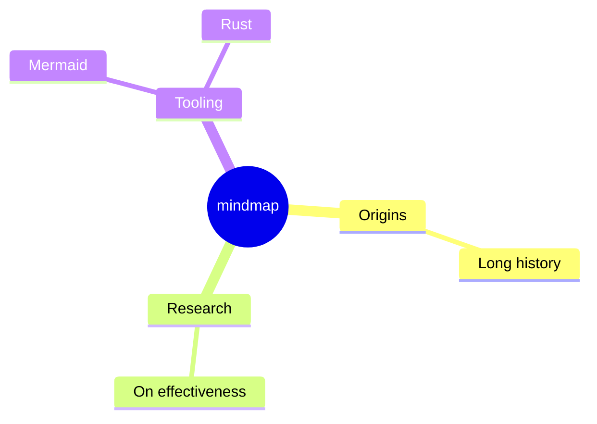

## Git graph
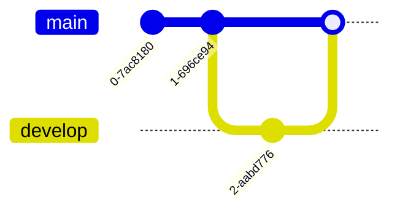

## Kanban board
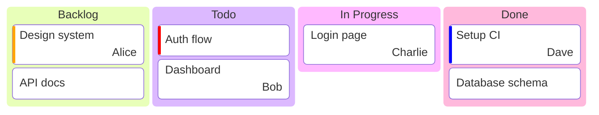

## Sankey diagram
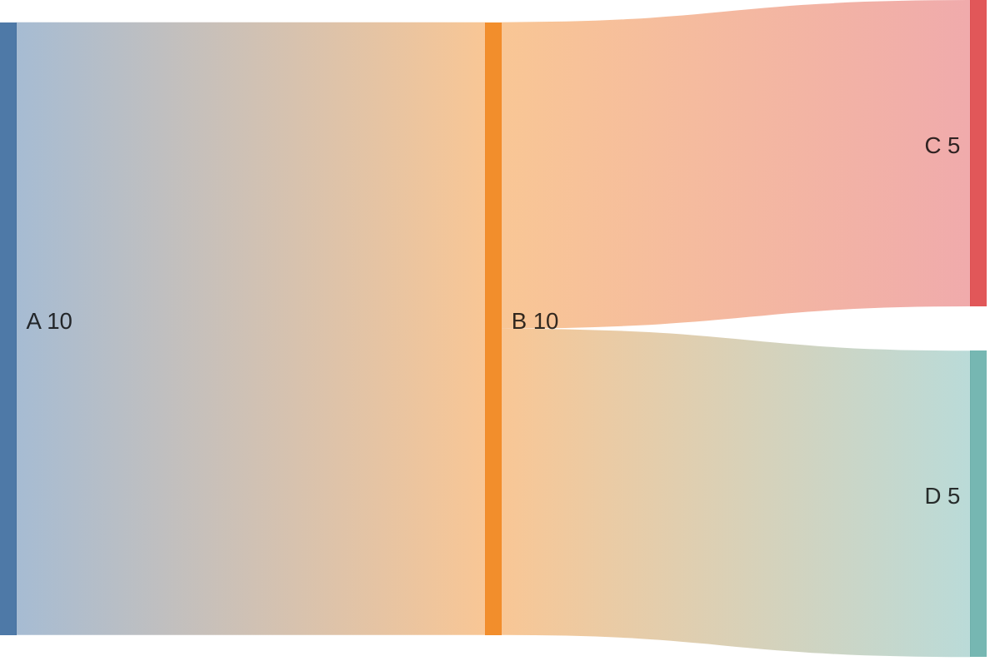

## XY chart
```mermaid
xychart-beta
    title Demo
    x-axis 0 --> 10
    y-axis 0 --> 100
    line [5, 10, 20, 40]
```

## Requirement diagram
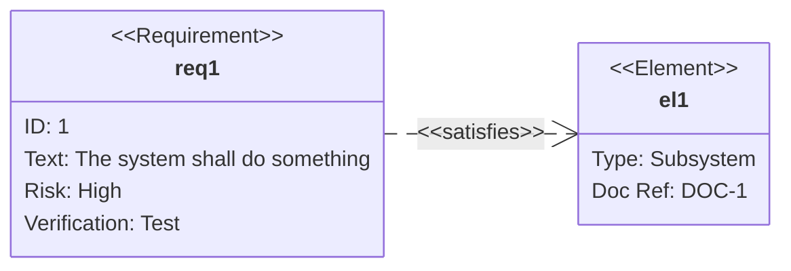

## C4 context
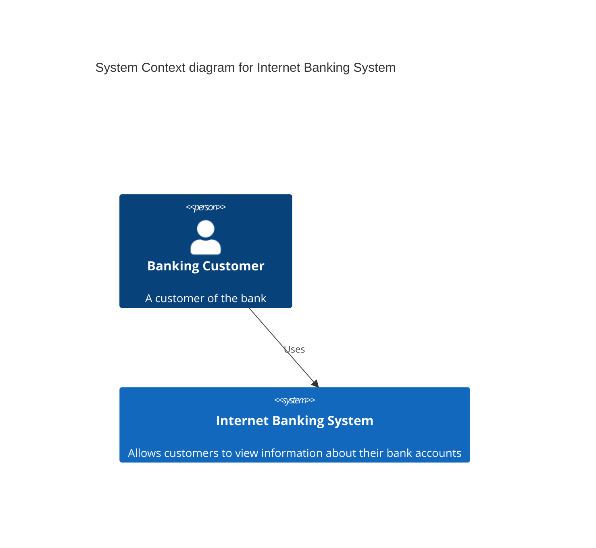

## Block diagram
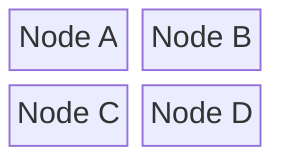

## Packet diagram
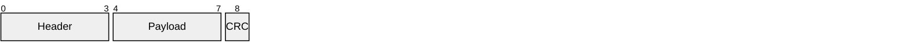

## Radar chart
```mermaid
radar-beta
axis A, B, C
curve Series1 { 1, 2, 3 }
```

## Info diagram
```mermaid
info
```

## Notes
- Verify that each code fence renders visually instead of as plain text.
- Check which diagram types fully render versus partially render or fall back.
- If useful, compare behavior between editor view, preview view, and reopen/resizing flows.
