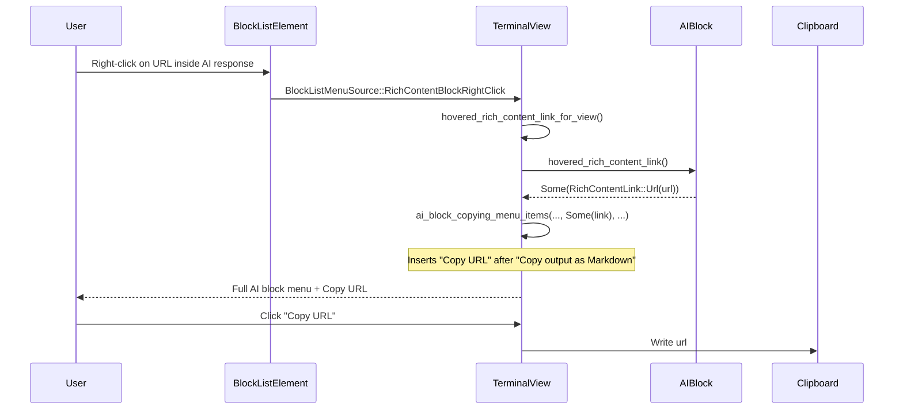

# APP-1915: Tech Spec

## Context

See `PRODUCT.md` for user-visible behavior. The feature branch was rewritten before this spec was finalized, so the diff against `master` is additive only — it introduces the hover-aware plumbing rather than removing a buggy short-circuit.

Implementation anchors in the current code:

- `app/src/ai/blocklist/block.rs (3910-3936)` — new `AIBlock::hovered_rich_content_link`. Reads `detected_links_state.currently_hovered_link_location` and maps the underlying `DetectedLinkType` into a `RichContentLink` (`Url` or, under `#[cfg(feature = "local_fs")]`, `FilePath { absolute_path, line_and_column_num, target_override }`).
- `app/src/terminal/view.rs:14252` — new `TerminalView::hovered_rich_content_link_for_view`, a thin wrapper that resolves the `EntityId` back to the `AIBlock` handle and delegates to `AIBlock::hovered_rich_content_link`.
- `app/src/terminal/view.rs (14262-14803)` — `context_menu_items`. The existing top match at `(14269-14340)` continues to handle the terminal grid `highlighted_link` path unchanged. The `RichContentBlockRightClick` branch at `(14712-14803)` is the AI block path; this is where the hovered link is computed and threaded through.
- `app/src/terminal/view.rs (15514-15655)` — `ai_block_copying_menu_items`, which builds the Copy group (Copy → Copy prompt → Copy output as Markdown → conditional Copy command / Copy git branch → Save as prompt → Share conversation → Copy conversation text). The link-specific item is inserted immediately after "Copy output as Markdown" and before the conditional Copy command / git branch items.
- `RichContentLink` enum (in `view.rs`): `Url(String)` and `#[cfg(feature = "local_fs")] FilePath { absolute_path, line_and_column_num, target_override }`. `ContextMenuAction::CopyUrl { url_content }` is reused for both variants — for `FilePath`, the absolute path is copied via `to_string_lossy().into_owned()`.

There are two callers of `ai_block_copying_menu_items` in `view.rs`, both updated to accept the new `Option<RichContentLink>` parameter:

- `view.rs:14723` — right-click on an AI block (`BlockListMenuSource::RichContentBlockRightClick`). Passes the computed `Some(link)` when the cursor is over a hyperlink, `None` otherwise.
- `view.rs:15716` — `open_ai_block_overflow_context_menu`, triggered by the three-dot overflow button on an AI block. This surface has no hovered-link concept, so it always passes `None`.

`RichContentTextRightClick` (selection-active right-click in an AI block) intentionally does not participate: it is handled by a different arm in `context_menu_items` and builds the selection-oriented menu, per `PRODUCT.md` Behavior 8.

## Proposed changes

1. **Add `AIBlock::hovered_rich_content_link`** (`app/src/ai/blocklist/block.rs`). Returns `Option<RichContentLink>` by reading the already-maintained `detected_links_state.currently_hovered_link_location` and mapping the underlying `DetectedLinkType` into the `RichContentLink` variants the terminal view already understands.

2. **Add `TerminalView::hovered_rich_content_link_for_view`** (`app/src/terminal/view.rs`). Resolves the `EntityId` to the AI block handle via the existing `ai_block_handle_by_view_id` helper and delegates to `AIBlock::hovered_rich_content_link`.

3. **Add an `Option<RichContentLink>` parameter to `ai_block_copying_menu_items`.** When `Some`, push exactly one additional `MenuItem` immediately after "Copy output as Markdown" (before the conditional "Copy command" / "Copy git branch"):

   ```rust path=null start=null
   if let Some(link) = hovered_link {
       match link {
           RichContentLink::Url(url) => items.push(
               MenuItemFields::new("Copy URL")
                   .with_on_select_action(TerminalAction::ContextMenu(
                       ContextMenuAction::CopyUrl { url_content: url },
                   ))
                   .into_item(),
           ),
           #[cfg(feature = "local_fs")]
           RichContentLink::FilePath { absolute_path, .. } => items.push(
               MenuItemFields::new("Copy path")
                   .with_on_select_action(TerminalAction::ContextMenu(
                       ContextMenuAction::CopyUrl {
                           url_content: absolute_path.to_string_lossy().into_owned(),
                       },
                   ))
                   .into_item(),
           ),
       }
   }
   ```

4. **Update both callers of `ai_block_copying_menu_items`:**

   - `view.rs:14723` in the `RichContentBlockRightClick` branch — compute the hovered link once and pass it through:

     ```rust path=null start=null
     let hovered_link = self.hovered_rich_content_link_for_view(*rich_content_view_id, ctx);
     items.extend(self.ai_block_copying_menu_items(
         *rich_content_view_id,
         ai_metadata.conversation_id,
         hovered_link.clone(),
         &model,
         ctx,
     ));
     ```

   - `view.rs:15716` in `open_ai_block_overflow_context_menu` — always pass `None` (the overflow button has no hover context).

5. **Intentionally skip `RichContentTextRightClick`.** That branch fires only when a text selection is active (see `block_list_element.rs (1417-1428)`) and `PRODUCT.md` Behavior 8 keeps the selection-oriented menu unchanged.

## End-to-end flow



## Risks and mitigations

1. **Menu ordering regressions.** Insertion is strictly after "Copy output as Markdown" and before "Copy command" / "Copy git branch"; `PRODUCT.md` Behavior 6 pins the order. Manual validation confirms it.
2. **`local_fs` feature gating.** The "Copy path" branch stays behind `#[cfg(feature = "local_fs")]` to match the existing `RichContentLink::FilePath` variant. Covered by `PRODUCT.md` Behavior 4.
3. **Selection path.** `RichContentTextRightClick` does not receive the new item. Intentional per `PRODUCT.md` Behavior 8; a link-specific path during selection can be added as a follow-up if needed.

## Testing and validation

Each `PRODUCT.md` Behavior invariant maps to a concrete verification step:

- Behavior 1, 2, 6: Manual — open an AI response with a URL list (similar to the APP-1915 screenshot), right-click a URL, confirm the full AI block menu is shown with "Copy URL" inserted immediately after "Copy output as Markdown" and before any "Copy command" / "Copy git branch". Click it and confirm the clipboard contains the URL verbatim.
- Behavior 3, 4: Manual on a `local_fs` build — right-click a file-path link in an AI response, confirm "Copy path" is in the same position and copies the absolute path. On a non-`local_fs` build, confirm no "Copy path" item appears and the rest of the menu is unchanged.
- Behavior 5: Manual — hover a link, right-click, confirm the link-specific item appears exactly once and that "Copy URL" and "Copy path" never appear together.
- Behavior 7: Manual — right-click in an AI response body away from any link; menu matches the pre-regression baseline with no link-specific item.
- Behavior 8: Manual — with a text selection inside an AI response, right-click and confirm the selection-oriented menu is unchanged.
- Behavior 9: Manual — right-click a URL in the terminal grid; grid link menu is unchanged.
- Behavior 10: The new conditional push is guarded by `Option::Some`, so a missing hovered link cannot panic. A small regression test in `view_test.rs` that asserts "Copy URL" is present when a hovered URL link is set — and absent otherwise — is recommended alongside the manual checks.
- Behavior 11: Implicitly covered — menu items are built from hover state at the moment the menu is opened; no mutation of an already-open menu.

Existing `view_test.rs` coverage for `RichContentBlockRightClick` must continue to pass.

## Follow-ups

- Optional: add "Open link" or "Open in editor" items for file paths in AI responses, to reach parity with the grid link menu.
- Optional: add a hovered-link path for `RichContentTextRightClick` if user feedback asks for it.
