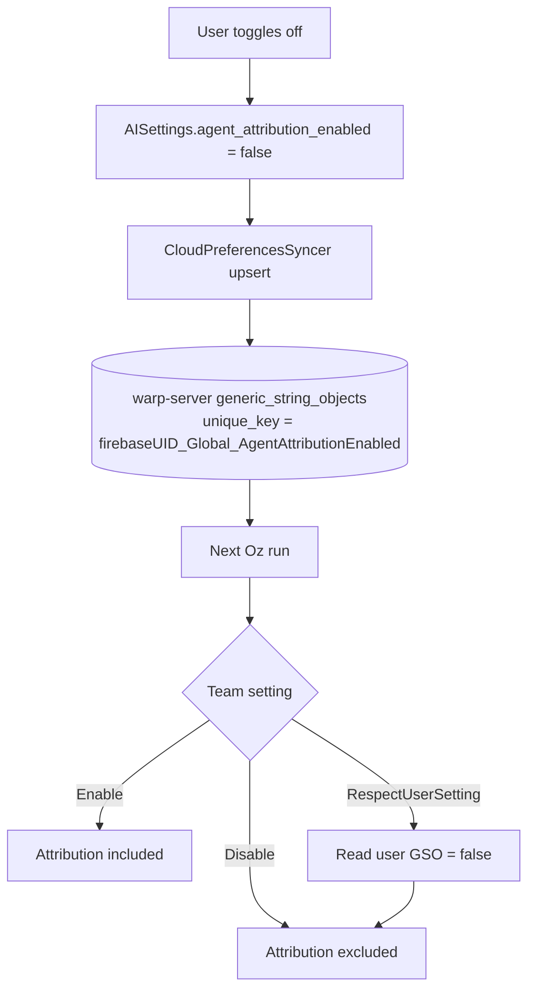

# APP-3585: Setting for agent commit and PR attribution — Client Tech Spec
Product spec: `specs/APP-3585/PRODUCT.md`.

Server tech spec: `warp-server/specs/APP-3585/TECH.md` (PR https://github.com/warpdotdev/warp-server/pull/10476).
## Problem
The attribution setting (whether Oz adds a `Co-Authored-By` line to commits and PRs) is currently a binary team-level flag. We need to turn it into a two-level setting: team admins get a three-way `AdminEnablementSetting` (Enable / Disable / RespectUserSetting), and individual users get their own boolean preference that takes effect when the team delegates.

This spec covers the warp-internal (client) changes. Anything about how the server stores or resolves the effective value lives in the server spec.
## Relevant code
- `app/src/settings/ai.rs` — `define_settings_group!(AISettings, ...)`: new user-level `agent_attribution_enabled` bool.
- `app/src/workspaces/workspace.rs (631–776)` — domain types for team settings (`AdminEnablementSetting`, `WorkspaceSettings`); flat `enable_warp_attribution: AdminEnablementSetting` added directly on `WorkspaceSettings`.
- `app/src/workspaces/user_workspaces.rs (1363–1458)` — accessor methods for team settings; new `get_agent_attribution_setting()`.
- `app/src/workspaces/gql_convert.rs` — `From<GqlAdminEnablementSetting>` mapping for the new field.
- `crates/graphql/src/api/workspace.rs (124–146)` — `WorkspaceSettings` cynic fragment; new `AmbientAgentSettings` fragment.
- `app/src/settings_view/ai_page.rs` — new `AgentAttributionWidget`; follows `CloudConversationStorageWidget` in `privacy_page.rs (1667–1770)` for team-override rendering.
- `app/src/settings/cloud_preferences_syncer.rs` — existing syncer that publishes any `SyncToCloud::Globally(...)` setting to warp-server as a `JsonPreference` GSO. No changes required — reused as the user-preference transport.
## Current state
`AmbientAgentSettings` on the server exposes `enableWarpAttribution: Boolean!`; the client does not fetch it. There is no user-level attribution preference, and attribution instructions are unconditionally present or absent in the agent prompt based solely on the server-side team boolean.

The client already has the transport we need for a user-level preference: any setting declared with `SyncToCloud::Globally(...)` via `define_settings_group!` is uploaded to warp-server by `CloudPreferencesSyncer` as a `JsonPreference` GSO with `unique_key = Global_<StorageKey>` (scoped per user). Other `AISettings` fields (e.g. `IncludeAgentCommandsInHistory`, `ShowConversationHistory`) already use this pattern, and warp-server reads them back by GSO lookup.
## Proposed changes
### 1. New user-level client setting
Add `agent_attribution_enabled` to `define_settings_group!(AISettings, ...)` in `app/src/settings/ai.rs`:

- default `true`
- `SyncToCloud::Globally(RespectUserSyncSetting::Yes)` (AI/coding preference, not a privacy/safety one)
- implicit storage key `AgentAttributionEnabled`

On toggle, the setting is persisted locally and the existing `CloudPreferencesSyncer` upserts the user's `JsonPreference` GSO (`unique_key = {firebaseUID}_Global_AgentAttributionEnabled` on the server side). No bespoke server call. See the server spec for the read path.

Because we use `RespectUserSyncSetting::Yes`, users who have turned "Sync settings across devices" off do not publish their preference to the server; the server falls back to the default (`true`) for those users. This matches how all other `AISettings` fields behave today.

### 2. Team-level field on `WorkspaceSettings` (flat, not wrapped)
Add a flat `enable_warp_attribution: AdminEnablementSetting` field (with `#[serde(default)]`) directly on `WorkspaceSettings` in `app/src/workspaces/workspace.rs`. No wrapper struct — the GQL field name matches the server directly.

`UserWorkspaces::get_agent_attribution_setting()` reads this field off the current team:

```rust
pub fn get_agent_attribution_setting(&self) -> AdminEnablementSetting {
    self.current_team()
        .map(|team| team.organization_settings.enable_warp_attribution.clone())
        .unwrap_or_default()
}
```

This matches the shape of every other admin-enablement accessor on `UserWorkspaces` (`team_allows_codebase_context`, `is_ai_allowed_in_remote_sessions`, `get_cloud_conversation_storage_enablement_setting`).

### 3. GraphQL fetch
Add an `AmbientAgentSettings` cynic fragment in `crates/graphql/src/api/workspace.rs` with `enable_warp_attribution: AdminEnablementSetting`, and include it on the `WorkspaceSettings` fragment as `ambient_agent_settings: Option<AmbientAgentSettings>`. The wrapper is `Option` because `WorkspaceSettings.ambientAgentSettings` is nullable in the GQL schema (no `!`); this matches the existing convention for `sandboxed_agent_settings`. When the wrapper is `None`, `gql_convert.rs` falls back to `AdminEnablementSetting::default()` (= `RespectUserSetting`). The inner `enable_warp_attribution` is non-optional, as the server guarantees a value when the wrapper is present.
### 4. AI settings page widget
Add `AgentAttributionWidget` in `app/src/settings_view/ai_page.rs`. It reads `UserWorkspaces::get_agent_attribution_setting()` and derives the toggle state:
- `Enable` → locked on
- `Disable` → locked off
- `RespectUserSetting` → interactive, reflects `AISettings.agent_attribution_enabled`
Included in both the legacy full-page (`None` subpage) and the `Some(AISubpage::WarpAgent)` subpage. The widget always renders; when AI is globally disabled, the toggle is shown disabled with a greyed-out label and description, matching the behavior of every other widget on the AI page (e.g. `CloudAgentComputerUseWidget`, `CLIAgentWidget`).
Visual structure follows the AI-page convention: a `render_separator` and a `build_sub_header("Agent Attribution", ...)` precede the toggle row and description, mirroring `CloudAgentComputerUseWidget`. The cited `CloudConversationStorageWidget` reference applies only to the team-override state machine (locked vs. interactive based on `AdminEnablementSetting`), not to the visual structure, since that widget lives on the Privacy page which has different conventions.
For the locked-toggle tooltip, the widget uses `WORKSPACE_OVERRIDE_TOOLTIP_MESSAGE` from `app/src/ai/execution_profiles/editor/ui_helpers.rs` ("This option is enforced by your organization's settings and cannot be customized."), matching `CloudAgentComputerUseWidget` and the rest of the AI page. The Privacy page uses a shorter "This setting is managed by your organization." string; we deliberately follow the AI-page wording here for consistency.

## End-to-end flow (user toggles attribution off)
1. User opens Settings → AI → Oz.
2. Client reads the team's `enable_warp_attribution` from cached `WorkspaceSettings` via `get_agent_attribution_setting()`.
3. Setting is `RespectUserSetting`, so the toggle is interactive and reflects `AISettings.agent_attribution_enabled` (default `true`, showing as checked).
4. User clicks the toggle → `ToggleAgentAttribution` action sets `AISettings.agent_attribution_enabled` to `false` (persisted locally).
5. `CloudPreferencesSyncer` picks up the change and upserts the user's `JsonPreference` GSO (`unique_key = {firebaseUID}_Global_AgentAttributionEnabled`, `serialized_model.value = false`).
6. Next Oz run: warp-server resolves the effective setting (team = RespectUserSetting → read user GSO = false) and excludes attribution instructions from the prompt. Oz creates a commit without the `Co-Authored-By` line.


## Risks and mitigations
- **Client ships ahead of server**: the cynic fragment requires `enable_warp_attribution: AdminEnablementSetting!` on the inner `AmbientAgentSettings` type; if the client lands first, `GetWorkspaceSettings` fails to parse. Mitigation: sequence the server change first (covered by the server spec). The outer `Option<AmbientAgentSettings>` wrapper already absorbs the case where the whole sub-object is missing.
- **User has settings sync off**: their preference never reaches the server; the server defaults to `true`. This is the documented behavior for any `RespectUserSyncSetting::Yes` setting.
- **Widget enablement**: when AI is globally disabled, the widget renders in a disabled state (greyed-out toggle, label, and description), consistent with every other widget on the AI page.
## Testing and validation
- Unit tests in `app/src/workspaces/user_workspaces_tests.rs`:
  - `test_agent_attribution_default_with_no_workspace` — no workspace → `RespectUserSetting`
  - `test_agent_attribution_forced_on_by_team` — team `Enable` → accessor returns `Enable`
  - `test_agent_attribution_forced_off_by_team` — team `Disable` → accessor returns `Disable`
  - `test_agent_attribution_respects_user_setting` — team `RespectUserSetting` → accessor returns `RespectUserSetting`
- UI manual test: verify each team-setting state renders the toggle in the correct locked/interactive state, in both the legacy and Oz subpages.
- End-to-end (once the server branch merges): run an Oz agent task that creates a commit with the setting off → verify no attribution line. Run with team-level `Enable` and verify the client toggle is locked on; same for `Disable`.
## Follow-ups
- Admin-panel UI (separate warp-server PR) to change the team-level control from a binary toggle to a three-way selector.
