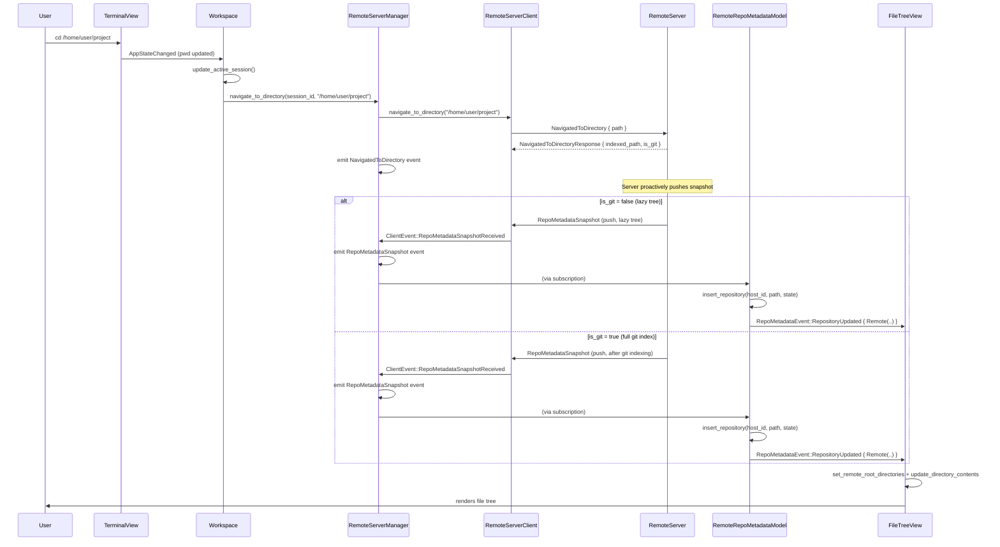
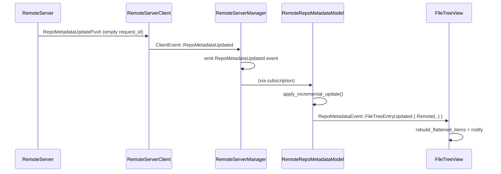

# Client-Side Wiring for Remote File Tree — Tech Spec

Linear: [APP-3788](https://linear.app/warpdotdev/issue/APP-3788)

## 1. Problem

The remote server file tree protocol (proto schema, server handlers, client API, Rust↔Proto conversion, incremental sync) is implemented. However, nothing on the client side triggers these flows. When a user SSH's into a remote host and `cd`s around, the Project Explorer shows "not supported in remote sessions."

We need to wire three things:
1. SSH `cd` → `navigate_to_directory` request to the remote server
2. Server push events (`RepoMetadataSnapshot`, `RepoMetadataUpdatePush`) → populate `RemoteRepoMetadataModel`
3. File tree view renders from `RemoteRepoMetadataModel` for SSH sessions

## 2. Relevant Code

### Remote server client & manager
- `crates/remote_server/src/client.rs:156` — `navigate_to_directory()` async request method
- `crates/remote_server/src/client.rs:202` — `send_request()` that all request methods delegate to
- `crates/remote_server/src/client.rs:46` — `ClientEvent` enum (`Disconnected`, `RepoMetadataSnapshotReceived`, `RepoMetadataUpdated`)
- `crates/remote_server/src/client.rs:109` — `new()` returns `(Self, async_channel::Receiver<ClientEvent>)` — unified event channel for push events and disconnect
- `app/src/remote_server/manager.rs:91` — `RemoteServerManager` singleton, maps sessions → hosts → clients
- `app/src/remote_server/manager.rs:262` — `client_for_session()` lookup
- `app/src/remote_server/manager.rs:181` — event channel drain loop (currently only handles `Disconnected`, TODO for forwarding push events)

### Repo metadata models
- `crates/repo_metadata/src/remote_model.rs:41` — `RemoteRepoMetadataModel` with `insert_repository()`, `apply_incremental_update()`
- `crates/repo_metadata/src/wrapper_model.rs:52` — `RepoMetadataModel` wrapper singleton
- `crates/repo_metadata/src/repository_identifier.rs:51` — `RemoteRepositoryIdentifier { session_id, path }`

### Proto conversion
- `crates/remote_server/src/repo_metadata_proto.rs` — `proto_snapshot_to_update()` converts `RepoMetadataSnapshot` → `RepoMetadataUpdate`; `proto_to_repo_metadata_update()` converts `RepoMetadataUpdatePush` → `RepoMetadataUpdate`; `From` impls for Rust → Proto direction

### File tree view & workspace
- `app/src/code/file_tree/view.rs:235` — `FileTreeView` struct with `root_directories`, `displayed_directories`, `repository_metadata_model`
- `app/src/code/file_tree/view.rs:660` — `set_root_directories()` converts `PathBuf` via `try_from_local` (fails for remote paths)
- `app/src/code/file_tree/view.rs:702` — `update_directory_contents()` looks up `DetectedRepositories` + local model only
- `app/src/code/file_tree/view.rs:351` — `handle_repository_metadata_event()` matches only `RepositoryIdentifier::Local(..)`
- `app/src/workspace/view.rs:13377` — `update_active_session()` sets `CodingPanelEnablementState::RemoteSession` for SSH
- `app/src/workspace/view.rs:11964` — `refresh_working_directories_for_pane_group()` collects CWDs via `pwd_if_local()`
- `app/src/coding_panel_enablement_state.rs:1` — `CodingPanelEnablementState` enum
- `app/src/terminal/view.rs:20438` — `pwd()` returns raw CWD (works for remote sessions)
- `app/src/terminal/view.rs:20445` — `pwd_if_local()` returns `None` for remote sessions
- `app/src/pane_group/working_directories.rs:737` — `normalize_cwd()` calls `dunce::canonicalize` (fails for remote paths)

### LSP push event pattern (reference)
- `crates/lsp/src/model.rs:268` — `spawn_stream_local` drains the LSP server notification channel on the main thread, calling `handle_server_notification` for each event
- `crates/lsp/src/model.rs:540` — `handle_server_notification` dispatches notifications by type, updates model state, and emits domain events via `ctx.emit()`
- `crates/lsp/src/manager.rs:191` — `LspManagerModel` subscribes to `LspServerModel` events and re-emits them as `LspManagerModelEvent`s for downstream consumers

## 3. Current State

### CWD tracking pipeline
`terminal_view_working_directories()` calls `pwd_if_local()`, which returns `None` for SSH sessions. The raw CWD *is* available via `pwd()` (reads `BlockMetadata::current_working_directory`), but it's never used for remote sessions. The workspace's `refresh_working_directories_for_pane_group` consequently filters remote sessions out entirely.

### File tree enablement
`update_active_session()` sets `CodingPanelEnablementState::RemoteSession` when `is_remote == true`. `FileTreeView::render()` shows "The Project Explorer requires access to your local workspace, which isn't supported in remote sessions." when enablement is `RemoteSession` and `displayed_directories` is empty.

### RemoteServerManager
Singleton that maps sessions → hosts → `RemoteServerClient` handles. Exposes `client_for_session(session_id)`. The event channel from `RemoteServerClient::new()` is drained in a background loop that currently only handles `Disconnected` — `RepoMetadataSnapshotReceived` and `RepoMetadataUpdated` events have a TODO to forward them.

### RemoteRepoMetadataModel
Has `insert_repository()`, `apply_incremental_update()`, and `update_file_tree_entry()` write APIs. Accessible through the `RepoMetadataModel` wrapper singleton which forwards events as `RepoMetadataEvent` with `RepositoryIdentifier::Remote(..)`. Currently never populated.

### Server push flow
The remote server proactively pushes repo metadata after `NavigatedToDirectory`:
- For non-git directories: server responds with `{ indexed_path, is_git: false }`, then pushes a `RepoMetadataSnapshot` with the lazy tree data.
- For git directories: server responds with `{ indexed_path, is_git: true }`, then pushes a `RepoMetadataSnapshot` once full git indexing completes.
- Incremental updates are pushed as `RepoMetadataUpdatePush` on filesystem watcher changes.

The client parses these in `push_message_to_event()` and delivers them as `ClientEvent::RepoMetadataSnapshotReceived` / `ClientEvent::RepoMetadataUpdated` through the event channel. The `RemoteServerManager` drain loop currently ignores these events.

### FileTreeView local-only assumptions
`set_root_directories()` converts `PathBuf → StandardizedPath` via `try_from_local` (calls `dunce::canonicalize`, fails for non-local paths). `update_directory_contents()` looks up `DetectedRepositories` (local singleton) and calls `load_directory` (local filesystem I/O). `handle_repository_metadata_event` matches only `RepositoryIdentifier::Local(..)` variants and ignores all `Remote(..)` variants.

## 4. Proposed Changes

### Pre-requisite: `RemoteRepositoryIdentifier` keyed by `HostId`

Currently `RemoteRepositoryIdentifier` is `(SessionId, StandardizedPath)`. Multiple SSH sessions to the same host share one remote server, so keying by session would duplicate repo metadata N times.

**Move `HostId`** from `crates/remote_server/src/host_id.rs` to `crates/warp_core/src/host_id.rs` (same pattern as `SessionId` in `warp_core/src/session_id.rs`). Re-export from `remote_server` for backward compatibility.

**Update `RemoteRepositoryIdentifier`**:

```rust
pub struct RemoteRepositoryIdentifier {
    pub host_id: HostId,
    pub path: StandardizedPath,
}
```

Blast radius is small — `RemoteRepositoryIdentifier` is only used within `repo_metadata` today (repository_identifier.rs, remote_model.rs, wrapper_model.rs).

### 4.1. Feature flag gating

All remote file tree behavior must be gated behind `FeatureFlag::SshRemoteServer`. When the flag is disabled:
- `update_active_session()` should NOT call `navigate_to_directory` for remote sessions
- The file tree view should continue to render the existing "not supported in remote sessions" disabled state
- Push events from the remote server are still forwarded (the server runs regardless of the flag), but `RemoteRepoMetadataModel` should no-op if the flag is off

The flag check should live at the entry points (workspace `update_active_session` and `FileTreeView::render`) rather than deep in the manager or model, so the plumbing is ready for immediate use once the flag is enabled.

### 4.2. Wire SSH `cd` to `navigate_to_directory`

**RemoteServerManager** stays as a thin connection manager. Add:

```rust
pub fn navigate_to_directory(
    &mut self,
    session_id: SessionId,
    path: String,
    ctx: &mut ModelContext<Self>,
) {
    // 1. Look up client + host_id for this session
    // 2. Clone the Arc<RemoteServerClient> and spawn on background executor
    // 3. Call client.navigate_to_directory(path).await
    // 4. On success, spawner.spawn() back to main thread and emit:
    //    RemoteServerManagerEvent::NavigatedToDirectory {
    //        host_id, indexed_path, is_git
    //    }
}
```

The manager does NOT store state or decide next actions — that's `RemoteRepoMetadataModel`'s job. The server will proactively push `RepoMetadataSnapshot` after responding to `NavigatedToDirectory`, so the client does not need a separate fetch request.

**Caller**: The workspace's `update_active_session()` flow. When the active terminal is remote and has a CWD (via `terminal.pwd()`), call `navigate_to_directory` on the manager instead of skipping.

### 4.3. Forward push events from `RemoteServerManager` (following LSP pattern)

The LSP codebase provides a clean pattern for handling server push messages:
1. `LspServerModel::start()` uses `spawn_stream_local` to drain the notification channel on the main thread
2. Each notification is dispatched to `handle_server_notification`, which updates model state and emits domain events via `ctx.emit()`
3. `LspManagerModel` subscribes to these events and re-emits them as higher-level manager events

We apply the same pattern to `RemoteServerManager`:

**Extend the event drain loop** in `connect_session()` (currently at `app/src/remote_server/manager.rs:181`). Instead of ignoring push events, forward them as `RemoteServerManagerEvent` variants:

```rust
// In the event drain loop (currently the while let Ok(event) block):
while let Ok(event) = event_rx.recv().await {
    match event {
        ClientEvent::Disconnected => break,
        ClientEvent::RepoMetadataSnapshotReceived { update } => {
            let _ = spawner.spawn(move |_me, ctx| {
                ctx.emit(RemoteServerManagerEvent::RepoMetadataSnapshot {
                    host_id: host_id.clone(),
                    update,
                });
            }).await;
        }
        ClientEvent::RepoMetadataUpdated { update } => {
            let _ = spawner.spawn(move |_me, ctx| {
                ctx.emit(RemoteServerManagerEvent::RepoMetadataUpdated {
                    host_id: host_id.clone(),
                    update,
                });
            }).await;
        }
    }
}
```

**Add new event variants** to `RemoteServerManagerEvent`:

```rust
pub enum RemoteServerManagerEvent {
    // ... existing variants ...

    /// A full or lazy-loaded repo metadata snapshot was pushed by the server.
    RepoMetadataSnapshot {
        host_id: HostId,
        update: repo_metadata::RepoMetadataUpdate,
    },
    /// An incremental repo metadata update was pushed by the server.
    RepoMetadataUpdated {
        host_id: HostId,
        update: repo_metadata::RepoMetadataUpdate,
    },
    /// Response to a navigate_to_directory request.
    NavigatedToDirectory {
        host_id: HostId,
        indexed_path: String,
        is_git: bool,
    },
}
```

**Note on `host_id` availability**: The event drain loop starts while the session is still in `Initializing` state (before the initialize handshake returns the `host_id`). Push events will only arrive after the handshake completes and `NavigatedToDirectory` is sent, so by that point the session is `Connected` and the `host_id` is known. The drain loop should capture the `host_id` from the `mark_session_connected` transition (e.g., via a shared `watch` channel or by looking it up from session state when emitting).

### 4.4. `RemoteRepoMetadataModel` subscribes to manager events

The remote model subscribes to `RemoteServerManagerEvent` and reacts to push events:

#### On `RemoteServerManagerEvent::RepoMetadataSnapshot { host_id, update }`
Call `self.insert_repository(host_id, update)` to populate the initial tree state.

#### On `RemoteServerManagerEvent::RepoMetadataUpdated { host_id, update }`
Call `self.apply_incremental_update(host_id, update)` to apply watcher-driven changes.

#### On `RemoteServerManagerEvent::HostDisconnected { host_id }`
Clean up remote repositories for that host.

The remote model no longer needs direct access to `RemoteServerClient` — all data arrives through the event channel. This keeps the model decoupled from connection management.

### 4.5. Update file tree view for remote repositories

#### 4.5a. Enablement state
Keep `CodingPanelEnablementState::RemoteSession`. When `FeatureFlag::SshRemoteServer` is enabled, change the file tree view's `render()` to check if remote root directories exist before showing the error. If `displayed_directories` is non-empty (remote roots present), render the tree normally regardless of `RemoteSession` enablement. When the flag is disabled, always render the existing disabled state for remote sessions.

#### 4.5b. Separate entry point for remote roots
The local pipeline (`PathBuf → normalize_cwd → WorkingDirectoriesModel → set_root_directories → try_from_local`) fails for remote paths at `dunce::canonicalize` and `try_from_local`. Rather than migrating that pipeline, add a separate entry point:

```rust
impl FileTreeView {
    /// Sets root directories from a remote server.
    /// Bypasses the local WorkingDirectoriesModel pipeline entirely.
    pub fn set_remote_root_directories(
        &mut self,
        roots: Vec<(HostId, StandardizedPath)>,
        ctx: &mut ViewContext<Self>,
    ) { /* ... */ }
}
```

Remote paths come from `NavigatedToDirectoryResponse.indexed_path` (a `String`), which converts directly to `StandardizedPath::try_new()` with no I/O.

Each `RootDirectory` gets an optional `RepositoryIdentifier` field so the view knows whether to query the local or remote model when loading contents.

Do NOT migrate `WorkingDirectoriesModel` or `normalize_cwd` to `StandardizedPath` — that's a much larger change with no immediate value for this feature.

#### 4.5c. Remote directory contents
`update_directory_contents()` currently looks up `DetectedRepositories` and calls `load_directory` (local-only). For remote roots:
- Look up `RepositoryIdentifier::Remote(RemoteRepositoryIdentifier { host_id, path })` in `RepoMetadataModel`
- Use the returned `FileTreeState.entry` directly as the root directory's entry
- Skip lazy loading / `DetectedRepositories` lookup entirely — the remote server handles indexing

#### 4.5d. Handle remote `RepoMetadataEvent`s
`handle_repository_metadata_event` currently only matches `RepositoryIdentifier::Local(..)` and ignores remote variants. Add handling for `RepositoryIdentifier::Remote(..)` in:
- `RepositoryUpdated` — triggers `update_directory_contents` for matching remote roots
- `FileTreeEntryUpdated` — refreshes the cached `FileTreeEntry` and calls `rebuild_flattened_items`

## 5. End-to-End Flow



After initial population, incremental updates flow as:



## 6. Risks and Mitigations

**Risk**: Multiple rapid `cd` commands could fire overlapping `navigate_to_directory` requests. The same path could be navigated to before the first response arrives.
**Mitigation**: The manager should debounce or dedup: if a navigation is already in-flight for the same session, skip or cancel the previous one. The remote model can also idempotently handle duplicate `insert_repository` calls.

**Risk**: The remote server disconnects between `NavigatedToDirectoryResponse` and the `RepoMetadataSnapshot` push, leaving the remote model without tree data.
**Mitigation**: On `RemoteServerManagerEvent::HostDisconnected`, clear all remote repositories for that host. The file tree view will fall back to the "not supported" message.

**Risk**: `FileTreeView` rendering code is heavily `#[cfg(feature = "local_fs")]`-gated. Remote rendering needs to work on all platforms including WASM (where `local_fs` is disabled).
**Mitigation**: The remote root directory pipeline (`set_remote_root_directories`, remote `update_directory_contents` branch) should NOT be behind `#[cfg(feature = "local_fs")]` since it performs no local I/O.

**Risk**: The event drain loop starts before the initialize handshake completes, so `host_id` is not yet available when push events arrive.
**Mitigation**: Push events only arrive after `NavigatedToDirectory` is sent, which happens after the session reaches `Connected` state. The drain loop can look up the `host_id` from session state or receive it via a shared channel after the handshake.

## 7. Testing and Validation

- **Unit tests for `RemoteRepoMetadataModel` event handling**: Mock `RemoteServerManagerEvent::RepoMetadataSnapshot` / `RepoMetadataUpdated` events and verify the model calls `insert_repository()` / `apply_incremental_update()` correctly.
- **Unit tests for `FileTreeView` with remote roots**: Construct a `RemoteRepoMetadataModel` with test data, call `set_remote_root_directories`, verify the view queries the correct model and renders entries.
- **Integration test**: End-to-end flow from `navigate_to_directory` through push event delivery to file tree rendering, using the existing in-memory client/server test harness from `client_tests.rs`.
- **Manual testing**: SSH into a remote host, `cd` around, verify the Project Explorer populates with the remote file tree and updates incrementally on filesystem changes.

## 8. Follow-ups

- **Remote `load_directory`**: When a user expands a collapsed directory in the remote file tree, the client needs to send a request to the server for that subtree. Today `load_directory_from_model` is synchronous (local I/O). The remote case requires an async round-trip with a loading spinner. The `loaded: false` field on `FileTreeDirectoryEntryState` can drive this.
- **File tree cleanup on session close**: When all sessions to a host are closed and the remote server is torn down, clean up remote repos from `RemoteRepoMetadataModel`.
- **`WorkingDirectoriesModel` StandardizedPath migration**: The current `PathBuf`-based working directories pipeline could be migrated to `StandardizedPath` for consistency, but this is a larger refactor with no immediate functional benefit.
- **Remote file search**: `FileSearchModel` currently only queries local repos. Extending it to search remote repos requires a separate remote search protocol.
