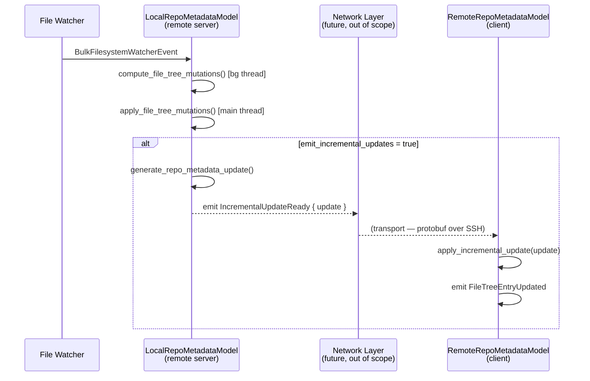

# Incremental Repo Metadata Syncing — Tech Spec

## Problem

The `LocalRepoMetadataModel` on the remote server keeps its file tree up to date via filesystem watchers. The client's `RemoteRepoMetadataModel` has no filesystem access and currently no mechanism to receive incremental updates — its only write API (`update_file_tree_entry`) replaces the entire `FileTreeEntry`, which is too expensive for frequent watcher-driven changes.

We need two new capabilities:
1. **Server side**: After the `LocalRepoMetadataModel` applies watcher-driven mutations, generate a serializable incremental update describing what changed.
2. **Client side**: The `RemoteRepoMetadataModel` applies that incremental update to its own `FileTreeEntry`.

These two APIs form the data layer of the sync protocol. The transport layer (protobuf encoding and SSH streaming) is out of scope for this spec but the Rust types are designed to map 1:1 to the proto schema for trivial conversion.

## Relevant Code

- `crates/repo_metadata/src/local_model.rs:121` — `FileTreeMutation` enum (the internal mutation representation)
- `crates/repo_metadata/src/local_model.rs:542` — `compute_file_tree_mutations()` (Phase 1: background I/O)
- `crates/repo_metadata/src/local_model.rs:607` — `apply_file_tree_mutations()` (Phase 2: main-thread tree ops)
- `crates/repo_metadata/src/local_model.rs:218` — `handle_watcher_event()` (orchestrates Phase 1 → Phase 2)
- `crates/repo_metadata/src/local_model.rs:699` — `ensure_parent_directories_exist()` (tree helper, needs extraction)
- `crates/repo_metadata/src/remote_model.rs:96` — `insert_repository()`, `update_file_tree_entry()` (existing write API)
- `crates/repo_metadata/src/file_tree_store.rs:10` — `FileTreeEntry` struct and mutation primitives
- `crates/repo_metadata/src/file_tree_store.rs:149` — `FileTreeEntryState`, `FileTreeFileMetadata`, `FileTreeDirectoryEntryState`
- `crates/repo_metadata/src/wrapper_model.rs:27` — `RepoMetadataEvent` (unified event enum to extend)

## Current State

### Watcher → mutation flow (server side)

`LocalRepoMetadataModel::handle_watcher_event` receives `BulkFilesystemWatcherEvent`s, groups changes by repository, then runs a two-phase pipeline:

1. **`compute_file_tree_mutations`** (async, background thread) — performs filesystem I/O (`exists()`, `is_dir()`, `build_tree()`, gitignore checks) and produces `Vec<FileTreeMutation>`.
2. **`apply_file_tree_mutations`** (sync, main thread) — walks the mutation list and directly mutates the `FileTreeEntry` using its primitives (`remove`, `insert_child_state`, `insert_entry_at_path`, `find_or_insert_directory`).

The `FileTreeMutation` enum has four variants:
- `Remove(PathBuf)`
- `AddFile { path, is_ignored, extension }`
- `AddDirectorySubtree { dir_path, subtree: Entry }` — `Entry` is a recursive tree
- `AddEmptyDirectory { path, is_ignored }`

These mutations are consumed internally and never leave the model. There is no mechanism to observe or forward them.

### RemoteRepoMetadataModel (client side)

A stub model with read-only query API and three write methods:
- `insert_repository` — sets full `FileTreeState` for a new repo
- `remove_repository` — drops a repo
- `update_file_tree_entry` — replaces the *entire* `FileTreeEntry`

There is no incremental update path. The `update_file_tree_entry` method is a full replacement, not a patch.

### FileTreeEntry internals

`FileTreeEntry` wraps `FileTreeMapStore`, which stores two flattened hash maps:
- `state_map: HashMap<Arc<Path>, FileTreeEntryState>` — path → metadata
- `parent_to_child_map: HashMap<Arc<Path>, HashSet<Arc<Path>>>` — parent → children

This flat representation is important: the incremental update format should express changes in terms of these same two maps so that applying an update is a direct merge.

## Proposed Changes

### 1. New module: `file_tree_update.rs`

New types that mirror the proto schema 1:1:

```rust
/// Mirrors `RepoMetadataUpdate` proto.
/// A batch of incremental changes for a single repository.
#[derive(Debug, Clone)]
pub struct RepoMetadataUpdate {
    /// Which repository this update targets.
    pub repo_path: StandardizedPath,
    /// Paths to remove from the tree.
    pub remove_entries: Vec<PathBuf>,
    /// Subtree patches to add or replace.
    pub update_entries: Vec<FileTreeEntryUpdate>,
}

/// Mirrors `FileTreeEntry` proto.
/// Describes a subtree patch rooted at a specific parent directory.
#[derive(Debug, Clone)]
pub struct FileTreeEntryUpdate {
    /// The parent directory whose subtree is being patched.
    pub parent_path_to_replace: PathBuf,
    /// Metadata for each node in the subtree.
    /// Directories must appear before their children (depth-first pre-order).
    pub subtree_metadata: Vec<RepoNodeMetadata>,
}

/// Mirrors `RepoNodeMetadata` proto.
#[derive(Debug, Clone)]
pub enum RepoNodeMetadata {
    Directory(DirectoryNodeMetadata),
    File(FileNodeMetadata),
}

/// Mirrors `DirectoryNodeMetadata` proto.
#[derive(Debug, Clone)]
pub struct DirectoryNodeMetadata {
    pub path: PathBuf,
    pub ignored: bool,
    pub loaded: bool,
}

/// Mirrors `FileNodeMetadata` proto.
#[derive(Debug, Clone)]
pub struct FileNodeMetadata {
    pub path: PathBuf,
    pub extension: Option<String>,
    pub ignored: bool,
}
```

Each `FileTreeEntryUpdate` represents a subtree patch rooted at a specific parent. Parent→child relationships are not sent explicitly — they are derived implicitly during application because each node's parent is determined by its path, and `insert_child_state` registers the child in `parent_to_child_map`. This simplifies the wire format: only `remove_entries` (paths) and `subtree_metadata` (node metadata in depth-first pre-order) are needed.

### 2. Server side: generate `RepoMetadataUpdate` from `FileTreeMutation`s

#### Configuration flag

Add a field to `LocalRepoMetadataModel`:

```rust
pub struct LocalRepoMetadataModel {
    // ... existing fields ...
    /// When true, emit `IncrementalUpdateReady` events after applying
    /// watcher mutations. Only the remote server variant enables this.
    emit_incremental_updates: bool,
}
```

Defaults to `false`. A new constructor or setter enables it for the remote server context.

#### Conversion function

Add a method that converts `Vec<FileTreeMutation>` → `RepoMetadataUpdate`:

```rust
impl LocalRepoMetadataModel {
    /// Converts internal file tree mutations into a serializable
    /// `RepoMetadataUpdate` suitable for sending to the remote client.
    fn generate_repo_metadata_update(
        repo_path: &StandardizedPath,
        mutations: &[FileTreeMutation],
    ) -> RepoMetadataUpdate { ... }
}
```

The conversion logic per variant:
- `Remove(path)` → append to `remove_entries`
- `AddFile { path, is_ignored, extension }` → create a `FileTreeEntryUpdate` with `parent_path_to_replace` = parent of `path`, one `FileNodeMetadata`
- `AddDirectorySubtree { dir_path, subtree }` → flatten the recursive `Entry` into a `Vec<RepoNodeMetadata>` in depth-first pre-order, set `parent_path_to_replace` = parent of `dir_path`
- `AddEmptyDirectory { path, is_ignored }` → same shape as `AddFile` but with `DirectoryNodeMetadata`

The `Entry` flattening walks the recursive tree depth-first, emitting directory metadata before children, so the ordering guarantee is maintained.

#### New event variant

```rust
pub enum RepositoryMetadataEvent {
    // ... existing variants ...
    /// Emitted after watcher mutations are applied, containing the
    /// serializable update for the remote client.
    IncrementalUpdateReady {
        update: RepoMetadataUpdate,
    },
}
```

#### Updated watcher handler flow

`apply_file_tree_mutations` returns the mutations that were actually applied (filtering out any that were skipped due to `lazy_load`). The update is then generated from only the applied mutations, ensuring the remote client never receives entries the server didn't apply.

```rust
let applied = Self::apply_file_tree_mutations(&mut state.entry, mutations, lazy_load);
ctx.emit(RepositoryMetadataEvent::FileTreeEntryUpdated { path: repo_path.clone() });

if model.emit_incremental_updates {
    let update = Self::generate_repo_metadata_update(&repo_path, &applied);
    ctx.emit(RepositoryMetadataEvent::IncrementalUpdateReady { update });
}
```

#### Lazy-loaded repositories

The remote server indexes both git repositories (via `DetectedRepositories`) and non-git directories (via `index_lazy_loaded_path` for file tree rendering). Lazy-loaded paths have `loaded: false` on unexpanded directories; when `lazy_load` is true, `apply_file_tree_mutations` skips mutations whose parent directory hasn't been expanded.

This filtering is critical for incremental updates: without it, the remote client would receive entries that the server's own tree doesn't contain, causing divergence. By generating the update from the *returned* applied mutations, the update accurately reflects the server's tree state regardless of whether the repository is fully indexed or lazily loaded.

When a user expands a collapsed directory on the remote client, the client calls `load_directory` to eagerly fetch its contents from the server. Today, the local file tree's `load_directory_from_model` is synchronous (local filesystem I/O), so no loading indicator exists. For the remote case this will involve a network round-trip, so a follow-up is needed to add an async flow with a loading/spinner state in the file tree UI while the request is in flight. The `loaded: false` field on `FileTreeDirectoryEntryState` already distinguishes collapsed (not-yet-loaded) directories from expanded ones, which can drive that loading state.

### 3. Client side: apply `RepoMetadataUpdate` on `RemoteRepoMetadataModel`

#### New method on `RemoteRepoMetadataModel`

```rust
impl RemoteRepoMetadataModel {
    /// Applies an incremental update received from the remote server.
    pub fn apply_incremental_update(
        &mut self,
        update: RepoMetadataUpdate,
        ctx: &mut ModelContext<Self>,
    ) {
        let id = /* look up RemoteRepositoryIdentifier from update.repo_path */;
        if let Some(IndexedRepoState::Indexed(state)) = self.repositories.get_mut(&id) {
            state.entry.apply_repo_metadata_update(&update);
            ctx.emit(RemoteRepositoryMetadataEvent::FileTreeEntryUpdated {
                id: id.clone(),
            });
        }
    }
}
```

#### New method on `FileTreeEntry`

The core mutation application logic lives on `FileTreeEntry` so it can be unit-tested independently:

```rust
impl FileTreeEntry {
    /// Applies a `RepoMetadataUpdate` to this file tree entry.
    pub fn apply_repo_metadata_update(&mut self, update: &RepoMetadataUpdate) {
        // 1. Process removals
        for path in &update.remove_entries {
            self.remove(path);
        }

        // 2. Process subtree patches
        for entry_update in &update.update_entries {
            self.apply_entry_update(entry_update);
        }
    }

    fn apply_entry_update(&mut self, update: &FileTreeEntryUpdate) {
        // Ensure parent directories exist up to parent_path_to_replace
        self.ensure_parent_directories_exist(&update.parent_path_to_replace);

        // subtree_metadata is in depth-first pre-order: each directory
        // appears before its children. A single pass is sufficient because
        // by the time we encounter a file, its parent directory has already
        // been inserted. insert_child_state also registers the child in
        // parent_to_child_map, so no separate wiring step is needed.
        for node in &update.subtree_metadata {
            // ... match Directory / File, build state, insert_child_state
        }
    }
}
```

### 4. Extract `ensure_parent_directories_exist` to `FileTreeEntry`

Currently a static method on `LocalRepoMetadataModel` (`local_model.rs:699`). Move it to `FileTreeEntry` so both the local apply path and the remote apply path can use it:

```rust
impl FileTreeEntry {
    /// Ensures all ancestor directories between root and `target_parent`
    /// exist in the tree, creating unloaded directory entries as needed.
    pub fn ensure_parent_directories_exist(&mut self, target_parent: &Path) { ... }
}
```

The existing `apply_file_tree_mutations` in `local_model.rs` is updated to call `root_entry.ensure_parent_directories_exist(parent)` instead of `Self::ensure_parent_directories_exist(root_entry, parent)`.

### 5. Forward `IncrementalUpdateReady` through the wrapper

Add a new variant to `RepoMetadataEvent` in `wrapper_model.rs`:

```rust
pub enum RepoMetadataEvent {
    // ... existing variants ...
    IncrementalUpdateReady {
        update: RepoMetadataUpdate,
    },
}
```

And forward it in `forward_local_event`:

```rust
RepositoryMetadataEvent::IncrementalUpdateReady { update } => {
    RepoMetadataEvent::IncrementalUpdateReady {
        update: update.clone(),
    }
}
```

### 6. Crate structure update

```
crates/repo_metadata/src/
├── file_tree_update.rs   (NEW — RepoMetadataUpdate and related types)
├── file_tree_store.rs    (MODIFIED — add apply_repo_metadata_update, ensure_parent_directories_exist)
├── local_model.rs        (MODIFIED — emit_incremental_updates flag, generate_repo_metadata_update)
├── remote_model.rs       (MODIFIED — apply_incremental_update)
├── wrapper_model.rs      (MODIFIED — forward IncrementalUpdateReady)
└── lib.rs                (MODIFIED — re-export new types)
```

## End-to-End Flow



## Risks and Mitigations

1. **Mutation ordering**: `apply_repo_metadata_update` processes removals before additions. This matches the current `apply_file_tree_mutations` order, which is correct because a "move" is expressed as remove-old + add-new. If ordering changes in the local model, the serialization must preserve that order.

2. **`FileId` preservation**: When a file already exists in the remote tree (e.g., only its `ignored` flag changed), `apply_entry_update` preserves the existing `FileId` via `get_mut` + `set_ignored` rather than creating a new entry. New files get a fresh `FileId`. Cross-environment `FileId` equality is not guaranteed; if needed, `FileId` would be added to the proto.

3. **Entry flattening fidelity**: The `AddDirectorySubtree` → `FileTreeEntryUpdate` conversion must faithfully reproduce the recursive `Entry`'s parent→child and metadata structure. A mismatch would cause the client tree to diverge from the server. Unit tests comparing round-tripped trees mitigate this.

4. **Large updates**: A single watcher batch could touch many files (e.g., `git checkout` of a branch with many changes). The `RepoMetadataUpdate` for such a batch could be large. The proto schema supports pagination by tree depth (described in the parent design doc) but this spec does not implement it — the full batch is sent as one update. This can be revisited if bandwidth proves problematic.

## Testing and Validation

### Unit tests in `repo_metadata` crate

- **`generate_repo_metadata_update` tests**: Construct `FileTreeMutation` lists covering each variant (Remove, AddFile, AddDirectorySubtree, AddEmptyDirectory) → verify the resulting `RepoMetadataUpdate` has correct `remove_entries` and `update_entries` structure.
- **`Entry` flattening round-trip**: Build a recursive `Entry`, flatten it via the `AddDirectorySubtree` conversion path, apply the resulting `FileTreeEntryUpdate` to an empty `FileTreeEntry`, and verify the tree matches the original.
- **`apply_repo_metadata_update` tests on `FileTreeEntry`**: Start with a known tree state, apply a `RepoMetadataUpdate`, verify the resulting tree matches expectations (correct entries added, removed, parent→child relationships correct).
- **`apply_incremental_update` on `RemoteRepoMetadataModel`**: Verify that applying an update emits `FileTreeEntryUpdated` and that `get_repository` returns the updated state.
- **`ensure_parent_directories_exist` extraction**: Existing local model tests continue to pass after moving the helper to `FileTreeEntry`.
- **Lazy-load filtering**: Mutations targeting unloaded parent directories are excluded from the applied list and therefore excluded from the generated update. Mutations targeting loaded parents pass through.

### Integration tests

- End-to-end test that creates a `LocalRepoMetadataModel` with `emit_incremental_updates = true`, triggers watcher events, captures the emitted `RepoMetadataUpdate`, applies it to a `RemoteRepoMetadataModel`, and verifies both models have equivalent tree state.

## Follow-ups

- **Proto definitions**: Define the actual `.proto` schema and implement `From`/`Into` conversions between the Rust types and generated proto types.
- **Transport layer**: Wire the `IncrementalUpdateReady` event through the SSH protobuf stream.
- **Initial full sync**: The initial tree sync (described in the parent design doc as `FetchInitialRepoMetadata`) uses the same `FileTreeEntryUpdate` shape but as a response rather than a push. Implement this as a separate request/response flow.
- **Paginated sync**: Split large updates by tree depth for progressive rendering.
- **Lazy loading over network**: The client's `load_directory` for remote repos needs a request/response cycle to the server, not covered here.
