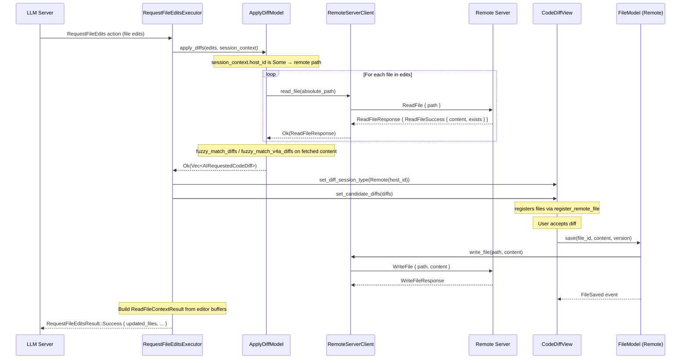

# APP-3790: Remote Apply Diff

## Problem

When an AI agent runs in an SSH session, the `ApplyFileDiffs` tool is disabled because the diff preprocessing step reads files from the local filesystem (`std::fs::read_to_string`, `std::fs::exists`). The remote host's files are inaccessible to the client. We need to:

1. Route file reads through the remote server during diff application
2. Wire the `CodeDiffView` save/delete/create flow through the remote `FileModel` backend
3. Return accepted buffer content to the LLM without a network re-read
4. Update the agent context so the server knows `ApplyFileDiffs` is available on remote sessions

## Relevant Code

- `crates/remote_server/proto/remote_server.proto` — proto schema; has `WriteFile`/`DeleteFile`, needs `ReadFile`
- `crates/remote_server/src/client.rs (210-244)` — `RemoteServerClient::write_file` / `delete_file`; pattern for `read_file`
- `app/src/remote_server/server_model.rs (498-573)` — `handle_write_file` / `handle_delete_file`; async-via-background-executor pattern
- `app/src/ai/blocklist/action_model/execute/request_file_edits/diff_application.rs` — `apply_edits` / `apply_edits_internal`; all local file I/O
- `app/src/ai/blocklist/action_model/execute/request_file_edits.rs (299-421)` — `RequestFileEditsExecutor::preprocess_action` / `on_diffs_applied`
- `app/src/ai/blocklist/inline_action/code_diff_view.rs (459-464)` — `DiffSessionType` enum
- `app/src/ai/blocklist/inline_action/code_diff_view.rs (981-1050)` — `set_candidate_diffs`; already routes `register_file` vs `register_remote_file`
- `app/src/ai/blocklist/controller.rs (86-121)` — `SessionContext`
- `app/src/ai/agent/api/impl.rs (146-206)` — `get_supported_tools`; gates tools on session type
- `crates/remote_server/src/manager.rs (134-139)` — `RemoteServerManager::client_for_host`
- `crates/warp_files/src/lib.rs (95-106)` — `FileBackend::Remote`; already supports remote save/delete

## Current State

**Diff application** (`diff_application.rs`): `apply_edits_internal` parses `FileEdit` into grouped maps (search-replace, v4a, create, delete), then calls helpers (`apply_search_replace`, `apply_v4a_update`, `apply_create_file`, `apply_delete_file`) that each call `std::fs::read_to_string` or `std::fs::exists`. Purely local I/O — no code path exists for remote files.

**CodeDiffView save/delete/create**: `DiffSessionType` already exists with `Local` and `Remote(HostId)` variants. `set_candidate_diffs` routes to `register_file` (local) or `register_remote_file` (remote). `FileModel` has `FileBackend::Remote` that dispatches save/delete through `RemoteServerClient`. However, `RequestFileEditsExecutor` never sets `diff_session_type` — it defaults to `Local`.

**Agent tool gating**: `get_supported_tools` excludes `ApplyFileDiffs`, `ReadFiles`, and `SearchCodebase` when `session_type` is `WarpifiedRemote`. There is no field on `SessionContext` to indicate whether a `RemoteServerClient` is available.

**Post-accept context**: After diffs are accepted, `execute` re-reads files from disk via `read_local_file_context` and sends updated content to the LLM. This would require a network round-trip for remote sessions.

**Proto**: `remote_server.proto` has `WriteFile` and `DeleteFile` but no `ReadFile`.

## Proposed Changes

### 1. Add `ReadFile` proto message

Add `ReadFile` / `ReadFileResponse` to the remote server protocol, following the same `oneof result { success, error }` pattern as `WriteFileResponse` and `DeleteFileResponse`.

**`remote_server.proto`**:

```protobuf
message ReadFile {
  string path = 1;
}

message ReadFileResponse {
  oneof result {
    ReadFileSuccess success = 1;
    FileOperationError error = 2;
  }
}

message ReadFileSuccess {
  string content = 1;
  bool exists = 2;
}
```

`ReadFile` is field 9 in `ClientMessage`, `ReadFileResponse` is field 10 in `ServerMessage`.

**`server_model.rs`**: `handle_read_file` spawns the read onto the background executor, returns `None` from the handler, and sends the response asynchronously through `response_tx`. If the file doesn't exist, returns `ReadFileSuccess { content: "", exists: false }`. I/O errors return `FileOperationError` (not the generic `ErrorResponse`).

**`client.rs`**: `read_file(&self, path: String) -> Result<ReadFileSuccess, ClientError>` unwraps the `oneof`, mapping `FileOperationError` to `ClientError::FileOperationFailed`.

### 2. Async-parameterized `apply_edits` + `ApplyDiffModel` dispatch

The core insight is that the local and remote diff application paths differ **only** in how they read file contents. Everything else — parsing edits, iteration, conflict checking, fuzzy matching, building `AIRequestedCodeDiff` — is identical. Rather than duplicating the application logic, we parameterize `apply_edits` over a file-reading closure so a single codepath handles both.

#### `FileReadResult` and `apply_edits` signature

A new enum in `diff_application.rs` abstracts over the file-read outcome:

```rust
pub(crate) enum FileReadResult {
    Found(String),
    NotFound,
    ReadError(String),
}

impl From<std::io::Result<String>> for FileReadResult { ... }
```

`apply_edits` (the public entry point with telemetry) and `apply_edits_internal` (the core logic) become async and generic over the reader:

```rust
pub(crate) async fn apply_edits<F, Fut>(
    edits: Vec<FileEdit>,
    session_context: &SessionContext,
    ai_identifiers: &AIIdentifiers,
    background_executor: Arc<Background>,
    auth_state: Arc<AuthState>,
    passive_diff: bool,
    read_file: F,
) -> Result<Vec<AIRequestedCodeDiff>, Vec1<DiffApplicationError>>
where
    F: Fn(String) -> Fut,
    Fut: Future<Output = FileReadResult>,
```

The four leaf helpers (`apply_search_replace`, `apply_v4a_update`, `apply_create_file`, `apply_delete_file`) each take `&F` and call `read_file(absolute_path).await` instead of `std::fs` directly. They match on `FileReadResult` variants instead of `io::Result`.

The edit parsing/grouping stays inline in `apply_edits_internal` (no `GroupedEdits` struct) — this keeps the code close to the original master version.

#### Unified error variant

The previous `UnreadableFile { source: io::Error, file }` and `RemoteReadFailed { file, message }` variants are merged into a single `ReadFailed { file, message }` that works for both local and remote I/O errors.

#### `ApplyDiffModel` (Entity submodel)

**New file**: `app/src/ai/blocklist/action_model/execute/request_file_edits/apply_diff_model.rs`

`ApplyDiffModel` is a thin Entity that holds `ModelHandle<ActiveSession>`. Its `apply_diffs` method resolves session context, remote client, background executor, and auth state from its `ModelContext`, then passes the appropriate closure to `apply_edits`:

- **Local**: `|path| async { FileReadResult::from(std::fs::read_to_string(path)) }`
- **Remote**: `|path| { let client = client.clone(); async move { read_remote_file(&client, &path).await } }` where `read_remote_file` is a small adapter (~10 lines) that maps `RemoteServerClient::read_file` → `FileReadResult`.

The local-vs-remote dispatch is a single unified code path with no `cfg` gating — `RemoteServerManager` and `RemoteServerClient` compile on all targets including WASM. On WASM, `RemoteServerManager::connect_session` is a no-op, so `client_for_host` returns `None` and the local closure is used.

The executor creates `ApplyDiffModel` in its constructor and delegates via `self.apply_diff_model.update(ctx, |model, ctx| model.apply_diffs(...))`.

### 3. Wire `RequestFileEditsExecutor` through `ApplyDiffModel`

- `preprocess_action` calls `ApplyDiffModel::apply_diffs` instead of `apply_edits` directly.
- `on_diffs_applied`: when `session_context.host_id()` is `Some`, set `diff_session_type` on the `CodeDiffView` to `DiffSessionType::Remote(host_id)` before calling `set_candidate_diffs`. This ensures save/delete/create routes through `FileModel`'s remote backend.
- For local sessions, behavior is identical to today.

### 4. Post-accept context reads

After diffs are accepted and saved, `execute` calls `read_local_file_context` to re-read files from disk and send updated content to the LLM. For remote sessions, instead of round-tripping to the server, we build `ReadFileContextResult` directly from the `InlineDiffView` editor buffers.

The buffer content is the accepted state — it's what we just wrote via `FileModel::save` — so this is both correct and avoids a network round-trip.

In the `SavedAcceptedDiffs` handler inside `execute`, when `session_context.host_id()` is `Some` (remote), extract text from each `InlineDiffView`'s editor and construct `FileContext` entries directly. For local sessions, the existing `read_local_file_context` path remains unchanged.

### 5. Split `BootstrapSessionType` / `SessionType` and agent tool gating

Session type is modeled as two distinct enums to separate immutable bootstrap-time data from mutable runtime state:

**`BootstrapSessionType`** — immutable, determined at bootstrap, lives on `SessionInfo`:

```rust
pub enum BootstrapSessionType {
    Local,
    WarpifiedRemote,
}
```

**`SessionType`** — the authoritative runtime type, lives on `Session` behind a `parking_lot::Mutex`:

```rust
pub enum SessionType {
    Local,
    WarpifiedRemote { host_id: Option<HostId> },
}
```

`Session::new()` converts `BootstrapSessionType` → `SessionType` via a `From` impl (remote maps to `host_id: None`). `Session::session_type()` returns an owned `SessionType` from the mutex. `Session::set_remote_host_id()` mutates the `host_id` in-place through `Arc<Session>`.

This separation means `SessionInfo` never carries mutable state, and the `Session`'s `session_type` is the single source of truth that evolves as the remote server connection lifecycle progresses.

**`Sessions` subscription**: `Sessions::new()` subscribes to `RemoteServerManager` events. On `SessionConnected`, it calls `session.set_remote_host_id(Some(host_id))`. On `SessionDisconnected`, it clears it. A race-condition guard in `initialize_bootstrapped_session` also checks `RemoteServerManager` when a session is first inserted, covering the case where the handshake completes before the session is stored.

**`get_supported_tools`** (`api/impl.rs`): gates on `host_id` presence (set only after a successful handshake):

```rust
match session_context.session_type() {
    None | Some(SessionType::Local) => {
        supported_tools.extend(&[
            api::ToolType::ReadFiles,
            api::ToolType::ApplyFileDiffs,
            api::ToolType::SearchCodebase,
        ]);
    }
    Some(SessionType::WarpifiedRemote { host_id: Some(_) }) => {
        supported_tools.push(api::ToolType::ApplyFileDiffs);
    }
    Some(SessionType::WarpifiedRemote { host_id: None }) => {
        // Feature flag off or not yet connected — no remote tools.
    }
}
```

`ReadFiles` and `SearchCodebase` remain disabled for remote sessions (follow-up).

## End-to-End Flow



## Risks and Mitigations

**Network latency during diff application**: Each file requires a `ReadFile` round-trip. For diffs touching many files, this could be slow. Mitigation: `apply_edits_remote` can be extended to batch reads or use concurrent futures in a follow-up. The model boundary makes this change contained.

**Disconnected remote server**: If the `RemoteServerClient` disconnects between tool gating and diff application, `read_file` will fail. Mitigation: `ClientError::Disconnected` propagates as a `DiffApplicationError`, which the executor reports to the LLM so it can retry or inform the user.

**Large file reads over the wire**: `ReadFileResponse` returns entire file content as a string. For very large files this could be slow or memory-intensive. Mitigation: this matches the local path (`std::fs::read_to_string`) which also loads full files. Existing per-file size limits apply equally.

**Editor buffer staleness for post-accept context**: We return buffer content that was just saved rather than re-reading. If `FileModel::save` silently fails, the buffer might not match disk. Mitigation: `FailedToSave` events already propagate through `CodeDiffView` and are reported as errors, so the buffer-read code path would not be reached on failure.

## Testing and Validation

- **Proto round-trip test**: Add a test in `protocol_tests.rs` for `ReadFile` / `ReadFileResponse` encode/decode.
- **`handle_read_file` server test**: Verify the handler reads existing files, returns `exists: false` for missing files, and returns an error for unreadable files.
- **Unit tests for remote path**: Since local and remote share a single codepath, existing `diff_application_tests.rs` covers the core logic. Additional tests can pass a mock `read_file` closure that simulates remote behavior (e.g. returning `ReadError` for connectivity failures) without needing to mock `RemoteServerClient` directly.
- **Regression**: Run existing `diff_application_tests.rs` and `cargo nextest run -p warp_files` to verify local path is unchanged.
- **Integration**: Manually test agent mode in an SSH session — verify `ApplyFileDiffs` appears in supported tools, diff preview renders correctly, accept/save writes to the remote host, and the LLM receives updated file context after acceptance.

## Follow-ups

- **`ReadFiles` tool for remote sessions**: Use the same `ReadFile` proto to implement remote file reading for the `ReadFiles` agent tool.
- **`SearchCodebase` for remote sessions**: Requires remote codebase indexing infrastructure — separate project.
- **Batch/concurrent `ReadFile`**: The `read_file` closure could be extended to batch or pre-fetch reads for independent files before entering the application loop.
- **Post-accept context from buffer for local sessions**: The buffer-based approach could also eliminate the re-read for local sessions — a minor optimization.
