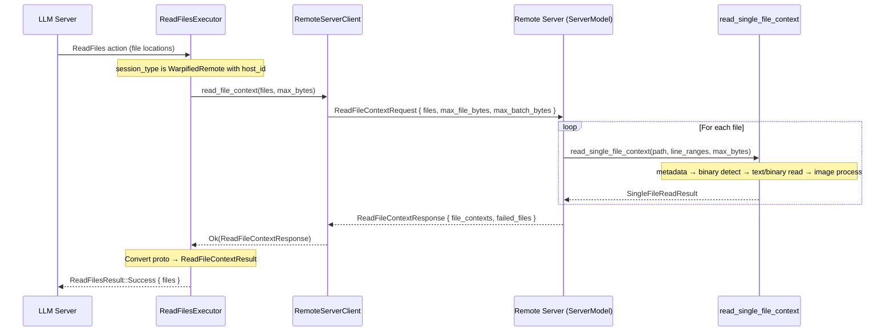

# APP-3790: Remote ReadFiles Tool

## Problem

The `ReadFiles` agent tool is disabled for remote SSH sessions. `get_supported_tools` skips `ToolType::ReadFiles` when `SessionType::WarpifiedRemote`, because the underlying `read_local_file_context` reads files via `async_fs`, `FileModel::read_text_file`, and local image processing — all local-only APIs.

The remote server already runs on the host machine with full filesystem access and has access to the same dependencies (`warp_files`, `warp_util`, `mime_guess`). Rather than building a degraded client-side approximation, we push the file-reading logic to the server so the ReadFiles tool has full feature parity with local: line-range extraction, binary/image support, metadata, and size limits.

## Relevant Code

- `app/src/ai/blocklist/action_model/execute/read_files.rs` — `ReadFilesExecutor`; dispatches to `read_local_file_context`
- `app/src/ai/blocklist/action_model/execute.rs:941` — `read_local_file_context`; per-file reading logic (metadata, binary detection, text/binary read, image processing, byte limits)
- `crates/warp_files/src/lib.rs:528` — `FileModel::read_text_file`; line-range extraction and byte-limit truncation
- `crates/warp_util/src/file_type.rs:46` — `is_binary_file`; extension-based binary detection
- `app/src/util/image.rs:96` — `process_image_for_agent`; image processing for LLM context
- `crates/remote_server/proto/remote_server.proto:234-249` — current `ReadFile`/`ReadFileResponse`/`ReadFileSuccess` proto (too simple)
- `crates/remote_server/src/client.rs:266` — `RemoteServerClient::read_file`; current simple read
- `app/src/remote_server/server_model.rs:883` — `handle_read_file_context`; calls `read_local_file_context` and converts result to proto
- `app/src/ai/agent/api/impl.rs:146` — `get_supported_tools`; gates tools on session type
- `app/src/ai/agent/api/impl.rs:221` — `get_supported_cli_agent_tools`; same gating for CLI agent
- `app/src/ai/blocklist/action_model/execute/request_file_edits/apply_diff_model.rs` — `read_remote_file` adapter; uses old `ReadFile` proto

## Current State

**`ReadFilesExecutor::execute`** resolves cwd/shell from `ActiveSession`, then calls `read_local_file_context(locations, cwd, shell, None)` inside a `BoxFuture`.

**`read_local_file_context`** iterates over `FileLocations` and for each file:

1. Resolves the absolute path via `host_native_absolute_path`
2. Reads metadata via `async_fs::metadata` → `last_modified`, `file_size`
3. Computes effective byte budget (per-file `MAX_FILE_READ_BYTES` ∩ remaining batch budget)
4. Binary detection via `is_binary_file` (extension-based, `warp_util::file_type`)
5. Text path: `FileModel::read_text_file` — reads with line-range extraction and byte-limit truncation, returns segments
6. Binary path: reads raw bytes, checks MIME via `mime_guess`, runs `process_image_for_agent` for supported images, skips oversized files
7. Returns `ReadFileContextResult { file_contexts, missing_files }`

**Current `ReadFile` proto** (`remote_server.proto`): `ReadFile { path }` → `ReadFileSuccess { content, exists }`. The server handler just calls `tokio::fs::read_to_string` — no metadata, no line ranges, no size limits, no binary support.

**Tool gating**: `get_supported_tools` excludes `ReadFiles` for `WarpifiedRemote` sessions. `get_supported_cli_agent_tools` also excludes it.

## Proposed Changes

### 1. Replace `ReadFile` proto with `ReadFileContext` (richer batch request/response)

Replace the current `ReadFile`/`ReadFileResponse`/`ReadFileSuccess` messages in-place (no backward compat needed — both changes land in the same release). Reuse field slots 10/11 in `ClientMessage`/`ServerMessage`.

**`remote_server.proto`**:

```protobuf
// A single file to read, with optional line ranges.
message ReadFileContextFile {
  string path = 1;
  // 1-indexed line ranges (start..end). Empty = read entire file.
  repeated LineRange line_ranges = 2;
}

message LineRange {
  uint32 start = 1;
  uint32 end = 2;
}

// Client → server: batch read multiple files with full context.
message ReadFileContextRequest {
  repeated ReadFileContextFile files = 1;
  // Per-file byte limit. Absent = use server default (MAX_FILE_READ_BYTES).
  optional uint32 max_file_bytes = 2;
  // Cumulative byte budget across all files. Absent = no batch limit.
  optional uint32 max_batch_bytes = 3;
}

// Server → client: result of ReadFileContextRequest.
// Per-file failures are reported in `failed_files`, not as a top-level error.
// Catastrophic server errors (malformed request, etc.) use the generic ErrorResponse.
message ReadFileContextResponse {
  repeated FileContextProto file_contexts = 1;
  repeated FailedFileRead failed_files = 2;
}

message FailedFileRead {
  string path = 1;
  FileOperationError error = 2;  // reuses the existing shared error type
}

message FileContextProto {
  string file_name = 1;
  oneof content {
    string text_content = 2;
    bytes binary_content = 3;
  }
  // Optional 1-indexed line range this segment covers.
  optional uint32 line_range_start = 4;
  optional uint32 line_range_end = 5;
  optional uint64 last_modified_epoch_millis = 6;
  uint32 line_count = 7;
}
```

This is a batch API — one round-trip reads all requested files, avoiding serial latency.

### 2. Share file-reading logic via `read_local_file_context`

Rather than extracting a new per-file helper, the server handler calls the existing `read_local_file_context` directly. This function already implements the full pipeline (metadata → binary detection → text line-range extraction via `FileModel::read_text_file` → image processing → byte-limit enforcement) and is accessible as `pub(crate)` from `crate::ai::blocklist::read_local_file_context`.

The server handler converts its proto request into `Vec<FileLocations>` (paths are already absolute, so `cwd: None` and `shell: None` are passed, causing `host_native_absolute_path` to act as an identity on absolute paths). The `ReadFileContextResult` is then converted to proto `ReadFileContextResponse` via a `file_context_result_to_proto` helper that maps `FileContext` → `FileContextProto` and `missing_files` → `FailedFileRead`.

### 3. Implement `handle_read_file_context` on the server

New handler in `ServerModel`:

- Deserialize `ReadFileContextRequest` → convert `ReadFileContextFile` list into `Vec<FileLocations>`
- Call `read_local_file_context(file_locations, None, None, max_batch_bytes)` to read all files
- Convert the `ReadFileContextResult` to proto via `file_context_result_to_proto`
- If `read_local_file_context` returns an `Err`, convert to a single `FailedFileRead` in the response
- Return `ReadFileContextResponse`

The handler uses `spawn_request_handler` (like `handle_run_command`) so it runs on the background executor and is cancellable via `Abort`.

### 4. Add `RemoteServerClient::read_file_context`

New method on the client:

```rust
pub async fn read_file_context(
    &self,
    files: Vec<ReadFileContextFile>,
    max_file_bytes: Option<u32>,
    max_batch_bytes: Option<u32>,
) -> Result<ReadFileContextResponse, ClientError>
```

Follows the same pattern as `write_file` / `delete_file` — sends request, awaits correlated response, maps error variant.

### 5. Update `ReadFilesExecutor::execute` to dispatch on session type

In the `execute` method, after resolving cwd/shell, check `active_session.session_type(ctx)`:

- **Local / None**: call `read_local_file_context` as today (unchanged).
- **WarpifiedRemote with host_id**: resolve `RemoteServerClient` via `RemoteServerManager::client_for_host`, call `client.read_file_context(...)`, convert `ReadFileContextResponse` → `ReadFileContextResult` (mapping proto `FileContextProto` → `FileContext`, `FailedFileRead` → `missing_files`).
- **WarpifiedRemote without host_id**: fall through to the local `read_local_file_context` path.

The remote client lookup uses a unified code path with no `cfg` gating — `RemoteServerManager` and `RemoteServerClient` compile on all targets including WASM. On WASM, `client_for_host` returns `None` (since `connect_session` is a no-op), so the local path is used automatically.

### 6. Update `apply_diff_model.rs` to use new proto

The `read_remote_file` adapter currently uses the old `ReadFile`/`ReadFileSuccess` proto. Update it to send a `ReadFileContextRequest` with a single file (no line ranges, no byte limits) and map the response back to `FileReadResult`.

### 7. Enable `ReadFiles` in `get_supported_tools` for remote sessions

In `get_supported_tools` (impl.rs:179), add `api::ToolType::ReadFiles` alongside `ApplyFileDiffs` for the `WarpifiedRemote { host_id: Some(_) }` arm.

Also in `get_supported_cli_agent_tools` (impl.rs:234), enable `ReadFiles` for remote sessions with a connected host.

## End-to-End Flow



## Risks and Mitigations

**Network latency for large batches**: The batch API sends all files in one round-trip, but the server reads them sequentially. For requests with many files, this could be slow. Mitigation: follow-up to add concurrent reads on the server via `futures::join_all`.

**Large binary files over the wire**: Image files after processing can still be significant. Mitigation: the same `MAX_FILE_READ_BYTES` limit applies server-side, and `process_image_for_agent` already has its own size guard.

**Server crash on malformed request**: A malformed `ReadFileContextRequest` could panic. Mitigation: validate inputs before processing; the `spawn_request_handler` pattern already handles errors gracefully.

**`apply_diff_model.rs` migration**: Replacing the proto in-place means the apply-diff path must be updated atomically in the same PR. Mitigation: the change to `apply_diff_model.rs` is small — send a single-file `ReadFileContextRequest` and map the response.

## Testing and Validation

- **Existing `read_local_file_context` tests**: Cover the shared per-file reading logic (text files with/without line ranges, missing files, binary/image files, oversized files, byte-limit enforcement) that the server handler now reuses.
- **Server handler test**: Test `handle_read_file_context` end-to-end — verify it reads existing files, returns `failed_files` for non-existent/unreadable files, and respects byte limits.
- **Proto round-trip test**: Encode/decode `ReadFileContextRequest` / `ReadFileContextResponse`.
- **Client integration**: Unit test `read_file_context` with a mock server response.
- **Regression**: Existing `read_local_file_context` tests and `diff_application_tests` remain unchanged (local path untouched, apply-diff adapter updated).
- **Manual**: Connect to a remote SSH session, invoke agent mode, verify the LLM can read text and image files on the remote host with correct line ranges.

## Follow-ups

- **Concurrent reads on server**: The server handler reads files sequentially via `read_local_file_context`. Concurrency could be added either inside that function or by splitting files across multiple calls.
- **Backport `FailedFileRead` to local path**: Update `ReadFileContextResult::missing_files` from `Vec<String>` to include failure reasons, matching the richer remote proto.
