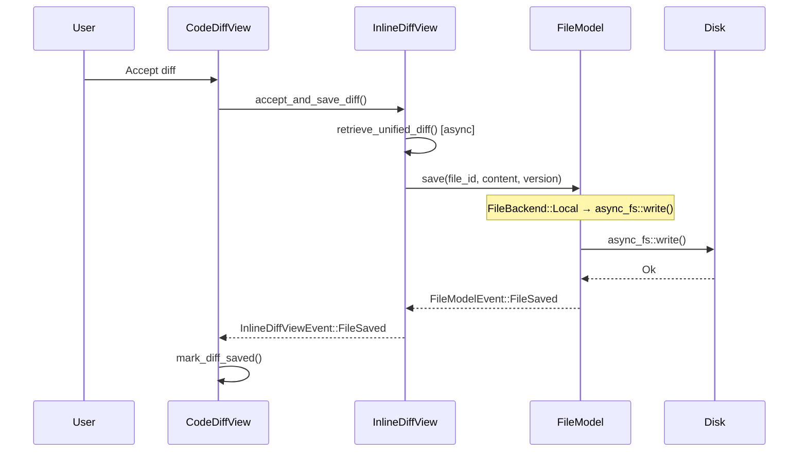
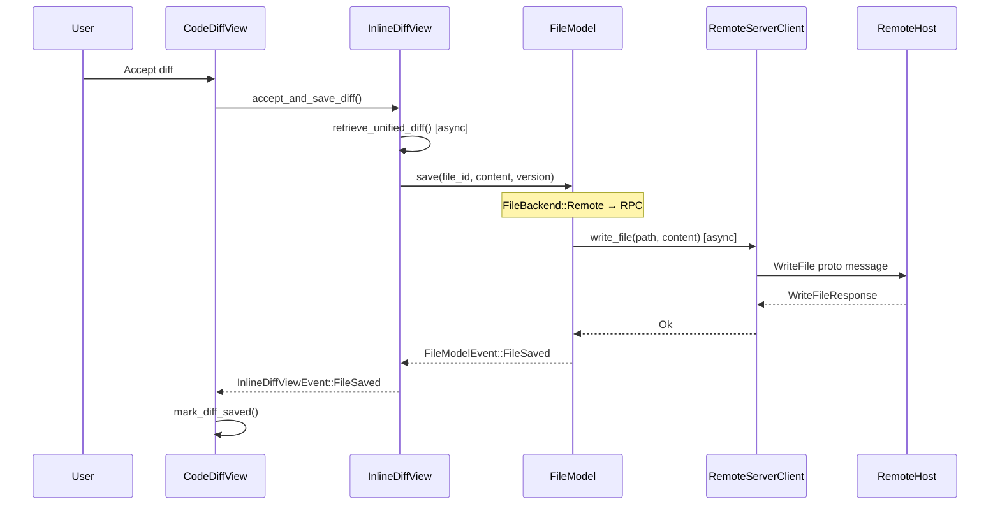

# Unified FileModel for Local and Remote File Persistence

## Problem

`LocalFileModel` only supports local filesystem operations. When the agent generates file edits for a remote SSH session, the diff view needs to write files to the remote host via `RemoteServerClient`, not to the local disk. Today this is impossible because `LocalFileModel::save()` and `delete()` always call `async_fs::write` / `async_fs::remove_file` on local paths.

The goal is to extend `LocalFileModel` into a unified `FileModel` that dispatches to local or remote backends based on how the file was registered, so all existing consumers (`InlineDiffView`, `LocalCodeEditorView`, `GlobalBufferModel`, `ServerModel`) continue using the same `FileId` + `FileModelEvent` event pattern without any changes to their subscription logic.

## Relevant code

- `app/src/code/inline_diff.rs` — `InlineDiffView` struct and all `LocalFileModel` usage
- `app/src/code/diff_viewer.rs (113-171)` — `DiffViewer` trait with `accept_and_save_diff`, `restore_diff_base` defaults
- `app/src/ai/blocklist/inline_action/code_diff_view.rs (954-1005)` — `set_candidate_diffs()` which constructs `InlineDiffView` and calls `register_file()`
- `crates/warp_files/src/lib.rs (282-315, 548-706)` — `LocalFileModel::register_file_path()`, `save()`, `delete()`
- `crates/warp_util/src/standardized_path.rs` — `StandardizedPath` for platform-aware remote paths
- `app/src/remote_server/manager.rs` — `RemoteServerManager` and `RemoteServerClient` (future remote implementation)

## Current state

`InlineDiffView` manages file persistence through a `backing_file_id: Option<FileId>` field:

- **Construction**: `InlineDiffView::new()` creates the view with `backing_file_id: None` (read-only).
- **Registration**: `register_file()` (non-WASM only) calls `LocalFileModel::register_file_path()`, stores the `FileId`, subscribes to `FileModelEvent::FileSaved` / `FailedToSave`, and re-emits them as `InlineDiffViewEvent`.
- **Save**: `save_content()` calls `LocalFileModel::save(file_id, content, version)`.
- **Delete**: `restore_diff_base()` calls `LocalFileModel::delete(file_id, version)` for new files or `LocalFileModel::save(file_id, base_content, version)` for existing files.
- **Editability gate**: `backing_file_id.is_some()` determines whether the editor is editable and whether accept/save/revert are allowed.

The coupling to `LocalFileModel` is spread across:
1. `register_file()` — 6 `LocalFileModel` calls + event subscription (lines 100-136)
2. `save_content()` — 1 `LocalFileModel::save()` call (lines 166-181)
3. `restore_diff_base()` — 2 `LocalFileModel` calls (save or delete) (lines 238-282)

All three are gated behind `#[cfg(not(target_family = "wasm"))]`. On WASM, `backing_file_id` stays `None` and all operations are no-ops.

## Proposed changes

### Unified `FileModel` singleton (replaces per-view trait)

Instead of a `BackingFileStore` trait with callbacks, extend the existing `LocalFileModel` singleton into a unified `FileModel` that handles both local and remote file entries. All consumers (`InlineDiffView`, `LocalCodeEditorView`, `GlobalBufferModel`, `ServerModel`) continue to use the same `FileId` + `FileModelEvent` pattern they already use today.

#### Why not a trait with callbacks

A trait-based approach (`BackingFileStore`) was considered but rejected because:
- Callbacks can't carry mutable `ViewContext` / `ModelContext`, making it impossible to emit events or access singletons from within the completion handler.
- All four consumers already subscribe to `FileModelEvent` via `ctx.subscribe_to_model(&file_model, ...)` and filter by `FileId`. This pattern works with any context type.
- Introducing a new abstraction layer adds complexity when the existing singleton event pattern already solves the problem.

#### Design: extend `LocalFileModel` to handle remote files

Rename `LocalFileModel` to `FileModel`. Internally, each `FileId` is backed by either a local file entry (existing `LocalFile` struct) or a remote file entry:

```rust
/// Per-file backing store. Local files use std::fs via async_fs.
/// Remote files use RemoteServerClient RPCs.
enum FileBackend {
    Local(LocalFile),
    Remote {
        /// Identifies the remote host. The actual client is looked up from
        /// RemoteServerManager at call time, which naturally handles
        /// disconnect (lookup returns None) without holding the Arc alive.
        host_id: HostId,
        /// Platform-aware path on the remote host.
        path: StandardizedPath,
    },
}
```

The `FileModel` (née `LocalFileModel`) stores `HashMap<FileId, FileBackend>` instead of `HashMap<FileId, LocalFile>`. The public API stays the same:

```rust
impl FileModel {
    /// Register a local file path. Existing behavior, unchanged.
    pub fn register_file_path(
        &mut self, path: &Path, subscribe_to_updates: bool, ctx: ...
    ) -> FileId;

    /// Register a remote file path. New.
    pub fn register_remote_file(
        &mut self, host_id: HostId, path: StandardizedPath,
    ) -> FileId;

    /// Save content. Dispatches to local async_fs::write or remote WriteFile RPC
    /// based on the FileId's backend. Emits FileModelEvent::FileSaved / FailedToSave.
    pub fn save(
        &mut self, file_id: FileId, content: String, version: ContentVersion, ctx: ...
    ) -> Result<(), FileSaveError>;

    /// Delete a file. Dispatches to local async_fs::remove_file or remote DeleteFile RPC.
    pub fn delete(
        &mut self, file_id: FileId, version: ContentVersion, ctx: ...
    ) -> Result<(), FileSaveError>;
}
```

`save()` and `delete()` check the `FileBackend` variant and dispatch accordingly:
- **`FileBackend::Local`**: existing code path (async_fs::write, ensure_parent_directories)
- **`FileBackend::Remote`**: look up `Arc<RemoteServerClient>` from `RemoteServerManager` via `host_id` at call time. If the client is connected, spawn async task calling `client.write_file(path, content).await` or `client.delete_file(path).await`, emit `FileModelEvent::FileSaved` / `FailedToSave` on completion. If disconnected, emit `FailedToSave` immediately with a descriptive error.

Both paths emit the same `FileModelEvent`, so all downstream subscribers work unchanged.

#### What changes for each consumer

| Consumer | Change |
|---|---|
| `InlineDiffView` | Calls `FileModel::register_file_path()` for local or `FileModel::register_remote_file()` for remote. Stores `FileId`. All existing event subscriptions unchanged. |
| `LocalCodeEditorView` | `LocalFileModel::handle(ctx)` → `FileModel::handle(ctx)`. No other changes. |
| `GlobalBufferModel` | Same rename. All `FileModelEvent` subscriptions unchanged. |
| `ServerModel` | Uses `FileModel::register_file_path()` + `save()` / `delete()` with `pending_file_ops` dispatch map (unchanged from previous spec section). |
| `code_diff_view.rs` | `set_candidate_diffs()` calls `register_file_path()` for local sessions, `register_remote_file()` for remote sessions. |

#### Migration strategy

1. **Rename**: `LocalFileModel` → `FileModel` (type alias `LocalFileModel = FileModel` for backward compat during migration).
2. **Add `FileBackend` enum**: wrap existing `LocalFile` in `FileBackend::Local`. All existing code paths unchanged.
3. **Add `register_remote_file()`**: creates a `FileBackend::Remote` entry.
4. **Extend `save()` / `delete()`**: match on `FileBackend` variant, dispatch to local or remote code path.
5. **Update `InlineDiffView`**: replace `backing_file_id: Option<FileId>` (unchanged type) but call `register_remote_file()` for remote sessions.

Steps 1-2 are pure refactors with no behavior change. Steps 3-4 add the remote capability. Step 5 wires it up.

#### `backing_file_id` semantics in `InlineDiffView` (unchanged)

The `backing_file_id: Option<FileId>` field retains its current semantics:
- `Some(file_id)` → editable, save/revert write through `FileModel`
- `None` → selection-only, save/revert are no-ops

The `FileId` is opaque — `InlineDiffView` doesn't know or care whether it's backed by local or remote. It calls `FileModel::save(file_id, content, version)` and subscribes to `FileModelEvent` filtered by `file_id`, exactly as today.


#### Proto definition

Extend `remote_server.proto` with two new request/response pairs. These follow the existing pattern: the `ClientMessage` oneof gets new variants, and corresponding response variants are added to `ServerMessage`.

```protobuf
// ── In ClientMessage oneof ────────────────────────────────────────
//   WriteFile write_file = 5;
//   DeleteFile delete_file = 6;

// ── File write/delete operations ──────────────────────────────────

// Client → server: write content to a file, creating parent dirs if needed.
message WriteFile {
  string path = 1;
  string content = 2;
}

// Server → client: file was written successfully.
message WriteFileResponse {}

// Client → server: delete a file.
message DeleteFile {
  string path = 1;
}

// Server → client: file was deleted successfully.
message DeleteFileResponse {}

// ── In ServerMessage oneof ────────────────────────────────────────
//   WriteFileResponse write_file_response = 7;
//   DeleteFileResponse delete_file_response = 8;
```

Errors are returned using the existing `ErrorResponse` variant (field 3 in `ServerMessage`), with `ErrorCode::INTERNAL` for I/O failures and a human-readable message. No new error codes are needed.

#### Client-side methods on `RemoteServerClient`

Follows the existing `initialize()` / `navigate_to_directory()` pattern:

```rust
impl RemoteServerClient {
    /// Writes content to a file on the remote host.
    /// Creates parent directories if they don't exist.
    pub async fn write_file(
        &self,
        path: String,
        content: String,
    ) -> Result<(), ClientError> {
        let request_id = RequestId::new();
        let msg = ClientMessage {
            request_id: request_id.to_string(),
            message: Some(client_message::Message::WriteFile(
                WriteFile { path, content },
            )),
        };
        let response = self.send_request(request_id, msg).await?;
        match response.message {
            Some(server_message::Message::WriteFileResponse(_)) => Ok(()),
            _ => Err(ClientError::UnexpectedResponse),
        }
    }

    /// Deletes a file on the remote host.
    pub async fn delete_file(&self, path: String) -> Result<(), ClientError> {
        let request_id = RequestId::new();
        let msg = ClientMessage {
            request_id: request_id.to_string(),
            message: Some(client_message::Message::DeleteFile(
                DeleteFile { path },
            )),
        };
        let response = self.send_request(request_id, msg).await?;
        match response.message {
            Some(server_message::Message::DeleteFileResponse(_)) => Ok(()),
            _ => Err(ClientError::UnexpectedResponse),
        }
    }
}
```

Both use the existing `send_request()` which handles timeout, abort, and error unwrapping.

#### Server-side handler in `ServerModel`

Reuses `LocalFileModel` on the server to avoid reimplementing async file I/O, parent directory creation, and error handling. `LocalFileModel` is already a singleton model with `save()` and `delete()` that run on background threads via `ctx.spawn(async { async_fs::write(...) })`. The remote server can register it as a singleton in `run()` and the handlers can use `LocalFileModel::handle(ctx)` just like the client does.

##### Setup: register `LocalFileModel` in the remote server

In `app/src/remote_server/mod.rs`, add `LocalFileModel` to the headless app's singleton models:

```rust
pub fn run() -> anyhow::Result<()> {
    // ...
    AppBuilder::new_headless(AppCallbacks::default(), Box::new(()), None).run(|ctx| {
        ctx.add_singleton_model(DirectoryWatcher::new);
        ctx.add_singleton_model(|_ctx| DetectedRepositories::default());
        ctx.add_singleton_model(RepoMetadataModel::new_with_incremental_updates);
        ctx.add_singleton_model(LocalFileModel::new);  // NEW
        ctx.add_singleton_model(ServerModel::new);
    })?;
    Ok(())
}
```

`LocalFileModel::new()` creates a `BulkFilesystemWatcher` internally, but since we never call `register_file_path(path, true /* subscribe */)`, the watcher stays idle with no overhead.

##### Event dispatch: subscribe once, dispatch via `file_id` map

Instead of subscribing to `LocalFileModel` per-request (which leaks subscriptions), `ServerModel` subscribes once at startup and uses a `HashMap<FileId, PendingFileOp>` to correlate `FileModelEvent`s back to their originating request.

```rust
/// Tracks an in-flight file write or delete so the async completion
/// event can be correlated back to the originating client request.
enum FileOpKind {
    Write,
    Delete,
}

struct PendingFileOp {
    request_id: RequestId,
    kind: FileOpKind,
}
```

Add to `ServerModel`:

```rust
pub struct ServerModel {
    response_tx: async_channel::Sender<ServerMessage>,
    in_progress: HashMap<RequestId, tokio::sync::oneshot::Sender<()>>,
    host_id: String,
    /// Maps FileId → pending file operation for write/delete correlation.
    pending_file_ops: HashMap<FileId, PendingFileOp>,
}
```

In `ServerModel::new()`, subscribe to `LocalFileModel` once:

```rust
// Subscribe to LocalFileModel events for write/delete completion.
{
    let file_model = LocalFileModel::handle(ctx);
    ctx.subscribe_to_model(&file_model, |me, event, _ctx| {
        let file_id = event.file_id();
        let Some(pending) = me.pending_file_ops.remove(&file_id) else {
            return; // Not a file op we're tracking.
        };

        let response_message = match (event, &pending.kind) {
            (FileModelEvent::FileSaved { .. }, FileOpKind::Write) => {
                server_message::Message::WriteFileResponse(WriteFileResponse {})
            }
            (FileModelEvent::FileSaved { .. }, FileOpKind::Delete) => {
                server_message::Message::DeleteFileResponse(DeleteFileResponse {})
            }
            (FileModelEvent::FailedToSave { error, .. }, _) => {
                server_message::Message::Error(ErrorResponse {
                    code: ErrorCode::Internal.into(),
                    message: format!("File operation failed: {error}"),
                })
            }
            _ => return,
        };

        let _ = me.response_tx.try_send(ServerMessage {
            request_id: pending.request_id.into(),
            message: Some(response_message),
        });
    });
}
```

##### Handlers: register file, insert pending op, trigger I/O

The handlers are now simple: register the path, record the pending op, trigger the async I/O, return `None`.

In `ServerModel::handle_message()`, add two new arms:

```rust
Some(client_message::Message::WriteFile(msg)) => {
    self.handle_write_file(msg, &request_id, ctx)
}
Some(client_message::Message::DeleteFile(msg)) => {
    self.handle_delete_file(msg, &request_id, ctx)
}
```

Handler implementations:

```rust
fn handle_write_file(
    &mut self,
    msg: WriteFile,
    request_id: &RequestId,
    ctx: &mut ModelContext<Self>,
) -> Option<server_message::Message> {
    log::info!("Handling WriteFile path={} (request_id={request_id})", msg.path);
    let path = std::path::Path::new(&msg.path);

    let file_model = LocalFileModel::handle(ctx);
    let file_id = file_model.update(ctx, |m, ctx| m.register_file_path(path, false, ctx));
    let version = ContentVersion::new();
    file_model.update(ctx, |m, _| m.set_version(file_id, version));

    // Track this op so the event subscription can correlate the result.
    self.pending_file_ops.insert(file_id, PendingFileOp {
        request_id: request_id.clone(),
        kind: FileOpKind::Write,
    });

    if let Err(err) = file_model.update(ctx, |m, ctx| m.save(file_id, msg.content, version, ctx)) {
        self.pending_file_ops.remove(&file_id);
        return Some(server_message::Message::Error(ErrorResponse {
            code: ErrorCode::Internal.into(),
            message: format!("Failed to initiate write: {err}"),
        }));
    }

    None // Response sent asynchronously via the event subscription.
}

fn handle_delete_file(
    &mut self,
    msg: DeleteFile,
    request_id: &RequestId,
    ctx: &mut ModelContext<Self>,
) -> Option<server_message::Message> {
    log::info!("Handling DeleteFile path={} (request_id={request_id})", msg.path);
    let path = std::path::Path::new(&msg.path);

    let file_model = LocalFileModel::handle(ctx);
    let file_id = file_model.update(ctx, |m, ctx| m.register_file_path(path, false, ctx));
    let version = ContentVersion::new();
    file_model.update(ctx, |m, _| m.set_version(file_id, version));

    self.pending_file_ops.insert(file_id, PendingFileOp {
        request_id: request_id.clone(),
        kind: FileOpKind::Delete,
    });

    if let Err(err) = file_model.update(ctx, |m, ctx| m.delete(file_id, version, ctx)) {
        self.pending_file_ops.remove(&file_id);
        return Some(server_message::Message::Error(ErrorResponse {
            code: ErrorCode::Internal.into(),
            message: format!("Failed to initiate delete: {err}"),
        }));
    }

    None
}
```

Key design decisions for the server handlers:
- **Subscribe once, dispatch via map**: `ServerModel` subscribes to `LocalFileModel` once at startup. Each write/delete handler inserts a `PendingFileOp` keyed by `FileId`, and the subscription callback removes it on completion to send the correlated response. No per-request subscription leaks.
- **Reuse `LocalFileModel`**: avoids reimplementing `async_fs::write`, `ensure_parent_directories`, error wrapping, and the async completion callback pattern. `LocalFileModel::save()` already handles all of this.
- **Async via `LocalFileModel`**: file I/O runs on the background thread through `LocalFileModel`'s internal `ctx.spawn()`. The handler returns `None` and the response is sent asynchronously when `FileModelEvent::FileSaved` / `FailedToSave` fires.
- **No watcher overhead**: `register_file_path(path, false)` skips watcher subscription, so the `BulkFilesystemWatcher` stays idle.
- **Cleanup on sync failure**: if `save()` / `delete()` returns an immediate error (e.g. `NoFilePath`), the pending op is removed and a sync error response is returned.

### Changes to `InlineDiffView`

No structural change — `backing_file_id: Option<FileId>` stays as-is. The `FileId` is opaque and works for both local and remote files.

Unify `register_file()` to accept a `DiffSessionType` and dispatch internally:

```rust
pub fn register_file(
    &mut self,
    session_type: &DiffSessionType,
    ctx: &mut ViewContext<Self>,
) {
    let file_model = FileModel::handle(ctx);
    let file_id = match session_type {
        DiffSessionType::Local => file_model.update(ctx, |m, ctx| {
            m.register_file_path(file_path, false, ctx)
        }),
        DiffSessionType::Remote(host_id) => {
            let remote_path = StandardizedPath::try_new(...);
            file_model.update(ctx, |m, _| m.register_remote_file(host_id, remote_path))
        }
    };
    self.finish_file_registration(file_id, ctx);
}
```

`save_content()`, `restore_diff_base()`, and all `is_some()`/`is_none()` checks remain identical — they call `FileModel::save(file_id, ...)` / `FileModel::delete(file_id, ...)` which dispatches internally.

### Changes to `set_candidate_diffs()` in `code_diff_view.rs`

The caller passes the session type; the local vs. remote dispatch is an internal detail of `register_file()`:

```rust
#[cfg(not(target_family = "wasm"))]
diff_viewer.update(ctx, |view, ctx| {
    view.register_file(&self.diff_session_type, ctx);
});
```

### File placement

- `crates/warp_files/src/lib.rs` — `FileModel` (renamed from `LocalFileModel`), `FileBackend` enum, `register_remote_file()`
- No new files needed for the trait — the abstraction lives inside the singleton.

## End-to-end flow

### Accept + save (local session)



### Accept + save (remote session)



## Risks and mitigations

**Risk: Remote `save()` / `delete()` latency.**
Remote RPCs are slower than local `async_fs::write`. The `SavingDiffs` state machine in `CodeDiffView` already handles async completion, so latency is tolerated. But UI responsiveness may degrade on high-latency SSH connections. Mitigation: the accept flow already shows a loading state via `CodeDiffState::Accepted(Some(SavingDiffs))`.

**Risk: `FileModel` becomes a larger singleton.**
Adding `FileBackend::Remote` entries increases the surface area of `FileModel`. Mitigation: remote entries are simple (no watcher, no repo subscription) and the `save()`/`delete()` dispatch is a single match arm. The rename from `LocalFileModel` → `FileModel` is the biggest churn.

**Risk: WASM cfg gates.**
On WASM, `FileModel` is not available. `InlineDiffView` continues to use `backing_file_id: None` (selection-only, no save). The cfg gates stay at the registration site in `set_candidate_diffs()`, same as today.

## Testing and validation

1. **Existing diff application tests** (`diff_application_tests.rs`): verify that `apply_edits()` still produces correct `AIRequestedCodeDiff` with `original_content`. These don't touch `BackingFileStore` directly.

2. **Manual testing**: accept, reject, and revert agent-generated diffs in local sessions. Verify files are written/deleted correctly.

3. **WASM build**: `cargo clippy --target wasm32-unknown-unknown --profile release-wasm-debug_assertions --no-deps` — verify no regressions.

4. **Unit test for `FileModel` remote backend** (optional): construct with a mock `RemoteServerClient`, call `save()`, verify `FileSaved` event is emitted. Requires `App::test()` harness.

## Follow-ups

- **`ApplyEditModel`**: dispatch diff matching to local `apply_edits()` vs remote `ApplyEdits` RPC based on session type.
- **Tool gating for remote sessions**: enable `ApplyFileDiffs` tool in `get_supported_tools()` when `RemoteServerClient` is connected.
- **Memory optimization**: clear `DiffBase.content` after editor initialization to avoid holding two copies (one in `DiffBase`, one in `DiffModel.base`).
- **Disconnect handling**: when `RemoteServerManager` emits `SessionDisconnected`, in-flight `FileModel` remote RPCs should fail with `FailedToSave` rather than hanging. `FileModel` could subscribe to `RemoteServerManagerEvent::SessionDisconnected` and fail all pending remote ops for that session.
- **Migrate `LocalCodeEditorView`**: replace direct `LocalFileModel::handle(ctx).update(...)` calls with `FileModel::handle(ctx).update(...)`. Pure rename, no behavior change.
- **Migrate `GlobalBufferModel`**: same rename. The `FileModelEvent` subscriptions are already generic over `FileId`.
