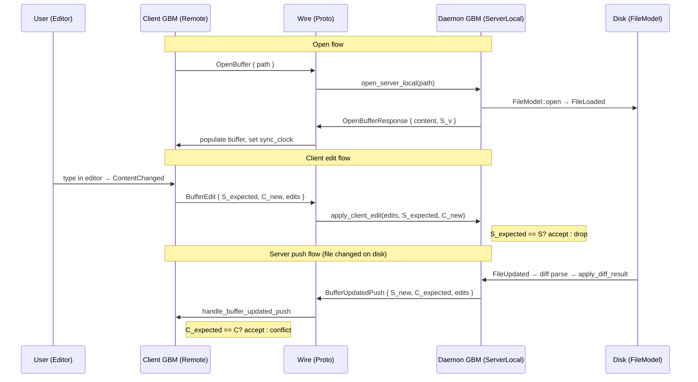

# APP-3802: Remote-Backed GlobalBufferModel

## Context

Warp's code editor uses `GlobalBufferModel` as a singleton that manages shared `Buffer` instances keyed by `FileId`. Before this work, it only supported local files—backed by `FileModel` for disk I/O and file-watching, with LSP integration for language services.

SSH-remote editing needs the same `Buffer` infrastructure to work over the remote-server protocol: a daemon process on the remote host owns the file on disk, and the client-side Warp app operates on a proxy buffer that syncs bidirectionally with the daemon. Rather than build a parallel buffer system, we extend `GlobalBufferModel` with two new source variants so the same `Buffer`, selection model, and editor view can be reused regardless of where the file lives.

### Relevant files

- `app/src/code/global_buffer_model.rs` — `BufferSource` enum, `SyncClock`-based version tracking, sync entry points (`apply_client_edit`, `handle_buffer_updated_push`, `apply_diff_result`).
- `app/src/code/buffer_location.rs` — `BufferLocation` enum (`Local` / `Remote`), `SyncClock` definition and conflict-detection helpers.
- `app/src/code/buffer_location_tests.rs` — unit tests exercising each sync flow without network I/O.
- `crates/remote_server/proto/remote_server.proto (334–407)` — wire format: `OpenBuffer`, `BufferEdit`, `TextEdit`, `BufferUpdatedPush`, `CloseBuffer`, `SaveBuffer`, `ResolveConflict`.
- `app/src/remote_server/server_model.rs` — daemon-side `ServerModel` that routes proto messages to `GlobalBufferModel` and pushes file-watcher diffs to clients.
- `app/src/remote_server/server_buffer_tracker.rs` — `ServerBufferTracker`: path↔FileId mappings, per-buffer connection sets, pending-request correlation.

## Proposed Changes

### 1. Data model: three `BufferSource` variants

`GlobalBufferModel` tracks each buffer's backing store via the `BufferSource` enum. The three variants share the same `Buffer` model but differ in who owns the file and how versions are tracked:

```
BufferSource
├── Local          { base_content_version, initial_content_version }
├── ServerLocal    { sync_clock, base_content_version, initial_content_version }
└── Remote         { remote_path, sync_clock: Option<SyncClock> }
```

**Local** — existing behavior. File I/O through `FileModel`, version tracking via `ContentVersion` from the file-watcher, LSP sync via `didChange`.

**ServerLocal** — daemon-side variant. Created when `ServerModel` calls `open_server_local`. Extends `Local` with a `SyncClock` for version-vector tracking so the daemon can detect conflicts with connected clients. File-watcher changes produce a background diff (`apply_diff_result`) which emits a `ServerLocalBufferUpdated` event containing 1-indexed `CharOffsetEdit`s. `ServerModel` subscribes to this event and pushes `BufferUpdatedPush` proto messages to all connections that have the buffer open.

**Remote** — client-side proxy. Created by `open_remote_buffer` when a Warp tab opens a file on an SSH host. The `sync_clock` starts as `None` (unloaded) and becomes `Some` once the `OpenBufferResponse` arrives with the initial content and server version. Edits made locally fire `BufferEvent::ContentChanged`, which the subscription handler converts into `BufferEdit` proto messages using the delta's `PreciseDelta` ranges. Incoming `BufferUpdatedPush` events from the daemon are applied via `handle_buffer_updated_push`.

The `is_loaded()` check differs by variant: `Local`/`ServerLocal` use `base_content_version.is_some()`, while `Remote` uses `sync_clock.is_some()` to distinguish the "waiting for OpenBufferResponse" state from a loaded buffer.

### 2. Syncing protocol and conflict handling

The protocol uses a two-component version vector (`SyncClock`) where each side owns one counter:

- **server_version** (S) — bumped by the daemon when the file changes on disk.
- **client_version** (C) — bumped by the client when the user edits the buffer.

All edits on the wire use 1-indexed character offsets (`TextEdit { start_offset, end_offset, text }`), matching the buffer's internal `CharOffset` representation. Since both sides of the syncing protocol (client and daemon) are our own `GlobalBufferModel`, there is no need for an intermediate 0-based format — using `CharOffset` values directly avoids conversion code and the off-by-one risks that come with it.

#### Client → Server (user edit)

```
Client sends: BufferEdit { S_expected, C_new, edits }
Server checks: S_expected == local S?
  yes → apply edits to buffer, update C to C_new
  no  → silently drop (stale edit)
```

The server never pushes a rejection response. The client's optimistic edit remains applied locally; a subsequent `BufferUpdatedPush` from the server with a mismatched `C_expected` will trigger a `RemoteBufferConflict` event on the client side.

The client constructs `BufferEdit` messages from `PreciseDelta`s in the `ContentChanged` event, using `replaced_range` for the old offsets and reading replacement text from `resolved_range` in the post-edit buffer.

#### Server → Client (file-watcher change)

```
Server sends: BufferUpdatedPush { S_new, C_expected, edits }
Client checks: C_expected == local C?
  yes → apply edits, update S to S_new
  no  → emit RemoteBufferConflict event
```

On the daemon side, file-watcher events flow through the existing `FileModel` → `populate_buffer_with_read_content` → `start_background_diff_parse` → `apply_diff_result` pipeline. For `ServerLocal` buffers, `apply_diff_result` converts the byte-range diff edits to 1-indexed `CharOffsetEdit`s (using the buffer's native `ByteOffset::to_buffer_char_offset`) before applying the diff, then emits `ServerLocalBufferUpdated`. The `ServerModel`'s subscription converts these to proto `TextEdit`s and broadcasts to all connections.

A race guard exists: if a client edit arrives during the background diff parse, the buffer's `ContentVersion` will have changed, causing `apply_diff_result` to detect the mismatch via `version_match` and discard the stale diff.

#### Conflict resolution

When a `RemoteBufferConflict` is detected on the client, the UI presents a resolution dialog. "Accept client" sends a `ResolveConflict` message that replaces the server buffer and saves to disk. "Accept server" re-sends `OpenBuffer` to reload from the server's state.

#### Connection lifecycle

`ServerBufferTracker` manages per-buffer connection sets. When a connection disconnects, orphaned buffers (no remaining connections) are automatically deallocated via `GlobalBufferModel::remove`. `CloseBuffer` removes a single connection; if it was the last one, the buffer is torn down.

### 3. Diagram: edit flow across client and daemon



## Testing and Validation

Tests live in `app/src/code/buffer_location_tests.rs` (15 tests). They exercise the sync protocol end-to-end at the `GlobalBufferModel` level without requiring network I/O or a running daemon process.

### Test design

All tests use `App::test((), |mut app| async move { ... })` with a minimal singleton setup (`init_app`) that registers `FileModel`, `LspManagerModel`, etc. Two seeding strategies bypass async I/O:

1. **Server-local path**: `open_server_local` + `populate_buffer_with_read_content(is_initial_load: true)` to synchronously populate content, simulating `FileModel::FileLoaded`.
2. **Remote path**: `seed_remote_buffer_for_test` to insert a `BufferSource::Remote` with a pre-set `SyncClock`, bypassing `RemoteServerManager`.

Helper functions (`text_edit`, `char_edit`) construct proto and internal edit types concisely. Content assertions use `content_for_file`; clock assertions read from `sync_clock_for_server_local` / `sync_clock_for_remote_test`.

### Coverage matrix

**Flow 1 — Open**: `open_server_local_creates_buffer_and_is_server_local` — verifies `BufferSource::ServerLocal` is created with a `SyncClock`.

**Flow 2 — Client edits** (`apply_client_edit`):
- Accepted when server version matches (insert, replace, cross-line, batched).
- Rejected when server version is stale (content unchanged).
- Clock update: `client_version` advances, `server_version` stays.
- Sequential edits: two successive edits accepted with the same `server_version`.

**Flow 3 — Server pushes** (`handle_buffer_updated_push`):
- Accepted when client version matches (single edit, batched).
- Conflict when client version mismatches (`RemoteBufferConflict` event emitted, content unchanged).
- Clock update: `server_version` advances, `client_version` stays.
- Sequential pushes: two successive pushes accepted.

**Flow 4 — Lifecycle**: `remove` deallocates the buffer and `content_for_file` returns `None`.

**Conflict resolution**: `resolve_conflict` replaces content and updates `server_version` to the acknowledged value.

### What is not covered by unit tests

- The async `open_remote_buffer` → `OpenBufferResponse` round-trip (requires `RemoteServerManager`).
- `ServerModel` proto routing and `ServerBufferTracker` connection management (would need `ServerModel` test harness).
- The background diff parse → `ServerLocalBufferUpdated` push pipeline (requires `FileModel` watcher events).
- Actual SSH transport and reconnection. These are covered by manual testing against a local session via `script/wasm/bundle` with the `remote_tty` feature.

## Risks and Mitigations

**Race between diff parse and client edit**: If a `BufferEdit` arrives while `apply_diff_result` is pending, the buffer version will have changed and the diff is safely discarded. The `version_match` guard at `global_buffer_model.rs:532` handles this.

**Offset coordinate mismatch**: Both the buffer and the wire protocol use 1-indexed `CharOffset` values, so no offset conversion is needed. Values are clamped to `max_charoffset` at the boundary to handle stale or out-of-range offsets.

**Multi-connection buffer sharing**: `ServerBufferTracker` tracks per-buffer connection sets. File-watcher pushes go to all connections; `CloseBuffer` only removes one. Orphaned buffers are auto-deallocated.
