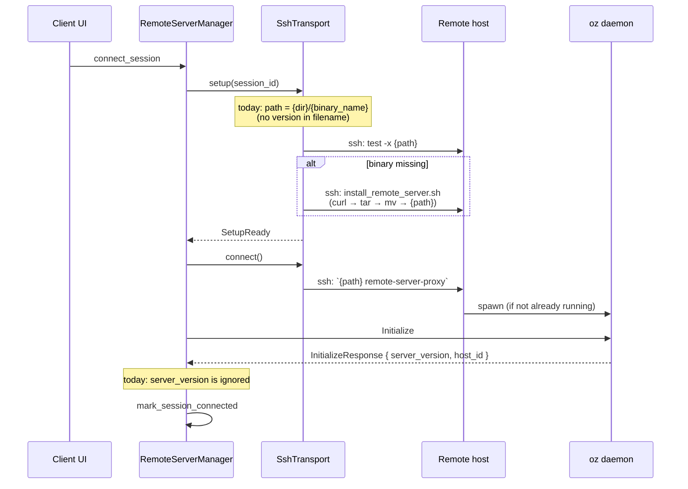

# TECH.md — Client/Server Version Skew for Remote Server

Linear: [APP-3805](https://linear.app/warpdotdev/issue/APP-3805/client-server-version-skew)

## 1. Problem

The Warp remote server binary is installed at a single, unversioned path per channel (e.g. `~/.warp/remote-server/oz`). The existence check is `test -x {bin}` and we never inspect the binary's version before talking to it. When the client auto-updates to a new version, it happily reuses the old remote server binary, which can drift arbitrarily far from the protocol/behaviour the client expects. The `InitializeResponse` already carries `server_version`, but the client ignores it.

We need a version-gated install flow: connecting from a client at version *V* always ends up talking to a server binary also at *V*. Any local `cargo run` workflow (where the client has no `GIT_RELEASE_TAG`) keeps working with `script/deploy_remote_server`: a deployed binary at the unversioned path always wins, and when one is missing the client falls back to installing latest-for-channel at the same unversioned path so the dev loop self-heals.

## 2. Requirements

R1. **Exact version match.** A connected client at version *V* must only communicate with a remote daemon spawned from a binary at the same version *V*. No silent skew.

R2. **Automatic reinstall on drift.** When the installed binary is the wrong version (or missing), the client reinstalls the correct version as part of the connect flow. No manual `rm -rf` step.

R3. **Cheap happy path.** When the correct binary is already installed, connecting should require no extra downloads and no extra SSH round-trips beyond today's single `test -x` check.

R4. **Local dev workflow preserved.** `Channel::Local` clients (the default `cargo run`) must keep working with `script/deploy_remote_server`. When a deployed binary exists at the unversioned path, the client uses it without re-downloading from the CDN. When no binary exists, the client auto-installs latest-for-channel at the same unversioned path so a stale install directory self-heals. The unversioned filename is reserved for `Channel::Local` and `Channel::Oss` (which has no release-pinned CDN artifact and is treated identically); every other channel always uses a versioned filename, so versioned-channel builds can never silently overwrite a `script/deploy_remote_server`-owned slot.

R5. **Clear failure surface.** If install or version validation fails, the user sees an actionable setup-failed state rather than a confusing protocol error.

R6. **Defense-in-depth.** A hand-placed or half-written binary at the expected path shouldn't be trusted blindly — the version reported at the handshake must also be verified.

R7. **No regression in storage behaviour.** We don't introduce unbounded disk growth, and we don't break existing installs at the current unversioned path during rollout.

## 3. Current connect flow

The install + handshake path this spec mutates spans four files. The sequence below shows today's behaviour; §4 slots version-aware steps into the marked decision points.

Key pieces of today's behaviour the diagram elides:

- `setup::remote_server_binary()` resolves the path purely from the channel; there is no version in the filename.
- `install_remote_server.sh` pulls from `{server_root_url}/download/cli?package=tar&os=...&arch=...&channel={channel}` with no version pin. The `warp-server` `/download/cli` endpoint already accepts a `version=` query parameter that pins the artifact to an exact release (and falls back to latest-for-channel when omitted), so this spec only needs client-side changes.
- `ChannelState::app_version()` returns `option_env!("GIT_RELEASE_TAG")` — `Some("v0.…")` on release builds, `None` on `cargo run`. This is the signal we'll thread through in §4.
- `script/deploy_remote_server` is the developer escape hatch: it `rsync`s a locally-built binary into `~/.warp-local/remote-server/oz-local` and assumes the client won't try to download on top of it.

## 4. Proposed solution

Encode the client's expected version into the installed binary's filename, so version drift turns into a missing-file miss that naturally re-triggers the existing install flow. Layer a handshake-level version check on top as a safety net, and reserve the unversioned filename for `Channel::Local` and `Channel::Oss`.
### 4.1 Channel-keyed binary paths
In `crates/remote_server/src/setup.rs`, the path resolution is keyed strictly off [`Channel`]:
- `remote_server_binary()`:
  - When `ChannelState::channel()` is `Channel::Local` or `Channel::Oss` → `{dir}/{binary_name}` (the unversioned `deploy_remote_server` slot; `Oss` has no release-pinned CDN artifact and follows the same convention).
  - For every other channel (`Stable`, `Preview`, `Dev`, `Integration`) → `{dir}/{binary_name}-{v}`, where `v = ChannelState::app_version().unwrap_or(env!("CARGO_PKG_VERSION"))`.
- `binary_check_command()` keeps the single `test -x {remote_server_binary()}` contract. Because the version is part of the filename on every versioned channel, any drift resolves to a miss on the existing code path and re-runs `install_script`.
The `CARGO_PKG_VERSION` fallback is intentionally not expected to point at a real release artifact; see §4.4 for the failure shape on versioned-channel + no-tag builds.
### 4.2 Install script pins the exact version (or latest, for Local/Oss)
`warp-server`'s `/download/cli` already honours a `version=` query parameter (pins the redirect to the exact versioned artifact when present; falls back to latest-for-channel when absent), so no server-side change is needed.
In `install_remote_server.sh`, add `{version_query}` and `{version_suffix}` placeholders used in two places:
- Download URL query string: `...&channel={channel}{version_query}` (e.g. `&version=v0.…`, or empty).
- Final install path: `mv "$bin" "$install_dir/{binary_name}{version_suffix}"` (e.g. `-v0.…`, or empty).
In `setup.rs::install_script()`, substitute based on `ChannelState::channel()`:
- `Channel::Local` and `Channel::Oss` → both substitutions are empty strings. These channels download latest-for-channel and install at the unversioned `{dir}/{binary_name}` path that `script/deploy_remote_server` also uses.
- Every other channel → `version_query = "&version={v}"`, `version_suffix = "-{v}"`, where `v` resolves via `app_version().unwrap_or(CARGO_PKG_VERSION)`. Release-tagged clients pin the exact published version; versioned-channel builds without a release tag pin `CARGO_PKG_VERSION`, which deliberately doesn't map to a real `/download/cli` artifact.
Unknown versions (rolled-back releases, or the `CARGO_PKG_VERSION` versioned-channel fallback) surface as a GCS 404 on the redirected URL, which `curl -fSL` turns into a non-zero exit and `SetupFailed` for the user.

### 4.3 Handshake version validation

In `crates/remote_server/src/manager.rs::connect_session`, immediately after `client.initialize().await` returns `Ok(resp)`:

- Let `client_v = ChannelState::app_version()` and `server_v = resp.server_version`.
- If both are `Some` (or server returned a non-empty string) and they differ → log the skew, **delete the versioned binary on the remote host** (see below), then emit `RemoteServerManagerEvent::SessionDisconnected` and call `mark_session_disconnected`.
- If both sides are unknown (client `None` and server reports an empty string) → accept and log a warning. This is the `cargo run` (Local/Oss) + `script/deploy_remote_server` dev loop where neither side carries a release tag.
- Any other shape (one side has a version, the other doesn't) → treated as incompatible. This is defense-in-depth: in normal operation the path-based check (§4.1) would already have triggered a reinstall to bring both sides into agreement, so a mixed shape at the handshake means something unusual (hand-placed binary, partial download) and we prefer to tear the session down and reinstall.

**Why delete the binary on mismatch?** The handshake check only fires when filename-based detection (§4.1) said we had the right version but the running daemon disagrees. That means the file at the versioned path is wrong — partial download, hand-placed, or corrupted. If we only disconnect, the next reconnect will re-run `ensure_binary_installed`, see `test -x {path}` succeed (the file still exists), skip install, respawn the daemon, and hit the same mismatch — a reconnect loop. Deleting the binary forces the next `ensure_binary_installed` to miss and reinstall, breaking the loop in a single extra SSH command (`ssh rm -f {path}`).

Factor the comparison into a pure helper (`fn version_is_compatible(client: Option<&str>, server: &str) -> bool`) so it's unit-testable without wiring up a client.

### 4.4 Unversioned channels (Local / Oss) and versioned-channel-without-tag
`Channel::Local` (the default `cargo run`) and `Channel::Oss` take the unversioned branch of `remote_server_binary()` / `install_script()` (see §4.1, §4.2). Concretely:
- If `script/deploy_remote_server` has put a binary at the unversioned path, `binary_check_command` succeeds and we connect without touching the CDN.
- If the unversioned binary is missing but the install directory exists (e.g. a previous install ran here), the controller's auto-update branch fires and `install_script` runs with empty `version_query`/`version_suffix` — i.e. it pulls latest-for-channel and installs at the same unversioned path. Future `deploy_remote_server` runs simply overwrite this in place.
- If the install directory is also missing (truly fresh host), we fall through to the normal install-mode path (`AlwaysAsk` → user modal, etc.).
`script/deploy_remote_server` is not touched; its target path (`~/.warp-local/remote-server/oz-local` on the local channel) is exactly what the `Channel::Local` branch of `remote_server_binary()` returns.
Versioned-channel builds without a release tag (e.g. `cargo run --bin dev`, `--bin preview`) are deliberately unsupported for SSH remote-server installs. The `CARGO_PKG_VERSION` fallback (§4.1) keeps the path deterministic but the resulting `&version=CARGO_PKG_VERSION` query 404s against `/download/cli`, surfacing a clean `BinaryInstallComplete::Err(_)` and the existing failed-banner path. Developers who need to test against a real channel should either build with `GIT_RELEASE_TAG` set or use `cargo run` (Local) + `script/deploy_remote_server`.

### 4.5 Rollout / backwards compatibility

The first release with this change will, for every user, look for a versioned path that does not yet exist on their remote host. That's fine — it falls through to the normal install path and overwrites into the new versioned filename. The legacy unversioned binary (`{dir}/{binary_name}`) is simply orphaned on disk. We accept that (see §4.6) and can sweep it later.

### 4.6 Deliberate non-goals

- **Cleanup of old versioned binaries.** Accept accumulation for v1; easy to add later as a post-install step that keeps the current + previous version.
- **Upload-over-SSH fallback** when the remote can't reach the CDN. Reasonable future work, not required here.
- **Protocol change to send client version in `Initialize`.** We only read `server_version` off the response; the reverse direction can be added if/when the server wants to reject proactively.

## 5. How the solution maps to the requirements

- **R1 (exact match).** Versioned filename (§4.1) + handshake check (§4.3) give us two independent enforcements of exact match.
- **R2 (automatic reinstall).** A new version turns into a path miss (§4.1), which re-enters the existing `install_script` path (§4.2). No manual step.
- **R3 (cheap happy path).** Still a single `test -x` SSH command on the hot path; handshake check is a string compare on a response we already receive.
- **R4 (local dev workflow).** `Channel::Local` and `Channel::Oss` short-circuit to the unversioned path for both the install location and the existence check (§4.1). A deployed binary always wins via `test -x`; if missing but the install directory exists, the install script runs with empty `version_query`/`version_suffix` and pulls latest-for-channel to the same unversioned path (§4.2, §4.4). `deploy_remote_server` is unchanged and overwrites in place. Versioned-channel builds without a release tag fail cleanly via the `CARGO_PKG_VERSION` 404 path so they can never silently overwrite a Local/Oss-owned slot.
- **R5 (clear failure).** Install errors (CDN 404, network failure, etc.) propagate via `BinaryInstallComplete { result: Err(_) }` and the controller surfaces them through the existing `show_ssh_remote_server_failed_banner` path. Handshake version mismatches reach the same banner via `SessionConnectionFailed { phase: Initialize }` (§4.3).
- **R6 (defense-in-depth).** Handshake check catches stale or hand-placed binaries even when the filename is right (§4.3).
- **R7 (no regression).** Existing unversioned install is simply orphaned after the first upgrade; no code assumes its absence or presence (§4.5).

## 6. Testing and validation

Covers each requirement with a concrete check:

- **Unit tests in `crates/remote_server/src/setup_tests.rs`** (uses the existing `test-util` `ChannelState::set_app_version` hook):
  - `remote_server_binary()` returns a `{name}-{version}` path on every versioned channel (`Stable`, `Preview`, `Dev`, `Integration`), whether `app_version()` is `Some` or falls back to `CARGO_PKG_VERSION`. *(R1, R2)*
  - `remote_server_binary()` returns the bare `{name}` path on `Channel::Local` and `Channel::Oss`, regardless of `app_version()`. *(R4)*
  - `install_script()` substitutes `{version_query}` / `{version_suffix}` into both the URL and the install path on every versioned channel. *(R1, R2)*
  - `install_script()` substitutes empty strings for both placeholders on `Channel::Local` and `Channel::Oss`, so the script downloads latest-for-channel and installs at the unversioned path. *(R4)*
- **Unit tests for `version_is_compatible`** covering:
  - Matching `Some("v…")` on both sides → compatible. *(R1)*
  - Differing `Some`/`Some` → incompatible. *(R1, R6)*
  - Both unknown (client `None`, server `""`) → compatible with warning. *(R4)*
  - Mixed shape (`Some`/empty, `None`/non-empty) → incompatible. *(R6)*
- **Manual validation** (captured in the PR description):
  - Connect once at version *V*; confirm the binary lands at `{dir}/{name}-{V}` and the session comes up. *(R1, R2, R3)*
  - Bump the client to version *V+1* (or stub the version in `ChannelState::set_app_version`), reconnect; confirm a new install runs and the connection succeeds. *(R1, R2)*
  - Corrupt the versioned binary (e.g. replace its contents with a stub) so the handshake reports a different version; confirm the session is torn down with `SessionDisconnected` and a user-visible error. *(R6)*
  - `cargo run` (Local) against a host where the install directory exists but the unversioned binary is missing; confirm the controller auto-installs latest-for-channel at the unversioned path and the session comes up. *(R4)*
  - After running `script/deploy_remote_server`, reconnect with `cargo run` (Local) and confirm `test -x` succeeds and we connect without re-downloading. *(R4)*
- **Existing remote-server manager tests** continue to pass unchanged (no behavioural change for the `None`/`""` path).

## 7. Risks and mitigations

- **Churn on every release.** Each stable/preview/dev release will pull a fresh binary on every host the user connects to the first time. Expected; bandwidth impact is minor.
- **Orphaned binaries accumulate.** See §4.6; acceptable for v1, cleanup is a straightforward follow-up.
- **Repeat handshake mismatches.** Addressed by deleting the offending binary on mismatch (§4.3) so the next reconnect reinstalls rather than looping. Worth explicit test coverage (§6).

## 8. Open questions

- Should `Initialize` (client → server) also carry the client's expected version so the server can reject proactively, or is client-side enforcement enough? Leaning "enough" for now.
- Do we want to surface the "version-skew detected, retrying" state as a distinct UI affordance, or is the standard reconnect flow sufficient? Current plan: reconnect-only, revisit if it surfaces as a usability issue.
