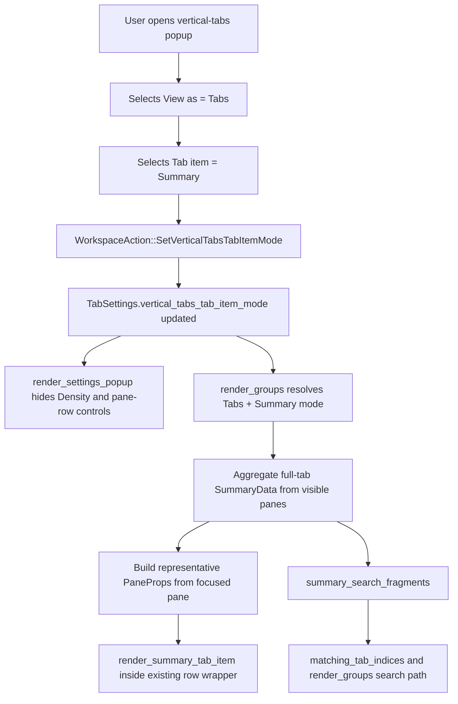

# APP-3875: Tech Spec — Summary Tab Item Mode for Vertical Tabs

## Problem

APP-3875 adds a second tab-level representation for vertical tabs when `View as = Tabs`.

Today, Tabs mode is implemented by reusing the existing pane-row UI for the tab's focused pane. That keeps the implementation simple, but it makes the tab item fundamentally pane-scoped:

- render logic is driven by a single representative `PaneId`
- search logic is driven by the same representative pane's search fragments
- diff stats and PR chips are rendered as pane-level terminal metadata

The new `Summary` mode needs a different unit of representation:

- the card must summarize the whole tab, not one pane
- the lower rows are branch lines, not pane previews
- search needs to match hidden summary content, not just visible rows
- the popup must hide the focused-session controls when Summary is selected, without losing the underlying settings

Technically, this means we need to introduce a Tabs-only item mode and a tab-level aggregation model while preserving the existing focused-session behavior and reusing as much of the current selection / hover / rename / drag infrastructure as possible.

## Relevant code

- `specs/APP-3875/PRODUCT.md` — agreed user-facing behavior for Summary mode
- `specs/APP-3828/PRODUCT.md` — current `View as = Tabs` focused-session behavior this feature extends
- `app/src/workspace/tab_settings.rs (171-279)` — current synced vertical-tabs settings (`VerticalTabsViewMode`, `VerticalTabsDisplayGranularity`, `VerticalTabsPrimaryInfo`, `VerticalTabsCompactSubtitle`)
- `app/src/workspace/action.rs (234-241)` — existing vertical-tabs setting actions
- `app/src/workspace/action.rs (624-848)` — `should_save_app_state_on_action` coverage for vertical-tabs popup actions
- `app/src/workspace/action_tests.rs (1-50)` — current tests for vertical-tabs action persistence behavior
- `app/src/workspace/view.rs (18224-18337)` — workspace-side action handling for the vertical-tabs popup settings
- `app/src/workspace/view/vertical_tabs.rs (231-327)` — shared row wrapper behavior (`render_pane_row_element`) for click, hover, selection styling, and inline rename
- `app/src/workspace/view/vertical_tabs.rs (428-669)` — `VerticalTabsPanelState`, popup-local mouse state, and `matching_tab_indices`
- `app/src/workspace/view/vertical_tabs.rs (1048-1314)` — main vertical-tabs render path (`render_groups`, `render_tab_group`), including the current flat Tabs-mode list
- `app/src/workspace/view/vertical_tabs.rs (1982-2180)` — `PaneProps`, search-fragment generation, and terminal primary-line helpers
- `app/src/workspace/view/vertical_tabs.rs (2155-2781)` — terminal metadata helpers and current clickable diff/PR badge rendering
- `app/src/workspace/view/vertical_tabs.rs (2398-2492)` — `render_title_override` and inline rename editor behavior
- `app/src/workspace/view/vertical_tabs.rs (2890-3319)` — `render_settings_popup`
- `app/src/workspace/view/vertical_tabs.rs (4087-4369)` — compact row rendering and the current vertical-tabs unit-test module hookup
- `app/src/workspace/view/vertical_tabs_tests.rs (1-259)` — existing pure helper tests for vertical-tabs behavior
- `app/src/terminal/view/tab_metadata.rs (24-119)` — terminal metadata accessors used by the current focused-session rows (`display_working_directory`, `current_git_branch`, `current_pull_request_url`, `current_diff_line_changes`)
- `app/src/terminal/view.rs:2753` — `TerminalView::current_repo_path`, needed to distinguish same-named branches across repositories

## Current state

### Settings and popup model

The vertical-tabs popup currently has two orthogonal axes:

- `View as` → `Panes` vs `Tabs`
- `Density` → `Compact` vs `Expanded`

It also exposes focused-pane controls:

- `Pane title as`
- `Additional metadata` (compact only)
- `Show` (expanded only)

There is no Tabs-only concept of "how should a tab item be represented?" The popup assumes that every rendered item is still a pane row.

### Tabs mode is already a flat list

Current `View as = Tabs` behavior is implemented as a flat list, not a grouped header + body UI:

- `uses_outer_group_container` returns `false` for `VerticalTabsDisplayGranularity::Tabs`
- `render_groups` adds spacing between flat tab items in Tabs mode
- `render_tab_group` skips the outer group header/container path when `uses_outer_group_container` is false

This matches the mock and is the right foundation for Summary mode. We do not need to invent a new container hierarchy for this feature.

### Rendering and search are pane-derived

The current Tabs-mode implementation still relies on a representative pane:

- `pane_ids_for_display_granularity(...)` returns one representative `PaneId` in Tabs mode
- `matching_tab_indices(...)` searches by building `PaneProps` for that representative pane
- the search branch in `render_groups(...)` also matches representative-pane `PaneProps`
- `render_tab_group(...)` iterates the selected pane IDs and renders either `render_compact_pane_row(...)` or `render_pane_row(...)`

This means render and search both inherit the limitations of pane-scoped data.

### Pane metadata is available in the right places, but not yet aggregated

The required summary inputs already exist in the codebase, mostly on `TerminalView`:

- work-label inputs:
  - conversation display title
  - CLI agent display title
  - terminal title
  - last completed command
- directory input:
  - `display_working_directory(...)`
- branch metadata:
  - `current_git_branch(...)`
  - `current_diff_line_changes(...)`
  - `current_pull_request_url(...)`
  - `current_repo_path(...)`

However, these values are only consumed today for a single pane at a time. There is no tab-level aggregation model, no stable dedupe / coalescing logic, and no summary-specific search fragments.

### Diff and PR badges are interactive today

The existing helpers:

- `render_terminal_diff_stats_badge(...)`
- `render_terminal_pull_request_badge(...)`

wrap the visual chip content in `Hoverable` and dispatch actions on click. That matches focused-session rows, but it does not match Summary mode, where branch lines and chips are informational only.

## Proposed changes

### 1. Add a synced Tabs-only item-mode setting

Add a new enum in `app/src/workspace/tab_settings.rs`:

```rust
#[derive(Default, Debug, serde::Serialize, serde::Deserialize, PartialEq, Copy, Clone)]
pub enum VerticalTabsTabItemMode {
    #[default]
    FocusedSession,
    Summary,
}
```

Register it in `TabSettings` with the same sync behavior as the existing vertical-tabs popup settings:

- `SupportedPlatforms::ALL`
- `SyncToCloud::Globally(RespectUserSyncSetting::Yes)`
- `hierarchy: "appearance.tabs"`

This setting is only used when `vertical_tabs_display_granularity == Tabs`, but it should still be persisted independently so Warp can restore the user's last chosen Tabs-mode representation.

### 2. Add a workspace action for the new setting

Add `WorkspaceAction::SetVerticalTabsTabItemMode(VerticalTabsTabItemMode)` beside the existing vertical-tabs popup actions.

Handle it in `Workspace::handle_action` exactly like the other vertical-tabs setting writes:

- write to `settings.vertical_tabs_tab_item_mode`
- call `ctx.notify()`

Update `should_save_app_state_on_action` and `action_tests.rs` so the new action is explicitly marked as not requiring workspace-state persistence.

### 3. Extend popup-local state and restructure `render_settings_popup`

Add two mouse states to `VerticalTabsPanelState`:

- `focused_session_option_mouse_state`
- `summary_option_mouse_state`

Keep the existing density and focused-session option mouse states unchanged so Summary mode can temporarily hide, rather than replace, those controls.

Update `render_settings_popup(...)` so the popup hierarchy becomes:

1. `View as`
2. `Tab item` (only when `View as = Tabs`)
3. `Density` and the focused-session controls (only when `View as = Tabs && Tab item = FocusedSession`, or when `View as = Panes`)

Concretely:

- if `View as = Panes`, do not render `Tab item`
- if `View as = Tabs`, render a `Tab item` section directly under `View as`
- if `Tab item = Summary`, do not render:
  - `Density`
  - `Pane title as`
  - `Additional metadata`
  - `Show`

This preserves the stored values of those controls while making the Summary-mode popup match the product behavior.

### 4. Introduce a tab-level Summary aggregation model

Add a new pure aggregation layer in `vertical_tabs.rs` for Summary mode rather than pushing summary derivation directly into the renderer.

Suggested data shape:

```rust
struct VerticalTabsSummaryData {
    primary_labels: Vec<String>,
    working_directories: Vec<String>,
    branch_entries: Vec<VerticalTabsSummaryBranchEntry>,
}

struct VerticalTabsSummaryBranchEntry {
    repo_path: PathBuf,
    branch_name: String,
    diff_stats: Option<GitLineChanges>,
    pull_request_label: Option<String>,
}
```

The exact field names can vary, but the design should keep two properties:

1. the full aggregated data is available for search, even when some items are visually hidden behind overflow
2. ordering is explicit and stable; do not rely on `HashMap` iteration order for rendering

Implementation guidance:

- preserve first-seen order with `Vec` plus a set / index map keyed by normalized value
- use one aggregation pass over the tab's `visible_pane_ids()`
- build Summary data from the full tab, not just the representative pane

Summary mode also needs a small tab-level icon selection helper:

- map each visible pane to a stable pane-kind enum used only for Summary icon rendering
- distinguish terminal-backed agent sessions from plain terminals so Oz/ambient-agent and CLI-agent terminal panes render their semantic agent icons rather than the generic terminal icon
- sort candidates by pane creation order, using the pane view `EntityId` as the current stable creation-order key
- render `Single(kind)` if all visible panes share the same kind
- render `Pair { primary, secondary }` for heterogeneous tabs, where `primary` is the oldest pane kind and `secondary` is the second-oldest distinct pane kind
- position the secondary icon using the same bottom-right anchor, offset, and cutout-ring sizing as the existing agent/status composite icon
- recompute from the current visible panes each render so closing the oldest pane naturally changes the selected icons

### 5. Reuse existing pane-derived helpers instead of re-implementing label logic

Summary mode should reuse the same data precedence rules the focused-session code already uses wherever possible.

For work labels:

- reuse `terminal_primary_line_data(...)` for terminal panes
- reuse `PaneProps::new(...)` / `displayed_title()` for non-terminal panes where practical

For working-directory contributions:

- terminal panes use `TerminalView::display_working_directory(...)`
- code panes can contribute the already-derived parent-directory subtitle that `PaneProps::new(...)` computes
- other panes should only contribute if they already expose a meaningful directory-like value; otherwise they contribute nothing

This avoids creating a second set of heuristics that drift from the current row behavior.

### 6. Coalesce branch lines by repository + branch

Summary branch lines must be keyed by repository + branch, not branch name alone.

Implementation plan:

- only panes that can expose both `current_repo_path()` and `current_git_branch()` contribute a branch line
- use `(repo_path, branch_name)` as the grouping key
- preserve first-seen order by recording the first time each key appears while scanning visible panes
- store diff stats and PR label once per coalesced entry

This keeps same-named branches in different repositories distinct and matches the product spec's branch-line behavior.

For v1, if multiple panes in the same coalesced group expose the same logical metadata, simply keep the first observed non-empty values for:

- diff stats
- PR label

That is sufficient because the product semantics treat these as logically branch-scoped. We do not need a more complex merge strategy.

### 7. Add summary-specific normalization and search helpers

Add pure helpers for:

- work-label normalization
- work-label deduplication with first-seen display preservation
- summary search-fragment generation

Search fragments for Summary mode should include the full, untruncated data set:

- all work labels
- all working directories
- all branch names
- all PR labels
- diff-stat text for all coalesced branch entries

This is intentionally different from the render path, which only shows a prefix and then `+ N more`.

### 8. Keep row-level interaction, selection, hover, and rename by reusing the existing wrapper

Do not build Summary mode as an entirely separate interaction surface.

Instead, keep a representative `PaneProps` for the tab's focused pane and use it to drive the existing shared row wrapper:

- `render_pane_row_element(...)` for click, hover, selection background, and detail-sidecar targeting
- `render_title_override(...)` for custom tab title and inline rename editor behavior

The Summary renderer should therefore have the shape:

- build `SummaryData` from the full tab
- build representative `PaneProps` from the focused pane
- render Summary content inside the existing wrapper using the representative `PaneProps`

This gives Summary mode the current Tabs-mode behavior "for free":

- click focuses the tab's active pane
- hover uses the existing tab-level styling
- double-click rename continues to work in the same place
- detail-sidecar hover targeting remains tab-scoped via `VerticalTabsDetailTarget::Tab`

### 9. Add a dedicated Summary renderer

Add a new renderer in `vertical_tabs.rs`, for example:

```rust
fn render_summary_tab_item(
    representative_props: PaneProps<'_>,
    summary: &VerticalTabsSummaryData,
    app: &AppContext,
) -> Box<dyn Element>
```

This renderer should:

- render a fixed expanded-style card
- render a Summary-specific pane-kind icon rather than the focused pane's icon
- render the primary line, working-directory line, visible branch lines, and optional overflow line
- cap visible work labels and visible branch entries independently
- omit empty sections instead of rendering placeholders

Because Summary mode is informational-only at the branch level, the branch lines should not introduce nested click handlers or badge hover handlers.

### 10. Split badge visuals from badge interactivity

Refactor the current terminal diff / PR badge helpers so the visual badge content can be reused without the focused-session click behavior.

Suggested direction:

- keep existing interactive helpers for focused-session rows
- extract passive visual helpers for:
  - diff-stats badge content
  - PR badge content
- Summary mode uses the passive versions in branch lines

This avoids duplicating the chip visuals while keeping Summary mode intentionally non-interactive.

### 11. Branch render and search logic based on mode, not only granularity

Current render and search logic branch only on `VerticalTabsDisplayGranularity`.

Update the Tabs-mode path so it branches on both:

- display granularity
- tab item mode

Suggested structure:

- `Panes` → existing pane-based render and search
- `Tabs + FocusedSession` → existing representative-pane render and search
- `Tabs + Summary` → summary render and summary search

This can be implemented with a small resolved-mode helper rather than scattering nested conditionals throughout the file.

### 12. Add pure tests for the new aggregation behavior

Extend `vertical_tabs_tests.rs` with pure helper tests covering:

- work-label normalization
- exact-equivalent dedupe while preserving first-seen display text
- working-directory dedupe and stable ordering
- branch coalescing by repository + branch
- same branch name in different repos stays distinct
- overflow-count behavior for primary labels and branch lines
- summary search fragments include hidden-overflow values

Keep these helpers pure so they do not require a full `AppContext` or UI harness.

### 13. Keep focused-session behavior untouched

Do not refactor the existing focused-session row renderers beyond what is needed to:

- add the new setting/action
- hide irrelevant popup sections in Summary mode
- share badge visuals where necessary

Focused-session Tabs mode is already shipped behavior from APP-3828. The safest implementation is to keep that path intact and add Summary as a parallel path.

## End-to-end flow



At runtime, Summary mode therefore follows the same top-level control flow as the current popup settings, but diverges at render/search time into a tab-level aggregation path.

## Risks and mitigations

### Risk: render and search drift apart

If Summary render data and Summary search fragments are built in separate ad hoc code paths, the panel will render one thing and search another.

Mitigation:

- use one `VerticalTabsSummaryData` aggregation path
- derive both render output and search fragments from that shared data

### Risk: same-named branches collapse incorrectly

If branch grouping keys only use the branch name, two different repos on `main` will merge incorrectly.

Mitigation:

- group by `(repo_path, branch_name)`
- add a unit test for two repos on `main`

### Risk: custom tab rename behavior regresses in Summary mode

Current Tabs-mode rows support inline rename because the row wrapper and `render_title_override(...)` are wired to tab-level rename state.

Mitigation:

- keep representative `PaneProps`
- route Summary primary-line rendering through the same title-override / rename-editor path

### Risk: Summary data is unavailable for some non-terminal panes

Branch metadata is readily available on `TerminalView`, but not every pane type exposes repo / branch context today.

Mitigation:

- let non-terminal panes contribute work labels and directories where available
- omit branch contributions from panes that do not expose branch context
- render sparse summary cards without placeholder text

### Risk: passive Summary chips drift visually from focused-session chips

If Summary mode re-implements diff/PR chips from scratch, the appearance can drift from the current vertical-tabs styling.

Mitigation:

- extract shared visual badge helpers
- keep only the event-handling wrapper different between focused-session and Summary mode

## Testing and validation

### Unit tests

- `app/src/workspace/action_tests.rs`
  - add coverage for `SetVerticalTabsTabItemMode(...)`
- `app/src/workspace/view/vertical_tabs_tests.rs`
  - label normalization and dedupe
  - directory dedupe and stable ordering
  - branch coalescing by repo + branch
  - same branch name in different repos
  - overflow counting
  - summary search fragments include hidden entries
- Summary pane-kind icon selection for homogeneous tabs, heterogeneous tabs, and oldest-pane removal

### Manual / UI validation

- verify `Tab item` appears only when `View as = Tabs`
- verify `Summary` hides `Density`, `Pane title as`, `Additional metadata`, and `Show`
- verify switching back to `Focused session` restores the prior focused-session settings
- verify a multi-pane tab renders a summary card instead of a focused-pane row
- verify homogeneous Summary tabs render one pane-kind icon
- verify heterogeneous Summary tabs render the two oldest distinct pane-kind icons with the secondary icon in the bottom-right
- verify branch lines are grouped by repo + branch and carry diff stats / PR chips
- verify branch lines and chips are not independently clickable
- verify clicking the card still focuses the active pane
- verify search matches hidden overflow data
- verify double-click rename still works in Summary mode

### Broader validation

When implementation lands, run the same validation expected for other vertical-tabs work:

- targeted unit tests
- relevant workspace / vertical-tabs test suites
- visual verification of the new Summary mode in a real app session

## Follow-ups

- Add interactive branch-line affordances (for example, opening code review from a branch line) if product later wants child-level actions
- Consider a compact Summary representation if product later decides Summary should coexist with `Density`
- Expand branch-context contribution beyond terminal panes if more pane types gain stable repo / branch metadata
- Consolidate focused-session and Summary badge rendering around a single shared visual badge API once both paths exist
