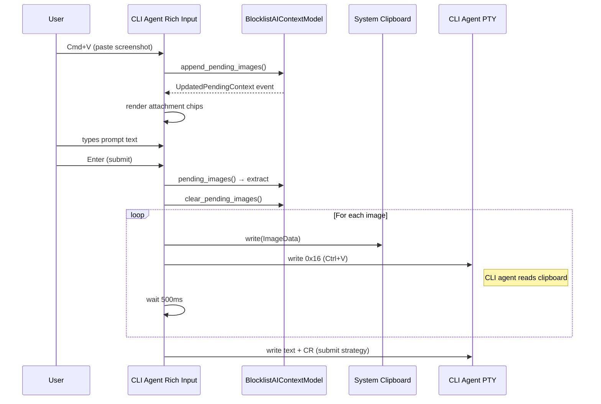

# CLI Agent Image Paste — Tech Spec

## Problem

The CLI agent rich input (used for composing prompts to Claude Code, Gemini CLI, etc.) did not support image attachments. The existing image paste infrastructure in Warp's agent mode needed to be extended to (1) render chips in the CLI agent input layout, (2) allow the paste flow to work when CLI agent input is open, and (3) deliver images to the CLI agent on submission by simulating clipboard-based Ctrl+V paste.

## Relevant code

- `app/src/terminal/input/cli_agent.rs` — CLI agent rich input rendering
- `app/src/terminal/input/agent.rs` — Agent mode input rendering (reference for chip layout)
- `app/src/terminal/input.rs` — Paste handling (`process_paste_event`, `can_attach_on_filepaths_paste_or_dragdrop`, `process_and_attach_clipboard_image`, `handle_pasted_or_dragdropped_image_filepaths`)
- `app/src/terminal/view/use_agent_footer/mod.rs` — `submit_cli_agent_rich_input`, new `paste_images_then_submit_text`
- `app/src/ai/blocklist/context_model.rs` — `BlocklistAIContextModel`, `PendingAttachment`, `ImageContext`, `pending_images()`, `clear_pending_images()`
- `app/src/ai/agent/mod.rs` — `ImageContext` struct (base64 data + mime_type + file_name)
- `crates/warpui_core/src/clipboard.rs` — `Clipboard` trait, `ClipboardContent`, `ImageData`

## Current state

### Before this change

- **Agent mode input** (`render_agent_input`): Renders attachment chips above the editor when `FeatureFlag::ImageAsContext` is enabled and input is in AI mode. Uses `render_attachment_chips()`.
- **CLI agent input** (`render_cli_agent_input`): Renders editor + footer only. No chip rendering.
- **Paste flow**: `process_paste_event` → `handle_pasted_image_data` / `handle_pasted_or_dragdropped_image_filepaths`. The gating function `can_attach_on_filepaths_paste_or_dragdrop` allows attachment when in agent mode, buffer is empty, or in active agent view — but has no explicit CLI agent input check.
- **Image paste side effect**: Both `process_and_attach_clipboard_image` and `handle_pasted_or_dragdropped_image_filepaths` try to enter the fullscreen agent view via `try_enter_agent_view` when an image is pasted. Irrelevant and incorrect for CLI agent mode.
- **Submission**: `submit_cli_agent_rich_input` sends only text bytes to the PTY. No image handling.
- **Chip removal**: `DeleteAttachment` action on `TerminalView` removes from `ai_context_model.pending_attachments`. Already works regardless of input mode.
- **Chip state**: `Input.attachment_chips` is populated from `BlocklistAIContextEvent::UpdatedPendingContext`. Already fires for any attachment change.

## Proposed changes

### 1. Render attachment chips in CLI agent input

**File**: `app/src/terminal/input/cli_agent.rs`

Add chip rendering above the editor in `render_cli_agent_input`, gated on `FeatureFlag::ImageAsContext`. Uses the same `render_attachment_chips()` + `spacing::UDI_CHIP_MARGIN` pattern as `render_agent_input` in `agent.rs`.

New imports: `FeatureFlag`, `spacing`.

### 2. Allow image paste in CLI agent mode

**File**: `app/src/terminal/input.rs`

- **`can_attach_on_filepaths_paste_or_dragdrop`**: Add early return `true` when `CLIAgentSessionsModel::as_ref(ctx).is_input_open(self.terminal_view_id)`. This makes the intent explicit rather than relying on the implicit AI mode set when CLI agent input opens.

- **`handle_pasted_or_dragdropped_image_filepaths`**: Wrap the `try_enter_agent_view` call in `if !is_cli_agent_input_open` so we skip entering the fullscreen agent view when pasting images in CLI agent mode.

- **`process_and_attach_clipboard_image`**: Same guard — skip `try_enter_agent_view` when CLI agent input is open.

### 3. Deliver images on submission via clipboard simulation

**File**: `app/src/terminal/view/use_agent_footer/mod.rs`

New constant:
- `CLI_AGENT_IMAGE_PASTE_DELAY: Duration = Duration::from_millis(500)` — delay between sequential image pastes to let the CLI agent read from the clipboard.

Modified method — `submit_cli_agent_rich_input`:
- Before sending text, extract `pending_images()` from `ai_context_model` and `clear_pending_images()`.
- Pass the images vec into the new `paste_images_then_submit_text` (instead of directly calling `write_cli_agent_text_then_submit`).

New method — `paste_images_then_submit_text`:
- Recursive: processes one image at a time from the vec.
- For each image: decode base64 → raw bytes, write to system clipboard as `ClipboardContent { images: Some(vec![ImageData { ... }]) }`, send `0x16` (Ctrl+V) to PTY.
- Spawn a timer with `CLI_AGENT_IMAGE_PASTE_DELAY` before processing the next image.
- Base case: when no images remain, fall through to `write_cli_agent_text_then_submit` for the text prompt.

## End-to-end flow

## Risks and mitigations

- **Clipboard clobbering**: Writing images to the system clipboard overwrites the user's previous clipboard contents. Mitigation: this is the same behavior as if the user manually Ctrl+V'd images. Could save/restore clipboard in a follow-up.
- **Delay sensitivity**: The 500ms delay works for Claude Code but may be insufficient for slower CLI agents or too long for fast ones. Mitigation: the constant is isolated and easy to tune; could be made per-agent in a follow-up.
- **CLI agents without Ctrl+V image support**: Agents that don't handle clipboard image paste will ignore the Ctrl+V or insert garbage. Mitigation: this is a non-goal for v1; the feature targets Claude Code which has known support.
- **Race between image paste and text submit**: If the delay is too short, the text arrives before the CLI agent finishes processing the last image. Mitigation: the 500ms delay was validated empirically with Claude Code.

## Testing and validation

- **Build**: `cargo fmt` and `cargo clippy --workspace --all-targets --all-features --tests -- -D warnings` pass clean.
- **Manual — single image**: Paste one screenshot, submit with prompt. Claude Code shows `[Image #1]` and describes the image.
- **Manual — two images**: Paste two different screenshots, submit. Claude Code shows `[Image #1] [Image #2]` and describes each distinctly.
- **Manual — chip removal**: Paste an image, click ×, submit. No image sent to CLI agent.
- **Manual — text only**: Submit without images. No regression in behavior.
- **Manual — agent mode**: Verify existing agent mode image paste still works (no regression from the `can_attach_on_filepaths_paste_or_dragdrop` and `process_and_attach_clipboard_image` changes).

## Follow-ups

- Save and restore clipboard contents after image paste submission.
- Per-agent paste delay tuning (some agents may need more or less than 500ms).
- Fallback strategy for CLI agents that don't support Ctrl+V image paste (e.g. file path references).
- Telemetry for CLI agent image paste (number of images, success rate).
- Drag-and-drop image files into CLI agent rich input (likely works already but needs explicit testing).
