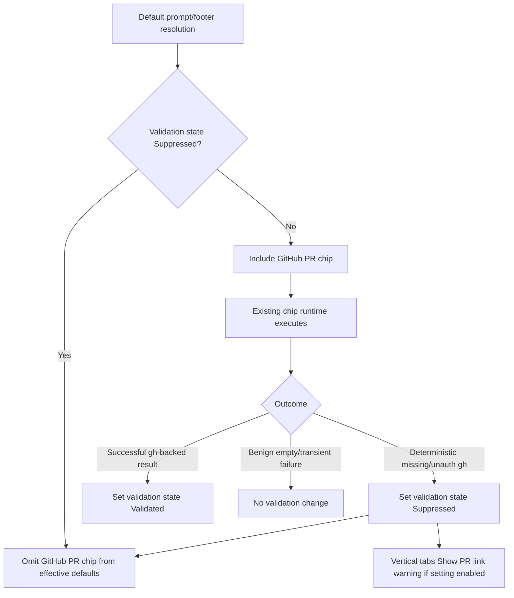

# Technical Spec: GitHub PR Prompt Chip — Default Inclusion with Validation

## Problem

We want the GitHub PR chip to be included in terminal prompt and agent view defaults without introducing a separate proactive readiness model. The existing chip runtime already knows how to check executables, run shell commands, suppress failures, and invalidate after relevant commands. The implementation should reuse that path to validate default inclusion and only add minimal state for remembering deterministic setup failures.

## Relevant Code

- `specs/APP-3908/PRODUCT.md` — product behavior.
- `app/src/context_chips/prompt.rs (1-348)` — `PromptSelection`, persisted prompt config, and `PromptConfiguration::default_prompt()`.
- `app/src/context_chips/current_prompt.rs (923-1424)` — chip state, chip execution, `chips_to_run`, snapshots, prompt string, and command-based invalidation.
- `app/src/context_chips/context_chip.rs (76-365)` — chip runtime capabilities and disabled reasons.
- `app/src/context_chips/mod.rs (142-341)` — `GithubPullRequest` chip policy, `gh`/`git` dependencies, timeout, failure suppression, and `git`/`gh`/`gt` invalidation.
- `app/src/context_chips/builtins.rs (147-180)` and `app/src/context_chips/scripts/github_pull_request_prompt_chip.*` — PR URL shell generator and benign empty cases.
- `app/src/context_chips/prompt_snapshot.rs (1-91)` — prompt snapshots currently order chips from `Prompt::chip_kinds()`.
- `app/src/context_chips/prompt_type.rs (1-184)` — dynamic/static prompt resolution and agent footer chip resolution.
- `app/src/ai/blocklist/agent_view/agent_input_footer/toolbar_item.rs (1-210)` — agent footer defaults and available toolbar items.
- `app/src/terminal/session_settings.rs (76-311)` — `AgentToolbarChipSelection` and `CLIAgentToolbarChipSelection` default/custom variants.
- `app/src/terminal/model/session.rs (816-1014)` — `Session::load_external_commands`, `Session::executable_names`, and command execution.
- `app/src/workspace/tab_settings.rs (129-293)` — persisted `vertical_tabs_show_pr_link` bool.
- `app/src/workspace/view/vertical_tabs.rs (1-200, 2688-2924, 3021-3655)` — vertical tabs settings popup, PR badge rendering, and toggle row rendering.
- `app/src/workspace/view.rs (18171-18369)` — vertical tabs settings actions.

## Current State

The terminal prompt default omits `GithubPullRequest`. `PromptSelection::Default` is converted into a concrete `PromptConfiguration::default_prompt()` in the `Prompt` singleton, and downstream paths frequently call `Prompt::chip_kinds()`.

The agent footer default includes `GithubPullRequest` whenever `FeatureFlag::GithubPrPromptChip` is enabled. The default is returned from `AgentToolbarItemKind::default_left()`.

The PR chip already has a runtime policy:

- required executables: `gh` and `git`
- `local_only: true`
- 5s timeout
- `suppress_on_failure`
- fingerprint invalidation on `git`, `gh`, and `gt`

The shell scripts intentionally exit 0 with empty output for benign states such as not being in a git repo, detached HEAD, missing origin, non-GitHub remote, or no PR.

Vertical tabs render PR badges through `TerminalView::current_pull_request_url()`, which currently reads from `agent_view_chips()`. `vertical_tabs_show_pr_link` is a persisted bool defaulting to `true`.

## Proposed Changes

### 1. Add a small validation state

Add a hidden app setting or model-backed persisted state that tracks the default PR chip validation outcome:

```rust
#[derive(Clone, Copy, Debug, Default, Serialize, Deserialize, PartialEq, Eq)]
pub enum GithubPrPromptChipDefaultValidation {
    #[default]
    Unvalidated,
    Validated,
    Suppressed,
}
```

This should be global, private, and synced the same way other user preference defaults are synced only if product wants suppression to follow the user across machines. If suppression should be machine-specific because `gh` installation/auth is machine-specific, use non-synced local storage instead. Recommendation: make this **local/non-synced** because `gh` readiness depends on the current machine/session environment.

Only `Suppressed` affects default inclusion. `Unvalidated` and `Validated` both include the PR chip in defaults.

### 2. Include the PR chip in both defaults unless suppressed

Update `PromptConfiguration::default_prompt()` or the effective prompt-default resolver so the default chip list includes `ContextChipKind::GithubPullRequest` after `GitDiffStats` when:

- `FeatureFlag::GithubPrPromptChip` is enabled
- validation state is not `Suppressed`

Do not rewrite `SessionSettings.saved_prompt`.

Update `AgentToolbarItemKind::default_left()` or a new parameterized helper so `ContextChipKind::GithubPullRequest` is included when:

- `FeatureFlag::GithubPrPromptChip` is enabled
- validation state is not `Suppressed`

Do not change `CLIAgentToolbarChipSelection` defaults.

Implementation detail: because the current default helpers are static, prefer introducing effective default helpers that take `GithubPrPromptChipDefaultValidation` as input instead of reading global state inside low-level static helpers. This keeps unit tests simple and avoids hidden dependencies.

### 3. Feed runtime failures back into validation state

Extend `CurrentPrompt::fetch_chip_value_once` completion handling for `ContextChipKind::GithubPullRequest` so deterministic setup failures update validation state:

- `ChipAvailability::Disabled(RequiresExecutable { command: "gh" })` → `Suppressed`
- unauthenticated `gh` error from the PR shell command → `Suppressed`
- successful `gh`-backed execution → `Validated`

Do **not** suppress for:

- successful empty output from benign states
- timeouts
- generic non-auth command errors
- network errors
- rate-limit/API outages

For auth failures, use narrow matching. The shell script currently prints the raw `gh pr view` error to stderr for non-benign failures. Add a helper that classifies `CommandOutput` stderr/stdout into:

```rust
enum GithubPrPromptChipValidationOutcome {
    Validated,
    SuppressDueToMissingGh,
    SuppressDueToUnauthenticatedGh,
    NoValidationChange,
}
```

Keep this helper small and unit-tested. If auth error strings are ambiguous, prefer `NoValidationChange` over over-suppressing.

### 4. Keep the PR chip running for validation while unvalidated

If the chip is included by default while `Unvalidated`, the existing chip runtime will run it and produce the validation signal.

After state transitions to `Suppressed`, rebuild effective default chip sets so:

- default terminal prompt no longer includes the PR chip
- default agent footer no longer includes the PR chip
- custom prompt/footer selections are unchanged

The `CurrentPrompt::handle_model_event` invalidation for `gh` commands can remain as-is for chip data. Automatic revalidation after suppression is not required for this feature, but a future follow-up could reset `Suppressed` after a successful `gh` command.

### 5. Keep vertical tabs setting decoupled, but show warning

Keep `vertical_tabs_show_pr_link` unchanged in `TabSettings`.

Add `show_pr_link_warning_mouse_state: MouseStateHandle` to `VerticalTabsPanelState`.

In `render_settings_popup`, compute:

```rust
let show_pr_link_warning =
    show_pr_link && validation_state == GithubPrPromptChipDefaultValidation::Suppressed;
```

Update `render_show_toggle_option` to accept an optional warning config:

```rust
struct ShowToggleWarning {
    mouse_state: MouseStateHandle,
    tooltip: &'static str,
}
```

For the PR link row only, pass a warning when `show_pr_link_warning` is true. Render the warning icon inline after the label:

- row layout: check icon, 8px gap, label, 4px gap, warning icon
- icon: `UiIcon::AlertTriangle`
- size: 12px by 12px
- color: `theme.ui_warning_color()`
- tooltip text: `Requires the GitHub CLI to be installed and authenticated`
- tooltip trigger: hover on the warning icon only
- tooltip position: above the warning icon, using `appearance.ui_builder().tool_tip(...)` and `Stack`

The row's existing click behavior remains unchanged.

### 6. Decouple vertical tab PR badge value from agent footer customization

Change `TerminalView::current_pull_request_url()` so it does not depend on `agent_view_chips()`. Use `PromptType::latest_chip_value(&ContextChipKind::GithubPullRequest, ctx)` or a direct `CurrentPrompt` accessor.

This ensures vertical tab PR badges are controlled by `vertical_tabs_show_pr_link` and chip availability, not by whether the user customized the agent footer.

## End-to-End Flow



## Risks and Mitigations

- **False suppression from transient errors:** Keep classification narrow. Unknown failures should not transition to `Suppressed`.
- **Benign empty results do not validate auth:** This is acceptable; keep the chip in defaults while `Unvalidated` unless a deterministic readiness failure occurs.
- **Suppression may be sticky after the user fixes `gh`:** Product accepts one-way suppression for this iteration. Users can manually add the chip; automatic reset can be a follow-up.
- **Prompt/default resolution paths are scattered:** Audit and update prompt display, prompt snapshots, prompt string, copy menu, and agent footer chip resolution so all effective defaults agree.
- **Machine-specific state:** If validation state is synced, suppression from one machine could hide the chip on another where `gh` works. Prefer non-synced local storage.
- **Vertical tabs warning state source:** The warning should use the same validation state as prompt/footer suppression to avoid another readiness model.

## Testing and Validation

- Unit test default prompt resolution includes PR chip for `Unvalidated` and `Validated`, and omits it for `Suppressed`.
- Unit test default agent footer resolution includes PR chip for `Unvalidated` and `Validated`, and omits it for `Suppressed`.
- Unit test custom prompt/footer configs are not changed by validation state.
- Unit test validation transitions:
  - missing `gh` → `Suppressed`
  - unauthenticated `gh` output → `Suppressed`
  - successful PR URL → `Validated`
  - no PR / non-GitHub remote / no git repo → no suppression
  - timeout / unknown error → no suppression
- Unit test or lightweight UI test `render_show_toggle_option` warning behavior.
- Manual validation for authenticated `gh`, missing `gh`, unauthenticated `gh`, custom prompt, and vertical tabs warning.

## Follow-Ups

- Reset `Suppressed` automatically after detecting a successful `gh auth login` or a later successful PR chip execution.
- Improve the prompt editor disabled tooltip to distinguish missing `gh` from unauthenticated `gh`.
- Add telemetry for validation transitions if rollout needs observability.
