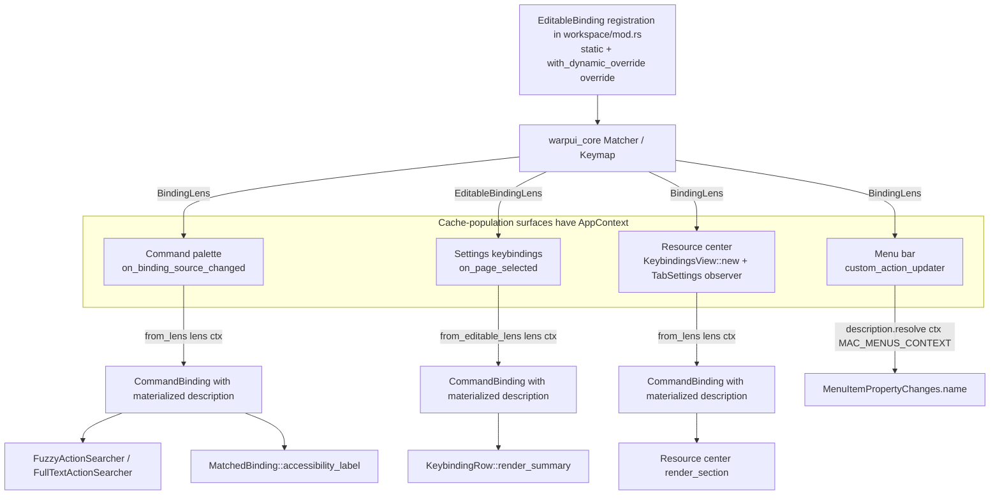

# APP-3909: Tech Spec — Layout-aware binding descriptions for tab actions

## Problem

PR #24105 updates the right-click tab context menu to show "Close tabs below" instead of "Close tabs to the right" when vertical tabs are enabled. The tab-layout-dependent label is computed inline in `app/src/tab.rs:close_tab_menu_items`, but the underlying `EditableBinding` for `workspace:close_tabs_right_active_tab` is still registered with a hardcoded `"Close tabs to the right"` description. That description is the source of truth for several other surfaces that all still show the horizontal-axis wording even when vertical tabs are enabled:

- the macOS menu bar (Tab > Close Tabs to the Right)
- the command palette (Cmd-P search for "close tabs")
- the settings keybindings page
- the resource center keybindings panel

The same inconsistency already exists for `workspace:move_tab_left` / `workspace:move_tab_right`: the tab context menu swaps them to "Move tab up" / "Move tab down" when vertical tabs are enabled, but every other surface continues to show "Move tab left" / "Move tab right". The scope of this spec is all three bindings, not just the one that triggered the review comment.

The goal is to give tab-layout-dependent bindings a single source of truth for their label that every consumer honors, and to make it **compile-time impossible** for a future consumer to miss the dynamic resolution.

## Relevant code

- `app/src/workspace/mod.rs:772-797` — registration of `workspace:move_tab_left` / `workspace:move_tab_right` with static descriptions.
- `app/src/workspace/mod.rs:892-899` — registration of `workspace:close_tabs_right_active_tab` with a static description.
- `app/src/tab.rs:266-356` — `modify_tab_menu_items` and `close_tab_menu_items`, which already branch on `uses_vertical_tabs` inline.
- `crates/warpui_core/src/keymap.rs:64-116` — `BindingDescription` definition and the `in_context` lookup API.
- `crates/warpui_core/src/keymap.rs:145-221` — `BindingLens`, `EditableBinding`, `EditableBindingLens`.
- `crates/warpui_core/src/core/app.rs:1718-1726` — `AppContext::description_for_custom_action`, used by the menu bar to resolve a custom action's description.
- `app/src/app_menus.rs:486-511` — `make_new_tab_menu`, where `CustomAction::CloseTabsRight`, `MoveTabLeft`, and `MoveTabRight` are wired.
- `app/src/app_menus.rs:1163-1186` — `custom_action_updater`, the per-menu-item update callback that pulls `description.in_context(MAC_MENUS_CONTEXT)` into `MenuItemPropertyChanges.name` on every menu open.
- `app/src/util/bindings.rs:714-782` — `CommandBinding` and its `from_binding` / `From<BindingLens<'_>>` / `From<EditableBindingLens<'_>>` constructors. These are the cache-population entry points that clone `BindingDescription` into a reusable value type.
- `app/src/search/action/data_source.rs:68-94` — `CommandBindingDataSource::on_binding_source_changed`, the command-palette cache-population site.
- `app/src/search/action/data_source.rs:142-182` — `FuzzyActionSearcher::search`, which fuzzy-matches against cached descriptions without access to `AppContext`.
- `app/src/search/action/data_source.rs:261-298` — `FullTextActionSearcher::rebuild_search_index`, which builds a Tantivy index from cached descriptions without access to `AppContext`.
- `app/src/search/action/search_item.rs:71-156` — `MatchedBinding::render_label` and `accessibility_label`, which read `binding.description` without access to `AppContext`.
- `app/src/settings_view/keybindings.rs:761-800` — `on_page_selected`, the settings keybindings cache-population site.
- `app/src/resource_center/keybindings_page.rs:81-100` — `KeybindingsView::new`, the resource center cache-population site. Built once per panel lifetime.
- `app/src/workspace/tab_settings.rs:352-360` — `TabSettings::use_vertical_tabs` definition.

## Current state

### Binding registration

`EditableBinding::new(name, description, action)` stores a `BindingDescription` by value on the binding. `BindingDescription` holds an immutable default `String` and an optional map of `DescriptionContext`-keyed overrides (for example, `MAC_MENUS_CONTEXT` lets a binding provide a shorter label for the macOS menu bar). `in_context(context)` returns an `&str`; there is no way to compute the description at lookup time.

### How each surface reads the description

**Menu bar.** `make_new_tab_menu` calls `updateable_custom_item_without_checkmark(CustomAction::CloseTabsRight, ctx)`, which constructs a `CustomMenuItem` whose updater is `custom_action_updater`. The updater runs every time the menu is opened, calls `ctx.description_for_custom_action(action, MAC_MENUS_CONTEXT)` via `update_custom_action_binding`, and copies the result into `MenuItemPropertyChanges.name`. Because the updater re-runs on each open, the menu bar is the one surface that could already pick up a dynamic label — the only static piece is the binding's own description.

**Command palette.** When the palette opens, `set_command_palette_binding_source` emits a change on the `BindingSource` model, which triggers `CommandBindingDataSource::on_binding_source_changed`. That method iterates `ctx.key_bindings_for_view(window_id, view_id)` and converts each `BindingLens` to a `CommandBinding` via `CommandBinding::from_binding`. The conversion clones the `BindingDescription` into the `CommandBinding`. The fuzzy/full-text searcher then builds its index from the cached descriptions — those downstream consumers run without `AppContext` and can only see the concrete cached string.

**Settings keybindings page.** `on_page_selected` calls `ctx.editable_bindings().map(CommandBinding::from)`, using `From<EditableBindingLens<'_>> for CommandBinding` to clone descriptions into the cache.

**Resource center keybindings panel.** `KeybindingsView::new` calls `ctx.get_key_bindings().map(CommandBinding::from)` once during view construction. The cached descriptions live for the lifetime of the panel.

### Key constraint: downstream consumers without `&AppContext`

Several `CommandBinding` consumers read the description from a path that does **not** have `AppContext`:

- `search_item::MatchedBinding::accessibility_label` (no context parameter)
- `FuzzyActionSearcher::search` (operates on cached descriptions)
- `FullTextActionSearcher::rebuild_search_index` (builds a Tantivy index from cached descriptions)
- `util/bindings::filter_bindings_including_keystroke` (no context parameter)
- `settings_view/keybindings::render_summary` (only has `Appearance`)

Any solution has to materialize dynamic descriptions into concrete `String`s at **cache-population time** (when `AppContext` is available) so these downstream consumers continue to see ordinary `String`s. This rules out "resolve at render time" designs that don't plumb `AppContext` all the way down.

### Why this is the moment to fix the framework, not each surface

The immediate bug is small. The structural risk is that there are four cache-population sites today and the set will grow. A purely per-surface fix relies on every future author remembering to call an override helper after constructing a `CommandBinding`, and nothing in the type system catches a miss. That is exactly the class of bug that prompted this spec.

## Proposed changes

Add first-class support for dynamic description overrides in `warpui_core::keymap`. Make `CommandBinding::from_lens(lens, ctx)` the only way to materialize a `CommandBinding` from a lens, so the compiler forces every cache-population site to pass `&AppContext` and resolve dynamic description overrides at construction time. Define the three tab-layout overrides next to the binding registrations, and teach the menu-bar updater to resolve dynamically too.

### 1. Framework: optional dynamic override on `BindingDescription`

In `crates/warpui_core/src/keymap.rs`:

- Add a new private field `dynamic_override: Option<Arc<dyn Fn(&AppContext) -> Option<String> + Send + Sync>>` to `BindingDescription`. Using a boxed closure (via `Arc` so `Clone` stays cheap) lets registrations define resolvers inline with captured state, rather than forcing every dynamic binding to have a free function.
- Replace the `#[derive(PartialEq, Eq, Debug)]` on `BindingDescription` with manual impls. The derived impls don't work because `Arc<dyn Fn>` is neither `PartialEq` nor `Debug`. The manual `PartialEq`/`Eq` compares the static `description` + `custom` overrides and ignores `dynamic_override`; this is safe because the only consumers of description equality (the dedup loops in `settings_view/keybindings.rs` and `resource_center/keybindings_page.rs`) operate on post-materialization `CommandBinding`s whose `dynamic_override` is always `None`. The manual `Debug` impl prints `dynamic_override: "<dynamic>"` when present.
- Add `BindingDescription::with_dynamic_override(self, impl Fn(&AppContext) -> Option<String> + Send + Sync + 'static) -> Self`.
- Add `BindingDescription::resolve(&self, ctx: &AppContext, context: DescriptionContext) -> Cow<'_, str>` that returns a title-cased `Cow::Owned(override)` when `dynamic_override` returns `Some`, and otherwise falls back to `Cow::Borrowed(self.in_context(context))`.
- Add `BindingDescription::has_dynamic_override(&self) -> bool` for cache-population code that only needs to know whether to materialize.
- Keep `in_context` unchanged. It still returns `&str` and still returns the static default even for bindings with a dynamic override. That keeps the non-context read paths compiling during migration and gives downstream consumers a safe static fallback if a cache was somehow populated without resolution.

`BindingDescription` is defined in the same crate as `AppContext` (`crates/warpui_core/src/core/app.rs`), and `AppContext` already owns the `keystroke_matcher: Matcher` that holds bindings. There is no layering or crate-graph concern here.

### 2. App layer: inline override closures at registration

Add a small `uses_vertical_tabs(ctx: &AppContext) -> bool` helper in `app/src/workspace/tab_settings.rs` (or `tab.rs`) and reuse it from `tab.rs:close_tab_menu_items` and `tab.rs:modify_tab_menu_items` so there is exactly one definition of the predicate.

Then update the three `EditableBinding::new` calls in `app/src/workspace/mod.rs` with inline override closures. Each closure returns `Some(...)` only when vertical tabs need a label different from the static fallback. `resolve` applies the same `titlecase` normalization used by `BindingDescription::new`, so the tab context menu, menu bar, command palette, and keybindings pages all agree:

```rust path=null start=null
EditableBinding::new(
    "workspace:close_tabs_right_active_tab",
    BindingDescription::new("Close tabs to the right").with_dynamic_override(|ctx| {
        uses_vertical_tabs(ctx).then(|| "close tabs below".into())
    }),
    WorkspaceAction::CloseTabsRightActiveTab,
)
```

The same pattern is applied to `workspace:move_tab_left` (swaps to "Move Tab Up") and `workspace:move_tab_right` (swaps to "Move Tab Down"). The tab context-menu literals in `tab.rs:modify_tab_menu_items` / `close_tab_menu_items` are updated to match the same Title Case so every surface is consistent.

The static `"Close tabs to the right"` is retained as the non-context fallback so downstream read paths without `AppContext` remain sensible, and so `titlecase` normalization still runs once at registration.

### 3. App layer: compile-enforced cache-population API

In `app/src/util/bindings.rs`:

- Remove `impl From<BindingLens<'_>> for CommandBinding` and `impl From<EditableBindingLens<'_>> for CommandBinding`. They cannot express an `&AppContext` dependency, which is exactly what we want the type system to enforce.
- Replace them with:

```rust path=null start=null
impl CommandBinding {
    pub fn from_lens(lens: BindingLens<'_>, ctx: &AppContext) -> Option<Self> { ... }
    pub fn from_editable_lens(lens: EditableBindingLens<'_>, ctx: &AppContext) -> Self { ... }
}
```

- Each constructor inspects the source `BindingDescription`. If `has_dynamic_override()` is true, it stores `lens.description.materialized(ctx)` on the `CommandBinding`. If there is no dynamic override, the existing `clone()` path is preserved.
- `CommandBinding::from_binding` becomes a thin wrapper over `from_lens` for callers that currently pass a `BindingLens` without constructing one themselves (search for the three remaining call sites and migrate them).

### 4. Call-site migration (four sites)

All four sites already have `&AppContext` available, so the migration is mechanical.

- `app/src/search/action/data_source.rs:on_binding_source_changed` — change `CommandBinding::from_binding(binding)` to `CommandBinding::from_lens(binding, ctx)`.
- `app/src/settings_view/keybindings.rs:on_page_selected` — change `ctx.editable_bindings().map(CommandBinding::from)` to `ctx.editable_bindings().map(|lens| CommandBinding::from_editable_lens(lens, ctx))`.
- `app/src/resource_center/keybindings_page.rs:KeybindingsView::new` — same treatment: `ctx.get_key_bindings().map(|lens| CommandBinding::from_lens(lens, ctx))`.
- Any remaining callers of the deleted `From` impls that `cargo build` surfaces.

Additionally, `KeybindingsView::new` subscribes to `TabSettings` via `ctx.observe` (pattern already used in `settings_view/appearance_page.rs`) and rebuilds `self.bindings` / `self.binding_results` when `use_vertical_tabs` flips. This is the one surface whose cache lifetime is longer than a single open and therefore needs explicit invalidation.

### 5. Menu bar: delegate to `resolve` in the updater

In `app/src/app_menus.rs:custom_action_updater`, replace `description.in_context(bindings::MAC_MENUS_CONTEXT).to_string()` with `description.resolve(ctx, bindings::MAC_MENUS_CONTEXT).into_owned()`. This single change gives the macOS menu bar dynamic labels for **every** binding that opts in, without per-`CustomAction` special-casing. No changes to `make_new_tab_menu` are required.

The menu bar is the only surface that can safely call `resolve` at render time, because `custom_action_updater` already takes `&mut AppContext` and re-runs on every menu open.

### 6. Tests

Add unit tests in `crates/warpui_core/src/keymap_test.rs` exercising:

- `BindingDescription::new("static").resolve(ctx, Default)` returns `Cow::Borrowed("Static")` (preserves title-casing).
- `BindingDescription::new("static").with_dynamic_override(|_| Some("dynamic".into())).resolve(ctx, Default)` returns `Cow::Owned("Dynamic")`.
- `has_dynamic_override()` reports correctly.
- `in_context` still returns the static fallback on a description that also has a dynamic override.

Add an integration-ish test alongside `CommandBinding::from_lens` in `app/src/util/bindings.rs` (or a new test file) that constructs an `EditableBinding` with `.with_dynamic_override(...)`, builds a lens, and asserts the materialized `CommandBinding.description.in_context(Default)` returns the dynamic value.

## End-to-end flow

### Command palette open

1. User presses Cmd-P. `Workspace::open_command_palette` → `set_command_palette_binding_source`.
2. The binding source model notifies, waking `CommandBindingDataSource::on_binding_source_changed`.
3. For each `BindingLens` in `ctx.key_bindings_for_view(...)`, the data source calls `CommandBinding::from_lens(lens, ctx)`.
4. Inside `from_lens`, `lens.description.has_dynamic_override()` is true for `workspace:close_tabs_right_active_tab`. The constructor calls `lens.description.materialized(ctx)` → the inline override closure → reads `TabSettings::use_vertical_tabs` and returns `Some("close tabs below")`.
5. `from_lens` stores a fresh `BindingDescription::new_preserve_case("Close Tabs Below")` in the cached `CommandBinding`.
6. The fuzzy/full-text searcher rebuilds its index from the materialized strings. The user typing "below" now matches.

### macOS menu bar open

1. User opens the Tab menu. macOS sends `menuNeedsUpdate`.
2. Cocoa calls each menu item's updater, landing in `custom_action_updater`.
3. The updater resolves the active binding for the `CustomAction` via `ctx.update_custom_action_binding`, reads `binding.description`, and calls `description.resolve(ctx, MAC_MENUS_CONTEXT)`.
4. `resolve` sees `dynamic_override` is set and returns `Cow::Owned("Close Tabs Below".into())`.
5. `MenuItemPropertyChanges.name` is set to the dynamic value; Cocoa updates the menu item label.

### TabSettings toggle while the resource center panel is open

1. User toggles "Use vertical tabs" in settings. `TabSettings` model emits a change.
2. `KeybindingsView` is subscribed via `ctx.observe`, reacts by rebuilding `self.bindings` and `self.binding_results`.
3. The rebuilt cache re-invokes `CommandBinding::from_lens(..., ctx)`, re-resolving dynamic description overrides.
4. `ctx.notify()` schedules a redraw. The panel now shows "Close Tabs Below".



## Alternatives considered

### A. Per-surface overrides via a shared helper

Add `apply_tab_layout_overrides(&mut CommandBinding, &AppContext)` in `app/src/util/bindings.rs` with a match statement over binding name, and call it from every cache-population site (plus a custom updater in the menu bar).

Pros: smallest diff, contained to the app crate.

Cons: nothing in the type system forces a future cache-population site to call it. The "list of layout-aware bindings" lives in a centralized match statement rather than alongside the binding registrations. The menu bar has to duplicate the label-resolution logic in a custom updater. This is the primary risk we are trying to eliminate, so it's a non-starter.

### B. Layout-agnostic wording

Rename the labels to be layout-neutral (for example, "Close tabs after this one", "Move tab toward end"). Remove the context-menu branching.

Pros: zero dynamic code; a single source of truth.

Cons: regresses UX for horizontal-tabs users who are used to the directional wording. Reverts the cleaner context-menu wording shipped with the vertical-tabs effort. Does not match the reviewer's intent.

### D. Register two bindings with `enabled_predicate`

Register both a "close tabs to the right" and a "close tabs below" binding and gate them with `enabled_predicate`.

Cons: `EnabledPredicate` is `fn() -> bool` with no `AppContext`; the vertical-tabs setting is a user preference, not a feature flag. Two different binding `name`s break custom keystroke persistence (user-defined keystrokes stick to one name). Does not generalize without four bindings for the `MoveTab{Left,Right}` pair.

### E. Menu bar only, file follow-up for everything else

Pros: smallest possible diff.

Cons: leaves the command palette and keybindings pages inconsistent. Only a marginal improvement over the reviewer's stated minimum bar.

### Conclusion

Approach C (the one specified above) is the only option that makes the cache-population invariant compile-time-enforced while keeping per-binding logic co-located with the registration. The framework change is bounded (≈ 40 lines in `warpui_core` plus a four-site app migration) and the resulting API is reusable for any future dynamic binding label.

## Risks and mitigations

### Stale cache in the resource center panel

Risk: `KeybindingsView::new` materializes dynamic descriptions once, so toggling vertical tabs while the panel is open leaves the strings stale.

Mitigation: subscribe to `TabSettings` via `ctx.observe` and rebuild `self.bindings` / `self.binding_results` on change. Pattern already used in `settings_view/appearance_page.rs`.

### Accidental use of `in_context` instead of `resolve`

Risk: a consumer with `AppContext` calls `binding.description.in_context(...)` and silently gets the static fallback instead of the dynamic value.

Mitigation: this is intentional for downstream consumers without `AppContext`, but for consumers that do have it we want them to go through `resolve`. The main offender would be a new surface added in the future. Mitigated structurally by routing all `CommandBinding` construction through `from_lens(..., ctx)` — consumers should read `binding.description.in_context(...)` on a `CommandBinding`, never on a `BindingLens` directly, and the materialization inside `from_lens` means the `CommandBinding`'s description is already the resolved string. Add a rustdoc comment on `BindingDescription::in_context` explaining the two modes and pointing to `resolve`.

### Closure `Send + Sync + 'static` bound

Risk: closures passed to `with_dynamic_override` must be `Send + Sync + 'static`. A future dynamic override that tries to capture a non-`Send` handle would fail to compile.

Mitigation: the bound is correct for our use case (reading global app state through `&AppContext`) and is the same bound we'd hand-write if we cared about thread safety anyway. The error message is a standard trait-bound complaint, not unusual for Rust.

### Manual `PartialEq`/`Eq`/`Debug` impls

Risk: `Arc<dyn Fn>` isn't `PartialEq` or `Debug`, so the derived impls on `BindingDescription` break. A hand-written impl that ignores `dynamic_override` could be subtly wrong.

Mitigation: equality is only consumed by the dedup loops in `settings_view/keybindings.rs` and `resource_center/keybindings_page.rs`, both of which run against post-materialization `CommandBinding`s (whose `dynamic_override` is always `None`). The manual `PartialEq` compares the static string + custom overrides and drops `dynamic_override` from the comparison — safe by construction. The `Debug` impl prints `dynamic_override: "<dynamic>"` when present, which is sufficient for diagnostics.

### Migration churn

Risk: removing the `From<BindingLens<'_>>` / `From<EditableBindingLens<'_>>` impls breaks any downstream code that depended on them.

Mitigation: grep results show exactly four call sites in the app crate, all with `AppContext` in scope. There are no external consumers. The compile error is the feature, not a bug.

### Title-casing inconsistency

Risk: `BindingDescription::new` runs the static description through `titlecase`, but `resolve` returns the raw result of the dynamic override.

Mitigation: `resolve` title-cases any dynamic override before returning it, matching the static normalization performed by `BindingDescription::new`. Dynamic override closures can therefore return sentence-case labels such as `"close tabs below"` without duplicating title-cased fallback strings.

## Testing and validation

### Unit tests

- `crates/warpui_core/src/keymap_test.rs`:
  - `BindingDescription::new("foo").resolve(&ctx, Default)` returns `Cow::Borrowed("Foo")`.
  - `BindingDescription::new("foo").with_dynamic_override(|_| Some("bar".into())).resolve(&ctx, Default)` returns `Cow::Owned("Bar")`.
  - `has_dynamic_override()` returns true after `with_dynamic_override`.
  - A description with both `with_custom_description(MAC_MENUS_CONTEXT, ...)` and a dynamic override that returns `None` falls back to the custom description for that context.
  - `in_context` still returns the static default when a dynamic override is present (no regressions on the non-context read path).
  - Two `BindingDescription`s with the same static string but different dynamic overrides compare `eq` (equality ignores `dynamic_override`).

### Targeted test run

```bash
cargo nextest run -p warp_app
cargo nextest run -p warpui_core
cargo test --doc -p warpui_core
```

### Manual validation

Toggle vertical tabs on and off with the appearance settings while observing the four surfaces:

- Tab context menu (should already work, unchanged by this spec).
- Tab > Close Tabs menu bar.
- Cmd-P and search for "close tabs".
- Settings > Keyboard Shortcuts, search for "close tabs".
- Help > Keyboard Shortcuts, search for "close tabs".

Repeat for "move tab" to verify `MoveTabLeft` / `MoveTabRight` as well. Verify that:

- With horizontal tabs: labels read "Close Tabs to the Right", "Move Tab Left", "Move Tab Right".
- With vertical tabs: labels read "Close Tabs Below", "Move Tab Up", "Move Tab Down".
- Toggling the setting with the resource center keybindings panel already open updates the labels without reopening the panel.

### Presubmit

Run `./script/presubmit` before pushing the PR; specifically ensure `cargo fmt` and `cargo clippy --workspace --all-targets --all-features --tests -- -D warnings` pass.

## Follow-ups

- Deprecate `BindingDescription::in_context` on consumers that do have `AppContext`. Likely requires walking the remaining call sites and deciding whether to add a lint or a `#[deprecated]` marker.
- Evaluate extending dynamic descriptions to other user-preference-dependent labels that may exist (for example, feature-flag-gated actions whose names change as flags flip). Out of scope for this change.
- Consider whether `FixedBinding` should also expose a `with_dynamic_override` builder for parity. Not required today; all layout-aware bindings are editable.
- If we later migrate `EnabledPredicate` to take `&AppContext`, the dynamic-description mechanism and the enabled-predicate mechanism should share the same resolver pattern.
