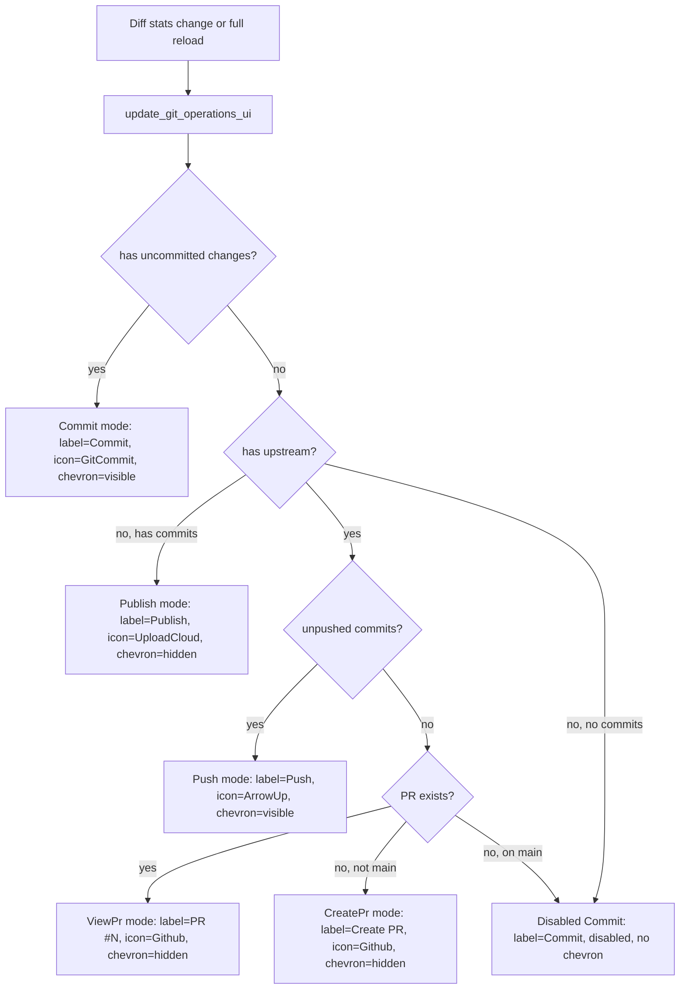

# APP-3918: Git Operations Button — Tech Spec

Product spec: `specs/APP-3918/PRODUCT.md`
Parent: APP-3632 (header UI refactor)

## Problem

The code review header refactor (APP-3632) cleared space for git operation buttons, but left them as a placeholder. This branch adds a context-aware split button that adapts its label, icon, and dropdown to the current repository state (uncommitted changes → commit, unpushed commits → push, otherwise → create PR).

## Relevant Code

- `app/src/code_review/code_review_view.rs:280-291` — `PrimaryGitActionMode` enum
- `app/src/code_review/code_review_view.rs:6702-6806` — `primary_git_action_mode`, `update_git_operations_ui`, `git_operations_menu_items`
- `app/src/code_review/code_review_view.rs:1308-1358` — button/menu construction in `new()`
- `app/src/code_review/code_review_header/header_revamp.rs:102-135` — `render_git_operations_button`
- `app/src/code_review/diff_state.rs:530-535` — `DiffStateModel::unpushed_commits()`
- `app/src/util/git.rs:247-290` — `get_unpushed_commits` with main-branch fallback
- `app/src/view_components/action_button.rs:296-321` — `AdjoinedSide`, `set_adjoined_side`, `clear_adjoined_side`

## Current State

The header refactor (APP-3632) restructured the code review header into two layers and moved contextual info to the right-panel header. The inner header now has space for action buttons on the right side. `DiffStateModel` already tracks `unpushed_commits` and provides `unpushed_commits()` accessor. Diff stats are available via the loaded state's `to_diff_stats()`.

However, `get_unpushed_commits` previously returned an empty vec for branches with no upstream tracking, which meant new local branches would incorrectly show "Create PR" instead of "Push".

## Changes

### 1. `PrimaryGitActionMode` enum

New private enum in `code_review_view.rs` with five variants: `Commit`, `Publish`, `Push`, `ViewPr`, `CreatePr`. Computed from:
- `LoadedState::to_diff_stats().has_no_changes()` — uncommitted changes check
- `DiffStateModel::has_upstream()` — upstream tracking branch check
- `DiffStateModel::unpushed_commits().is_empty()` — unpushed commits check
- `DiffStateModel::pr_info()` — existing PR check
- `DiffStateModel::is_on_main_branch()` — main branch check

### 2. Split button in `CodeReviewView`

Four new fields on `CodeReviewView`:
- `git_primary_action_button: ViewHandle<ActionButton>` — primary button (`SecondaryTheme`, `ButtonSize::Small`, `AdjoinedSide::Right`)
- `git_operations_chevron: ViewHandle<ActionButton>` — chevron button (`AdjoinedSide::Left`)
- `git_operations_menu: ViewHandle<Menu<CodeReviewAction>>` — dropdown menu
- `git_operations_menu_open: bool` — menu state
- `show_git_operations_chevron: bool` — controls chevron visibility (hidden in `CreatePr` mode)

Created once in `new()`. The menu subscribes to `MenuEvent::ItemSelected` / `MenuEvent::Close` to reset open state and chevron active state.

Passed to the header via six new fields on `CodeReviewHeaderFields`.

### 3. New `CodeReviewAction` variants

- `OpenCommitDialog`, `OpenPushDialog`, `OpenCreatePrDialog` — dispatch to dialogs (currently TODO stubs, wired in child branches)
- `OpenGitOperationsMenu` — toggles the dropdown
- `CommitAndPush`, `CommitAndCreatePr` — compound actions (stubs for now)
- `ViewPr(String)` — opens the PR URL in the browser
- `PublishBranch` — pushes and sets upstream (stub for now)

### 4. Reactive state updates

`update_git_operations_ui` is called from two sites:
- `update_aggregate_stats` (line 2777) — when diff stats change
- `invalidate_all` (line 2872) — when a full diff reload completes

It recomputes `primary_git_action_mode` and updates the button's label, icon, click handler, and adjoined-side. In `CreatePr` mode, the adjoined side is cleared via `clear_adjoined_side` and the chevron is hidden.

### 5. Header rendering

`render_git_operations_button` in `header_revamp.rs` builds a `Stack` with:
- A `Flex::row` of primary button + optional chevron
- A positioned overlay for the dropdown menu (anchored `BottomRight → TopRight`)

Gated on `CodeReviewHeaderFields::show_git_operations` (which is `FeatureFlag::GitOperationsInCodeReview.is_enabled()`).

### 6. `get_unpushed_commits` fallback

When `git log @{u}..HEAD` fails with "no upstream configured" or "unknown revision", now falls back to `detect_main_branch` and runs `git log {main_branch}..HEAD`. This ensures new local branches correctly report their commits as "unpushed". Extracted `parse_commit_log` helper to avoid duplication.

### 7. `has_upstream` detection

New `has_upstream: bool` field on `DiffMetadata`, computed during `load_metadata_for_repo` via `git rev-parse --abbrev-ref --symbolic-full-name @{u}`. Exposed as `DiffStateModel::has_upstream()`. Used by `primary_git_action_mode` to distinguish Publish (no upstream) from Push (has upstream) and to gate Create PR (only with upstream).

### 8. PR info refresh on metadata updates

Previously `refresh_pr_info` only ran on branch change. Now also runs during throttled metadata refreshes when `pr_info` is `None`, so the button updates to "PR #N" after an external push or PR creation without requiring a branch switch.

### 9. Overflow menu gated on changes

When the git operations flag is enabled, `has_header_menu_items` now requires actual changes to be present. The "Add comment" item is also gated on `has_changes`. This hides the three-dot overflow menu entirely when there are no changes.

### 10. New `UploadCloud` icon

Added `app/assets/bundled/svg/upload-cloud-01.svg` and registered as `Icon::UploadCloud` for the Publish button.

### 11. New `GitCommit` icon

Added `app/assets/bundled/svg/git-commit.svg` (a 24×24 SVG with `fill="#FF0000"` per the existing icon convention) and registered it as `Icon::GitCommit` in `crates/warp_core/src/ui/icons.rs`. This replaces `Icon::GitBranch` for the Commit action — a git-branch icon is semantically incorrect for a commit operation.

### 8. `ActionButton::clear_adjoined_side`

New public method to remove the adjoined-side styling at runtime, used when transitioning to `CreatePr` mode (standalone button, no chevron).

## End-to-End Flow

## Risks and Mitigations

- **Stale button state**: If diff stats and unpushed-commit data get out of sync, the button could show the wrong mode. Mitigated by recomputing on every diff reload and stats update.
- **Fallback branch detection**: `detect_main_branch` may fail in unusual repo setups (bare repos, orphan branches). Falls back to empty vec (shows "Create PR"), which is a reasonable degraded state.
- **Action stubs**: The dialog actions are TODO stubs. If child branches aren't merged alongside this one, clicking the buttons does nothing. Acceptable because the feature is behind a flag that's off by default.

## Testing and Validation

- Manual: enable feature flag, modify files, and step through Commit → Push → Create PR states by committing and pushing from the terminal.
- Verify dropdown items and disabled states in each mode.
- Test on a new local branch with no upstream to confirm "Push" is shown.
- Verify the flag-off path renders no git operations button.

## Follow-ups

- Wire `OpenCommitDialog`, `OpenPushDialog`, `OpenCreatePrDialog` to actual dialogs (child branches in stack).
- Wire `CommitAndPush` and `CommitAndCreatePr` compound actions.
- Wire `PublishBranch` to `git push --set-upstream origin <branch>`.
- Add integration tests for mode transitions once dialogs are functional.
- Consider progress/error UI for push and PR creation flows.
- Handle the "no remote at all" edge case (currently treated same as no upstream).
