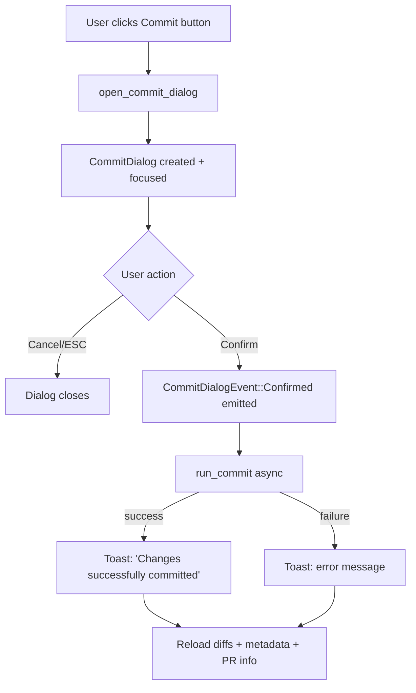

# APP-3919: Commit Dialog — Tech Spec

Product spec: `specs/APP-3919/PRODUCT.md`
Branch: `edward/commit-dialog`

## Relevant Code

- `app/src/code_review/commit_dialog.rs` — new file, entire dialog view
- `app/src/code_review/code_review_view.rs` — `open_commit_dialog`, dialog overlay rendering, action wiring
- `app/src/util/git.rs` — `get_file_change_entries`, `FileChangeEntry`
- `app/src/code_review/mod.rs` — module registration

## Changes

### 1. `CommitDialog` view (`commit_dialog.rs`)

New 718-line view implementing the dialog UI. Key types:

- `CommitIntent` enum — `CommitOnly` (future: `CommitAndPush`, `CommitAndCreatePr`)
- `CommitDialogAction` — internal actions: `Cancel`, `Confirm`, `SetIntent`, `ToggleIncludeUnstaged`, `ToggleChangesExpanded`
- `CommitDialogEvent` — events emitted to parent: `Confirmed { message, intent, include_unstaged }`, `Cancelled`

State:
- `repo_path`, `branch_name` — set at construction
- `intent: CommitIntent` — which action to take on confirm
- `include_unstaged: bool` — toggle for staged-only vs all changes (default: true)
- `file_changes: Vec<FileChangeEntry>` — loaded async on open and on toggle
- `changes_expanded: bool` — collapsible file list
- `message_editor: ViewHandle<EditorView>` — commit message input

The dialog uses the existing `Dialog` component with `dialog_styles`. The message editor uses `EditorView` with `soft_wrap`, `autogrow`, and `supports_vim_mode: false`.

File changes are loaded on construction and reloaded when `include_unstaged` is toggled. The confirm button is disabled when there are no files or no message.

### 2. `get_file_change_entries` (`git.rs`)

New async function that returns per-file change stats:

```rust
pub async fn get_file_change_entries(
    repo_path: &Path,
    include_unstaged: bool,
) -> Result<Vec<FileChangeEntry>>
```

- When `include_unstaged` is true: runs `git diff --numstat HEAD` + `git ls-files --others --exclude-standard` for untracked files
- When false: runs `git diff --cached --numstat` (staged only)
- Returns `FileChangeEntry { path, additions, deletions }` for each file

### 3. Dialog lifecycle in `CodeReviewView`

New field: `commit_dialog: Option<ViewHandle<CommitDialog>>`

`open_commit_dialog` method:
1. Guards against double-open
2. Gets repo path and branch name from `DiffStateModel`
3. Creates `CommitDialog` view
4. Subscribes to `CommitDialogEvent`:
   - `Confirmed` → closes dialog, spawns async `run_commit`, shows success/error toast, reloads diffs + metadata + PR info
   - `Cancelled` → closes dialog
5. Focuses the dialog

### 4. Overlay rendering

The dialog is rendered as a positioned overlay in `View::render`, using the same pattern as the discard confirmation dialog. Both dialogs are mutually exclusive — only one modal can be open at a time.

### 5. Action wiring

`CodeReviewAction::OpenCommitDialog` now calls `self.open_commit_dialog(ctx)` instead of being a TODO stub. `CommitAndPush` and `CommitAndCreatePr` remain stubs for child branches.

### 6. Post-commit refresh

After commit (success or failure):
- `load_diffs_for_active_repo(false, ctx)` — reloads diffs
- `refresh_diff_metadata_for_current_repo(PromptRefresh)` — updates stats
- `refresh_pr_info(ctx)` — updates PR button state

## End-to-End Flow



## Follow-ups

- Wire `CommitAndPush` intent (push-dialog branch)
- Wire `CommitAndCreatePr` intent (pr-dialog branch)
- Auto-generate commit message when left blank (AI integration)
- Per-file staging/unstaging in the changes panel
- Commit amend support
