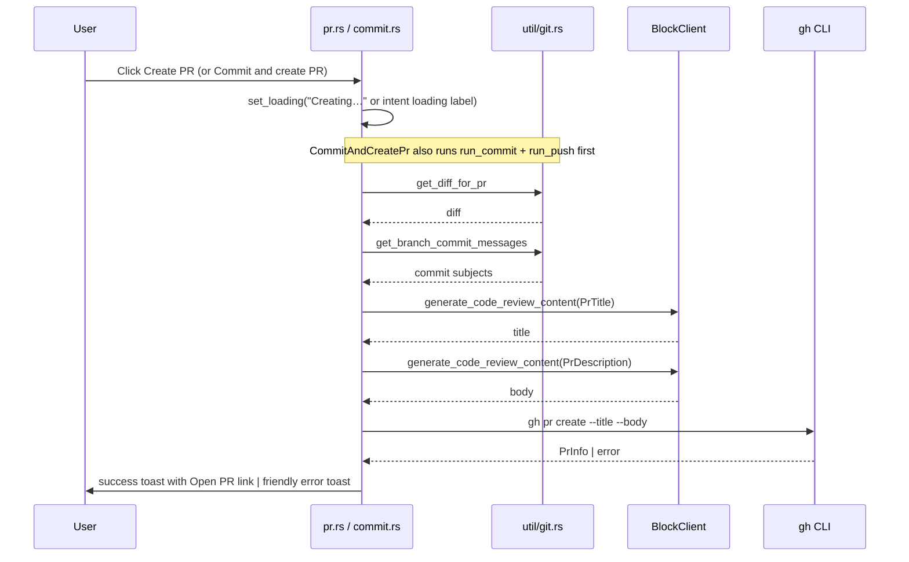
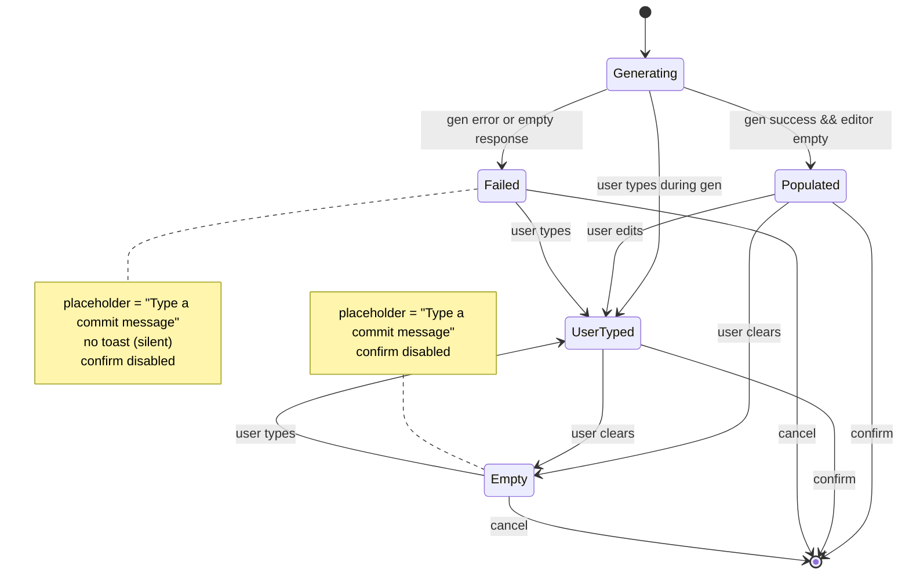

# APP-3923: AI-autogenerated commit messages and PR metadata — Tech Spec
Product spec: `specs/APP-3923/PRODUCT.md`
Parent stack: APP-3918 (header button) → APP-3920 (commit/push dialog) → APP-3922 (create-PR dialog) → **APP-3923** (this branch).
## Problem
APP-3922 landed the `GitDialog::CreatePr` mode and the `CommitIntent::CommitAndCreatePr` chain, both of which called `gh pr create --fill`. `--fill` just copies the latest commit subject/body into the PR, and commit messages themselves had to be typed manually. We want AI-generated copy for all three: commit message (at dialog open time), PR title and PR body (at confirm time).
The work has three logical layers that needed new plumbing:
1. A server endpoint for AI generation of review-adjacent content.
2. A client-side block-service method and request/response types.
3. Git helpers that produce the LLM input (diff + branch commit messages).
Plus editor-state changes in `commit.rs` so that an autogenerated draft is discoverable, overridable, and failure-visible.
## Relevant code
- `app/src/ai/generate_code_review_content/api.rs` — new `GenerateCodeReviewContentRequest` / `Response` + `OutputType` enum
- `app/src/ai/generate_code_review_content/mod.rs` — module root (plus the follow-up TODO)
- `app/src/ai/mod.rs:44` — registers the new module
- `app/src/server/server_api/block.rs:54,175-196` — new `BlockClient::generate_code_review_content` trait method and `ServerApi` impl, following the pattern of `generate_shared_block_title`
- `app/src/util/git.rs:445-527` — `MAX_DIFF_CHARS_FOR_AI`, `MAX_UNTRACKED_FILE_BYTES`, `BINARY_CHECK_BYTES`, `MAX_PR_TITLE_BYTES`, `truncate_on_char_boundary`, `get_diff_for_commit_message`
- `app/src/util/git.rs:677-721` — `get_diff_for_pr`, `get_branch_commit_messages`
- `app/src/util/git.rs:723-798` — `create_pr(repo_path, Option<&str>, Option<&str>)` with `--fill` fallback when title/body are `None`; `sanitize_pr_title` helper
- `app/src/code_review/git_dialog/commit.rs:66-70` — placeholder constants
- `app/src/code_review/git_dialog/commit.rs:239-305` — `generate_commit_message` (open-time)
- `app/src/code_review/git_dialog/commit.rs:313-319` — `is_ready_to_confirm`
- `app/src/code_review/git_dialog/commit.rs:362-473` — `start_confirm` (PR title/body gen for `CommitAndCreatePr`)
- `app/src/code_review/git_dialog/pr.rs:101-174` — `start_confirm` + `create_pr_with_ai_content` (shared helper used by both standalone PR and `CommitAndCreatePr`; parallelizes title/body with `futures::try_join!`, falls back to `--fill` on AI failure)
- `app/src/code_review/git_dialog/mod.rs:484-496` — `refresh_confirm_enabled` call site updated for the new `is_ready_to_confirm` signature
- Server side: `warp-server/router/handlers/generate_code_review_content.go` (already deployed)
## Current state
Before this branch:
- `commit.rs` required a typed commit message; placeholder was `"Leave blank to autogenerate a commit message"` but there was no autogeneration wired — the confirm was disabled on empty.
- `pr.rs::start_confirm` called `create_pr(&repo_path)` → `gh pr create --fill`.
- `commit.rs::start_confirm` `CommitAndCreatePr` branch likewise called `create_pr(&repo_path)`.
- `BlockClient` only had `generate_shared_block_title` as an AI-adjacent method.
- `util/git.rs` had no diff-for-AI helpers.
The dialog parent (`GitDialog`) owns chrome (title, buttons, loading state) and each mode owns its own state, body renderer, and confirm async; events collapse to `Completed | Cancelled`. That contract is preserved by this branch — all new work lives inside the existing per-mode submodules.
## Proposed changes
### 1. `generate_code_review_content` module (`app/src/ai/generate_code_review_content/`)
Mirrors the shape of `generate_block_title/`: a `mod.rs` that declares `pub(crate) mod api;` and an `api.rs` with request/response types.
```rust path=null start=null
pub enum OutputType {
    CommitMessage,
    PrTitle,
    PrDescription,
}
pub struct GenerateCodeReviewContentRequest {
    pub output_type: OutputType,
    pub diff: String,
    #[serde(skip_serializing_if = "String::is_empty", default)]
    pub branch_name: String,
    #[serde(skip_serializing_if = "Vec::is_empty", default)]
    pub commit_messages: Vec<String>,
}
pub struct GenerateCodeReviewContentResponse {
    pub content: String,
}
```
A single endpoint + request type is enough because all three output types share the same inputs (diff, optional branch name, optional commit subjects). The server dispatches on `output_type`.
### 2. `BlockClient::generate_code_review_content`
Added alongside `generate_shared_block_title` in `app/src/server/server_api/block.rs`. The `ServerApi` implementation POSTs to `{server_root_url}/ai/generate_code_review_content` with bearer auth, JSON body, and JSON response decoding — same skeleton as `generate_shared_block_title`. Reusing `BlockClient` keeps this off the GraphQL path (which would require a new mutation and cynic codegen) and matches where block-title gen already lives.
### 3. Diff helpers in `app/src/util/git.rs`
Four module-scope consts (`MAX_DIFF_CHARS_FOR_AI = 16_000`, `MAX_UNTRACKED_FILE_BYTES = 4_000`, `BINARY_CHECK_BYTES = 1_024`, `MAX_PR_TITLE_BYTES = 200`) plus a `truncate_on_char_boundary` helper and three git-diff helpers, all `#[cfg(feature = "local_fs")]` with wasm stubs to match existing conventions in the file. All byte-length truncation uses `truncate_on_char_boundary` to avoid UTF-8 panics on diffs/source files containing non-ASCII text.
- `get_diff_for_commit_message(repo_path, include_unstaged) -> Result<String>`
  - `git diff HEAD` when `include_unstaged`, else `git diff --cached`.
  - When `include_unstaged`, iterates `git ls-files --others --exclude-standard -z` (NUL-separated to survive paths with spaces/non-ASCII), skips binaries via `warp_util::file_type::is_buffer_binary(&bytes[..BINARY_CHECK_BYTES])`, and appends synthetic unified-diff hunks for each new file (capped at `MAX_UNTRACKED_FILE_BYTES`) so the LLM sees new-file-only commits.
  - Final output truncated at `MAX_DIFF_CHARS_FOR_AI` with `\n... (diff truncated)` marker.
- `get_diff_for_pr(repo_path) -> Result<String>`
  - Diffs `{base}..origin/{current}` when `git rev-parse --verify origin/{current}` succeeds, else `{base}..HEAD`.
  - Same truncation rule as above.
- `get_branch_commit_messages(repo_path) -> Result<Vec<String>>`
  - `git log {base}..HEAD --format=%s`, one subject per vec element.
### 4. `create_pr` signature change
`create_pr(repo_path, title: Option<&str>, body: Option<&str>) -> Result<PrInfo>` replaces `create_pr(repo_path)`. When both fields are `Some`, invokes `gh pr create --title <t> --body <b>` (title passes through `sanitize_pr_title` to first-line and cap at `MAX_PR_TITLE_BYTES` — GitHub silently collapses newlines in titles otherwise). When either is `None`, falls back to `gh pr create --fill`, used as a last-resort source when AI title/body generation fails so the PR is still created. Both wasm stub and both call sites (`pr.rs` and `commit.rs`) updated.
### 5. Commit-dialog open-time autogen (`commit.rs`)
Two placeholder constants in `commit.rs`:
- `GENERATING_PLACEHOLDER_TEXT = "Generating commit message…"` (shown while gen is in flight; was `"Leave blank to autogenerate a commit message"`).
- `FALLBACK_PLACEHOLDER_TEXT = "Type a commit message"` (shown after gen resolves, success or failure).
A new private `generate_commit_message(repo_path, branch_name, include_unstaged, ctx)` fires from `new_state` at dialog construction. It:
1. Awaits `get_diff_for_commit_message` and `block_client.generate_code_review_content(CommitMessage, ...)`.
2. On success: if the editor is still empty (`!buffer_text.trim().is_empty()` is false), `editor.system_reset_buffer_text(generated.trim(), ctx)`; otherwise discards. Placeholder swaps to `FALLBACK_PLACEHOLDER_TEXT`. `refresh_confirm_enabled`.
3. On failure: placeholder swaps to `FALLBACK_PLACEHOLDER_TEXT`, `refresh_confirm_enabled`. No toast — the empty editor plus placeholder already communicate that no draft arrived, and the failure isn't retryable. `log::warn!` for the underlying error.
No `is_autogenerating` field on `CommitState`. Confirm enablement is purely `!file_changes.is_empty() && commit_message(state, app).is_some()`; while gen is in flight the buffer is empty, so this is false naturally.
### 6. Confirm-time PR gen: shared `create_pr_with_ai_content` helper
Both flows (standalone `pr::start_confirm` and the `CommitAndCreatePr` branch of `commit::start_confirm`) delegate to `pr::create_pr_with_ai_content(repo_path, branch_name, block_client)`:
1. `get_diff_for_pr(repo_path)`.
2. `get_branch_commit_messages(repo_path)` (wrapped in `.unwrap_or_default()` — commit subjects are advisory).
3. Parallel `block_client.generate_code_review_content` calls (`PrTitle` + `PrDescription`) via `futures::try_join!`, both sharing the same `diff`, `branch_name`, and `commit_messages`.
4. On AI success: `create_pr(&repo_path, Some(&pr_title), Some(&pr_body))`.
5. On AI failure (either call): `log::warn!` and fall back to `create_pr(&repo_path, None, None)` so the PR still gets created via `gh pr create --fill`.
Non-AI errors (diff fetch, `gh pr create` itself) bubble via `?` into the existing `Err` handler, which logs and calls `show_toast(user_facing_git_error(&err.to_string()), ctx)`. AI errors no longer reach that path since they're converted to the `--fill` fallback.
### 7. `is_ready_to_confirm` simplification
Before: `(state, app)` → required non-empty file changes AND non-empty commit message.
Interim (mid-branch): dropped `app`, added `is_autogenerating` flag, made message optional.
Final: `(state, app)` → required non-empty file changes AND non-empty commit message again. The `is_autogenerating` flag is gone; the empty-buffer state during gen is what gates confirm.
`start_confirm` is correspondingly simplified: `let Some(message) = commit_message(state, ctx) else { return; };` as a defensive guard (handles keyboard-shortcut dispatch that bypasses the button's disabled state), then straight into `run_commit`. The previously-added confirm-time AI fallback branch is deleted.
## End-to-end flows
### Commit message autogeneration
```mermaid
sequenceDiagram
    participant User
    participant CommitDialog as commit.rs
    participant Git as util/git.rs
    participant AI as BlockClient
    User->>CommitDialog: Open dialog
    CommitDialog->>CommitDialog: placeholder = "Generating…"; confirm disabled
    CommitDialog->>Git: get_diff_for_commit_message
    Git-->>CommitDialog: diff (≤ 16k chars, + synthesised untracked files)
    CommitDialog->>AI: generate_code_review_content(CommitMessage)
    alt success
        AI-->>CommitDialog: draft
        CommitDialog->>CommitDialog: if editor empty, insert draft<br/>placeholder = "Type a commit message"
        CommitDialog->>User: editor populated → confirm enabled
    else failure
        AI-->>CommitDialog: error
        CommitDialog->>CommitDialog: placeholder = "Type a commit message"<br/>log::warn + refresh_confirm_enabled
        CommitDialog->>User: blank editor → confirm still disabled
    end
```
### PR title/body autogeneration (both flows)

### State machine for the commit message editor

## Risks and mitigations
**AI latency blocks the user.** Commit message gen runs at open time in the background, so the user can start typing immediately; gen results are discarded if the user has typed anything. PR title/body gen runs at confirm time, which does extend the `Creating…` loading phase by two sequential AI calls. Mitigation is bounded by server SLA; a failure simply surfaces the existing friendly error toast.
**AI errors don't surface to the user.** AI-generation errors are caught inside `create_pr_with_ai_content` and transparently fall back to `gh pr create --fill`, so the user sees a successfully-created PR with latest-commit-derived copy rather than an error toast. Only non-AI errors (diff fetch, `gh pr create` itself) still flow through `user_facing_git_error`, which doesn't know about them specifically and maps them to the generic git fallback. Improving that mapping is an explicit follow-up.
**Sequential PR gen calls double the latency.** Addressed in-branch: `create_pr_with_ai_content` now runs `PrTitle` + `PrDescription` concurrently via `futures::try_join!`. The diff payload is cloned across both requests but latency is bounded by the slower of the two.
**`CommitAndCreatePr` chain can leave the branch pushed but PR not created.** If PR creation fails after `run_commit` + `run_push` (non-AI failure — AI failures now fall back to `--fill`), the commit and push are real but no PR exists. The header button transitions to the `CreatePr` state on the next diff-metadata refresh, so the user can retry via the standalone dialog. Documented in the product spec; no code-level mitigation in-branch.
**Duplicate PR title/body gen code.** The ~25-line PR title + PR body generation block appears verbatim in both `commit.rs::start_confirm` (`CommitAndCreatePr` branch) and `pr.rs::start_confirm`. An extracted helper would sit naturally in `git_dialog/mod.rs`. Deferred to follow-up.
**Privacy / opt-out.** `GitOperationsInCodeReview` gates the UI, but does not address AI-specific privacy concerns (sending diffs to an LLM). See the TODO at the top of `app/src/ai/generate_code_review_content/mod.rs` — follow-up work needs to add an `AISettings` toggle (mirroring `is_shared_block_title_generation_enabled`) and a customer-type guard that excludes Enterprise unless on Warp plan or dogfood, matching the pattern in `terminal/share_block_modal.rs::should_send_title_gen_request`.
## Testing and validation
No automated tests added — the parent branches (APP-3920, APP-3922) also ship without tests and the `git_dialog` module has no test harness yet. Manual validation covers each path in the product spec's **Validation** section.
When we add a test harness, the highest-value targets are:
- `is_ready_to_confirm` transitions through the editor states (empty → typed → cleared).
- `generate_commit_message`'s "user typed before response landed → discard" path.
- `get_diff_for_commit_message` truncation and untracked-file synthesis.
## Follow-ups
- Add `AISettings::is_commit_message_generation_enabled` (or similar) and wire it through `generate_commit_message` and `create_pr_with_ai_content`. Mirror `share_block_modal.rs::should_send_title_gen_request`.
- Add customer-type guard for Enterprise users (allow Warp plan + dogfood, deny otherwise).
- Route AI errors to dedicated toast copy instead of the git-error mapper. Options explored: typed-error marker + `downcast_ref` (clean but heavier) vs. fall-through-on-unknown-error (simpler but changes behavior for unknown git errors). Pick one and implement.
- Extract the `origin/{current}`-or-HEAD resolution helper — duplicated between `get_branch_diff_entries` (APP-3922) and `get_diff_for_pr` (this branch).
- Consider a regenerate button for the commit message draft, and a preview/edit UI for PR title/body before `gh pr create` fires.
- Update PR #23945 title and description to cover all three generated fields (currently title only mentions commit messages).
