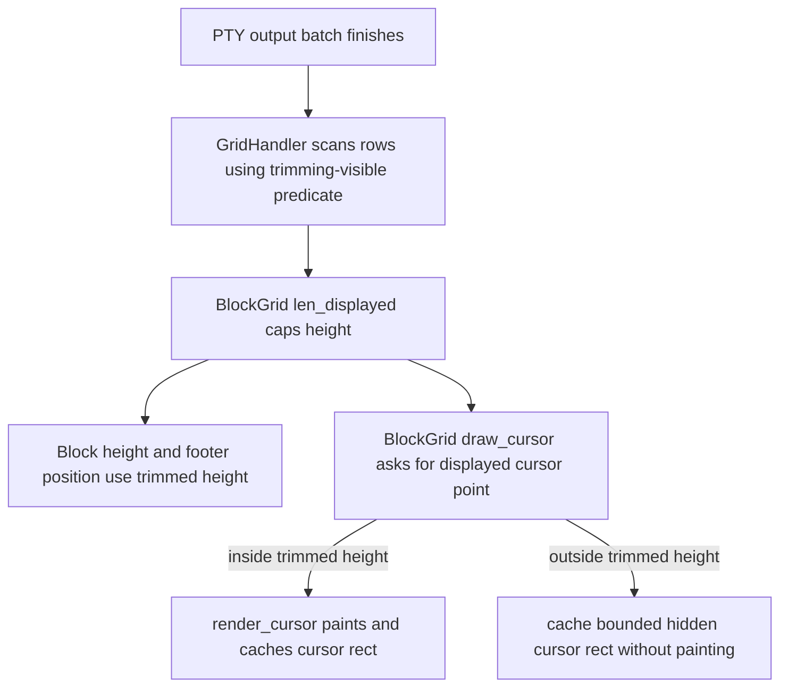

# Fix CLI Agent Trailing Blank Line Trimming Edge Cases
## 1. Problem
APP-4004 trimmed trailing blank rows from active CLI agent blocks by capping `BlockGrid::len_displayed()` at `GridHandler::content_len()`. Testing found two edge cases:
- If the PTY cursor is positioned in rows that are trimmed out of the output height, Warp still renders the cursor at that translated row. Because the block height no longer includes those rows, the cursor can render outside the block and underneath adjacent UI such as the CLI agent toolbar.
- Claude Code slash commands still leave visible empty rows in at least one flow. Typing `/` causes Claude to output extra rows for the suggestions menu. When `/` is cleared and the menu is gone, the rows can remain visually empty but still affect displayed height.
The follow-up should keep the displayed output height, cursor rendering, and the content-length heuristic aligned around the same definition of “displayed content.”
## 2. Relevant code
- `specs/APP-4004/TECH.md` — original design and assumptions for trailing blank row trimming.
- `app/src/terminal/model/blockgrid.rs:167` — `BlockGrid::len_displayed()` caps displayed height at `GridHandler::content_len()` when `trim_trailing_blank_rows` is active.
- `app/src/terminal/model/blockgrid.rs:262` — `BlockGrid::set_trim_trailing_blank_rows()` enables content-length tracking on the owned `GridHandler`.
- `app/src/terminal/model/grid/grid_handler.rs:310` — `bottommost_nonempty_row` and `track_content_length` fields store the cached content-height scan result.
- `app/src/terminal/model/grid/grid_handler.rs:1422` — `cursor_render_point()` returns the raw cursor render position, accounting for marked text but not trimming.
- `app/src/terminal/model/grid/grid_handler.rs:2358` — `bottommost_nonempty_row_backward()` currently treats any `!Cell::is_empty()` cell as content.
- `app/src/terminal/model/grid/grid_handler.rs:2373` — `content_len()` falls back to max-cursor height when no non-empty row is cached.
- `app/src/terminal/model/grid/ansi_handler.rs:738` and `app/src/terminal/model/grid/ansi_handler.rs:804` — line and screen clears replace cells with the current background template, which can leave rows logically non-empty even when they are visually blank.
- `app/src/terminal/model/grid/ansi_handler.rs:1203` — `on_finish_byte_processing()` updates the cached bottommost row once per PTY-read batch.
- `app/src/terminal/blockgrid_renderer.rs:146` — `BlockGrid::draw_cursor()` always translates and renders the cursor without checking `len_displayed()`.
- `app/src/terminal/block_list_element.rs:2707` — active long-running output grids call `draw_cursor()` independently from output-grid height advancement.
- `app/src/terminal/grid_renderer.rs:2320` — `render_cursor()` computes a pixel position directly from the supplied row and caches it indefinitely.
- `crates/warp_terminal/src/model/grid/cell.rs:227` — `Cell::is_empty()` is a terminal-state predicate that includes background, foreground, and flags, not just visible glyph content.
- `crates/warp_terminal/src/model/grid/cell.rs:245` — `Cell::is_visible()` filters whitespace but still depends on terminal-state emptiness, so trimming needs a narrower predicate for raw glyph content.
## 3. Current state
APP-4004 has one source of truth for block height: `Block::output_grid_displayed_height()` delegates to `BlockGrid::len_displayed()`, and `len_displayed()` applies `base.min(grid_handler.content_len())`.
That source of truth is not shared by cursor rendering. `BlockGrid::draw_cursor()` computes `cursor_render_point()`, translates through `maybe_translate_point_from_original_to_displayed()`, and passes the result to `render_cursor()`. If there is no displayed-output filter, translation returns the same row. A cursor at original row 8 with `len_displayed() == 5` therefore renders at displayed row 8 even though layout only reserved five rows.
The Claude Code slash-command issue likely comes from using `Cell::is_empty()` as the row-content predicate. `Cell::is_empty()` intentionally considers terminal metadata such as non-default backgrounds, foregrounds, wrap flags, and cursor flags. That is appropriate for terminal state but too strict for deciding whether a row contributes visible content to a trimmed block. A row that was part of a transient suggestions menu can be cleared into whitespace or template-background cells that are visually blank but still fail `is_empty()`. In the all-blank case, `content_len()` also falls back to max-cursor height, which preserves exactly the blank height that trimming is intended to remove.
## 4. Proposed changes
### 4.1 Add a trimming-specific visible-content predicate
Keep `Cell::is_empty()` unchanged. Add a trimming-specific row scan in `GridHandler`, for example:
- `row_has_visible_content_for_trimming(row_idx: usize) -> bool`
- `bottommost_visible_content_row_backward() -> Option<usize>`
The predicate should count rows with glyph content that is actually meaningful to display. It should include cells with non-placeholder, non-ASCII-whitespace raw content, and it should ignore whitespace-only cells, default placeholders, cursor metadata, and style-only remnants from clear operations. If a row has image placements or another non-cell visual artifact that should keep block height, the predicate should count that row as content as well.
Use this predicate only for CLI-agent trailing-row trimming. Do not redefine terminal-wide emptiness or line length semantics.
### 4.2 Replace max-cursor fallback for active trimming
For trimming, “no visible content found” should not mean “show all rows visited by the cursor.” Introduce a dedicated content-height API so callers can distinguish real content from the all-blank case:
- `GridHandler::visible_content_len_for_trimming() -> Option<usize>` returns `Some(row + 1)` for the bottommost visible-content row and `None` for no visible content.
- `BlockGrid::len_displayed()` applies the minimum only when trimming is enabled. If the grid has no visible content, cap to a small active-grid floor instead of max-cursor height. The expected floor is one row for a started output grid and zero rows for an unstarted grid where the base length is already zero.
This preserves enough vertical space for an active terminal area without allowing transient menus or cursor-only movement to allocate many blank rows.
### 4.3 Gate cursor rendering by displayed output height
Add a `BlockGrid` helper that returns the displayed cursor point only if it is inside the current displayed grid:
- Compute `cursor_render_point()`.
- Translate it via `maybe_translate_point_from_original_to_displayed()`.
- Return `None` if `translated.row >= self.len_displayed()`.
- Otherwise return the translated point.
Use this helper in `BlockGrid::draw_cursor()`. If it returns `None`, do not paint a visible cursor, but still update `terminal_view:cursor_{terminal_view_id}` with a safe in-bounds rect by calling `render_cursor()` at a bounded cache point with `CursorShape::Hidden` and no hint text. This keeps out-of-band consumers such as IME positioning from observing a missing active cursor position while preventing the cursor from drawing outside the trimmed block.
Do not clamp the cursor to the last displayed row. Clamping would render the cursor on content it does not own and would make the terminal state visually misleading. If the active program moves its cursor into intentionally trimmed blank rows, the cursor should be hidden until either content appears there or trimming no longer excludes that row.
### 4.4 Keep cursor-cell suppression consistent
`GridRenderParams::hide_cursor_cell` currently skips rendering the cell at `grid.cursor_render_point()` inside `render_grid()`. Once cursor rendering has a displayed-bounds helper, keep cursor-cell suppression aligned with the same decision:
- If the cursor render point is outside `len_displayed()`, there is no visible cell to suppress.
- If future refactoring moves cursor-point calculation into `BlockGrid`, prefer passing an optional displayed cursor point into `render_grid()` rather than recomputing raw cursor state in two places.
This can be deferred if the current row iteration already excludes trimmed rows, but the spec should treat the helper as the eventual single source of truth for cursor visibility.
## 5. End-to-end flow

Claude Code slash-command cleanup should follow the same path. When Claude clears the suggestions menu, rows that contain only whitespace or style-only remnants no longer count as visible content, so `len_displayed()` shrinks back to the last real content row or the active-grid floor.
## 6. Testing and validation
Add unit tests around the model helpers rather than relying only on visual/manual checks.
Recommended tests:
- `GridHandler` content-length tests:
  - existing trailing blank tests still pass with the new visible-content predicate.
  - whitespace-only rows after content are trimmed.
  - rows cleared with a non-default background/template after content are trimmed if they have no visible glyphs.
  - all-blank active grids cap to the active-grid floor instead of max-cursor height.
  - rows with real visible glyphs after blanks restore height.
- `BlockGrid` cursor helper tests:
  - cursor below content with trimming enabled returns `None`.
  - cursor on or above the last displayed content row returns the translated displayed point.
  - filter/displayed-output translation still returns the expected displayed point when the cursor line is included.
- Renderer behavior:
  - `draw_cursor()` does not paint a visible cursor when the helper returns `None`.
  - `terminal_view:cursor_*` remains cached at an in-bounds hidden cursor rect after a frame where the cursor is hidden by trimming.
- Manual regression:
  - Run Claude Code, type `/` to open slash-command suggestions, then clear `/`. The suggestion-menu rows collapse once Claude has cleared them.
  - Move a CLI agent cursor into blank rows below content. The output block height remains trimmed, and no cursor appears below the block or underneath the CLI agent toolbar.
  - Run Codex/OpenCode smoke flows from APP-4004 to confirm the original trailing-row trimming still works.
Because this is a UI-rendering change, run the normal targeted Rust tests first, then visually verify the active CLI agent block behavior in Warp. If implementation changes rendering code, invoke the UI verification workflow before considering the implementation complete.
## 7. Risks and mitigations
- **Whitespace-only content may be intentional.** Restrict the new predicate to active CLI-agent trimming and keep the feature flag in place. Treating whitespace-only rows as trimmable is appropriate for the observed transient menu behavior but should not change terminal storage semantics globally.
- **Styled blank rows can be visually meaningful.** If testing finds a CLI agent intentionally uses background-only rows as persistent UI, refine the predicate to count visibly non-default background runs while still ignoring cleared-row remnants. Start with glyph-visible content because it fixes the known Claude Code case with the smallest scope.
- **All-blank active grids can collapse too far.** Use an explicit active-grid floor instead of returning zero for started grids. This avoids block jitter while still preventing cursor-only row movement from reserving arbitrary height.
- **Cursor position cache consumers.** Do not clear `terminal_view:cursor_{terminal_view_id}` when cursor painting is skipped because IME positioning and other cursor-relative UI can depend on it. Cache a bounded hidden cursor rect instead.
- **Filters and row translation.** The current trimming feature targets active CLI agent output, not arbitrary filtered output. Cursor rendering should still use the existing displayed-output translation and only add the displayed-height bounds check.
## 8. Follow-ups
- Rename APP-4004’s `bottommost_nonempty_row` terminology to “visible content” terminology during implementation if the predicate changes, so future readers do not confuse terminal emptiness with trimming content.
- Consider replacing the min-based `len_displayed()` cap with a small `DisplayedExtent` type if more display-only clipping rules are added.
- Remove `FeatureFlag::TrimTrailingBlankLines` after APP-4004 and APP-4006 stabilize.
