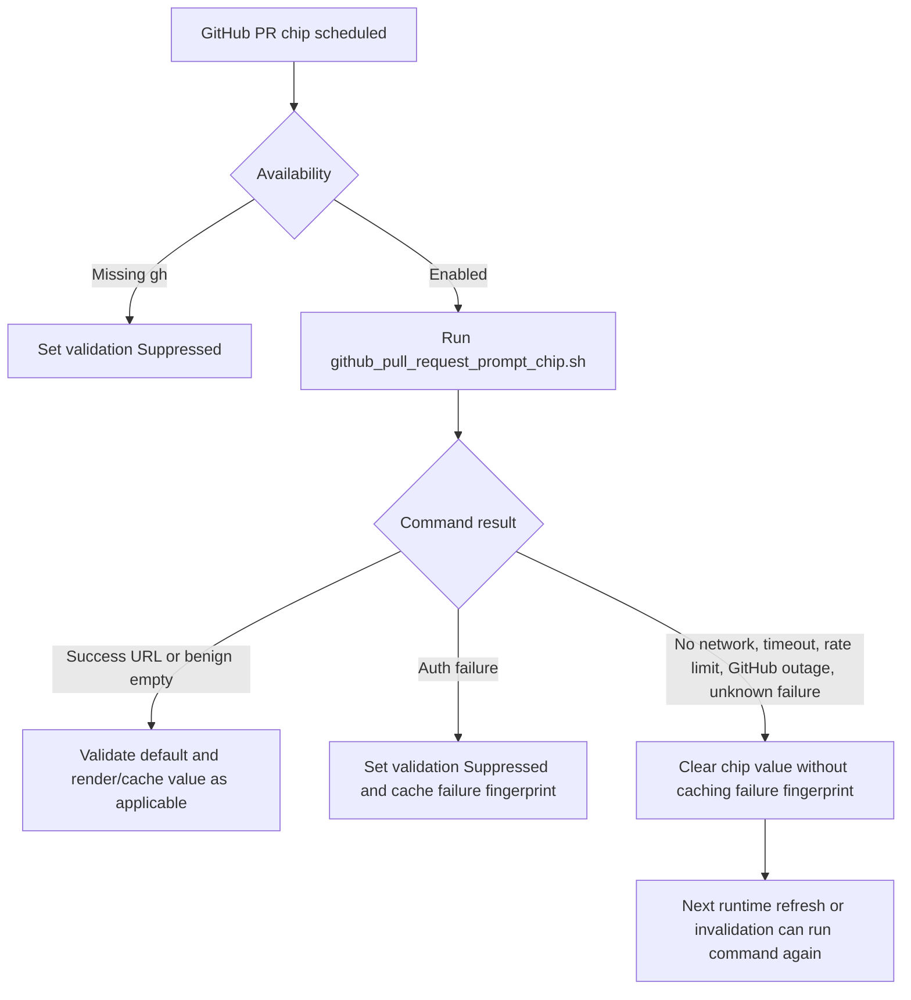

# Technical Spec: GitHub PR Prompt Chip Retryable Network Failures
## Problem
The GitHub PR prompt chip currently uses the generic prompt-chip `suppress_on_failure` runtime path. That path caches any failed shell command by fingerprint in `last_failure_fingerprint` and skips future executions until the fingerprint changes.
For the GitHub PR chip, this is too broad. A no-network failure, DNS failure, GitHub outage, API/rate-limit failure, timeout, or other transient `gh pr view` failure can resolve without any change to the session, directory, branch, executable set, or invalidating command count. These failures should not hide the chip or block a later retry. Deterministic setup failures such as missing `gh` or unauthenticated `gh` should continue to suppress the default PR chip behavior introduced by APP-3908.
## Relevant code
- `specs/APP-3908/PRODUCT.md` — existing product behavior for default PR chip inclusion and deterministic readiness suppression.
- `specs/APP-3908/TECH.md` — original technical plan for PR chip default validation.
- `app/src/context_chips/context_chip.rs (207-309)` — `ChipRuntimePolicy`, `suppress_on_failure`, runtime availability, and disabled reasons.
- `app/src/context_chips/mod.rs (236-263)` — `ContextChipKind::GithubPullRequest` runtime policy: required `gh`/`git`, local-only execution, 5s timeout, `suppress_on_failure`, and `git`/`gh`/`gt` invalidation.
- `app/src/context_chips/current_prompt.rs (343-520)` — fingerprint construction and `maybe_skip_fetch_due_to_matching_fingerprint`.
- `app/src/context_chips/current_prompt.rs (620-839)` — shell chip execution, timeout handling, PR validation transitions, and `last_failure_fingerprint` updates.
- `app/src/context_chips/current_prompt.rs (1345-1518)` — `is_gh_auth_error`, default PR chip suppression, and validation state updates.
- `app/src/context_chips/scripts/github_pull_request_prompt_chip.sh` — shell script that maps benign repo/no-PR states to successful empty output and forwards non-benign `gh pr view` failures to stderr.
- `app/src/context_chips/current_prompt_test.rs (631-843)` — current PR chip suppression test that expects command failures to cache the failure fingerprint.
- `app/src/context_chips/current_prompt_test.rs (1033-1184)` — `RecordingCommandExecutor` test helper for shell command outputs.
- `app/src/terminal/session_settings.rs (96-113, 338-349)` — `GithubPrPromptChipDefaultValidation` and local-only persisted validation setting.
## Current state
`ContextChipKind::GithubPullRequest` is configured with `ChipRuntimePolicy::with_suppress_on_failure()`. In `CurrentPrompt::fetch_chip_value_once`, two paths cache failures:
- If the shell command times out, `state.last_failure_fingerprint = current_fingerprint`.
- If the command exits unsuccessfully and `suppress_on_failure` is true, `state.last_failure_fingerprint = current_fingerprint`.
Before executing a chip, the runtime checks whether `last_failure_fingerprint` matches the current fingerprint. If it does, the chip value is cleared, status becomes `Cached`, and no command is run.
The PR chip already has extra validation logic: missing `gh` from `ChipAvailability::Disabled(RequiresExecutable { command: "gh" })` suppresses default inclusion, `is_gh_auth_error(stderr)` suppresses default inclusion after an auth failure, and successful command execution validates the default.
The gap is that validation state and per-fingerprint failure caching are not separated. A transient network error does not set `GithubPrPromptChipDefaultValidation::Suppressed`, but it still populates `last_failure_fingerprint`, which suppresses the chip for the same fingerprint and prevents the normal runtime retry.
## Proposed changes
### 1. Introduce a PR chip command outcome classifier
Add a small classifier near the PR validation helpers in `current_prompt.rs`:
```rust
enum GithubPrPromptChipCommandOutcome {
    Validated,
    DeterministicAuthFailure,
    RetryableFailure,
}
```
The classifier should take the command output and timeout flag from the shell execution completion path. It should only be used for `ContextChipKind::GithubPullRequest`.
Classification:
- `CommandExitStatus::Success` → `Validated`
- stderr matching the existing narrow auth patterns in `is_gh_auth_error` → `DeterministicAuthFailure`
- timeout → `RetryableFailure`
- all other command failures → `RetryableFailure`
Do not attempt to maintain a broad list of every possible network error string. Treat unknown `gh` command failures as retryable unless they are a known deterministic setup failure.
### 2. Gate PR chip failure fingerprint updates by outcome
Keep the generic `suppress_on_failure` behavior unchanged for other chips.
For `GithubPullRequest`, replace the unconditional failed-command cache update with outcome-specific behavior:
- `Validated`: call `maybe_validate_github_pr_default(ctx)`, clear `last_failure_fingerprint` if it matches the current fingerprint, and store the command output as today.
- `DeterministicAuthFailure`: call `maybe_suppress_github_pr_default(ctx)` and set `last_failure_fingerprint = current_fingerprint`.
- `RetryableFailure`: do not call `maybe_suppress_github_pr_default(ctx)` and do not set `last_failure_fingerprint`. If the current fingerprint is already cached from a previous retryable failure after partial execution, clear it.
Timeout handling should follow the same PR-specific branch. Timeouts for non-PR chips can keep the existing generic behavior.
### 3. Keep missing executable suppression unchanged
The availability path should continue to suppress the default PR chip when `gh` is missing:
- `ChipAvailability::Disabled(ChipDisabledReason::RequiresExecutable { command: "gh" })` → `maybe_suppress_github_pr_default(ctx)`
This is not a transient command failure because the command cannot run until local setup changes. The existing `maybe_unsuppress_github_pr_default` path can continue to reset suppression when `gh` appears on `$PATH`.
### 4. Preserve benign empty states
Do not change `github_pull_request_prompt_chip.sh` for this work. Its current behavior is desirable:
- not in a git repo, detached HEAD, missing origin, non-GitHub remote, and no open PR exit successfully with empty output
- successful empty output does not render a PR chip value
- successful empty output can still validate that the command path is healthy when `gh pr view` was reached
### 5. Factor the failure-cache decision for testability
To avoid embedding special cases throughout `fetch_chip_value_once`, add a helper that determines whether a failure should set `last_failure_fingerprint`:
```rust
fn should_cache_failure_fingerprint(
    chip_kind: &ContextChipKind,
    output: Option<&CommandOutput>,
    timed_out: bool,
) -> bool
```
Expected behavior:
- non-PR chips return the existing generic `suppress_on_failure && failed_or_timed_out` result
- PR chip auth failures return true
- PR chip retryable failures and timeouts return false
An equivalent helper returning a richer enum is also acceptable if it keeps validation and cache decisions together.
## End-to-end flow

## Risks and mitigations
- **Retrying too aggressively:** The PR chip already has a 30s periodic refresh and command-based invalidation. Avoid adding a new retry loop; simply avoid poisoning the existing cache on retryable failures.
- **False positives for auth failures:** Keep `is_gh_auth_error` narrow. Unknown failures should be retryable rather than suppressing the chip.
- **Behavior change for the existing suppression test:** Update the current test to distinguish auth failures from retryable failures instead of asserting all PR command failures cache a fingerprint.
- **Repeated failures while offline:** The chip may retry periodically while offline. This is acceptable because the command has a 5s timeout and this behavior is limited to the PR chip. If needed later, add bounded backoff rather than suppression.
- **Default validation state remains suppressed from previous deterministic failures:** This spec only changes transient command failure behavior. It does not require clearing already-suppressed validation state except through existing setup-change logic.
## Testing and validation
- Unit test PR chip auth failure:
  - command stderr contains an auth error
  - `github_pr_chip_default_validation` becomes `Suppressed`
  - `last_failure_fingerprint` is set
  - revisiting the same fingerprint skips execution
- Unit test PR chip network failure:
  - command stderr is a representative network failure, such as `Post "https://api.github.com/graphql": dial tcp: lookup api.github.com: no such host`
  - validation state does not become `Suppressed`
  - `last_failure_fingerprint` remains `None`
  - a subsequent fetch with the same fingerprint runs the command again and can succeed
- Unit test PR chip timeout:
  - timeout does not suppress validation
  - timeout does not set `last_failure_fingerprint`
- Unit test generic suppress-on-failure behavior for another shell chip remains unchanged, or keep existing coverage if sufficient.
- Manual validation:
  - disconnect network in a GitHub repo with an authenticated `gh`
  - trigger the PR chip and confirm the chip disappears or stays empty without suppressing the default
  - restore network and confirm the chip can re-run and show the PR without changing branches, directories, prompt settings, or restarting Warp
## Follow-ups
- Consider bounded retry backoff for repeated retryable PR chip failures if periodic command execution is too noisy while offline.
- Consider surfacing a lightweight transient error state in debug logs or prompt-chip logs if this is hard to diagnose manually.
