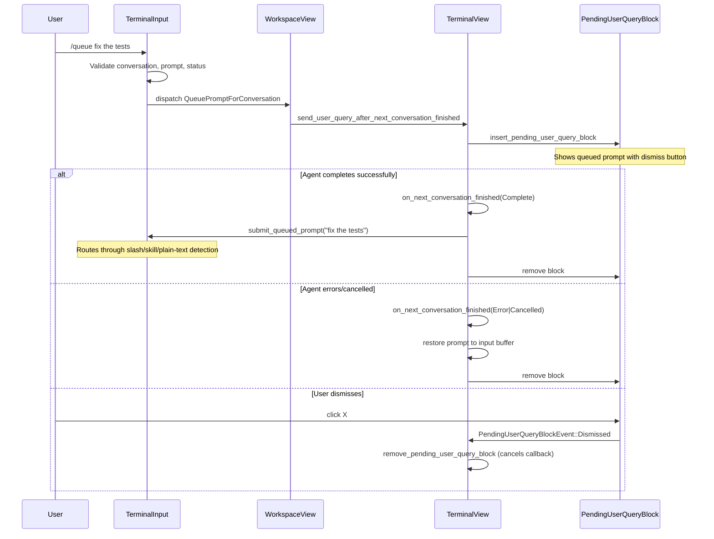

# /queue Slash Command & Auto-Queue Toggle — Technical Spec

## Problem

Users need a way to queue a follow-up prompt while the agent is mid-response. This requires a new slash command, an auto-queue toggle in the status bar, validation logic, a workspace action to route the prompt, and updates to the pending user query block to support dismissal.

## Relevant Code

- `app/src/search/slash_command_menu/static_commands/commands.rs (288-297)` — `QUEUE` static command definition
- `app/src/terminal/input/slash_commands/mod.rs (739-768)` — `/queue` execution handler
- `app/src/terminal/input.rs` — `submit_queued_prompt` (re-submits queued prompts through slash/skill/plain-text routing) and `maybe_queue_input_for_in_progress_conversation` (auto-queue toggle bottleneck)
- `app/src/workspace/action.rs (453-456)` — `QueuePromptForConversation` workspace action variant
- `app/src/workspace/view.rs (19634-19658)` — workspace-level handler that routes to `TerminalView`
- `app/src/terminal/view/pending_user_query.rs` — pending query block insertion, removal, and auto-send logic
- `app/src/ai/blocklist/block/pending_user_query_block.rs` — pending block view with dismiss button
- `app/src/ai/blocklist/block/status_bar.rs` — auto-queue toggle button in the warping indicator
- `app/src/ai/blocklist/context_model.rs` — `queue_next_prompt_enabled` state
- `app/src/terminal/view.rs:18101` — `active_ai_block` helper (skips pending query blocks)
- `app/src/terminal/view.rs:20044` — `last_ai_block` helper (skips pending query blocks)
- `app/src/terminal/view/init.rs` — `TOGGLE_QUEUE_NEXT_PROMPT_KEYBINDING` (`Cmd+Shift+J`)

## Current State

The codebase already has a `PendingUserQueryBlock` and `send_user_query_after_next_conversation_finished` mechanism used by `/compact-and` and `/fork-and-compact`. These commands queue a prompt that fires after summarization completes. The `/queue` command reuses this infrastructure for a simpler case: queue a prompt during any in-progress conversation (no summarization involved).

Prior to this change, `PendingUserQueryBlock` had no dismiss functionality, and `active_ai_block`/`last_ai_block` did not account for pending query blocks at the tail of the rich content list.

## Proposed Changes

### 1. Slash command registration

New `QUEUE` static command in `commands.rs` with:
- Required argument (the prompt text).
- Availability: `AGENT_VIEW | ACTIVE_CONVERSATION | NO_LRC_CONTROL`.
- `requires_ai_mode: true`.
- Gated behind `FeatureFlag::QueueSlashCommand` (dogfood). The command only appears in the slash command menu when the flag is enabled.

### 2. Command execution (`slash_commands/mod.rs`)

The handler validates two preconditions:
1. Active conversation exists (else error toast).
2. Prompt argument is non-empty (else error toast).

Then checks conversation status:
- If `is_in_progress()` or `is_blocked()`: dispatches `WorkspaceAction::QueuePromptForConversation { prompt }`.
- If idle (conversation finished): sends the prompt immediately via `submit_queued_prompt`, which routes through slash command / skill / plain-text detection.

### 3. Workspace action routing (`action.rs`, `view.rs`)

New `QueuePromptForConversation { prompt }` variant on `WorkspaceAction`. The workspace handler resolves the active terminal view and calls `terminal.send_user_query_after_next_conversation_finished(prompt, interruptible: true, ctx)`. The `interruptible` parameter controls whether the pending block shows a "Send now" button; `/queue` and auto-queue set this to `true`, while summarization-triggered queuing (`/compact-and`, `/fork-and-compact`) sets it to `false`.

### 4. Dismiss and Send-now support on `PendingUserQueryBlock`

- Block now owns a `ViewHandle<ActionButton>` close button (X icon, `ButtonSize::XSmall`, `NakedTheme`) and an optional `ViewHandle<ActionButton>` send-now button (Play icon), created only when the block is constructed with `interruptible: true`.
- New `PendingUserQueryBlockAction::{Dismiss, SendNow}` and `PendingUserQueryBlockEvent::{Dismissed, SendNow}`.
- `PendingUserQueryBlock` implements `TypedActionView` to translate actions → events.
- The button column ("Remove queued prompt" + optional "Send now") is positioned top-right via `Stack` + `OffsetPositioning`.
- The caller in `pending_user_query.rs` subscribes to `Dismissed` (→ `remove_pending_user_query_block`) and `SendNow` (→ `send_queued_prompt_now`, which removes the block and immediately submits the queued prompt through the input) events.

### 5. Skip pending blocks in `active_ai_block` / `last_ai_block`

Both methods use `Iterator::rfind` to skip all trailing non-AI items (usage footers and pending query blocks) rather than checking only the last entry.

### 6. Auto-queue toggle (`context_model.rs`, `status_bar.rs`, `input.rs`)

- `queue_next_prompt_enabled: bool` on `BlocklistAIContextModel` tracks the toggle state.
- `toggle_queue_next_prompt()` flips the flag and emits `QueueNextPromptToggled`.
- The status bar renders a `ClockPlus` icon button gated behind `FeatureFlag::QueueSlashCommand`. The icon is accent-colored when active.
- Keybinding `Cmd+Shift+J` maps to `TerminalAction::ToggleQueueNextPrompt`.
- `maybe_queue_input_for_in_progress_conversation` in `input.rs` is the bottleneck: when the toggle is on and the active conversation is in progress, it captures the input buffer, clears it, and dispatches `QueuePromptForConversation`.
- The toggle persists across exchanges (same semantics as fast-forward).

## End-to-End Flow

## Risks and Mitigations

- **Only one queued prompt at a time**: calling `/queue` again while one is pending replaces the previous one (via `remove_pending_user_query_block` in `insert_pending_user_query_block`). This is acceptable for v1.
- **Pending indicator behind feature flag**: the `PendingUserQueryIndicator` flag gates the visual block (dogfood). Without the flag, the prompt is still queued and auto-sent — just without visual feedback. This is the same behavior as `/compact-and`.
- **Queue command behind feature flag**: the `QueueSlashCommand` flag gates the `/queue` command registration (dogfood). The command handler, workspace action, and pending block infrastructure are always compiled in but only reachable when the flag is enabled.

## Testing and Validation

- Manual testing of the five error/success paths described in the product spec.
- Code review of the `active_ai_block` / `last_ai_block` skip logic to ensure pending blocks don't break conversation state detection.