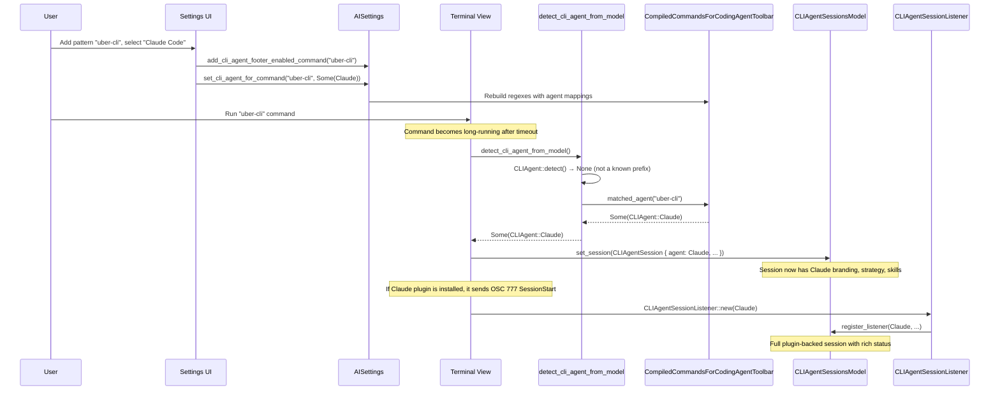

# APP-4060: Tech Spec

## Problem

Custom toolbar command patterns always produce `CLIAgent::Unknown` sessions. The detection path (`detect_cli_agent_from_model` → `command_matches_cli_agent_footer_settings` → `CompiledCommandsForCodingAgentToolbar::matches_command`) returns a `bool` with no way to carry an agent assignment. This means plugin listeners, rich input strategy, skills, and branding are all lost for custom commands.

## Relevant code

- `app/src/settings/ai.rs (1168-1178)` — `CLIAgentToolbarEnabledCommands` setting (`Vec<String>`)
- `app/src/settings/ai.rs (1776-1822)` — `CompiledCommandsForCodingAgentToolbar` singleton (compiled regexes, `matches_command`)
- `app/src/settings/ai.rs (1698-1734)` — `add_cli_agent_footer_enabled_command` / `remove_cli_agent_footer_enabled_command`
- `app/src/terminal/view/use_agent_footer/mod.rs (328-362)` — `detect_cli_agent_from_model` and `command_matches_cli_agent_footer_settings`
- `app/src/terminal/view.rs (10027-10073)` — long-running command timer that creates `CLIAgentSession` and optionally registers plugin listener
- `app/src/terminal/cli_agent.rs (272-305)` — `CLIAgent::detect` (alias resolution, `aifx` special case)
- `app/src/terminal/cli_agent_sessions/mod.rs (104-127)` — `CLIAgentSession` struct (stores `agent: CLIAgent`)
- `app/src/terminal/cli_agent_sessions/listener/mod.rs (41-61)` — `is_agent_supported` / `create_handler` (determines plugin listener eligibility)
- `app/src/terminal/cli_agent_sessions/plugin_manager/mod.rs (146-189)` — `plugin_manager_for` (install/update chip eligibility)
- `app/src/settings_view/ai_page.rs (5086-5093)` — `CLIAgentWidget` struct
- `app/src/settings_view/ai_page.rs (5232-5270)` — command list rendering via `render_input_list`
- `app/src/settings_view/ai_page.rs (360-413)` — `AISettingsPageView` struct fields
- `app/src/settings_view/ai_page.rs (1870-1936)` — `AISettingsPageAction` enum
- `app/src/settings_view/ai_page.rs (2310-2314)` — `RemoveCLIAgentToolbarEnabledCommand` handler
- `app/src/settings_view/settings_page.rs (1000-1053)` — `InputListItem` / `render_input_list`
- `app/src/view_components/dropdown.rs (66-97)` — `Dropdown` / `DropdownItem`
- `app/src/menu.rs (389-714)` — `MenuItemFields` (supports `with_icon`)

## Current state

### Detection flow

When a command becomes long-running (after `LONG_RUNNING_COMMAND_DURATION_MS`), the timer in `view.rs:10019` fires:

1. `detect_cli_agent_from_model` (`use_agent_footer/mod.rs:328`) is called.
2. It first tries `CLIAgent::detect` which checks the resolved command against known `command_prefix()` values and the `aifx agent run claude` special case.
3. If `CLIAgent::detect` returns `None`, it falls back to `command_matches_cli_agent_footer_settings` which calls `CompiledCommandsForCodingAgentToolbar::matches_command` — a `bool`-returning method.
4. If the fallback matches, `CLIAgent::Unknown` is returned unconditionally (`mod.rs:357`).

### Session creation

The detected `CLIAgent` is passed to `CLIAgentSessionsModel::set_session` (`view.rs:10042`), which stores it on `CLIAgentSession.agent`. Every downstream consumer reads the agent from this session:

- Toolbar rendering uses `session.agent` for icon/branding.
- `rich_input_submit_strategy(session.agent)` selects the PTY write strategy.
- `session.agent.supported_skill_providers()` filters the slash menu.
- `is_agent_supported(&agent)` / `plugin_manager_for(agent)` gate the plugin listener and install chip.

### Plugin listener lifecycle

For natively-detected agents, two paths can create a listener:

1. **OSC 777 sentinel**: When the plugin sends `warp://cli-agent` with a `SessionStart` event, `view.rs:10960` calls `register_listener`. This only fires if the agent plugin is installed.
2. **Proactive registration**: For Codex specifically, `register_cli_agent_listener` is called immediately on detection (`view.rs:10069`) because Codex uses OSC 9 plain-text notifications.

Both paths check `is_agent_supported(&agent)`, which currently returns `true` only for `Claude | OpenCode | Codex`. For `CLIAgent::Unknown`, no listener is ever created.

With this change, when a custom pattern maps to e.g. `CLIAgent::Claude`, the session stores `CLIAgent::Claude`, making the entire plugin lifecycle work automatically — the OSC 777 sentinel path will register a listener when the plugin sends events, and `plugin_manager_for(CLIAgent::Claude)` will return the Claude plugin manager for the install/update chip.

### `aifx agent run claude`

`CLIAgent::detect` (`cli_agent.rs:298-304`) already detects `aifx agent run claude` as `CLIAgent::Claude` for Uber team members via the `is_aifx_agent_run_claude` helper. No changes needed — this already correctly categorises the command as Claude, and the Uber-team gate stays in place.

## Proposed changes

### 1. Migrate setting type from `Vec<String>` to `HashMap<String, String>`

Replace the existing `CLIAgentToolbarEnabledCommands` setting with a new type that carries both pattern and agent in one structure. Since users never downgrade, we only need forward migration.

Change the setting type from `Vec<String>` to `HashMap<String, String>`, keeping the same `toml_path` (`agents.third_party.cli_agent_toolbar_enabled_commands`). Keys are regex patterns, values are serialized `CLIAgent` names (e.g. `"Claude"`, `"Gemini"`). An empty string value means "Any CLI Agent" (`CLIAgent::Unknown`).

**Migration via custom `Deserialize`**: Implement `Deserialize` for the new setting's value type that handles both formats:
- Old format `["pattern1", "pattern2"]` → `{"pattern1": "", "pattern2": ""}`
- New format `{"pattern1": "Claude", "pattern2": ""}` → used directly

This is achieved with a `#[serde(untagged)]` helper enum:

```rust
#[derive(Deserialize)]
#[serde(untagged)]
enum CommandMapOrVec {
    Map(HashMap<String, String>),
    Vec(Vec<String>),
}
```

Then a `Deserialize` impl for the wrapper type that tries `Map` first, falls back to `Vec`, converting each string to a key with empty value.

**File**: `app/src/settings/ai.rs`

Update helper methods:
- `add_cli_agent_footer_enabled_command(&mut self, command, ctx)`: Inserts key with empty-string value.
- `remove_cli_agent_footer_enabled_command(&mut self, command, ctx)`: Removes the key (also removes agent mapping).
- `set_cli_agent_for_command(&mut self, pattern, agent: Option<CLIAgent>, ctx)`: Updates the value for an existing key. `None` sets empty string, `Some(agent)` sets `agent.to_serialized_name()`.

### 2. Update `CompiledCommandsForCodingAgentToolbar`

Replace the `Vec<Regex>` with `Vec<(Regex, CLIAgent)>` compiled from the HashMap:

```rust
struct CompiledCommandsForCodingAgentToolbar {
    regexes: Vec<(Regex, CLIAgent)>,
}
```

Each entry is built by iterating the HashMap, compiling the key as a regex, and resolving the value to a `CLIAgent` via `CLIAgent::from_serialized_name` (empty string → `CLIAgent::Unknown`).

Delete `matches_command` (the only caller is `command_matches_cli_agent_footer_settings`) and replace with:

```rust
pub fn matched_agent(app: &AppContext, command: &str) -> Option<CLIAgent> {
    Self::as_ref(app)
        .regexes
        .iter()
        .find(|(regex, _)| regex.is_match(command))
        .map(|(_, agent)| *agent)
}
```

Subscribe to the setting's change event to rebuild compiled regexes (same as today, but now the single HashMap setting emits one event for any change).

**File**: `app/src/settings/ai.rs`

### 3. Update detection to propagate the matched agent

In `app/src/terminal/view/use_agent_footer/mod.rs`:

Rename `command_matches_cli_agent_footer_settings` → `detect_cli_agent_from_toolbar_settings` and change its return type:

```rust
fn detect_cli_agent_from_toolbar_settings(command: &str, app: &AppContext) -> Option<CLIAgent> {
    CompiledCommandsForCodingAgentToolbar::matched_agent(app, command)
}
```

Update `detect_cli_agent_from_model` (`mod.rs:353-357`):

```rust
// Before:
Self::command_matches_cli_agent_footer_settings(&command, ctx).then_some(CLIAgent::Unknown)

// After:
Self::detect_cli_agent_from_toolbar_settings(&command, ctx)
```

### 4. Plugin listener registration for custom agent patterns

No changes needed. The session is created with whatever `CLIAgent` is returned by `detect_cli_agent_from_model`. Once that returns a concrete agent (e.g. `CLIAgent::Claude`), the existing code automatically:

- Stores it on `CLIAgentSession.agent`.
- The OSC 777 sentinel path (`view.rs:10960`) registers a listener when the plugin sends events, because `is_agent_supported(&CLIAgent::Claude)` returns `true`.
- `plugin_manager_for(CLIAgent::Claude)` returns the Claude plugin manager, so the install/update chip appears.
- Codex proactive registration (`view.rs:10069`) already checks `cli_agent == Some(CLIAgent::Codex)`, which works for custom patterns assigned to Codex.

### 5. Settings UI: per-command agent dropdown

#### New action

Add to `AISettingsPageAction`:

```rust
SetCLIAgentForCommand { pattern: String, agent: Option<CLIAgent> }
```

`None` means "CLI Agent" (set empty string in HashMap). `Some(agent)` sets the serialized name.

#### New view state

Add to `AISettingsPageView`:

```rust
cli_agent_footer_command_dropdowns: Vec<ViewHandle<Dropdown<AISettingsPageAction>>>,
```

Created in `new()` and rebuilt whenever the setting changes (in the existing subscription handler that already rebuilds `cli_agent_footer_command_mouse_state_handles`).

Each dropdown uses the standard `Dropdown` component, configured with:
- `set_top_bar_max_width(160.)` for a compact appearance.
- `set_menu_width(180.)` to fit icon + name.
- `set_main_axis_size(MainAxisSize::Min)` to wrap to content width.

Menu items are built from `enum_iterator::all::<CLIAgent>()`:

```rust
// First item: "CLI Agent" (no icon)
MenuItemFields::new("CLI Agent")
    .with_on_select_action(DropdownAction::SelectActionAndClose(
        AISettingsPageAction::SetCLIAgentForCommand { pattern, agent: None }
    ))
    .into_item(),

// Then each known agent (skip Unknown):
MenuItemFields::new(agent.display_name())
    .with_icon(agent.icon().unwrap())
    .with_on_select_action(DropdownAction::SelectActionAndClose(
        AISettingsPageAction::SetCLIAgentForCommand { pattern, agent: Some(agent) }
    ))
    .into_item(),
```

#### Rendering

Replace the `render_input_list` call in `CLIAgentWidget::render` with custom rendering that interleaves dropdowns. Each row becomes:

```
Flex::row()
  [Shrinkable: command text (monospace)]
  [ChildView: dropdown]
  [close button]
```

The dropdown's initial selection is set based on the current HashMap value for that pattern.

#### Action handler

In `handle_action` for `SetCLIAgentForCommand`:

```rust
AISettingsPageAction::SetCLIAgentForCommand { pattern, agent } => {
    AISettings::handle(ctx).update(ctx, |settings, ctx| {
        settings.set_cli_agent_for_command(&pattern, agent, ctx);
    });
}
```

**File**: `app/src/settings_view/ai_page.rs`

## End-to-end flow



## Risks and mitigations

1. **Setting migration**: Custom `Deserialize` must handle both old `Vec<String>` and new `HashMap<String, String>` formats. A malformed TOML value that is neither an array of strings nor a map would fall back to the default (empty HashMap). This matches the existing behavior for corrupt settings.

2. **HashMap iteration order**: `HashMap` does not guarantee iteration order, so the display order of commands in the settings UI may differ from insertion order. This is acceptable — the items are displayed in a flat list with no meaningful ordering. If deterministic order is needed later, we can switch to `BTreeMap`.

3. **Orphaned entries impossible**: Because pattern and agent live in the same HashMap entry, removing a pattern always removes its agent assignment. No cleanup logic needed.

## Testing and validation

1. **Unit tests for `matched_agent`**: Test that a pattern with an agent mapping returns the correct `CLIAgent`, and that a pattern with an empty value returns `CLIAgent::Unknown`.

2. **Deserialization migration test**: Verify that the old `["pattern1", "pattern2"]` JSON format deserializes correctly into the new HashMap with empty-string values.

3. **Integration / manual test**: Add a custom pattern, assign to Claude, run a matching command, verify:
   - Toolbar shows Claude icon.
   - Plugin install chip appears.
   - Rich input uses Claude's submit strategy.

4. **Persistence test**: Restart Warp and verify the dropdown reflects the saved selection.

5. **Backward compatibility test**: Existing patterns (migrated with empty agent value) continue to produce `CLIAgent::Unknown` sessions.

