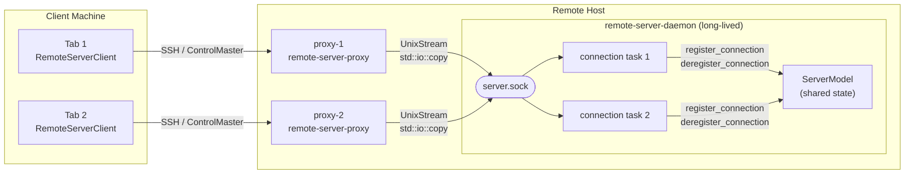
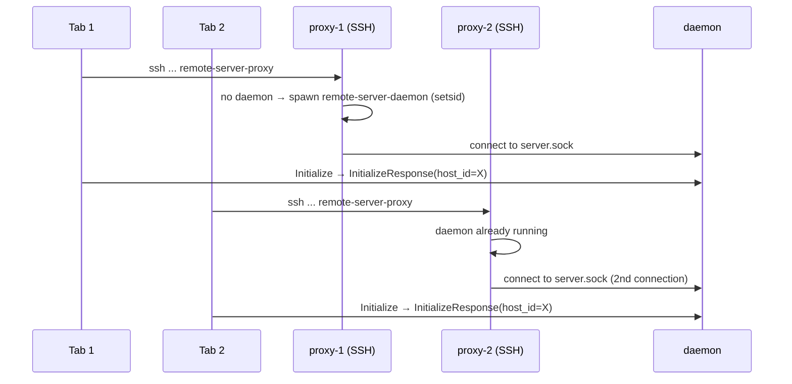

# TECH.md — Long-Running SSH Remote Server (APP-4068)

## Problem

The current `remote-server` process runs directly over SSH stdio. When the SSH
connection drops, the server process dies with it — losing all state. Two tabs
SSH-ing to the same host each spin up a separate server process.

## Requirements

1. **Survival**: the server must survive SSH disconnections and remain available for
   reconnect for up to 10 minutes.
2. **Multiplexing**: multiple Warp tabs SSH-ing to the same host must share a single
   underlying server process.
3. **Reconnect**: when an SSH connection drops, the client must automatically detect
   this and reconnect to the existing server.
4. **Session isolation**: each tab's requests and responses must stay within its own
   connection — responses must not leak to other tabs.

## Relevant Code

- `crates/warp_cli/src/lib.rs` — `WorkerCommand::RemoteServerProxy` / `RemoteServerDaemon`
- `app/src/remote_server/mod.rs` — platform dispatch (`run_proxy`, `run_daemon`)
- `app/src/remote_server/unix/` — Unix-specific daemon and proxy implementation
- `app/src/remote_server/server_model.rs` — platform-agnostic `ServerModel`
- `app/src/remote_server/ssh_transport.rs` — `SshTransport` implements `RemoteTransport`
- `crates/remote_server/src/transport.rs` — `RemoteTransport` trait
- `crates/remote_server/src/manager.rs` — session lifecycle, host deduplication
## Current State

`manager.rs` runs `ssh ... {binary} remote-server` and wires `RemoteServerClient`
directly to the child's stdio. The server process lives and dies with the SSH
connection. There is no grace period and no sharing across tabs.

## Solution

Split the binary into two subcommands:

- **`remote-server-proxy`**: a thin process launched over SSH. Checks if the daemon
  is running (PID file + `kill -0`), starts one if not, then bridges its own
  stdin/stdout to the daemon's Unix domain socket using `std::io::copy`.
- **`remote-server-daemon`**: a long-lived process on the remote host that accepts
  multiple concurrent proxy connections and exits after a 10-minute grace period
  with no connections.

A Unix domain socket (`.sock`) is a local IPC channel provided by the OS kernel —
fast, no network involved, and only accessible on the same machine. The proxy
connects to `~/.warp[-channel]/remote-server/server.sock`.

### Architecture



### How this meets each requirement

**Requirement 1 — Survival**: the proxy spawns the daemon with `setsid()` (via
`Command::pre_exec`) so it is in a new Unix session, detached from SSH's process
group. When SSH exits and sends SIGHUP to its session, the daemon is unaffected.
A 10-minute grace timer starts when the last connection leaves.

**Requirement 2 — Multiplexing**: the daemon accepts multiple concurrent proxy
connections, one per SSH session. `ServerModel` is platform-agnostic and tracks
all connections in a `HashMap<ConnectionId, Sender<ServerMessage>>`. The
`initialize()` handshake returns the same `host_id` to all tabs.

**Requirement 3 — Reconnect**: deferred to a follow-up. See Follow-ups below.

**Requirement 4 — Session isolation**: each accepted connection runs in its own
task on WarpUI's background executor with a dedicated `async_channel` sender.
`ServerModel.send_server_message` routes responses to the matching sender by
`ConnectionId`; no response can reach a different connection's channel.

## Implementation Details

### Proxy mode (`remote-server-proxy`)

`WorkerCommand::RemoteServerProxy` in `warp_cli/src/lib.rs` dispatches to
`unix::run_proxy()`.

1. Acquires an exclusive advisory `flock` on `server.pid` to serialise concurrent
   starts — if two tabs SSH in simultaneously, only one spawns the daemon.
2. Reads `server.pid` and checks `kill(pid, 0)`. If no daemon is running, spawns
   `{binary} remote-server-daemon` via `Command::pre_exec(|| { setsid(); Ok(()) })`
   with null stdio — this creates a new Unix session so the daemon is detached from
   SSH's process group and survives when SSH exits.
3. Polls for `server.sock` to appear (20 ms intervals, 10 s timeout).
4. Connects via `UnixStream` and bridges stdin/stdout with two `std::io::copy`
   threads — one per direction. The proxy is protocol-agnostic and forwards raw
   bytes; framing is handled at the endpoints.

### Daemon mode (`remote-server-daemon`)

`WorkerCommand::RemoteServerDaemon` dispatches to `unix::run_daemon()`.

The accept loop lives in the `run_daemon_app` closure (in `unix/mod.rs`), which
has access to WarpUI's `ModelContext`. It binds an `async_io::Async<UnixListener>`,
then for each accepted connection spawns a task on the WarpUI background executor
that runs a `futures::select!` loop over two channels:

- **Inbound**: reads `ClientMessage`s from the socket and dispatches them to
  `ServerModel` via `ModelSpawner`
- **Outbound**: drains the per-connection `async_channel` that `ServerModel`
  writes to when it produces a response or push notification

`ServerModel` is entirely platform-agnostic — it only sees
`register_connection(id, sender)` and `deregister_connection(id)` calls. All
socket types stay in `unix/mod.rs`.

**Session isolation**: `ServerModel.send_server_message` looks up the connection's
`Sender<ServerMessage>` in a `HashMap<ConnectionId, Sender>` and sends only to
that entry. There is no broadcast; push messages (e.g. repo metadata updates) are
sent to every entry in the map individually.

**Grace timer**: started (or restarted) in `deregister_connection` whenever the connection
map becomes empty. Implemented with `ctx.spawn_abortable(Timer::after(GRACE_PERIOD), ...)`;
the returned `SpawnedFutureHandle` is stored in `ServerModel.grace_timer_cancel`. When the
timer fires it calls `ctx.terminate_app` to exit the process. `register_connection` aborts
the handle when a new connection arrives, cancelling the shutdown. The race between expiry
and a new connection is not an issue: both `register_connection` and `deregister_connection`
are dispatched through `ModelSpawner` onto the single-threaded WarpUI main loop, so they
cannot interleave.

### Transport abstraction

`RemoteServerManager` is transport-agnostic. The `RemoteTransport` trait in
`crates/remote_server/src/transport.rs` has two methods:

- `setup(session_id, spawner)` — check/install the binary, emit progress events
- `connect(executor)` — launch `remote-server-proxy` over SSH, return the live
  `RemoteServerClient` and event channel

`connect_session` takes `Arc<dyn RemoteTransport>`. `SshTransport` in
`app/src/remote_server/ssh_transport.rs` implements both methods using the
ControlMaster socket.

## End-to-End Flow

### Two tabs connecting to the same host



### SSH drop

```mermaid
sequenceDiagram
    participant T1 as Tab 1
    participant P1 as proxy-1
    participant D  as daemon
    participant T2 as Tab 2

    Note over P1,D: Network drops — proxy-1 exits
    P1->>T1: EOF
    Note over D: still running; one connection remains
    Note over T2,D: Tab 2 unaffected throughout
```

## Risks and Mitigations

- **Two proxies start simultaneously**: `flock` on the PID file ensures only one
  spawns the daemon; the second waits, then connects to the already-running daemon.
- **Stale PID file**: `kill(pid, 0)` detects the stale entry; proxy starts fresh.
- **Leftover socket from crashed daemon**: proxy removes `server.sock` before
  spawning if the PID check shows no running process.

## Follow-ups

- Client-side reconnect loop (re-run proxy, re-attach to daemon on disconnect).
- Detect `server_version` mismatch in `InitializeResponse` and force-restart daemon.
- Windows support (ControlMaster not supported on Windows OpenSSH; named pipes alternative).
- Telemetry: daemon start, reconnect attempts, grace period expiry.
