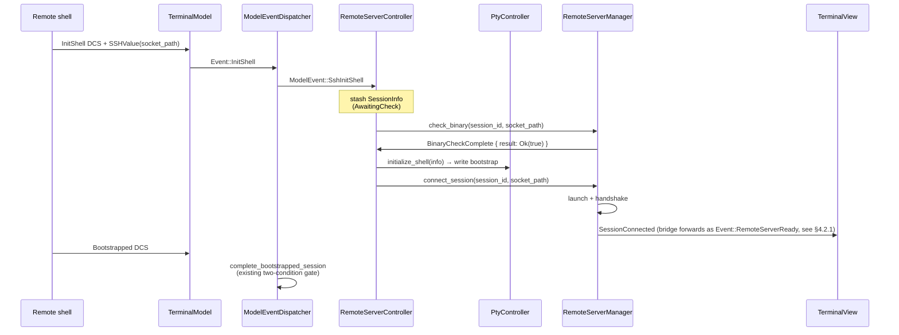
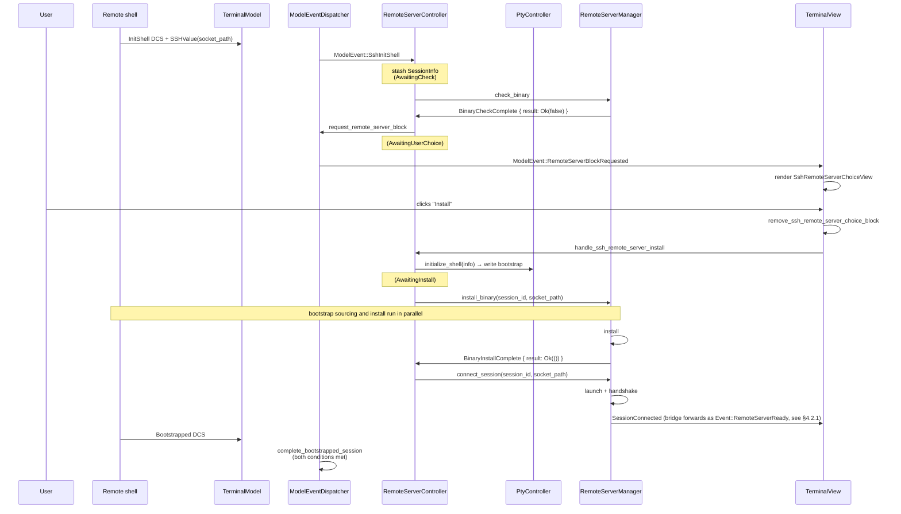
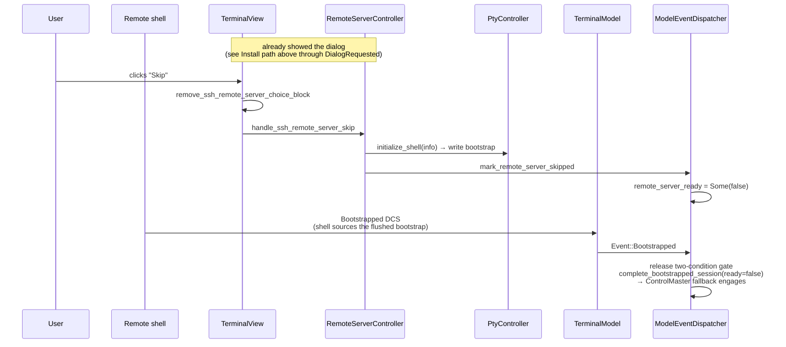
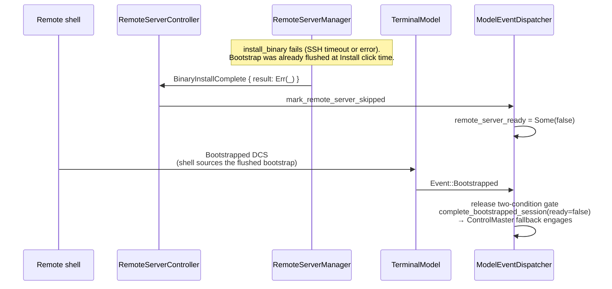

# APP-4069 — SSH Initialization UX
Linear: [APP-4069 — Initialization UX](https://linear.app/warpdotdev/issue/APP-4069/initialization-ux)
## 1. Problem
When a user SSHes into a remote host, we want to introduce a choice block for users to choose between (1) installing and connecting to the remote server (2) falling back to the existing warpify behaviour.

To do so, we'll need to block the current bootstrap and connect server flow. Today, the client has a race where: `PtyController` writes the legacy bootstrap script to the PTY synchronously on `InitShell`, while `TerminalView` in parallel kicks off an async background task in `RemoteServerManager` that checks for the remote-server binary, installs it if missing, and initializes the server. Because the bootstrap is written before the check completes, we cannot defer or cancel warpification based on the check result — by the time we know whether the remote server is available, the legacy warpification has already taken effect.
This spec resolves the race by deferring the bootstrap write under the control of the remote-server setup outcome, and introduces a **two-option choice block** that appears only when the binary is missing:
- **Yes, install** — flush the bootstrap, install the binary on the remote, launch + handshake the remote server. Session is fully warpified via the remote-server path.
- **No, skip** — flush the stashed bootstrap (so the shell is properly initialized) but do not call `connect_session`. The session falls back to ControlMaster warpification without engaging the remote-server path.

This spec covers the following two sections:
- **Part 1 — Blocking and wiring.** A new per-pane `RemoteServerController` owns the state machine that defers the bootstrap, checks the binary via `RemoteServerManager`, and flushes at the right moment.
- **Part 2 — Rendering.** How `RemoteServerController` signals `TerminalView` via `ModelEventDispatcher` to render the two-option dialog, and how the view forwards the user's decision back.

## 2. Relevant code
- `crates/remote_server/src/manager.rs:168–284` — `RemoteServerManager::connect_session` orchestrates check → install → launch → handshake as a single background task.
- `crates/remote_server/src/manager.rs:599–667` — `ensure_binary_installed` free function; where we split the check phase from the install phase.
- `app/src/terminal/writeable_pty/pty_controller.rs:122–210` — `PtyController::new` constructor and subscription to `ModelEventDispatcher`, where `InitShell` is handled today.
- `app/src/terminal/writeable_pty/pty_controller.rs:393–509` — `initialize_shell` + `write_bootstrap_script_to_shell`; the target of the deferred write.
- `app/src/terminal/view.rs:10813–10836` — current view-level `InitShell` handler that calls `RemoteServerManager::connect_session`. This entire block gets deleted.
- `app/src/terminal/view.rs:4128–4160` — current bridge that forwards `RemoteServerManagerEvent::SetupReady` / `SessionConnectionFailed` into the terminal event stream. Per §4.2.1, the `SetupReady` arm is replaced with a `SessionConnected` arm; `SetupFailed` arm is renamed to `SessionConnectionFailed`, and the `SetupStateChanged` arm is unchanged.
- `app/src/terminal/model_events.rs:41–55, 433–562` — `ModelEventDispatcher` struct and `ModelEvent` enum, where new variants and methods for dialog signaling are added.
- `app/src/terminal/model_events.rs:93–104` — emission site where `HandlerEvent::InitShell` is converted into a `ModelEvent`; the single place where the SSH-vs-regular branch is introduced (§4.1.1).
- `app/src/terminal/model_events.rs:105–160, 340–369` — existing Bootstrapped ↔ RemoteServerReady stash-and-wait gate; unchanged.
- `app/src/terminal/writeable_pty/terminal_manager_util.rs:120` — `init_pty_controller_model` where both `PtyController` and the new `RemoteServerController` are constructed side-by-side.
- `app/src/terminal/model/session.rs:511–514` — `IsLegacySSHSession` enum used to distinguish sessions we can engage.
- `crates/warp_features/src/lib.rs:806` — `FeatureFlag::SshRemoteServer`.
- `app/src/ai/blocklist/inline_action/ask_user_question_view.rs` — existing block-based dialog we draw visual inspiration from; `HeaderConfig` + `NumberShortcutButtons` are the reusable primitives.
## 3. Current state
Two subscribers react synchronously to `ModelEvent::Handler(AnsiHandlerEvent::InitShell)`:
- `PtyController` (in `pty_controller.rs:126–129`) calls `initialize_shell`, which unconditionally writes the bootstrap script to the PTY via `write_bootstrap_script_to_shell`.
- `TerminalView` (in `view.rs:10813–10836`) spawns `RemoteServerManager::connect_session`, which runs check + install + launch + handshake in a single background task.
Because both subscribers fire on the same tick but the view's work is async, the bootstrap is already written by the time the check result is known. This is the core race.
`RemoteServerManager::connect_session` today is monolithic: it emits `SetupStateChanged(Checking)` → runs the check → on "not installed" emits `SetupStateChanged(Installing)` and runs the install → on success emits `SetupReady` and proceeds to launch + handshake. There is no way to observe the binary-presence result without also triggering the install.
`ModelEventDispatcher` already has a stash-and-wait gate that waits for both `Bootstrapped` (from the remote shell sourcing the bootstrap script) and `RemoteServerReady` (forwarded today from `RemoteServerManager::SetupReady`) before calling `complete_bootstrapped_session`. The gate logic itself is unchanged, but its success-signal source moves: today `SetupReady` fires after the install decision but before `start_remote_server` and `client.initialize()` have run, so it is optimistic — launch or handshake can still fail after the gate has already resolved with `ready=true` (because `Bootstrapped` typically arrives while the handshake is still in flight), at which point the session has been committed to the warpified path against a manager that has no connected client. §4.2.1 sources the gate's success signal from `SessionConnected` (emitted only after handshake succeeds at `manager.rs:535`) to fix this.
## 4. Proposed changes
### Part 1: Blocking and wiring
#### 4.1 `RemoteServerController` — per-pane orchestrator
A new per-pane `Entity` model, `RemoteServerController`, owns the block-and-bootstrap state machine. `PtyController` stays a byte writer: it exposes `initialize_shell` as `pub(crate)` so the controller can flush the deferred bootstrap. `TerminalView` no longer initiates anything — it only renders the dialog (Part 2) and forwards clicks to the controller.
**Construction.** Constructed alongside `PtyController` in `init_pty_controller_model` (`app/src/terminal/writeable_pty/terminal_manager_util.rs:120`). Generic over `T: EventLoopSender` so it can hold `WeakModelHandle<PtyController<T>>`. Dropped with the PTY (no special `Drop` behaviour — by the time the controller is dropped, the PTY is gone, so there is nothing to initialize).
**Fields.**
```rust
/// Per-SSH-init state machine. Encoding the state as an enum makes invalid
/// transitions unrepresentable and ensures the `SessionInfo` stash cannot be
/// accessed after it has been consumed.
enum SshInitState {
    Idle,
    /// Stash held, `check_binary` in flight.
    AwaitingCheck { session_info: SessionInfo },
    /// Stash held, dialog showing.
    AwaitingUserChoice { session_info: SessionInfo },
    /// Stash already flushed at Install-click time, `install_binary` in flight.
    /// `session_id` and `socket_path` retained for event-matching and connect.
    AwaitingInstall { session_id: SessionId, socket_path: PathBuf },
}

pub struct RemoteServerController<T: EventLoopSender> {
    pty_controller: WeakModelHandle<PtyController<T>>,
    model_event_dispatcher: ModelHandle<ModelEventDispatcher>,
    state: SshInitState,
}
```
**State machine.** The controller is always in exactly one of these states for a given SSH init:
- `Idle` — no stash.
- `AwaitingCheck` — stash held, `check_binary` in flight.
- `AwaitingUserChoice` — stash held, dialog showing.
- `AwaitingInstall` — stash already flushed, `install_binary` in flight. `socket_path` is stashed here for use in `connect_session` after install completes.

Transitions:
- `Idle → AwaitingCheck` on `SshInitShellRequested` — stash info, call `mgr.check_binary`.
- `AwaitingCheck → Idle` on `BinaryCheckComplete{result: Ok(true)}` — flush, call `mgr.connect_session`.
- `AwaitingCheck → AwaitingUserChoice` on `BinaryCheckComplete{result: Ok(false)}` — `request_remote_server_block`.
- `AwaitingCheck → Idle` on `BinaryCheckComplete{result: Err(_)}` — flush, `mark_remote_server_skipped` (check failed — fall back to ControlMaster rather than offering install against an unreachable host).
- `AwaitingUserChoice → AwaitingInstall` on Install click — flush, call `mgr.install_binary`.
- `AwaitingUserChoice → Idle` on Skip click — flush, `mark_remote_server_skipped`.
- `AwaitingInstall → Idle` on `BinaryInstallComplete{result: Ok(())}` — call `mgr.connect_session` (socket path read from `AwaitingInstall` state).
- `AwaitingInstall → Idle` on `BinaryInstallComplete{result: Err(_)}` — `mark_remote_server_skipped`.

**Flush contract:** 
- Every exit from `AwaitingCheck` / `AwaitingUserChoice` calls `flush_stashed_bootstrap`
- Every `AwaitingInstall` entry already flushed at click time.
- The bootstrap and remote-server setup run in parallel; the existing `ModelEventDispatcher` two-condition gate coordinates `Bootstrapped` × `RemoteServerReady` / `SessionConnectionFailed`.
- Within a single PTY, overlapping SSH `InitShell` events cannot occur: the first session's remote shell is blocked waiting for the deferred bootstrap, so no second `InitShell` DCS can arrive until the stash is consumed. A `debug_assert!` guards this invariant; as a defensive fallback in release builds, the old session's bootstrap is flushed and its dispatcher gate released via `mark_remote_server_skipped` before the new session takes over.
```rust
impl<T: EventLoopSender> RemoteServerController<T> {
    pub fn new(
        pty_controller: WeakModelHandle<PtyController<T>>,
        model_event_dispatcher: ModelHandle<ModelEventDispatcher>,
        ctx: &mut ModelContext<Self>,
    ) -> Self {
        ctx.subscribe_to_model(&model_event_dispatcher, |me, event, ctx| {
            if let ModelEvent::SshInitShell { pending_session_info } = event {
                me.on_ssh_init_shell_requested(
                    pending_session_info.as_ref().clone(), ctx,
                );
            }
        });
        let mgr = RemoteServerManager::handle(ctx);
        ctx.subscribe_to_model(&mgr, |me, event, ctx| match event {
            RemoteServerManagerEvent::BinaryCheckComplete { session_id, result, socket_path } =>
                me.on_binary_check_complete(*session_id, result.clone(), socket_path.clone(), ctx),
            RemoteServerManagerEvent::BinaryInstallComplete { session_id, result } =>
                me.on_binary_install_complete(*session_id, result.clone(), ctx),
            _ => {}
        });
        Self {
            pty_controller, model_event_dispatcher,
            state: SshInitState::Idle,
        }
    }
}
```
**Methods**:
```rust
/// Exclusive flush primitive. Extracts the `SessionInfo` from whatever
/// stash-holding state we're in (`AwaitingCheck` or `AwaitingUserChoice`)
/// and writes the bootstrap script to the PTY.
fn flush_stashed_bootstrap(&mut self, session_info: SessionInfo, ctx: &mut ModelContext<Self>) {
    if let Some(pty) = self.pty_controller.upgrade(ctx) {
        pty.update(ctx, |pty, ctx| pty.initialize_shell(&session_info, ctx));
    } else {
        log::warn!("PtyController dropped before bootstrap could be flushed");
    }
}

// Idle -> AwaitingCheck
fn on_ssh_init_shell_requested(&mut self, info: SessionInfo, ctx: &mut ModelContext<Self>) {
    let IsLegacySSHSession::Yes { socket_path } = &info.is_legacy_ssh_session else {
        return;
    };
    let session_id = info.session_id;
    let socket_path = socket_path.clone();
    debug_assert!(matches!(self.state, SshInitState::Idle));
    // Defensive fallback: if an overlapping init arrives, flush the old
    // session's bootstrap so its shell doesn't hang and release its gate.
    match std::mem::replace(&mut self.state, SshInitState::Idle) {
        SshInitState::Idle => {}
        SshInitState::AwaitingCheck { session_info: old_info }
        | SshInitState::AwaitingUserChoice { session_info: old_info } => {
            let old_session_id = old_info.session_id;
            self.flush_stashed_bootstrap(old_info, ctx);
            self.model_event_dispatcher.update(ctx, |d, ctx| {
                d.mark_remote_server_skipped(old_session_id, ctx);
            });
        }
        SshInitState::AwaitingInstall { session_id: old_session_id, .. } => {
            // Stash already flushed at Install-click time; release the gate.
            self.model_event_dispatcher.update(ctx, |d, ctx| {
                d.mark_remote_server_skipped(old_session_id, ctx);
            });
        }
    }
    self.state = SshInitState::AwaitingCheck { session_info: info };
    RemoteServerManager::handle(ctx).update(ctx, |mgr, ctx| {
        mgr.check_binary(session_id, socket_path, ctx);
    });
}

// AwaitingCheck -> { Idle (installed / check-failed) | AwaitingUserChoice (missing) }
fn on_binary_check_complete(
    &mut self, session_id: SessionId, result: Result<bool, String>, socket_path: PathBuf,
    ctx: &mut ModelContext<Self>,
) {
    // Guard: reject events that don't match the current AwaitingCheck state.
    let SshInitState::AwaitingCheck { ref session_info } = self.state else {
        log::warn!("BinaryCheckComplete for {session_id:?} but state is not AwaitingCheck");
        return;
    };
    if session_info.session_id != session_id {
        log::warn!("BinaryCheckComplete session {session_id:?} != expected {:?}", session_info.session_id);
        return;
    }
    // Take ownership of session_info out of the state.
    let SshInitState::AwaitingCheck { session_info } = std::mem::replace(&mut self.state, SshInitState::Idle) else {
        unreachable!("just matched AwaitingCheck above");
    };
    match result {
        Ok(true) => {
            self.flush_stashed_bootstrap(session_info, ctx);
            RemoteServerManager::handle(ctx).update(ctx, |mgr, ctx| {
                mgr.connect_session(session_id, socket_path, ctx);
            });
        }
        Ok(false) => {
            self.state = SshInitState::AwaitingUserChoice { session_info };
            self.model_event_dispatcher.update(ctx, |d, ctx| {
                d.request_remote_server_block(session_id, ctx);
            });
        }
        Err(e) => {
            // Check failed — remote is unreachable or SSH is broken. Fall back
            // to ControlMaster rather than offering install against a host we
            // can't reach.
            log::warn!("Binary check failed for session {session_id:?}: {e}");
            self.flush_stashed_bootstrap(session_info, ctx);
            self.model_event_dispatcher.update(ctx, |d, ctx| {
                d.mark_remote_server_skipped(session_id, ctx);
            });
        }
    }
}

// AwaitingUserChoice -> AwaitingInstall
pub fn handle_ssh_remote_server_install(
    &mut self, session_id: SessionId, ctx: &mut ModelContext<Self>,
) {
    // Extract session_info from AwaitingUserChoice to get the socket path.
    let SshInitState::AwaitingUserChoice { ref session_info } = self.state else {
        log::warn!("Install clicked but state is not AwaitingUserChoice for {session_id:?}");
        return;
    };
    let IsLegacySSHSession::Yes { socket_path } = &session_info.is_legacy_ssh_session else {
        return;
    };
    let socket_path = socket_path.clone();
    let SshInitState::AwaitingUserChoice { session_info } = std::mem::replace(&mut self.state, SshInitState::AwaitingInstall { session_id, socket_path: socket_path.clone() }) else {
        unreachable!("just matched AwaitingUserChoice above");
    };
    self.flush_stashed_bootstrap(session_info, ctx);
    RemoteServerManager::handle(ctx).update(ctx, |mgr, ctx| {
        mgr.install_binary(session_id, socket_path, ctx);
    });
}

// AwaitingUserChoice -> Idle (explicit Skip)
pub fn handle_ssh_remote_server_skip(
    &mut self, session_id: SessionId, ctx: &mut ModelContext<Self>,
) {
    let SshInitState::AwaitingUserChoice { session_info } = std::mem::replace(&mut self.state, SshInitState::Idle) else {
        log::warn!("Skip clicked but state is not AwaitingUserChoice for {session_id:?}");
        return;
    };
    self.flush_stashed_bootstrap(session_info, ctx);
    self.model_event_dispatcher.update(ctx, |d, ctx| {
        d.mark_remote_server_skipped(session_id, ctx);
    });
}

// AwaitingInstall -> Idle
fn on_binary_install_complete(
    &mut self, session_id: SessionId, result: Result<(), String>,
    ctx: &mut ModelContext<Self>,
) {
    // Guard: reject stale events from a previous session's install.
    let SshInitState::AwaitingInstall { session_id: expected, .. } = &self.state else {
        log::warn!("BinaryInstallComplete for {session_id:?} but state is not AwaitingInstall");
        return;
    };
    if *expected != session_id {
        log::warn!("BinaryInstallComplete session {session_id:?} != expected {expected:?}");
        return;
    }
    let SshInitState::AwaitingInstall { socket_path, .. } =
        std::mem::replace(&mut self.state, SshInitState::Idle)
    else {
        unreachable!("just matched AwaitingInstall above");
    };
    match result {
        Ok(()) => {
            RemoteServerManager::handle(ctx).update(ctx, |mgr, ctx| {
                mgr.connect_session(session_id, socket_path, ctx);
            });
        }
        Err(e) => {
            log::warn!("Install failed for session {session_id:?}: {e}");
            self.model_event_dispatcher.update(ctx, |d, ctx| {
                d.mark_remote_server_skipped(session_id, ctx);
            });
        }
    }
}

```
The prompt view dispatches `SshRemoteServerChoiceViewAction::Install` / `::Skip` (see §4.5) which `TerminalView` forwards to the corresponding `RemoteServerController` methods (see §4.4).
**PtyController change (minimal).** `initialize_shell` is promoted to `pub(crate)`. `PtyController` gains no new fields, subscriptions, or manager knowledge. A `debug_assert!(self.bootstrap_file.is_none())` at the top of `initialize_shell` catches accidental double-calls during development.
#### 4.1.1 Event-split at the emission site
`ModelEventDispatcher::handle_terminal_model_event` (`app/src/terminal/model_events.rs:95–104`) is the single place where `Event::Handler(HandlerEvent::InitShell)` is converted into a `ModelEvent`. That branch is extended to emit a distinct variant when the session is legacy SSH and the feature flag is on:
```rust
Event::Handler(HandlerEvent::InitShell { pending_session_info }) => {
    self.sessions.update(ctx, |sessions, ctx| {
        sessions.register_pending_session(pending_session_info.as_ref(), ctx);
    });
    let is_legacy_ssh = matches!(
        pending_session_info.is_legacy_ssh_session,
        IsLegacySSHSession::Yes { .. }
    );
    if FeatureFlag::SshRemoteServer.is_enabled() && is_legacy_ssh {
        ModelEvent::SshInitShell { pending_session_info }
    } else {
        ModelEvent::Handler(AnsiHandlerEvent::InitShell { pending_session_info })
    }
}
```
A new `ModelEvent` variant:
```rust
pub enum ModelEvent {
    // ... existing variants ...
    SshInitShell { pending_session_info: Box<SessionInfo> },
}
```
Rationale: every subscriber only sees events it owns. `PtyController` keeps its synchronous `InitShell` handler and never runs for deferred SSH sessions. `RemoteServerController` subscribes only to `SshInitShell` and never races `PtyController`. Double-flush is prevented by construction — no subscription ordering dependency, no shared event. Centralizing the branch at this single emission site prevents drift: there is exactly one place to keep in sync, and any new code path that wants to emit `InitShell` is forced to go through this helper.

#### 4.2 `RemoteServerManager` — three public phases; gate on `SessionConnected`
The current `ensure_binary_installed` is split into two public entry points on `RemoteServerManager` — `check_binary` and `install_binary` — and `connect_session` drops its install responsibility entirely. Each phase emits a distinct terminal event so the caller (`RemoteServerController`) can decide independently what to do between phases and so install-phase failure can be surfaced differently from launch/handshake failure without having to infer the phase from session state.
The three phases and their terminal events:
- `check_binary(session_id, socket_path)` → emits `SetupStateChanged(Checking)`, then `BinaryCheckComplete { result: Result<bool, String> }` where `Ok(true)` = installed, `Ok(false)` = definitively not installed, `Err(_)` = check itself failed (e.g. SSH timeout/unreachable).
- `install_binary(session_id, socket_path)` → emits `SetupStateChanged(Installing)`, then `BinaryInstallComplete { result: Result<(), String> }`. Does **not** emit `SessionConnectionFailed` on install failure — install-phase failure is signaled exclusively via `BinaryInstallComplete { result: Err(_) }`, leaving `SessionConnectionFailed` scoped to launch/handshake failure.
- `connect_session(session_id, socket_path)` → emits `SessionConnecting`, then either `SessionConnected` (on handshake success) or `SessionConnectionFailed` (on launch or handshake failure). Assumes the binary is present; callers that need to install first call `install_binary` and wait for `BinaryInstallComplete { result: Ok(()) }`.
`connect_session` is also tightened so launch (`start_remote_server`) and handshake (`client.initialize()`) failures both emit `SessionConnectionFailed` instead of only calling `mark_session_disconnected`. Under the new gating scheme (§4.2.1) `SessionConnectionFailed` is the sole signal that releases the gate with `ready=false` on a launch/handshake failure, so it must fire on every terminal failure in those phases.
**New event variants** on `RemoteServerManagerEvent`:
```rust
pub enum RemoteServerManagerEvent {
    // ... existing variants ...
    /// Result of check_binary. `Ok(true)` = binary is installed and
    /// executable, `Ok(false)` = definitively not installed, `Err(_)` =
    /// the check itself failed (SSH error, timeout). Callers can
    /// distinguish "not installed" from "check failed" to avoid offering
    /// install when the remote is unreachable. The error type is `String`
    /// rather than `anyhow::Error` because the event derives `Clone` and
    /// `anyhow::Error` is not `Clone`.
    /// Carries `socket_path` because `flush_stashed_bootstrap` consumes the
    /// `SessionInfo` stash (via `take()`), so the controller can no longer
    /// extract the path from the stash by the time it needs to call
    /// `connect_session`. The event is the only source of the path after flush.
    BinaryCheckComplete {
        session_id: SessionId,
        result: Result<bool, String>,
        socket_path: PathBuf,
    },
    /// Result of install_binary. `Ok(())` = install succeeded; `Err(_)`
    /// carries the failure reason (SSH error, timeout, script error).
    /// Scoped to the install phase only so callers can render a
    /// phase-specific error without inferring from session state.
    /// Does not carry `socket_path` — the controller stashes it in
    /// `AwaitingInstall` at Install-click time and reads it back on
    /// completion, avoiding a round-trip through the event.
    BinaryInstallComplete {
        session_id: SessionId,
        result: Result<(), String>,
    },
}
```
**Public methods**:
```rust
impl RemoteServerManager {
    /// Pure check. Emits SetupStateChanged(Checking) then BinaryCheckComplete.
    /// Does NOT mutate self.sessions — safe to call concurrently with other
    /// session-state transitions (including `deregister_session`). A
    /// `BinaryCheckComplete` that arrives for an already-torn-down session is
    /// a no-op downstream because `RemoteServerController::on_binary_check_complete`
    /// guards on the state being `AwaitingCheck` with a matching session ID.
    ///
    /// On SSH timeout or error, `run_ssh_command` returns `Err` and the
    /// normal code path emits `BinaryCheckComplete { result: Err(_) }`,
    /// so `AwaitingCheck` is time-bounded by `CHECK_TIMEOUT`.
    pub fn check_binary(
        &self,
        session_id: SessionId,
        socket_path: PathBuf,
        ctx: &mut ModelContext<Self>,
    ) {
        ctx.emit(RemoteServerManagerEvent::SetupStateChanged {
            session_id,
            state: RemoteServerSetupState::Checking,
        });
        let spawner = self.spawner.clone();
        ctx.background_executor().spawn(async move {
            let result = match run_ssh_command(&socket_path, &binary_check_command(), CHECK_TIMEOUT).await {
                Ok(output) => match output.status.code() {
                    Some(0) => Ok(true),
                    Some(1) => Ok(false),
                    Some(code) => {
                        let stderr = String::from_utf8_lossy(&output.stderr);
                        Err(format!("binary check exited with code {code}: {stderr}"))
                    }
                    None => Err("binary check terminated by signal".into()),
                },
                Err(e) => Err(e.to_string()),
            };
            let _ = spawner.spawn(move |_, ctx| {
                ctx.emit(RemoteServerManagerEvent::BinaryCheckComplete {
                    session_id, result, socket_path,
                });
            }).await;
        }).detach();
    }
    /// Pure install. Emits SetupStateChanged(Installing) then
    /// BinaryInstallComplete. Does NOT mutate self.sessions — install is a
    /// side-effect on the remote host, decoupled from the session's
    /// connection lifecycle. Does NOT emit SessionConnectionFailed; install failure is
    /// signaled exclusively via BinaryInstallComplete { result: Err(_) },
    /// leaving SessionConnectionFailed scoped to launch/handshake failure.
    ///
    /// On SSH timeout or error, `run_ssh_script` returns `Err` and the
    /// normal code path emits `BinaryInstallComplete { result: Err(_) }`,
    /// so `AwaitingInstall` is time-bounded by `INSTALL_TIMEOUT`.
    pub fn install_binary(
        &self,
        session_id: SessionId,
        socket_path: PathBuf,
        ctx: &mut ModelContext<Self>,
    ) {
        ctx.emit(RemoteServerManagerEvent::SetupStateChanged {
            session_id,
            state: RemoteServerSetupState::Installing { progress_percent: None },
        });
        let spawner = self.spawner.clone();
        ctx.background_executor().spawn(async move {
            let result = match run_ssh_script(&socket_path, &install_script(), INSTALL_TIMEOUT).await {
                Ok(output) if output.status.success() => Ok(()),
                Ok(output) => {
                    let code = output.status.code().unwrap_or(-1);
                    let stderr = String::from_utf8_lossy(&output.stderr);
                    Err(format!("install script failed (exit {code}): {stderr}"))
                }
                Err(e) => Err(e.to_string()),
            };
            let _ = spawner.spawn(move |_, ctx| {
                ctx.emit(RemoteServerManagerEvent::BinaryInstallComplete {
                    session_id, result,
                });
            }).await;
        }).detach();
    }
    /// Launch + handshake only. Assumes the binary is already present on
    /// the remote host; callers that need to install first should call
    /// `install_binary` and wait for `BinaryInstallComplete { result: Ok(()) }`
    /// before calling this. Emits SessionConnecting, then either
    /// SessionConnected (on handshake success) or SessionConnectionFailed (on launch or
    /// handshake failure).
    pub fn connect_session(
        &mut self,
        session_id: SessionId,
        socket_path: PathBuf,
        ctx: &mut ModelContext<Self>,
    ) {
        self.sessions.insert(session_id, RemoteSessionState::Connecting);
        ctx.emit(RemoteServerManagerEvent::SessionConnecting { session_id });
        let spawner = self.spawner.clone();
        ctx.background_executor().spawn(async move {
            // Launch + handshake tail. Any failure here emits SessionConnectionFailed
            // so the gate can release, not just mark_session_disconnected.
            match start_remote_server(&socket_path).await {
                Ok((stdin, stdout, stderr)) => {
                    // create RemoteServerClient, initialize handshake.
                    // On handshake Err: emit SessionConnectionFailed + mark_session_disconnected.
                }
                Err(_) => {
                    let _ = spawner.spawn(move |me, ctx| {
                        ctx.emit(RemoteServerManagerEvent::SessionConnectionFailed { session_id });
                        me.mark_session_disconnected(session_id, ctx);
                    }).await;
                }
            }
        }).detach();
    }
}
```

#### 4.2.1 Gate release signal: `SessionConnected` instead of `SetupReady`
As described in §3, `SetupReady` is optimistic — it fires before launch/handshake. We fix this by sourcing the gate's success signal from `SessionConnected` instead (`mark_session_connected` at `manager.rs:535`), which fires only after `client.initialize()` succeeds. By that point the `RemoteServerClient` is wired up and `client_for_session(session_id)` returns `Some`.
Bridge change in `view.rs:4129–4161`: replace the `SetupReady` arm with a `SessionConnected` arm forwarded as `Event::RemoteServerReady`. The `SetupFailed` arm is renamed to `SessionConnectionFailed`, and the `SetupStateChanged` arm is unchanged.
```rust
// Before:
RemoteServerManagerEvent::SetupReady { session_id } => {
    me.model.lock().event_proxy.send_terminal_event(
        Event::RemoteServerReady { session_id: *session_id },
    );
}
// After:
RemoteServerManagerEvent::SessionConnected { session_id, host_id: _ } => {
    me.model.lock().event_proxy.send_terminal_event(
        Event::RemoteServerReady { session_id: *session_id },
    );
}
```
`SessionConnected` and `SessionConnectionFailed` are mutually exclusive per session. The specific emission branches are disjoint:
- `SessionConnected` ← `mark_session_connected`, which runs only on the `Ok(client.initialize())` branch in `connect_session`.
- `SessionConnectionFailed` ← `start_remote_server` Err branch / handshake Err branch. Install failure is not in this set — it emits `BinaryInstallComplete { result: Err(_) }` instead, which `RemoteServerController` routes through `mark_remote_server_skipped` to release the gate with `ready=false`. (`deregister_session` is currently dead code with no callers; if it gains callers in the future, it should also emit `SessionConnectionFailed` for sessions in `Connecting`/`Initializing` state to prevent the gate from hanging.)
### Part 2: Rendering
#### 4.3 `ModelEventDispatcher` — dialog signaling primitives
Only "show" crosses the model→view boundary. Dismissal is owned by `TerminalView` (on click or `SessionDeregistered`).
**New `ModelEvent` variant**:
```rust
pub enum ModelEvent {
    // ... existing variants ...
    RemoteServerBlockRequested { session_id: SessionId },
}
```
**New public methods** on `ModelEventDispatcher`:
```rust
impl ModelEventDispatcher {
    pub fn request_remote_server_block(
        &mut self, session_id: SessionId, ctx: &mut ModelContext<Self>,
    ) { ctx.emit(ModelEvent::RemoteServerBlockRequested { session_id }); }
    /// Resolves the remote-server condition as failed for Skip, so the
    /// two-condition gate can release and ControlMaster fallback engages.
    pub fn mark_remote_server_skipped(
        &mut self, session_id: SessionId, ctx: &mut ModelContext<Self>,
    ) { self.handle_remote_server_setup_result(session_id, false, ctx); }
}
```

#### 4.4 `TerminalView` — dialog render + choice forwarding
Delete the `RemoteServerManager::connect_session` call in the `InitShell` handler (`view.rs:10816–10836`). The view no longer initiates the check; that responsibility has moved to `RemoteServerController`.
Add one match arm for the new `ModelEvent` variant that shows the `SshRemoteServerChoiceView` block (see §4.5). Dismissal is handled inline by the click handlers below, not via a match arm:
```rust
ModelEvent::RemoteServerBlockRequested { session_id } => {
    self.show_ssh_remote_server_choice_block(session_id, ctx);
}
```
New view methods:
- `show_ssh_remote_server_choice_block(session_id, ctx)` — creates a new inline block containing the `SshRemoteServerChoiceView` and tracks its handle by `SessionId`.
- `remove_ssh_remote_server_choice_block(session_id, ctx)` — removes the inline block.
`TerminalView` gains a handle to `RemoteServerController` (constructed alongside `PtyController` per §4.1) and subscribes to the prompt view's typed actions. Each handler removes the prompt view's block directly (dialog dismissal is a view-only concern) and then forwards to the corresponding `RemoteServerController` method:
```rust
fn on_ssh_remote_server_install(
    &mut self,
    session_id: SessionId,
    ctx: &mut ViewContext<Self>,
) {
    self.remove_ssh_remote_server_choice_block(session_id, ctx);
    self.remote_server_controller.update(ctx, |ctrl, ctx| {
        ctrl.handle_ssh_remote_server_install(session_id, ctx);
    });
}
fn on_ssh_remote_server_skip(
    &mut self,
    session_id: SessionId,
    ctx: &mut ViewContext<Self>,
) {
    self.remove_ssh_remote_server_choice_block(session_id, ctx);
    self.remote_server_controller.update(ctx, |ctrl, ctx| {
        ctrl.handle_ssh_remote_server_skip(session_id, ctx);
    });
}
```
The existing view-level forwarding subscription on `RemoteServerManager` (`view.rs:4129–4161`) is updated per §4.2.1: its `SetupReady` arm is replaced with a `SessionConnected` arm. A `SessionDeregistered` arm is added to dismiss any stale dialog so it doesn't linger when the SSH session goes away (e.g. network drop, user Ctrl-C, `exit`):
```rust
RemoteServerManagerEvent::SessionDeregistered { session_id } => {
    me.remove_ssh_remote_server_choice_block(*session_id, ctx);
}
```
The `SetupFailed` arm is renamed to `SessionConnectionFailed`, and the `SetupStateChanged` arm is unchanged. The subscription continues to feed `ModelEventDispatcher`'s two-condition gate via `Event::RemoteServerReady` / `Event::RemoteServerFailed`.
#### 4.5 `SshRemoteServerChoiceView` — the two-option dialog view
New file: `app/src/terminal/view/ssh_remote_server_choice_view.rs` (final location TBD alongside existing inline block views).
A standalone `View` composed of existing block primitives. We don't extract a shared `ChoiceBlockView` abstraction: this is the only two-option choice block in the blocklist today, and `HeaderConfig` + `NumberShortcutButtons` compose cleanly into the view without further factoring. If a second consumer with similar structure arrives, the abstraction can be lifted at that point.
Structure:
- **Header** — `HeaderConfig` from `inline_action_header` with title "Install Warp remote server?" and a suitable icon.
- **Description** — `render_text_with_markdown_support` (the same helper `AskUserQuestionView` uses) briefly explaining that Warp can install a helper binary on the remote host to enable remote-server features.
- **Two numbered buttons via `NumberShortcutButtons`**:
  - `1.` "Install Warp's SSH extension"
  - `2.` "Continue without installing"
- **Session association** — constructor takes a `SessionId` used in click callbacks. The view is a pure renderer of the two-button prompt and owns no internal state beyond the session ID; dismissal is performed by `TerminalView` removing the block on click.
**Action enum** on the prompt view:
```rust
#[derive(Clone, Debug)]
pub enum SshRemoteServerChoiceViewAction {
    Install,
    Skip,
}
```
Click handlers dispatch `SshRemoteServerChoiceViewAction::Install` / `::Skip` via `dispatch_typed_action`. TerminalView subscribes to the prompt view and maps each action to `handle_ssh_remote_server_install` / `handle_ssh_remote_server_skip`. The dialog does not own any state about the stash, the socket path, or the manager — it is a pure renderer + user-input forwarder.
`1` / `2` keyboard shortcuts come for free from `NumberShortcutButtons`. No AI action model coupling.
The view matches `AskUserQuestionView`'s visual style (header + description + numbered buttons + rounded-corner border) so the block feels at home in the blocklist.
## 5. End-to-end flow
### Happy path (binary present — no dialog)

### Install path (binary missing → user picks Install)

### Skip path (binary missing → user picks Skip)

### Failure path (install failure after Install was picked)

### Failure path (launch or handshake failure after Install was picked)
```mermaid
sequenceDiagram
    participant Shell as Remote shell
    participant Ctrl as RemoteServerController
    participant Mgr as RemoteServerManager
    participant View as TerminalView
    participant TM as TerminalModel
    participant MED as ModelEventDispatcher
    Note over Mgr: BinaryInstallComplete { result: Ok(()) } already delivered.<br/>Ctrl called connect_session; launch or handshake fails.
    Mgr->>Ctrl: SessionConnectionFailed
    Mgr->>View: SessionConnectionFailed (existing bridge at view.rs:4151)
    View->>TM: Event::RemoteServerFailed<br/>(remote_server_ready = Some(false))
    Shell->>TM: Bootstrapped DCS<br/>(shell sources the flushed bootstrap)
    TM->>MED: Event::Bootstrapped
    MED->>MED: release two-condition gate<br/>complete_bootstrapped_session(ready=false)<br/>→ ControlMaster fallback engages
```
