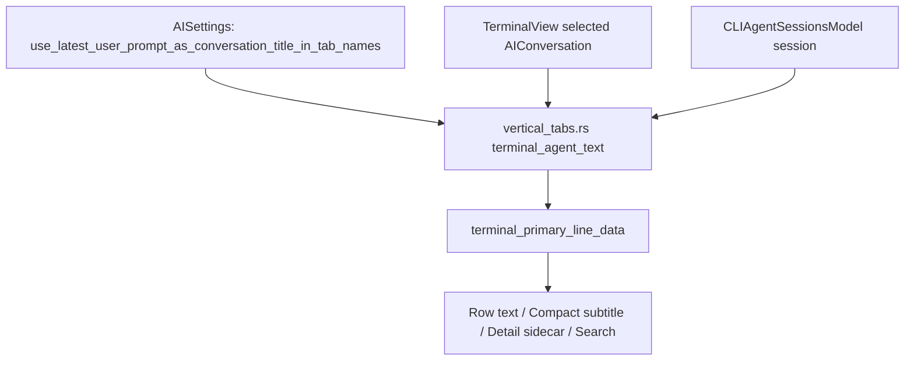

# APP-4080: Use Latest User Prompt as Conversation Title in Tab Names

## Problem
Vertical tabs currently resolve agent terminal row text in several places, and the Oz and plugin-backed CLI agent paths use different semantics.
Oz rows call through `TerminalView::selected_conversation_display_title`, which ultimately uses `AIConversation::title()`: generated task description, then an initial prompt-style fallback, then explicit fallback title. Plugin-backed CLI agent rows call `CLIAgentSessionContext::display_title()`, which currently prefers the latest plugin `query` over `summary`. The new setting needs to make this choice consistent:
- setting off/default: prefer conversation title/title-like metadata
- setting on: prefer latest user prompt

The technical work is to add the setting, expose it in AI settings, and route all vertical-tabs conversation-text call sites through shared resolution logic so row rendering, compact subtitles, detail sidecar, and search stay in sync.

## Relevant code
- `specs/APP-4080/PRODUCT.md` — source of truth for desired behavior.
- `app/src/settings/ai.rs:551` — `AISettings` group where persisted AI settings are declared.
- `app/src/settings/ai.rs:1246` — existing user-visible AI setting with global sync policy, useful as the sync/default pattern.
- `app/src/settings_view/ai_page.rs:1368` — AI settings page widget registration order.
- `app/src/settings_view/ai_page.rs:1870` — `AISettingsPageAction`, where the toggle action should be added.
- `app/src/settings_view/ai_page.rs:2461` — settings action handling for persisted toggle settings.
- `app/src/settings_view/ai_page.rs:4910` — `OtherAIWidget`, currently home for conversation/display-adjacent AI settings such as conversation history and thinking display.
- `app/src/terminal/view/pane_impl.rs:945` — Oz conversation selection/title helpers for user-facing chrome.
- `app/src/ai/agent/conversation.rs:1053` — `AIConversation::title()`, the generated-title-first path.
- `app/src/ai/agent/conversation.rs:1121` — `AIConversation::initial_query()` and `initial_user_query()` helpers.
- `app/src/ai/agent/mod.rs:2478` — `AIAgentInput::user_query()`, the canonical display text for user prompt-like inputs.
- `app/src/terminal/cli_agent_sessions/mod.rs:39` — `CLIAgentSessionContext` stores plugin metadata: `summary`, `query`, etc.
- `app/src/terminal/cli_agent_sessions/mod.rs:93` — `CLIAgentSessionContext::display_title()`, which currently prefers `query` over `summary`.
- `app/src/terminal/cli_agent_sessions/event/mod.rs:27` and `event/v1.rs:53` — CLI plugin payload parsing for `query` and `summary`.
- `app/src/workspace/view/vertical_tabs.rs:2217` — vertical-tabs search text for terminal rows.
- `app/src/workspace/view/vertical_tabs.rs:2237` — `terminal_primary_line_data()` fallback chain.
- `app/src/workspace/view/vertical_tabs.rs:2679` — main terminal row command/conversation text rendering.
- `app/src/workspace/view/vertical_tabs.rs:4079` — detail sidecar terminal conversation text.
- `app/src/workspace/view/vertical_tabs.rs:4613` — compact subtitle command/conversation text.
- `app/src/workspace/view/vertical_tabs_tests.rs:331` — existing terminal primary-line precedence tests.
- `app/src/terminal/cli_agent_sessions/mod_tests.rs:186` — existing CLI session metadata tests.

## Current state
`vertical_tabs.rs` repeats the same terminal-agent extraction pattern in at least four call sites:
- `terminal_pane_search_text_fragments`
- `render_terminal_primary_line_for_view`
- `render_terminal_detail_section`
- the `VerticalTabsCompactSubtitle::Command` branch in `render_compact_pane_row`

Each call site:
1. reads `CLIAgentSessionsModel::session(terminal_view.id())`
2. suppresses agent metadata for non-plugin-backed CLI sessions
3. calls `terminal_view.selected_conversation_display_title(app)` for Oz
4. calls `session.session_context.display_title()` for plugin-backed CLI agents
5. passes both values into `terminal_primary_line_data()`

`terminal_primary_line_data()` then prefers CLI agent text over Oz conversation text, and only falls through to terminal title, last completed command, and `New session` when no agent text is available.

This works for the current UI but makes APP-4080 easy to implement inconsistently because the new setting would otherwise need to be read at every duplicated extraction site.

## Proposed changes
### Add the setting
Add a new boolean setting to `AISettings` in `app/src/settings/ai.rs`.

Suggested setting:
- field: `use_latest_user_prompt_as_conversation_title_in_tab_names`
- generated setting type: `UseLatestUserPromptAsConversationTitleInTabNames`
- default: `false`
- supported platforms: `SupportedPlatforms::ALL`
- sync: `SyncToCloud::Globally(RespectUserSyncSetting::Yes)`
- private: `false`
- TOML path: `agents.display.use_latest_user_prompt_as_conversation_title_in_tab_names`
- description: `Whether agent tab names use the latest user prompt instead of the generated conversation title.`

The sync policy should match similar user-visible display/AI behavior preferences. The setting affects the user's preferred navigation chrome rather than machine-local state, so global sync is preferable.

### Add the settings UI
Add `UseLatestUserPromptAsConversationTitleInTabNames` to the imports in `app/src/settings_view/ai_page.rs`.

Add an action:
- `AISettingsPageAction::ToggleUseLatestUserPromptAsConversationTitleInTabNames`

Handle the action by toggling `AISettings::use_latest_user_prompt_as_conversation_title_in_tab_names` with `toggle_and_save_value(ctx)` and notifying the view.

Render the toggle in `OtherAIWidget`, near `Show conversation history in tools panel` and `Agent thinking display`, because it is a conversation display/navigation preference rather than an input-routing behavior. Suggested label:
- `Use latest user prompt as conversation title in tab names`

Suggested description:
- `Show the latest user prompt instead of the generated conversation title for Oz and third-party agent sessions in vertical tabs.`

Because the setting also affects plugin-backed third-party CLI agent sessions, do not make editability depend exclusively on `AISettings::is_any_ai_enabled(app)`. The row can still use standard AI settings styling, but the toggle should remain usable for users who keep Warp AI disabled while using third-party coding agents.

### Centralize agent tab text resolution
Introduce a small private resolver in `app/src/workspace/view/vertical_tabs.rs` so every vertical-tabs call site uses the same setting semantics.

Suggested private types in `vertical_tabs.rs`:
- `AgentTabTextPreference` with variants `ConversationTitle` and `LatestUserPrompt`
- `TerminalAgentText` containing:
  - `conversation_display_title: Option<String>`
  - `cli_agent_title: Option<String>`
  - `is_oz_agent: bool`
  - `cli_agent: Option<CLIAgent>`

Suggested helpers:
- `agent_tab_text_preference(app: &AppContext) -> AgentTabTextPreference`
- `terminal_agent_text(terminal_view: &TerminalView, app: &AppContext) -> TerminalAgentText`

`terminal_agent_text()` should own the plugin-backed suppression rule:
- if a CLI agent session exists and `listener.is_none()`, do not use CLI or Oz conversation metadata for the row; preserve current terminal fallback behavior
- otherwise resolve Oz and CLI text according to the setting

`terminal_primary_line_data()` can remain as the pure fallback combiner once the agent text has been chosen. This avoids coupling it directly to settings or `AppContext`, and keeps existing unit tests easy to extend.

### Oz conversation prompt support
Add a helper on `AIConversation`:
- `latest_user_prompt_for_tab_name(&self) -> Option<String>`

Implementation should iterate `root_task_exchanges()` in reverse order and find the latest non-empty `AIAgentInput::user_query()` value. This uses the existing display-oriented prompt helper, which already accounts for slash-command-like inputs such as plan/orchestrate, create project, clone repository, code review, invoke skill, and accepted suggested prompts.

Keep `AIConversation::title()` unchanged. The new helper is only for the explicit latest-prompt tab-name setting.

Update `TerminalView` in `app/src/terminal/view/pane_impl.rs` with either:
- a new method such as `selected_conversation_tab_name_text(use_latest_user_prompt, ctx)`, or
- a new private helper used by vertical tabs to access the selected `AIConversation`

Prefer not to change existing pane-header behavior. `selected_conversation_display_title()` should keep serving pane headers and other existing chrome with title semantics.

### CLI agent title/prompt support
Extend `CLIAgentSessionContext` with explicit methods instead of overloading `display_title()`:
- `latest_user_prompt(&self) -> Option<String>` returns trimmed non-empty `query`
- `title_like_text(&self) -> Option<String>` returns trimmed non-empty title-like metadata

Keep the preference application in `vertical_tabs.rs` rather than making `terminal::cli_agent_sessions` depend on a workspace/view-specific enum.

For the current protocol, `summary` is the only available title-like field. Use it as `title_like_text()` for APP-4080, but keep the method boundary explicit so a future plugin protocol can add a dedicated `title` field without touching vertical tabs again.

Do not use CLI agent text for non-plugin-backed detections. Those sessions should continue to fall through to terminal title/last command.

### Update vertical tabs call sites
Replace duplicated local extraction with `terminal_agent_text()` in:
- `terminal_pane_search_text_fragments`
- `render_terminal_primary_line_for_view`
- `render_terminal_detail_section`
- `render_compact_pane_row` when `VerticalTabsCompactSubtitle::Command`

Search should include the visibly rendered setting-driven text. If adding the non-rendered counterpart is cheap after centralization, include both title-like text and latest prompt in `terminal_search_text_fragments()` for eligible agent rows, while keeping `primary_text` as the visible setting-driven text.

### Keep generated schemas/settings in sync
Adding an `AISettings` field may require updating generated or checked-in settings schema artifacts if this repository expects those to change. Follow the existing settings workflow in the repo after implementation; do not hand-edit generated schema files unless that is the established pattern for this codebase.

## End-to-end flow
1. User opens Settings > AI and sees `Use latest user prompt as conversation title in tab names` disabled by default.
2. Vertical tabs render a terminal row.
3. The row asks `terminal_agent_text()` for Oz/CLI conversation text.
4. `terminal_agent_text()` reads `AISettings::use_latest_user_prompt_as_conversation_title_in_tab_names`.
5. For Oz:
   - disabled: use `AIConversation::title()`, with existing empty-conversation default title handling
   - enabled: use `AIConversation::latest_user_prompt_for_tab_name()`, falling back to title/default text
6. For plugin-backed CLI agents:
   - disabled: use `CLIAgentSessionContext::title_like_text()`, falling back to latest prompt
   - enabled: use `CLIAgentSessionContext::latest_user_prompt()`, falling back to title-like text
7. `terminal_primary_line_data()` receives already-selected agent text and preserves the existing terminal fallback chain.
8. Row rendering, compact subtitles, detail sidecar, and search use the same selected text.

## Diagram

## Risks and mitigations
- **Duplicated resolution stays inconsistent**: centralize the setting read in one helper and make all four vertical-tabs call sites use it.
- **Pane headers accidentally change**: keep `TerminalView::selected_conversation_display_title()` title-first for existing chrome; add a new tab-specific helper rather than changing the existing method globally.
- **Third-party `summary` may not be a durable title**: hide this behind `CLIAgentSessionContext::title_like_text()` and treat a dedicated plugin `title` payload field as a follow-up if needed.
- **Global AI disabled blocks a third-party setting**: make the UI toggle usable even when Warp AI is disabled, since the setting also affects plugin-backed third-party CLI sessions.
- **Blank or whitespace text**: trim and filter every title/prompt candidate before choosing it.
- **Search mismatch**: test that search includes the visible text after toggling. If both title and prompt are indexed, make sure rendered text still follows the setting.

## Testing and validation
Add or update unit tests:
- `app/src/ai/agent/conversation.rs` tests for `latest_user_prompt_for_tab_name()`:
  - returns the latest non-empty user prompt across root-task exchanges
  - ignores exchanges without user prompt text
  - returns `None` for empty conversations
- `app/src/terminal/cli_agent_sessions/mod_tests.rs` tests for `CLIAgentSessionContext`:
  - default/title preference returns `summary` before `query`
  - latest-prompt preference returns `query` before `summary`
  - empty/whitespace values fall through
- `app/src/workspace/view/vertical_tabs_tests.rs` tests for any pure helper added in `vertical_tabs.rs`:
  - setting off: CLI title-like text wins over latest prompt
  - setting on: latest prompt wins over title-like text
  - missing preferred text falls back to the other agent text
  - no plugin-backed metadata preserves terminal title/last-command fallback
- `app/src/settings/ai_tests.rs` or an adjacent settings test:
  - new setting defaults to `false`
  - setting persists through the normal settings machinery

Manual validation:
- Default-off Oz conversation shows generated title in vertical tabs.
- Toggle on and send an Oz follow-up prompt; row, compact command subtitle, detail sidecar, and search reflect the latest prompt.
- Plugin-backed CLI agent with both summary and query shows summary/title-like text by default and query when toggled on.
- Non-plugin CLI detection and plain terminal rows keep existing fallback behavior.

Suggested targeted commands after implementation:
- `cargo test -p warp workspace::view::vertical_tabs_tests`
- `cargo test -p warp terminal::cli_agent_sessions::mod_tests`
- `cargo test -p warp settings::ai_tests`

Do not run `cargo fmt --all` or file-specific `cargo fmt`; follow the repository formatting guidance when implementation changes are made.

## Follow-ups
- Add an explicit `title` field to the CLI agent plugin protocol if `summary` is not sufficiently stable for tab names.
- Consider telemetry for the setting toggle only if product wants adoption data; the implementation does not need telemetry to satisfy APP-4080.
- If vertical-tabs search indexes both rendered and non-rendered counterpart text, document that behavior in a small helper test so future changes do not accidentally regress discoverability.
