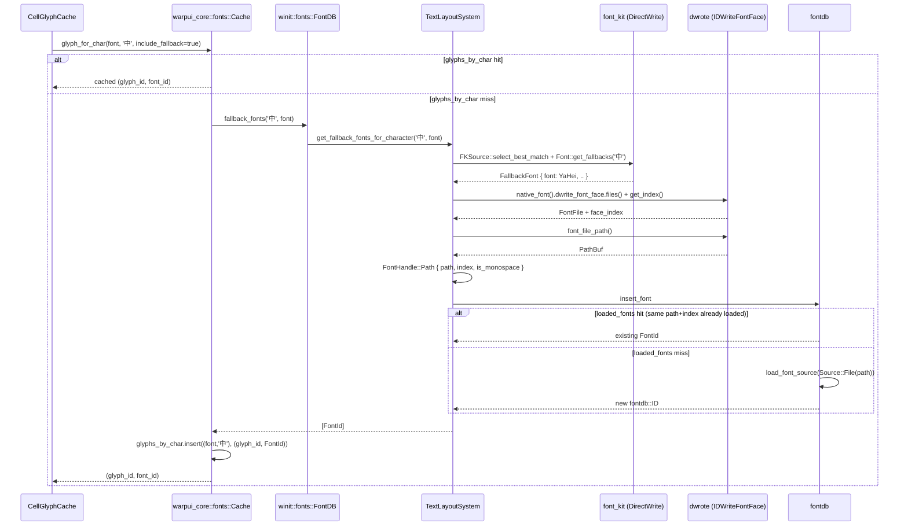

# APP-4098 — CJK fallback font memory growth on Windows
Linear: https://linear.app/warpdotdev/issue/APP-4098/cjk-fallback-font

## Problem
On Windows, rendering many **unique** CJK codepoints into a block (e.g. a long stream of Chinese output) causes Warp's memory to grow without bound and never be released. When the user's primary font already contains the CJK glyphs, the bug does not reproduce. The growth is caused by the per-character font-fallback path duplicating a large fallback font file (typically Microsoft YaHei, a 10–25 MB TTC) into `fontdb` once per unique codepoint.

This spec covers the technical fix landed on branch `kc/memory2`.

## Relevant code
- `app/src/terminal/grid_renderer/cell_glyph_cache.rs:32` — `CellGlyphCache::glyph_for_char` calls `FontCache::glyph_for_char(font_id, ch, /* include_fallback_fonts */ true)` once per (char, font) for every terminal cell.
- `crates/warpui_core/src/fonts.rs:457-500` — `Cache::glyph_for_char` caches the final `Option<(GlyphId, FontId)>` per `(FontId, char)` in `glyphs_by_char`. On a miss it first tries app-specified fallbacks, then `system_font_fallback`, which calls `platform.fallback_fonts(ch, font)`.
- `crates/warpui/src/windowing/winit/fonts.rs` — `TextLayoutSystem` (cosmic_text + fontdb wrapper). Contains `loaded_fonts: DashMap<FontKey, FontId>` used by `insert_font` for path-based dedup, where `FontKey` is `(PathBuf, u32)`.
- `crates/warpui/src/windowing/winit/fonts/windows.rs:125-265` — `TextLayoutSystem::get_fallback_fonts_for_character` plus the new `fallback_font_path_handle` helper.
- External: `font-kit/src/loader.rs:172-176` — default `Loader::handle()` impl that reads the full font file into an `Arc<Vec<u8>>` and returns `Handle::Memory(bytes, 0)`. Used by the DirectWrite `Font` in the absence of a platform-specific override. This is what we step around.
- External: `font-kit/src/sources/directwrite.rs:103-110` — `DirectWriteSource::create_handle_from_dwrite_font` already builds a `Handle::Path` for enumerated system fonts. Our helper mirrors this pattern.
- External: `dwrote/src/font_face.rs` — `FontFace::files()`, `FontFace::get_index()`. `dwrote/src/font_file.rs` — `FontFile::font_file_path()`. These are the DirectWrite accessors we use to rebuild a Path handle.
## Current state (before this fix)
On Windows, fallback resolution is lazy and per-character:
1. `CellGlyphCache::glyph_for_char` enters `Cache::glyph_for_char(font_id, ch, true)` for each cell.
2. For characters not present in the primary font, `Cache::glyph_for_char` falls back to `system_font_fallback(ch, font)` → `FontDB::fallback_fonts(ch, font)` → `TextLayoutSystem::get_fallback_fonts_for_character(ch, font_id)`.
3. That function uses font-kit (`SystemSource` + `Font::get_fallbacks`) to ask DirectWrite which font provides the glyph. For each fallback `font_kit::Font`, it used to call `.handle()`, pass the handle to `load_font_from_handle`, and finally `insert_font` to register the face in the cosmic_text `FontSystem`'s fontdb.
4. `Font::handle()` on DirectWrite uses the default `Loader::handle` impl, which reads the full font file into memory and returns `Handle::Memory(Arc<Vec<u8>>, /* font_index */ 0)`. The `font_index = 0` is also wrong for font collections (there's a FIXME to this effect in font-kit itself), and the bytes are a fresh allocation every call.
5. `load_font_from_handle` pattern-matches on `Handle::Memory` and copies the bytes (`bytes.to_vec()`) into an `OwnedFace`.
6. `insert_font` wraps that into `fontdb::Source::Binary(Arc::new(face.into_vec()))` and calls `fontdb.load_font_source(source)`. The dedup cache `loaded_fonts: DashMap<FontKey, FontId>` is keyed by `PathBuf`, so `Source::Binary` entries bypass it entirely.
Because `Cache::glyphs_by_char` caches by `(FontId, char)`, each unique CJK codepoint triggers the full pipeline **exactly once**. With N unique codepoints, fontdb ends up with N duplicate copies of the same fallback face retained for the life of the `FontSystem`.
When the user's primary font already contains the CJK glyphs, `Cache::glyph_for_char` returns at `crates/warpui_core/src/fonts.rs:471` without ever entering the fallback path, so the bug is invisible — matching the user-reported symptom.
## Design
The fix addresses the root cause: `Font::handle()` returning `Handle::Memory` instead of `Handle::Path`. Rather than caching around the byte-copy pipeline, we skip it entirely by reaching through font-kit's `NativeFont` to the underlying `IDWriteFontFace` and rebuilding a path-based handle ourselves — the same trick `DirectWriteSource::create_handle_from_dwrite_font` uses for enumerated system fonts.
### New helper in `windows.rs`
```rust path=null start=null
fn fallback_font_path_handle(font: &font_kit::loaders::directwrite::Font) -> Option<FontHandle> {
    let native = font.native_font();
    let file = native.dwrite_font_face.files().ok()?.into_iter().next()?;
    let path = file.font_file_path().ok()?;
    let font_index = native.dwrite_font_face.get_index();
    Some(FontHandle::new(path, font_index, font.is_monospace()))
}
```
Returns `None` for fonts that are not backed by a local file (custom-collection loaders, in-memory streams). `IDWriteFontFallback::MapCharacters` against the system font collection always produces file-backed faces, so this branch is taken ~100% of the time for real CJK fallbacks.
### Modified flow in `get_fallback_fonts_for_character`
For each `FallbackFont` returned by `Font::get_fallbacks`:
1. Try `fallback_font_path_handle(&fallback_font.font)`. On success — almost always — we get a `FontHandle::Path { path, index, is_monospace }` with no byte copy.
2. On `None`, fall back to the legacy `.handle()` → `load_font_from_handle` path, which still returns a correct handle via `Handle::Memory` for custom-collection fonts. This keeps behavior for edge cases identical to today.
3. Pass the handle to `self.insert_font(...)`. For path handles, the existing `loaded_fonts: DashMap<FontKey, FontId>` dedup fires on `FontKey { path, index }` and returns the previously loaded `FontId` without touching fontdb. For the rare memory fallback, behavior is unchanged.
No new caches or structs are added to `TextLayoutSystem`. The earlier design's Windows-gated `loaded_fallback_fonts_by_ps_name: DashMap<String, FontId>` is no longer needed — the existing path-based dedup does the job.
### Cargo.toml
Add `dwrote` as a direct Windows dependency pinned to the same git rev the workspace already uses transitively via font-kit (`warpdotdev/dwrote-rs @ a71ce6c0`). This keeps the compiled version graph flat.
```toml path=null start=null
[target.'cfg(target_os = "windows")'.dependencies]
dwrote = { git = "https://github.com/warpdotdev/dwrote-rs", rev = "a71ce6c0136f7d0954a9a8b181b5b2d8ace5eb9c", default-features = false }
```
### Why this design
- **Fixes the root cause.** The leak is that `.handle()` returns Memory on Windows. We no longer call `.handle()` on the hot path, so the problem is excised at the source rather than papered over with a cache.
- **Zero new state.** No new `DashMap` on `TextLayoutSystem`, no new lock, no new lifecycle concerns. All dedup flows through the existing `loaded_fonts` DashMap, which is already how enumerated system fonts are deduped today.
- **TTC-correct.** We pass the real `dwrite_font_face.get_index()` instead of hard-coded `0`, so if DirectWrite picks face 3 out of a TTC we actually load face 3. This also fixes the silent correctness bug called out by the FIXME in font-kit's default `Loader::handle`.
- **mmap-friendly.** fontdb sees `Source::File(path)`, and `cosmic_text::FontSystem::get_font` calls `db.make_shared_face_data(id)` to mmap the file on demand. Multiple faces from the same TTC share one mapping, pages are lazy-loaded from disk, and no anonymous heap allocation is needed to hold the font data.
- **Matches existing pattern.** `DirectWriteSource::create_handle_from_dwrite_font` already does this for enumerated fonts. We're just applying the same pattern on the fallback path.
- **Doesn't require a font-kit fork change.** We can ship the fix in `warp-internal` today. A follow-up to override `Loader::handle()` inside the font-kit fork is still desirable (so other consumers benefit too), but is not a blocker.
## End-to-end flow

Every call after the first for the same fallback face hits `loaded_fonts` and returns the existing `FontId` immediately. fontdb never holds more than one entry per `(path, index)` pair.
## Risks and mitigations
- **`font_file_path()` returns `Err`.** Happens only for fonts not backed by a local file (custom collection loaders, in-memory streams). DirectWrite system fallbacks always have a path, so this case is not exercised for real CJK fallbacks. We gracefully fall back to the legacy Memory-handle path, so behavior for edge cases is strictly no worse than before.
- **Extra COM calls per character.** Each unique-codepoint first lookup now makes two additional COM calls (`GetFiles` and the local-loader cast in `font_file_path()`). Both are cheap and only happen once per unique codepoint thanks to the existing `glyphs_by_char` cache in `warpui_core::fonts::Cache`.
- **Pinned dwrote version.** We now carry `dwrote` as a direct dep pinned to a specific git rev. If font-kit's transitive pin drifts, we could end up with two compiled versions. Mitigation: the fork pins are both under `warpdotdev/`, and CI's `cargo tree -p dwrote` output will show a dup immediately. Bump both at once.
- **font-kit fork drift.** None. We do not modify `warpdotdev/font-kit`. If/when we later override `Loader::handle()` in the fork, the in-tree helper simply becomes redundant and can be removed without behavior change.
- **Concurrency.** Unchanged. All dedup flows through `loaded_fonts`, which is a `DashMap` — same as today.
## Testing and validation
- **Manual repro**:
  1. On Windows, select a primary font with no CJK glyphs (e.g. Cascadia Code NF).
  2. `cat` or `Get-Content` a large text file containing many unique Chinese characters.
  3. Observe Warp's working-set memory in Task Manager. Before: grows with unique-codepoint count and does not return after the block scrolls off. After: plateaus after the first fallback family loads, then stays flat.
- **Static checks** (already run on the implementation): `cargo check -p warpui --target x86_64-pc-windows-msvc`, `cargo clippy -p warpui --target x86_64-pc-windows-msvc --no-deps`, `cargo fmt -p warpui -- --check`.
- **Automated regression** (not landed): a reliable unit/integration test would need to exercise the real DirectWrite system-font set, which is environment-dependent (CI images may not even ship CJK fonts). Deferred in favor of the manual repro; see Follow-ups.
## Follow-ups
- Patch `warpdotdev/font-kit` to override `Loader::handle()` on the DirectWrite loader so it returns `Handle::Path { path, font_index }` when `dwrite_font_face.files()[0].font_file_path()` succeeds (mirroring `DirectWriteSource::create_handle_from_dwrite_font` in `src/sources/directwrite.rs`). Also fix the hard-coded `font_index = 0` in the default `handle()` impl. Once that lands, `fallback_font_path_handle` in our code can be deleted and we can simply call `font.handle()` everywhere.
- Remove the throwaway `font_handle.load()?` in `load_font_from_handle` when `ValidateFontSupportsEn::No` is passed (the call exists only for the `is_monospace` side-effect, which the caller already has via `font.is_monospace()`).
- Consider layering a `(FontId, char) → Vec<FontId>` cache analogous to the non-Windows `fallback_fonts` DashMap so we can skip re-entering font-kit/DirectWrite even for cold characters. Not required for the memory fix; pure perf optimization on top of the existing `glyphs_by_char` cache.
- Add an integration-style test that stands up a `TextLayoutSystem` with a stub fontdb pre-seeded with a known CJK face and asserts that `fallback_fonts` returns the same `FontId` across many distinct characters. Requires some test-only injection hooks into `TextLayoutSystem`; not worth the churn as part of this fix but a sensible follow-up.
