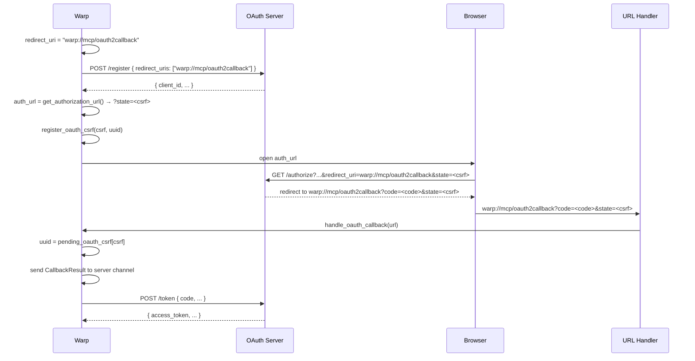

# APP-4099: Technical Spec — Fix MCP OAuth `redirect_uri`

## Problem

`make_authenticated_client` in `app/src/ai/mcp/templatable_manager/oauth.rs` constructs the OAuth redirect URI as:

```
{scheme}://mcp/oauth2callback?server_id={uuid}
```

The `?server_id=` query parameter is used by `handle_oauth_callback` to route incoming callbacks to the correct in-flight OAuth flow. However, including it in the redirect URI breaks RFC 6749 §3.1.2.2 exact-match validation: when an OAuth provider normalizes the URI during Dynamic Client Registration (stripping the query parameter), the subsequent authorization request—which still includes `?server_id=`—does not match the registered URI and is rejected.

The fix removes `server_id` from the redirect URI and instead routes callbacks using the OAuth `state` parameter, which carries rmcp's CSRF token throughout the authorization flow.

## Relevant Code

- `app/src/ai/mcp/templatable_manager/oauth.rs (225–449)` — `make_authenticated_client`: constructs redirect URI and drives the full OAuth state machine
- `app/src/ai/mcp/templatable_manager/oauth.rs (457–504)` — `handle_oauth_callback`: routes incoming callback URLs to waiting OAuth flows
- `app/src/ai/mcp/templatable_manager.rs (41–86)` — `TemplatableMCPServerManager` and `SpawnedServerInfo` struct definitions
- `app/src/uri/mod.rs:410–418` — URL scheme handler: dispatches `warp://mcp/*` URLs to `handle_oauth_callback`
- `~/.cargo/git/checkouts/rmcp-349989f9317a4437/c0f65dc/crates/rmcp/src/transport/auth.rs:490–517` — rmcp's `get_authorization_url`: generates a random CSRF token and embeds it as the `state` query parameter in the authorization URL

## Current State

### Redirect URI construction

`make_authenticated_client` (line 239–243):
```rust
let server_id = uuid;
let redirect_uri = format!(
    "{}://mcp/oauth2callback?server_id={server_id}",
    ChannelState::url_scheme()
);
```

This `redirect_uri` is passed to both `start_authorization` and `register_client`, so it becomes part of the DCR request and the authorization URL.

### Callback routing

`handle_oauth_callback` (lines 457–504) routes by extracting `server_id` from the redirect URI's query parameters:
```rust
let Some(server_id) = query_params.get("server_id") else {
    bail!("Missing 'server_id' parameter in OAuth callback");
};
// ...
for (uuid, server_info) in &self.spawned_servers {
    if uuid.to_string() != *server_id.to_string() { continue; }
    // send result ...
}
```

### rmcp's `state` parameter

rmcp's `get_authorization_url` generates a random CSRF token and stores it internally; it embeds it as `state=<csrf_token>` in the returned authorization URL string. The same CSRF token must be passed to `handle_callback(code, csrf_token)` after the user completes authorization, where rmcp validates it against the stored value.

## Proposed Changes

### 1. Use a clean redirect URI

Remove `?server_id=` from the redirect URI:

```rust
let redirect_uri = format!("{}://mcp/oauth2callback", ChannelState::url_scheme());
```

This single-line change makes the redirect URI identical across DCR registration and authorization requests.

### 2. Add `pending_oauth_csrf` to `TemplatableMCPServerManager`

Add a new field to map CSRF tokens to server UUIDs for callback routing:

```rust
// In TemplatableMCPServerManager (templatable_manager.rs)
#[cfg(not(target_family = "wasm"))]
pending_oauth_csrf: HashMap<String, Uuid>,
```

This map is populated when an OAuth flow begins and cleaned up when the callback is received (success or error).

### 3. Extract CSRF token from auth URL and register the mapping

After calling `get_authorization_url`, parse the `state` query parameter from the returned URL to obtain the CSRF token, then register the mapping via the spawner before opening the browser:

```rust
// After: let auth_url = auth_manager.get_authorization_url(scopes).await?;
let csrf_state = Url::parse(&auth_url)
    .ok()
    .and_then(|u| {
        u.query_pairs()
            .find(|(k, _)| k == "state")
            .map(|(_, v)| v.into_owned())
    })
    .unwrap_or_default();

// Replace the existing spawner.spawn block:
if let Err(e) = spawner
    .spawn(move |manager, ctx| {
        manager.register_oauth_csrf(csrf_state, uuid);
        ctx.open_url(&auth_url);
        manager.change_server_state(uuid, MCPServerState::Authenticating, ctx);
    })
    .await
{ ... }
```

Add `register_oauth_csrf` as a method on `TemplatableMCPServerManager`:

```rust
#[cfg(not(target_family = "wasm"))]
fn register_oauth_csrf(&mut self, csrf_state: String, uuid: Uuid) {
    self.pending_oauth_csrf.insert(csrf_state, uuid);
}
```

### 4. Update `handle_oauth_callback` to route by `state`

Replace the `server_id` lookup with a `state` lookup:

```rust
pub fn handle_oauth_callback(&self, url: &Url) -> anyhow::Result<()> {
    if url.path() != "/oauth2callback" {
        bail!(...);
    }

    let query_params: HashMap<_, _> = url.query_pairs().collect();

    let Some(state) = query_params.get("state") else {
        bail!("Missing 'state' parameter in OAuth callback");
    };

    let code = query_params.get("code");
    let error = query_params.get("error");

    let result = match code {
        Some(code) => CallbackResult::Success {
            code: code.to_string(),
            csrf_token: state.to_string(),
        },
        None => CallbackResult::Error {
            error: error.map(|e| e.to_string()),
        },
    };

    let Some(&server_uuid) = self.pending_oauth_csrf.get(state.as_ref()) else {
        bail!("No active OAuth flow found for state={state}");
    };

    let Some(server_info) = self.spawned_servers.get(&server_uuid) else {
        bail!("No spawned server found for uuid={server_uuid}");
    };

    block_on(server_info.oauth_result_tx.send(result))
        .map_err(|_| anyhow!("Failed to send OAuth result to server {server_uuid}"))?;

    self.pending_oauth_csrf.remove(state.as_ref());
    Ok(())
}
```

Note: `handle_oauth_callback` currently takes `&self` but needs `&mut self` to remove from `pending_oauth_csrf`. The current call site in `uri/mod.rs` calls it via `TemplatableMCPServerManager::as_ref(ctx)` — this will need to change to `as_mut(ctx)` or equivalent mutable access pattern used elsewhere in the manager.

### 5. Clean up `pending_oauth_csrf` on flow cancellation/error

When a spawned server task is aborted (e.g. user cancels, server errors out), the CSRF entry should be removed from `pending_oauth_csrf`. Look for where `spawned_servers` entries are removed and add a corresponding removal from `pending_oauth_csrf` there.

Alternatively, since the map is keyed by CSRF token (a random string with low collision probability) and entries are small, stale entries from cancelled flows are harmless until the next restart — but it is cleaner to remove them proactively.

## End-to-End Flow

```
User enables OAuth MCP server
        ↓
make_authenticated_client()
  redirect_uri = "{scheme}://mcp/oauth2callback"   ← no server_id
  OAuthState::start_authorization(redirect_uri)
  auth_manager.register_client(redirect_uri)       ← DCR with clean URI
  auth_url = auth_manager.get_authorization_url()  ← contains ?state=<csrf>
  csrf_state = parse state param from auth_url
  manager.register_oauth_csrf(csrf_state, uuid)    ← csrf→uuid mapping
  open browser → auth_url
        ↓
User approves in browser
        ↓
Browser → warp://mcp/oauth2callback?code=<code>&state=<csrf>
        ↓
uri/mod.rs UriHost::Mcp handler
  handle_oauth_callback(url)
    state = url.query_pairs["state"]              ← CSRF token from callback
    uuid = pending_oauth_csrf[state]             ← route to correct server
    send CallbackResult::Success { code, csrf_token: state } to server
    remove pending_oauth_csrf[state]
        ↓
make_authenticated_client() (resumed)
  oauth_state.handle_callback(code, csrf_token)   ← rmcp validates CSRF
  exchange code for token
  persist credentials
  return AuthClient
```

## Diagrams



## Risks and Mitigations

**Risk**: `handle_oauth_callback` currently takes `&self`; it needs `&mut self` to remove from `pending_oauth_csrf`.
**Mitigation**: Change the call site in `uri/mod.rs` from `as_ref` to use mutable access. The handler already writes to the channel via `block_on`, so the mutability change is consistent with the existing pattern for other manager mutations triggered by URI handling. Check the existing patterns in the codebase for other `handle_*` methods called from the URI handler.

**Risk**: OAuth servers that modify or re-encode the `state` value would break routing.
**Mitigation**: Such servers would also break rmcp's CSRF validation (which is a pre-existing issue unrelated to this fix). We can log a clear error message if the `state` is unrecognized to aid debugging.

**Risk**: Stale `pending_oauth_csrf` entries if OAuth flows are aborted before the callback.
**Mitigation**: Entries are small (string → uuid). Add cleanup in the server-stopping path alongside where `spawned_servers` entries are removed. As a safety net, the map could be periodically pruned, but this is a low-priority follow-up.

**Risk**: Regression for existing GitHub/Figma MCP servers that currently work.
**Mitigation**: Servers with valid cached credentials skip the entire OAuth flow and are unaffected. For re-authentication scenarios, the redirect URI change is transparent because both DCR and auth requests now use the same clean URI.

## Testing and Validation

- **Unit test** (`handle_oauth_callback`): verify routing by `state` param, clean removal from `pending_oauth_csrf`, and error on unknown `state`
- **Unit test** (redirect URI): verify `make_authenticated_client` constructs a redirect URI with no query parameters
- **Manual test**: end-to-end flow against an OAuth provider with strict redirect URI matching (e.g. local Hydra instance)
- **Regression**: GitHub MCP and Figma MCP continue to connect with cached credentials

## Follow-ups

- Proactively clean up `pending_oauth_csrf` when a server's spawn task is aborted (`abort_handle` is triggered), to avoid indefinite accumulation of stale entries
- Consider whether `handle_oauth_callback` should accept error callbacks even when `state` is absent (some OAuth servers omit `state` on error responses); this would be a separate improvement
