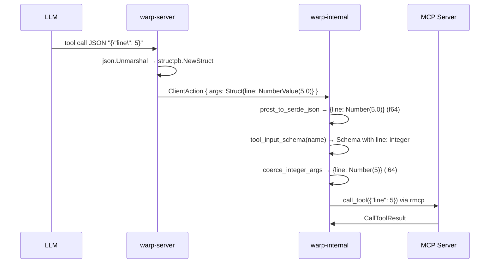

# APP-4105: Fix MCP Tool Call Integer Parameter Coercion — Tech Spec

## Problem

MCP tool call arguments are transported from warp-server to the Warp client as a `google.protobuf.Struct` (`structpb`). The protobuf `NumberValue` field stores all numeric values as `float64`, erasing the integer/float distinction present in the original JSON. When the Rust client converts this struct back to `serde_json::Value` for dispatch, `serde_json::Number::from_f64` together with the ryu formatter serializes `f64(5.0)` as `"5.0"`, not `"5"`. Strict MCP servers (GoLand, JVM-based servers, strict Python with Pydantic, Rust with `i64`) reject this when parsing integer-typed fields.

The fix is a scoped client-side coercion step: before dispatching the tool call via `rmcp`, we look up the tool's cached `input_schema` and rewrite any whole-number `f64` arguments to `i64` when the schema declares the property as [`"type": "integer"`](https://json-schema.org/understanding-json-schema/reference/type).

## Relevant Code

- `app/src/ai/blocklist/action_model/execute/call_mcp_tool.rs` — the dispatch site for MCP tool calls (via `reconnecting_peer.call_tool(...)`). Coercion runs here before dispatch. Hosts the `coerce_integer_args` helper, exposed as `pub(crate)` so the render path can reuse it.
- `app/src/ai/blocklist/block.rs` — MCP tool call detail render. Builds `command_text` from the action's raw `input` and passes it to `handle_mcp_tool_stream_update`. Coercion runs here as well, so the UI mirrors what dispatch sends.
- `app/src/ai/mcp/templatable_manager.rs:243` — `tools_for_server(uuid) -> Vec<rmcp::model::Tool>` provides cached tools per server; a new helper `tool_input_schema` is added alongside it.
- `app/src/ai/mcp/templatable_manager/native.rs:1610,1629` — `server_with_tool_name` and `server_with_installation_id_and_tool_name`. Existing lookups; kept as-is.
- `rmcp::model::Tool.input_schema: Arc<JsonObject>` — where `JsonObject = serde_json::Map<String, Value>`. The schema is native serde_json. The `"type"` keyword is a plain JSON string (per the [JSON Schema spec](https://json-schema.org/understanding-json-schema/reference/type)), so the distinction between `"integer"` and `"number"` is a simple string comparison.

## Current State

There are two consumers of `AIAgentActionType::CallMCPTool.input` in the client today:

**Dispatch** (`call_mcp_tool.rs`): destructures the action, converts `input` to a `serde_json::Map`, and hands it to `rmcp` via `CallToolRequestParam`. Values are `f64(5.0)` for integer fields.

**Render** (`block.rs:1859`): builds the block detail string via `format!("MCP Tool: {name} ({input})")` and feeds it to `handle_mcp_tool_stream_update`. The formatted `{input}` uses `serde_json::Value`'s `Display` impl, which emits `5.0` for whole-number `f64`.

Neither path runs any schema-aware correction, so integer-typed fields are dispatched and displayed as `5.0`. Strict MCP servers reject the dispatch, and the blocklist UI misleadingly shows floats.

## Proposed Changes

Entirely contained in warp-internal. No proto, server, or coordinated-deploy changes.

### 1. Add a schema-lookup helper to `TemplatableMCPServerManager`

In `app/src/ai/mcp/templatable_manager.rs`, add a public method that returns the `input_schema` for a named tool:

```rust
/// Returns the JSON Schema `input_schema` for a named tool across active
/// MCP servers. If `installation_id` is `Some`, only that server is
/// considered; otherwise, the first active server providing a matching
/// tool name wins (matching the existing `server_with_tool_name` lookup).
pub fn tool_input_schema(
    &self,
    installation_id: Option<uuid::Uuid>,
    tool_name: &str,
) -> Option<std::sync::Arc<rmcp::model::JsonObject>> {
    let candidates: Box<dyn Iterator<Item = &TemplatableMCPServerInfo>> =
        if let Some(uuid) = installation_id {
            Box::new(self.active_servers.get(&uuid).into_iter())
        } else {
            Box::new(self.active_servers.values())
        };

    candidates
        .flat_map(|server| server.tools.iter())
        .find(|t| t.name.as_ref() == tool_name)
        .map(|t| t.input_schema.clone())
}
```

### 2. Add `coerce_integer_args` helper in `call_mcp_tool.rs`

Pure function, unit-testable. Walks the schema's `properties` map, finds fields declared `"type": "integer"`, and rewrites whole-number `f64` values in `args` to `i64`.

```rust
/// Coerces float-valued entries in `args` to integers for fields declared
/// as `"type": "integer"` in the tool's JSON Schema `input_schema`. See:
/// https://json-schema.org/understanding-json-schema/reference/type
///
/// Only top-level properties are handled. Nested objects, arrays, and
/// JSON Schema combinators (`anyOf`/`oneOf`/`$ref`) are left unchanged.
fn coerce_integer_args(
    args: &mut serde_json::Map<String, serde_json::Value>,
    input_schema: &serde_json::Map<String, serde_json::Value>,
) {
    let Some(properties) = input_schema
        .get("properties")
        .and_then(|p| p.as_object())
    else {
        return;
    };

    for (key, prop_def) in properties {
        // Schema's `"type"` keyword is a plain JSON string (per JSON Schema
        // spec); we compare against the literal "integer".
        let is_integer = prop_def.get("type").and_then(|t| t.as_str()) == Some("integer");
        if !is_integer {
            continue;
        }

        if let Some(serde_json::Value::Number(n)) = args.get_mut(key) {
            if let Some(f) = n.as_f64() {
                if f.fract() == 0.0 {
                    if let Ok(i) = i64::try_from(f as i128) {
                        *n = serde_json::Number::from(i);
                    }
                }
            }
        }
    }
}
```

**Why a bare string literal instead of an enum:** rmcp does not expose a typed enum for the generic tool `input_schema` — the schema is stored as opaque JSON. (It does have typed `const_string` markers in `elicitation_schema.rs`, but those are scoped to MCP elicitation requests, not tool calls.) The [JSON Schema spec](https://json-schema.org/understanding-json-schema/reference/type) is the source of truth; comparing against the literal `"integer"` is the idiomatic way to read this keyword.

### 3. Wire it into the executor (dispatch site)

In `call_mcp_tool.rs`, after the existing `templatable_peer` lookup and before the async dispatch, look up the schema and coerce. The existing `arguments` destructure must also be changed from immutable to mutable.

```rust
// existing:
let serde_json::Value::Object(mut arguments) = input.clone() else {
    // ...
};

// existing manager already bound:
let templatable_mcp_manager = TemplatableMCPServerManager::as_ref(ctx);

// NEW: schema-based coercion.
if let Some(schema) = templatable_mcp_manager
    .tool_input_schema(server_id.as_ref().copied(), name.as_str())
{
    coerce_integer_args(&mut arguments, &schema);
}

// ... unchanged peer lookup and call_tool(arguments) ...
```

### 4. Wire it into the render (block detail)

In `block.rs`, the `CallMCPTool` match arm builds `command_text` from the raw `input`. Before formatting, run the same coercion so the displayed literal form matches the dispatched literal form. `coerce_integer_args` is made `pub(crate)` in `call_mcp_tool.rs` so the render path can reuse it; no duplication of the coercion logic itself.

```rust
AIAgentActionType::CallMCPTool { server_id, name, input } => {
    // Coerce the display value the same way dispatch does, so the UI
    // shows `5` instead of `5.0` for integer-typed fields.
    let display_input = match input {
        serde_json::Value::Object(map) => {
            let mut map = map.clone();
            if let Some(schema) = TemplatableMCPServerManager::as_ref(ctx)
                .tool_input_schema(*server_id, name.as_str())
            {
                call_mcp_tool::coerce_integer_args(&mut map, &schema);
            }
            serde_json::Value::Object(map)
        }
        other => other.clone(),
    };
    let command_text = if display_input.is_null() {
        format!("MCP Tool: {name}")
    } else {
        format!("MCP Tool: {name} ({display_input})")
    };
    self.handle_mcp_tool_stream_update(action_id, &command_text, ctx);
}
```

The two call sites stay independent: if schema lookup fails at render time (e.g. the MCP server disconnected), the display falls back to the raw input without affecting dispatch, and vice versa. A future refactor (Option 2 in the design discussion) could consolidate this by mutating the output model's cached action in place, at the cost of changing persistence semantics. Deferred until we have more than two consumers of this field.

### 5. Unit tests

Add a `#[cfg(test)] mod tests` in `call_mcp_tool.rs` (or a companion file per repo convention) covering:

| Case | Input args | Schema `"type"` | Expected |
|---|---|---|---|
| Integer field, whole float | `{"line": 5.0}` | `integer` | `{"line": 5}` |
| Integer field, non-whole float | `{"line": 5.5}` | `integer` | unchanged (`5.5`) |
| Number field, whole float | `{"temp": 1.0}` | `number` | unchanged (`1.0`) |
| String field | `{"name": "foo"}` | `string` | unchanged |
| No `properties` key in schema | `{"x": 1.0}` | — | unchanged |
| Multiple mixed fields | `{"line": 5.0, "file": "f.go"}` | `line: integer, file: string` | `{"line": 5, "file": "f.go"}` |
| Overflow (> i64::MAX) | `{"n": 1e20}` | `integer` | unchanged (coercion skipped) |

These tests exercise the shared helper once; both dispatch and render use the same helper, so no separate render-layer unit tests are required.

## End-to-End Flow



## Risks and Mitigations

| Risk | Mitigation |
|---|---|
| Tool schema not cached (server disconnected mid-call) | `tool_input_schema` returns `None`; coercion skipped; call proceeds with the pre-existing `5.0` arguments — same behaviour as today. |
| `i64::try_from` overflow for values above `i64::MAX` | Silently skip coercion and leave the `f64` value. The MCP server will see the float and reject it if strict, which is the same failure mode as today; no regression. |
| Schema declares `"integer"` but the LLM generated a non-whole float (e.g. `5.5`) | Left unchanged. Silent truncation would be worse than letting the MCP server reject it. |
| Precision loss for integers above 2⁵³ (e.g. large snowflake IDs) | Already lost upstream in the `structpb` round-trip; not recoverable client-side. Documented as an explicit non-goal in `PRODUCT.md`; a future proto-layer fix (e.g. passing the raw JSON string) is the only way to address this. |
| Collision with an MCP tool that *expects* `5.0` for an integer field | Not possible per JSON Schema spec: `"integer"` explicitly means "a number with no fractional part", and strict MCP servers that care about integer typing require the literal form `5`. Permissive servers accept both. |
| Render and dispatch drift (e.g. one succeeds at schema lookup, the other fails) | Acceptable: both fall back to raw (uncoerced) values on schema lookup failure, so the worst case is "UI shows what was sent" — which is still honest, just lossy. |
| New consumers of `action.input` may forget to coerce | Future work: if a third consumer appears, refactor to a shared helper or mutate the canonical action in-place (Option 2 in the design discussion). Tracked as a follow-up, not a blocker. |

## Testing and Validation

- Unit tests on `coerce_integer_args` (table above).
- Manual test: configure the GoLand MCP server and invoke `get_symbol_info` with a valid file/line/column; confirm a symbol result (not a parse error).
- Regression: `cargo nextest run --no-fail-fast --workspace` — confirm no MCP-related failures.
- Presubmit: `./script/presubmit` (fmt + clippy + tests).

## Follow-ups

- **Nested / array coercion.** If an MCP tool surfaces a schema with nested integer fields or arrays of integers, extend `coerce_integer_args` to recurse. Deferred until there's a concrete case.
- **Long-term proto-level fix.** The root cause is the lossy `structpb.NumberValue` encoding on warp-server. A `raw_args_json` string field on the `CallMCPTool` proto would preserve full precision (including integers above 2⁵³) and eliminate this class of bug entirely. Not in scope for this PR; tracked separately.
- **Debug logging.** Consider a `log::debug!` when coercion is applied, to help diagnose MCP integration issues.
