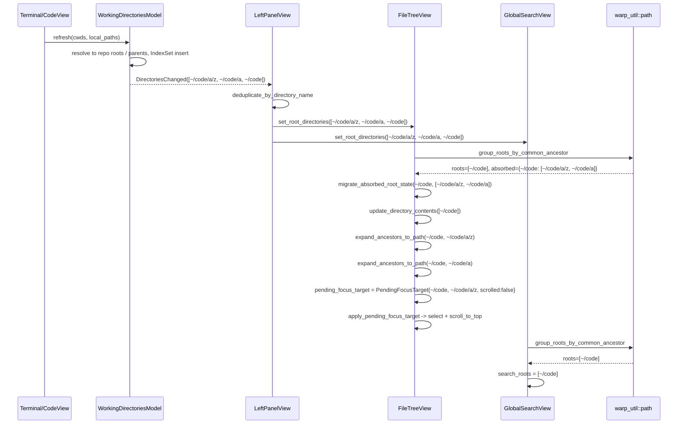

# APP-4106: Tech Spec

Linear: https://linear.app/warpdotdev/issue/APP-4106/group-by-shared-root-in-file-tree
Product spec: `specs/APP-4106/PRODUCT.md`

## Problem

`FileTreeView` treats every working-directory path emitted by
`WorkingDirectoriesModel` as a separate top-level root, even when one path is
a strict ancestor of another. Upstream deduplication
(`deduplicate_by_directory_name` in `left_panel.rs`) only removes exact
duplicates; the view itself has no ancestor-awareness. `GlobalSearchView`
already does this with a private `deduplicate_search_roots`, so the two
panels disagree on what the active roots are for the same pane group.

The implementation needs to (a) collapse descendants into their ancestor in
the file tree's displayed-root set, (b) auto-expand the ancestor chain down
to each absorbed descendant while respecting explicit collapses, (c) migrate
per-root state (expansion, explicit collapse, selection) when a previously
top-level root gets absorbed, and (d) share the core ancestor-dedup logic
between file tree and global search.

## Relevant code

- `app/src/code/file_tree/view.rs` — `FileTreeView`; owns `displayed_directories`
  and per-root state.
  - `set_root_directories` (~763–792) — entry point from `LeftPanelView`.
  - `update_directory_contents` (~805–884) — per-path init, lazy-load
    registration, auto-expand of the "last" directory.
  - `expand_ancestors_to_path` (~698–739) — expands ancestors of a path,
    short-circuits on explicit collapse. Reusable as-is.
  - `auto_expand_to_most_recent_directory` (~1615–1660) — today selects and
    scrolls to the first displayed root; we'll generalize the scroll target
    to a specific descendant path when absorption happened.
  - `scroll_to_file` (~667–694) — scrolls to a `FileTreeIdentifier`; we'll
    reuse the lookup logic to select a directory header by path.
  - `find_deepest_root_for_file` (~657–663) — already picks the deepest
    containing root for editor focus. Works unchanged once roots are
    ancestor-deduped.
  - `insert_or_update_remote_root` (~372–426) — remote path's own
    ancestor/descendant sweep. Untouched by this change; we gate the new
    grouping to `!is_remote()` roots.
  - `explicitly_collapsed` (~282) — per-root `HashSet<StandardizedPath>`.
    Must be migrated when a root is absorbed.
  - `registered_lazy_loaded_paths` (~287) — per-view `HashSet` of paths
    registered with `RepoMetadataModel`. Absorbed descendants that were
    lazy-registered must be unregistered.
- `app/src/workspace/view/global_search/view.rs:147` — `deduplicate_search_roots`.
  Will be removed; caller at `:1004` will use the shared helper.
- `app/src/workspace/view/left_panel.rs:1213` — `deduplicate_by_directory_name`
  stays. It feeds both file tree and global search the full
  path-deduplicated list; ancestor dedup happens inside each view (the file
  tree needs the absorbed descendants to drive auto-expand, so it can't
  happen upstream).
- `crates/warp_util/src/path.rs` + `path_test.rs` — target location for the
  shared `group_roots_by_common_ancestor` helper.
- `crates/warp_util/src/standardized_path.rs` — `StandardizedPath` impls
  `AsRef<Path>` and `starts_with(&StandardizedPath)`; usable directly with the
  shared helper.

## Current state

`WorkingDirectoriesModel::refresh_working_directories_for_pane_group` (in
`app/src/pane_group/working_directories.rs`) resolves each terminal cwd and
each code-view file path to its git repo root (or the path itself / the
file's parent if there is no repo) and maintains an ordered `IndexSet` per
pane group. The model emits `WorkingDirectoriesEvent::DirectoriesChanged`
with those paths in most-recent-first order.

`LeftPanelView` subscribes to that event (and also reads state in
`set_active_pane_group`), runs `deduplicate_by_directory_name`, then calls
`FileTreeView::set_root_directories(paths)` and
`GlobalSearchView::set_root_directories(paths)`.

`FileTreeView::set_root_directories` stores the full list in
`displayed_directories`, retains matching entries in `root_directories`, and
calls `update_directory_contents` which lazily registers non-repo paths
through `RepoMetadataModel` and optionally expands the "last" directory.

`GlobalSearchView::set_root_directories` runs `deduplicate_search_roots` over
the incoming paths (ancestor-dedup) and stores the result as `search_roots`.
This is the behavior we want to reuse in the file tree.

## Proposed changes

### 1. Shared helper in `warp_util::path`

Add a generic ancestor-dedup helper usable by both views.

```rust path=null start=null
// crates/warp_util/src/path.rs

use std::collections::HashMap;
use std::path::{Path, PathBuf};

/// Result of grouping a set of root paths by ancestor/descendant relationship.
#[derive(Debug, Clone)]
pub struct RootGrouping<P> {
    /// Ancestor-deduped set of roots, preserving the input order of
    /// surviving entries.
    pub roots: Vec<P>,
    /// For each surviving root, the input paths that were absorbed because
    /// they were strict descendants of that root. Recorded in input order.
    pub absorbed_by_root: HashMap<PathBuf, Vec<P>>,
}

/// Returns the ancestor-deduped set of `roots`. If any input path has an
/// ancestor already present in the set, it is dropped from `roots` and
/// recorded in `absorbed_by_root` under its closest surviving ancestor.
///
/// Equality is treated as "already present" (not "ancestor"), so duplicate
/// inputs collapse to one surviving entry with an empty absorbed list.
///
/// Order: `roots` preserves the order of `roots_most_recent_first` for
/// surviving entries.
pub fn group_roots_by_common_ancestor<P>(
    roots_most_recent_first: &[P],
) -> RootGrouping<P>
where
    P: AsRef<Path> + Clone,
{
    // Two-pass algorithm:
    //
    // 1. Decide survivors by sorting by component count ascending, then
    //    keep a path only if no already-accepted path is an ancestor.
    //    O(n log n) time.
    // 2. Re-order survivors to match the input order; bucket absorbed
    //    descendants under their closest surviving ancestor.
    // ...
}
```

Place unit tests next to the impl in `crates/warp_util/src/path_test.rs`
(following the existing `_test.rs` convention in that crate).

### 2. Thin `StandardizedPath` wrapper in the file tree

`StandardizedPath` implements `AsRef<Path>`, so the shared helper accepts it
directly. The file tree needs the result back in `StandardizedPath`, so it
builds a small adapter inside `view.rs`:

```rust path=null start=null
// app/src/code/file_tree/view.rs

fn group_std_roots_by_common_ancestor(
    roots: &[StandardizedPath],
) -> RootGrouping<StandardizedPath> {
    warp_util::path::group_roots_by_common_ancestor(roots)
}
```

The `absorbed_by_root` map is keyed by `PathBuf` in the shared helper; inside
the file tree we index into it via `ancestor.to_path_buf()` to get the
absorbed `Vec<StandardizedPath>`.

### 3. `FileTreeView::set_root_directories` (core change)

Pseudocode for the new flow:

```rust path=null start=null
pub fn set_root_directories(
    &mut self,
    paths: Vec<PathBuf>,
    ctx: &mut ViewContext<Self>,
) {
    let incoming: Vec<StandardizedPath> = paths
        .iter()
        .filter_map(|p| StandardizedPath::try_from_local(p).ok())
        .collect();

    // Preserve remote roots as-is; grouping only runs on local roots.
    let (remote_roots, local_inputs): (Vec<_>, Vec<_>) = incoming
        .into_iter()
        .partition(|p| self.root_directories.get(p).is_some_and(|r| r.is_remote()));

    let grouping = group_std_roots_by_common_ancestor(&local_inputs);

    // Final displayed order: local grouped roots (most-recent-first) then
    // any remote roots in their original incoming order.
    let new_displayed: Vec<StandardizedPath> = grouping
        .roots
        .iter()
        .cloned()
        .chain(remote_roots.iter().cloned())
        .collect();

    // ---- State migration for local roots that are being absorbed ----
    for (ancestor, absorbed) in &grouping.absorbed_by_root {
        let ancestor_std = StandardizedPath::try_from_path(ancestor).unwrap();
        self.migrate_absorbed_root_state(&ancestor_std, absorbed, ctx);
    }

    // ---- Unregister lazy-loaded paths that no longer survive ----
    #[cfg(feature = "local_fs")]
    {
        let removed: Vec<StandardizedPath> = self
            .registered_lazy_loaded_paths
            .iter()
            .filter(|p| !new_displayed.contains(p))
            .cloned()
            .collect();
        for path in removed {
            self.remove_lazy_loaded_entry(&path, ctx);
        }
    }

    // ---- Retain and update displayed state ----
    self.root_directories.retain(|root, _| new_displayed.contains(root));
    self.displayed_directories = new_displayed.clone();

    #[cfg(feature = "local_fs")]
    {
        let new_last_directory = paths.last() /* raw-input last */
            != self.last_seen_raw_last_directory.as_ref();
        self.update_directory_contents(&new_displayed, new_last_directory, ctx);
    }

    // ---- Auto-expand absorbed descendants ----
    for (ancestor, absorbed) in &grouping.absorbed_by_root {
        let ancestor_std = StandardizedPath::try_from_path(ancestor).unwrap();
        for descendant in absorbed {
            self.expand_ancestors_to_path(&ancestor_std, descendant, ctx);
        }
    }

    // ---- Focus-follow on the most recent absorbed descendant ----
    // `grouping.absorbed_by_root[&first_local_root]` preserves input order;
    // the most-recent absorbed is the first entry (if any).
    if let Some(first_local) = grouping.roots.first() {
        if let Some(absorbed) = grouping
            .absorbed_by_root
            .get(first_local.as_ref())
        {
            if let Some(most_recent) = absorbed.first() {
                self.select_directory_header_by_path(first_local, most_recent, ctx);
            }
        }
    }
}
```

Key details:

- `migrate_absorbed_root_state` (new helper) merges `expanded_folders`,
  `item_states`, and `explicitly_collapsed` from each absorbed descendant's
  previous `RootDirectory` (if one existed) into the surviving ancestor's
  `RootDirectory`. It also remaps `self.selected_item` when the selection's
  `root` matches an absorbed path.
- `select_directory_header_by_path` (new helper) finds the item index for a
  given directory path inside a surviving root's flattened `items` (after
  rebuild) and calls `select_id` with the resulting `FileTreeIdentifier`.
  This reuses the selection-scroll plumbing already used by
  `scroll_to_file`.

### 4. Selection remapping

`FileTreeIdentifier { root, index }` assumes `root` is stable. After an
absorption:

- Before `rebuild_flattened_items`, capture the previously-selected item's
  path: `let prev_selected_path = self.selected_item_std_path();`
- Note the absorbed source root: if `self.selected_item.as_ref().map(|id| &id.root)` is in
  `grouping.absorbed_by_root.values().flat_map(|v| v.iter())`, the selection
  needs a remap.
- After `rebuild_flattened_items`, re-locate the captured path in the new
  surviving root's items and set `self.selected_item` accordingly. If the
  path is not found (e.g., it's collapsed under an explicit-collapse link),
  clear selection.

This mirrors the pattern already in
`rebuild_flatten_items_and_select_path`, which walks items and remaps an
index by path.

### 5. State migration helper

```rust path=null start=null
fn migrate_absorbed_root_state(
    &mut self,
    ancestor: &StandardizedPath,
    absorbed: &[StandardizedPath],
    ctx: &mut ViewContext<Self>,
) {
    // Make sure the ancestor entry exists.
    self.root_directories.entry(ancestor.clone()).or_insert_with(|| {
        RootDirectory {
            entry: Self::create_empty_entry(ancestor),
            expanded_folders: HashSet::new(),
            items: Vec::new(),
            item_states: HashMap::new(),
            remote_host_id: None,
        }
    });

    for absorbed_root in absorbed {
        // Remove the absorbed root's RootDirectory, if any.
        let Some(old) = self.root_directories.remove(absorbed_root) else {
            continue;
        };

        // Merge expanded folders.
        if let Some(ancestor_dir) = self.root_directories.get_mut(ancestor) {
            ancestor_dir.expanded_folders.extend(old.expanded_folders);
            for (path, state) in old.item_states {
                ancestor_dir.item_states.entry(path).or_insert(state);
            }
        }

        // Merge explicit collapses.
        if let Some(collapsed) = self.explicitly_collapsed.remove(absorbed_root) {
            self.explicitly_collapsed
                .entry(ancestor.clone())
                .or_default()
                .extend(collapsed);
        }
    }

    // (selection remap happens after rebuild, in set_root_directories)
}
```

### 6. `GlobalSearchView::set_root_directories`

Replace the private `deduplicate_search_roots` call with the shared helper:

```rust path=null start=null
pub fn set_root_directories(&mut self, roots: Vec<PathBuf>, _ctx: &mut ViewContext<Self>) {
    let grouping = warp_util::path::group_roots_by_common_ancestor(&roots);
    self.search_roots = grouping.roots;
    self.root_directories = roots;
}
```

Delete the private `deduplicate_search_roots` function. Global Search does
not need the `absorbed_by_root` map; discarding it is fine.

### 7. Remote roots

Skip grouping for remote roots by partitioning the incoming list in step 3
above. `insert_or_update_remote_root` stays as-is. This preserves the
"remote new root wins" sweep without interacting with the new local
grouping.

### 8. Focus-follow target and selection preservation

When the user cds into an active path that is absorbed into an ancestor, we
want that new cwd visible and selected. The "most recent" absorbed
descendant for the first surviving local root is defined as the first entry
in `absorbed_by_root[first_local_root]` (which preserves input order, and
the input is most-recent-first).

`FileTreeView` stores a `pending_focus_target: Option<PendingFocusTarget>`
field:

```rust path=null start=null
struct PendingFocusTarget {
    root: StandardizedPath,
    path: StandardizedPath,
    /// True after the target has driven a scroll. First apply scrolls
    /// via `perform_scroll_to_top`; later re-applies preserve selection
    /// but do NOT scroll, so user scrolling is respected.
    scrolled: bool,
}
```

#### Setting the target

At the end of `set_root_directories`, for the first surviving local root
that has absorbed descendants, we record a `PendingFocusTarget` pointing
at the most-recent absorbed descendant and then call
`apply_pending_focus_target` immediately.

Two short-circuits suppress recording the target:

- **Current selection is already at or under the descendant.** This
  covers the case where the user just clicked a file in the tree, the
  code view opened it, and `DirectoriesChanged` fires with the file's
  parent (or repo root) added. The user's file-level selection is more
  specific than the generic cwd-follow target; we keep it.
- **No absorbed descendants** for the first surviving local root. No
  focus-follow needed.

#### Applying the target

`apply_pending_focus_target` does nothing if no target is set. Otherwise
it:

1. Drops the target if its `root` is no longer in `displayed_directories`.
2. Looks up the descendant path in the surviving root's flattened items
   via `find_directory_header_id`. If the item is not yet materialized
   (e.g. the ancestor is still indexing), returns `false` and leaves the
   target in place for a later retry.
3. Sets `selected_item` to the resolved `FileTreeIdentifier`.
4. On the first successful apply only (`!target.scrolled`), calls
   `perform_scroll_to_top(id)` to place the descendant's directory
   header at the top of the viewport, then sets `scrolled = true`.

Scrolling only on the first apply is the mechanism that satisfies
PRODUCT.md Invariants 5 and 9: the initial cd lands the cwd at the top;
later rebuilds preserve selection but leave the scroll position alone.

#### Scroll-to-top implementation

`FileTreeView::perform_scroll_to_top(id)` differs from the existing
`perform_scroll` (which uses `UniformListState::scroll_to(item_ix)` and
only scrolls far enough to make the item visible). It computes the delta
between the current `UniformListState::scroll_top()` and the target item
index, then calls `add_scroll_top(delta)`, so the target row lands at the
top of the viewport. Clamping against the scrollable bounds is handled
by the existing state (`add_scroll_top` clamps against zero; layout-time
`autoscroll` clamps against `scroll_max`).

#### Re-application on metadata events

The target is re-applied whenever the tree could newly materialize the
descendant's entry:

- At the end of `set_root_directories`.
- In `handle_repository_metadata_event::RepositoryUpdated` (Local),
  *after* the existing `auto_expand_to_most_recent_directory` call, so
  the cwd-follow wins over the default root-header selection.
- In `handle_repository_metadata_event::FileTreeEntryUpdated` (Local),
  after the rebuild.

The target is preserved across successful applies (only the `scrolled`
flag flips) so a later generic rebuild cannot steal focus back to the
root header. It is cleared when:

- The target root stops being displayed.
- The user takes an explicit focus-changing action — both `select_id`
  and `toggle_folder_expansion` clear the target.
- A subsequent `set_root_directories` call either sets a new target or
  (due to one of the short-circuits above) resets it to `None`.

### 9. `auto_expand_to_most_recent_directory` override policy

The existing `auto_expand_to_most_recent_directory` unconditionally
re-selected `{first_displayed_root, index: 0}` on every call. That caused
two user-visible glitches under the new cd-follow flow:

- After `set_root_directories` landed selection on the cwd subdirectory,
  the left panel's subsequent call to `auto_expand_to_most_recent_directory`
  clobbered it back to the root header for a frame until
  `ActiveFileChanged`/`scroll_to_file` re-selected the opened file.
- On repo-metadata updates, the same clobber reset the user's selection
  on every file-watcher event.

`auto_expand_to_most_recent_directory` now only falls back to selecting
the root header when:

- `selected_item` is `None`, OR
- `selected_item.root` is not the current most-recent root (i.e. a
  brand-new unrelated root just became most-recent on cd).

Otherwise it preserves the existing selection. The expand-root step
still runs unconditionally.

This satisfies PRODUCT.md Invariants 10 and 11: explicit selections are
preserved, but cd-ing to a brand-new top-level root moves focus to it.

## End-to-end flow



## Risks and mitigations

1. **Selection / identifier churn** after absorption. `FileTreeIdentifier`
   holds `{ root, index }`; both can change when a root is absorbed.
   Mitigation: capture the selected item's absolute path before rebuild,
   then re-locate by path after rebuild. Existing
   `rebuild_flatten_items_and_select_path` already handles this pattern
   for in-place rebuilds; we extend the capture point to run across
   rebuilds that change the surviving-root set.

2. **Lazy-loaded watcher leaks** for absorbed descendants that were
   previously registered standalone with `RepoMetadataModel`. Mitigation:
   explicitly `remove_lazy_loaded_entry` for every path in
   `registered_lazy_loaded_paths` that is not in the new
   `displayed_directories`. Already covered by an equivalent filter today
   for non-absorbed path removal; extend it to cover the absorbed case.

3. **Explicit-collapse regression**. `expand_ancestors_to_path` already
   halts at the first explicitly-collapsed parent. We rely on that; new
   tests pin the behavior.

4. **Remote vs. local collision**. We only run grouping on local roots.
   `insert_or_update_remote_root` continues to mutate `displayed_directories`
   directly; if a remote push later inserts a root that happens to be a
   descendant of a local root (or vice versa), the remote sweep wins, as
   today. This matches current behavior and PRODUCT.md Invariant 7.

5. **Ancestor helper correctness on `/a` vs `/ab`**. `Path::starts_with`
   already operates on path components, not string prefix, so `/a` is not
   considered an ancestor of `/ab`. Unit tests in the shared helper pin
   this.

6. **Scroll-snap fighting the user.** A naive cd-follow that re-scrolls
   on every rebuild fights the user's scroll position when repo-metadata
   events fire. Mitigation: `PendingFocusTarget.scrolled` ensures scroll
   happens exactly once per cd target; selection is preserved on later
   applies but scroll is not re-touched.

7. **Click-then-open clobbering the click selection.** When the user
   clicks a file in the tree, the code view opens it, which emits
   `DirectoriesChanged` with the file's parent added. A naive
   implementation would set a cd-follow to the parent and override the
   user's file selection. Mitigation: `set_root_directories` suppresses
   the pending focus target when the current selection is already at or
   under the would-be descendant target.

8. **Stale selection after cd to unrelated root.** The
   `auto_expand_to_most_recent_directory` override policy must still
   move selection when the most-recent root changes. We check
   `selected_item.root != most_recent_dir` before preserving.

## Testing and validation

### Unit tests (`crates/warp_util/src/path_test.rs`)

- `group_roots_by_common_ancestor`:
  - Empty input → empty grouping.
  - Single path → itself, no absorbed.
  - Unrelated siblings preserved: `[/a, /b]` → roots `[/a, /b]`, no
    absorbed.
  - Ancestor + descendant: `[/a/b, /a]` → roots `[/a]`, absorbed
    `{/a: [/a/b]}` (absorbed order matches input order).
  - Three-deep chain: `[/a/b/c, /a/b, /a]` → roots `[/a]`, absorbed
    `{/a: [/a/b/c, /a/b]}`.
  - Mixed groups: `[/a, /x, /a/b, /x/y]` → roots `[/a, /x]`, absorbed
    `{/a: [/a/b], /x: [/x/y]}`.
  - Same-prefix-different-name: `[/foo/a, /foo/abc]` → both kept.
  - Duplicate input: `[/a, /a]` → roots `[/a]`, no absorbed.
  - Surviving-root input order preserved across interleaved descendants.

### View-level tests (`app/src/code/file_tree/view/view_tests.rs`)

Using the `VirtualFS::test` harness already used by the existing tests:

- **Absorb on second call**: set roots `[~/code/a]`, then set roots
  `[~/code]`. Assert `displayed_directories == [~/code]`,
  `~/code/a`'s `expanded_folders` and `explicitly_collapsed` are merged
  into `~/code`, and the previously-registered lazy-loaded entry for
  `~/code/a` is unregistered.
- **Auto-expand chain**: set roots `[~/code]`, then set roots
  `[~/code/a/z, ~/code]`. Assert `~/code/a` and `~/code/a/z` are in
  `expanded_folders`.
- **Respect explicit collapse**: set roots `[~/code]` with `~/code/a`
  explicitly collapsed, then set roots `[~/code/a/z, ~/code]`. Assert
  `~/code/a` stays in `explicitly_collapsed` and is NOT expanded, and
  `~/code/a/z` is NOT expanded (blocked by the collapsed link).
- **Sibling preservation**: set roots `[~/code/a, ~/code/b]`. Assert both
  are kept as top-level roots.
- **Focus-follow on cd**: simulate cd-ing into `~/code/warp-server` with
  `~/code` as the ancestor. Assert `selected_item` lands on
  `~/code/warp-server`, and `pending_focus_target.scrolled` is `true`.
  After a subsequent `select_id` on an unrelated item, pending clears.
- **No re-scroll on rebuild**: after initial apply, trigger a rebuild
  and re-apply. Assert selection is re-set to the cwd but
  `pending_focus_target.scrolled` stays `true` (no re-scroll).
- **Click preserves file selection**: seed `~/code`, expand
  `~/code/warp-server`, select `main.rs`. Simulate a
  `DirectoriesChanged` emitting `[warp-server, code]`. Assert selection
  stays on `main.rs` and no `pending_focus_target` is set.
- **Cd to new unrelated root**: with `~/code` selected, call
  `set_root_directories` with `[~/other, ~/code]` and invoke
  `auto_expand_to_most_recent_directory`. Assert selection moves to
  `~/other`'s root header.
- **Auto-expand preserves existing selection**: select a subdirectory,
  then call `auto_expand_to_most_recent_directory`. Assert the
  subdirectory selection is preserved (not clobbered to the root
  header).
- **Lazy-loaded cleanup**: previously top-level `~/code/a` registered
  lazy-loaded gets unregistered after absorption into `~/code`.

### Cross-view parity

Because both views now call
`warp_util::path::group_roots_by_common_ancestor`, their surviving-root
sets agree by construction. The shared helper's unit tests cover the
path-shape behavior for both consumers.

### Manual validation

`verify-ui-change-in-cloud` runs per the PRODUCT.md validation section,
which includes the new scroll-preservation and click-preservation
checks.

## Follow-ups

- Consider exposing `RootGrouping` through the `WorkingDirectoriesModel`
  itself so both consumers can read an already-grouped version. Not blocking
  for this change; keeping it view-local avoids the model knowing about
  remote-vs-local distinctions.
- Consider making the ancestor helper available to other consumers that
  currently re-implement ancestor checks (search for `starts_with` on path
  collections) as a follow-up cleanup.
- Add a subtle UI affordance (e.g., a label next to the root or a highlight
  on the cwd directory) when a descendant has been absorbed, if users find
  the grouping ambiguous post-rollout.
