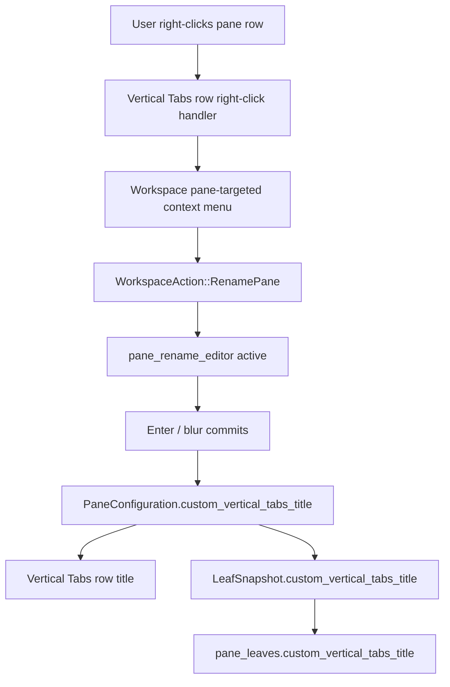

# APP-4114: Tech Spec — Custom Pane Names in Vertical Tabs

## Problem

APP-4114 adds user-authored names for individual panes in Vertical Tabs. The implementation needs to introduce pane-scoped naming without reusing tab-scoped state too broadly:

- tab rename already exists and is stored on `PaneGroup`
- pane rows already derive generated titles from each pane's `PaneConfiguration` and terminal metadata
- `View as = Tabs` focused-session rows reuse pane-row renderers but their rename entry points remain tab-scoped
- hover sidecar and pane headers must continue showing generated pane detail, not custom pane names

The technical problem is to add a pane-scoped title override that follows pane ownership and persistence boundaries, then thread it only into Vertical Tabs row title/search rendering.

## Relevant code

- `specs/APP-4114/PRODUCT.md` — agreed user-facing behavior.
- `app/src/workspace/action.rs (90-116)` — tab rename actions and tab context menu action shape.
- `app/src/workspace/action.rs (650-710)` — `should_save_app_state_on_action`, where rename-style actions are treated as workspace-state changes.
- `app/src/workspace/util.rs (88-236)` — `WorkspaceState` and the existing `tab_being_renamed` state pattern.
- `app/src/workspace/view.rs (1000-1260)` — construction and event handling for `tab_rename_editor`.
- `app/src/workspace/view.rs (4775-4832)` — `rename_tab`, `finish_tab_rename`, `cancel_tab_rename`, and editor prefill behavior.
- `app/src/workspace/view.rs (6024-6048)` — tab context menu population via `TabData::menu_items`.
- `app/src/tab.rs (248-320)` — tab context menu items, including `Rename tab` and `Reset tab name`.
- `app/src/workspace/view/vertical_tabs.rs (319-425)` — shared pane-row wrapper for click, hover sidecar targeting, and tab double-click rename in Tabs mode.
- `app/src/workspace/view/vertical_tabs.rs (1455-1778)` — render/search selection for Panes, Focused session, and Summary modes.
- `app/src/workspace/view/vertical_tabs.rs (1778-2015)` — tab-group right-click and kebab action wiring.
- `app/src/workspace/view/vertical_tabs.rs (3123-3224)` — `render_title_override`, which currently handles tab title overrides and inline tab rename.
- `app/src/workspace/view/vertical_tabs.rs (5468-5755)` — compact row title rendering where `Pane title as` is applied.
- `app/src/pane_group/pane/mod.rs (661-815)` — `PaneConfiguration`, the pane-owned model for title-like pane metadata.
- `app/src/pane_group/mod.rs (6228-6382)` — pane attachment and `PaneConfigurationEvent::TitleUpdated` propagation to workspace.
- `app/src/pane_group/mod.rs (4596-4735)` — tab-level `display_title`, `set_title`, and `clear_title`.
- `app/src/pane_group/mod.rs (3995-4138)` — pane move APIs; moved pane contents preserve their `PaneConfiguration`.
- `app/src/pane_group/mod.rs (1450-1955)` — restore each `LeafSnapshot` into a concrete pane and `PaneId`.
- `app/src/pane_group/mod.rs (2032-2072)` — snapshot each leaf pane for app-state persistence.
- `app/src/app_state.rs (108-135)` — `LeafSnapshot`, the pane-leaf snapshot boundary.
- `app/src/persistence/sqlite.rs (801-842)` — saving `LeafSnapshot` to `pane_leaves`.
- `app/src/persistence/sqlite.rs (2355-2675)` — reading `pane_leaves` back into `LeafSnapshot`.
- `crates/persistence/src/schema.rs (300-304)` — current `pane_leaves` schema.
- `crates/persistence/src/model.rs (371-393)` — `PaneLeaf` / `NewPane` persistence models.
- `app/src/workspace/view/vertical_tabs_tests.rs (1-420)` — current home for vertical-tabs pure helper tests.
- `app/src/persistence/sqlite_tests.rs (117-260)` — existing SQLite round-trip tests for pane snapshots.

## Current state

### Tab rename is tab-scoped

Tab rename uses:

- `WorkspaceAction::RenameTab(usize)` to start editing
- `WorkspaceState::tab_being_renamed` to track the active editor target
- one `tab_rename_editor: ViewHandle<EditorView>` on `Workspace`
- `PaneGroup::custom_title: Option<String>` for persisted tab-level title state
- `TabSnapshot.custom_title` and the `tabs.custom_title` SQLite column for restoration

This flow is intentionally tab-level. In Vertical Tabs, group headers and kebab/overflow menus dispatch the same tab rename action. `View as = Tabs` also passes a `renamable_tab_index` into pane-row rendering so double-clicking the representative row opens the tab rename editor.

### Pane row titles are generated

Vertical Tabs builds `PaneProps` from a `PaneId` and the pane's `PaneConfiguration`. `PaneProps::new` computes:

- `title`
- `subtitle`
- `typed`
- focus/selection state
- optional `display_title_override` for tab-level override behavior in flat Tabs mode

The row renderers then decide which generated value to show based on `Pane title as`, density, and pane type. Terminal rows use terminal metadata and `VerticalTabsPrimaryInfo`; non-terminal rows generally use `props.displayed_title()`.

### Focused-session Tabs mode reuses pane rows

`View as = Tabs` with `Tab item = Focused session` still renders a pane-derived row for the tab's focused pane. The row is tab-scoped for rename interactions, but pane-scoped for metadata. This is why an existing custom pane name should be visible there while rename actions remain tab rename actions.

### Hover sidecar uses pane detail data

The hover sidecar is driven by `VerticalTabsDetailTarget` and detail render helpers. It should keep using generated pane detail data. Custom pane names must not be threaded into detail-sidecar section titles or summary content.

### Pane ownership and persistence

Live pane content owns a `PaneConfiguration` model. When a pane is moved between tabs, `remove_pane_for_move` returns the pane content and `add_pane_as_hidden` inserts the same content into the destination group, so data stored in the pane's `PaneConfiguration` naturally moves with the pane.

Persistence is separate. App-state snapshots store pane leaves in `LeafSnapshot`; SQLite persists those leaves through `pane_leaves` and kind-specific pane tables. Because `PaneId` is recreated during restoration, persisted pane custom names should live on each `LeafSnapshot`, not in a persisted `HashMap<PaneId, String>`.

## Proposed changes

### 1. Store live custom names on `PaneConfiguration`

Add a pane-row-only custom title field to `PaneConfiguration`:

```rust
custom_vertical_tabs_title: Option<String>,
```

Add APIs:

```rust
pub fn custom_vertical_tabs_title(&self) -> Option<&str>;
pub fn set_custom_vertical_tabs_title(&mut self, title: impl Into<String>, ctx: &mut ModelContext<Self>);
pub fn clear_custom_vertical_tabs_title(&mut self, ctx: &mut ModelContext<Self>);
```

Setter behavior:

- trim leading/trailing whitespace
- store `None` for an empty string
- no-op if the normalized value did not change
- emit a pane-configuration event that causes Vertical Tabs to re-render
- do not emit `HeaderContentChanged`, because pane headers must not show this title

Recommended event shape:

```rust
pub enum PaneConfigurationEvent {
    // existing variants...
    VerticalTabsTitleUpdated,
}
```

Then update `PaneGroup::attach_pane` to treat `TitleUpdated` and `VerticalTabsTitleUpdated` as `Event::PaneTitleUpdated`. This keeps the workspace and Vertical Tabs repaint path simple without refreshing pane headers.

This design is preferable to storing a `HashMap<PaneId, String>` on `PaneGroup` because it preserves names when pane contents move between tabs.

### 2. Persist custom names on `LeafSnapshot`

Extend `LeafSnapshot`:

```rust
pub struct LeafSnapshot {
    pub is_focused: bool,
    pub custom_vertical_tabs_title: Option<String>,
    pub contents: LeafContents,
}
```

Snapshot flow:

- In `PaneGroup::snapshot_for_node`, read `pane.as_pane().pane_configuration().as_ref(app).custom_vertical_tabs_title()`.
- Store that value on the `LeafSnapshot`.
- Do not put this field on `LeafContents`; it is pane-leaf metadata that applies uniformly to all pane types.

Restore flow:

- When `restore_pane_leaf` creates a real pane and `PaneId`, apply `leaf.custom_vertical_tabs_title` to the restored pane's `PaneConfiguration`.
- For deferred AI document panes, preserve the title in the deferred `LeafSnapshot` and apply it after the placeholder is replaced with the real pane.
- For invalid/unrestorable leaves, the title is naturally dropped with the pane.

SQLite flow:

- Add a migration that adds `custom_vertical_tabs_title TEXT` to `pane_leaves`.
- Update `crates/persistence/src/schema.rs` for the new nullable column.
- Update `crates/persistence/src/model.rs`:
  - `PaneLeaf` gets `custom_vertical_tabs_title: Option<String>`
  - `NewPane` gets `custom_vertical_tabs_title: Option<String>`
- Update `save_pane_state` to write `snapshot.custom_vertical_tabs_title.clone()`.
- Update `read_node` to populate `LeafSnapshot.custom_vertical_tabs_title`.
- Update tests that construct `LeafSnapshot` literals.

### 3. Add pane rename workspace state and editor

Add pane rename state alongside tab rename state:

```rust
pane_being_renamed: Option<PaneViewLocator>,
```

Add methods on `WorkspaceState` mirroring the tab helpers:

- `is_pane_being_renamed`
- `set_pane_being_renamed`
- `clear_pane_being_renamed`
- `pane_being_renamed`

Add a separate `pane_rename_editor: ViewHandle<EditorView>` to `Workspace` rather than reusing `tab_rename_editor`. The pane editor should use the 12px row-title size used by compact/expanded pane rows, while `tab_rename_editor_font_size` already varies between header-like and row-like tab rename states.

Editor event handling should mirror tab rename:

- `Enter` or `Blurred` commits
- `Escape` cancels
- commit trims and saves through `PaneConfiguration::set_custom_vertical_tabs_title`
- unchanged value leaves state unchanged
- empty value clears the custom pane name
- after commit/cancel, clear the editor buffer and focus the active tab/pane

Ensure only one inline rename editor is active:

- starting tab rename clears any pane rename state
- starting pane rename clears any tab rename state
- `WorkspaceState::close_all_modals` clears both states

### 4. Add pane rename actions

Add a new action:

```rust
WorkspaceAction::RenamePane(PaneViewLocator)
```

Optionally add `WorkspaceAction::ResetPaneName(PaneViewLocator)` only if the UI includes an explicit reset item. The current product spec only requires clearing via whitespace submission, so this can be deferred unless needed for parity with tab reset.

Handle `RenamePane` in `Workspace::handle_action`:

1. find the target `PaneGroup` by `pane_group_id`
2. verify the pane still exists in that group
3. activate the tab containing the pane if needed
4. focus the target pane
5. prefill `pane_rename_editor` with:
   - existing custom pane name, if present
   - otherwise the currently displayed generated pane-row title
6. set `pane_being_renamed`
7. focus the editor and notify

The prefill value should be computed from the same display helper used by `PaneProps` / row rendering. If the first implementation cannot easily get the exact generated title for every `Pane title as` branch, add a small helper in `vertical_tabs.rs` that returns the current main title text for a `PaneProps` in Panes mode, and unit-test the pure cases.

`RenamePane` and any commit path must save app state. Follow the existing rename-tab persistence pattern, but verify the final implementation saves after the committed pane name is applied. If action-level saving only captures the pre-edit state, emit `pane_group::Event::AppStateChanged` or dispatch the workspace save action from the commit path.

### 5. Route right-click pane rename by row location

Keep tab-group kebab behavior unchanged:

- `render_group_action_buttons` still dispatches `ToggleTabRightClickMenu` with `TabContextMenuAnchor::VerticalTabsKebab`
- `TabData::menu_items` still exposes tab-level `Rename tab`

For pane rows in `View as = Panes`, add row-specific right-click handling:

- add `on_right_click` to `render_pane_row_element`, or pass a right-click callback into it
- only enable the pane-targeted context menu when `props.display_granularity == VerticalTabsDisplayGranularity::Panes`
- dispatch a new action such as:

```rust
WorkspaceAction::ToggleVerticalTabsPaneContextMenu {
    tab_index: usize,
    pane: PaneViewLocator,
    position: Vector2F,
}
```

Implementation options:

- Reuse `tab_right_click_menu` and `show_tab_right_click_menu` by extending the stored context with an optional pane target.
- Or add a separate `vertical_tabs_pane_context_menu` view if keeping target-specific menu state separate is cleaner.

Prefer reusing the existing `Menu<WorkspaceAction>` instance unless the state shape becomes awkward. The menu is still a workspace-level context menu; only the target and first rename item differ.

Pane-row context menu contents:

- include `Rename pane`, wired to `WorkspaceAction::RenamePane(locator)`
- keep the rest of the existing tab-level menu items only if product/review expectations allow it
- do not show pane rename from tab group header right-click
- do not show pane rename from kebab / overflow
- do not show pane rename in `View as = Tabs`

Be careful with event propagation: the tab group currently has an `on_right_click` that opens the tab context menu. The row-level handler must prevent the parent group handler from also opening the tab menu, or the parent handler must ignore right-clicks already handled by children.

### 6. Wire double-click on pane title text in Panes mode

Do not attach pane rename double-click to the whole row. The product spec scopes it to title text.

Refactor title rendering into a title-slot helper that can wrap the rendered title element:

```rust
fn render_pane_title_slot(props: &PaneProps<'_>, generated_title: Box<dyn Element>, ...) -> Box<dyn Element>
```

The helper should:

- render the pane rename editor if `props.is_pane_being_renamed`
- otherwise render custom pane name if one exists
- otherwise render the generated title
- in `View as = Panes`, wrap the title text element with `on_double_click` dispatching `RenamePane`
- not add pane rename double-click in `View as = Tabs`
- not interfere with the existing row click-to-focus behavior

Keep existing tab rename double-click intact:

- `render_pane_row_element` continues using `renamable_tab_index` for `View as = Tabs`
- `render_group_header` continues dispatching `RenameTab`
- horizontal `TabComponent` remains unchanged

### 7. Add custom-title precedence to row rendering only

Extend `PaneProps` with:

```rust
custom_vertical_tabs_title: Option<String>,
is_pane_being_renamed: bool,
pane_rename_editor: Option<ViewHandle<EditorView>>,
```

Do not overwrite `PaneProps.title`. The generated title should remain available for:

- pane header behavior
- hover sidecar details
- Summary mode aggregation
- generated metadata/search fragments

Recommended title precedence for row main-title rendering:

1. active tab rename editor, when `props.is_tab_being_renamed`
2. active pane rename editor, when `props.is_pane_being_renamed`
3. `props.custom_vertical_tabs_title`
4. tab-level `props.display_title_override`
5. generated title from `Pane title as` / pane metadata

This precedence allows focused-session `View as = Tabs` to display an active pane's custom name while preserving tab rename interactions. When the tab rename editor is open in Tabs mode, the tab editor should take visual precedence.

Apply this helper anywhere the main pane row title is rendered:

- expanded terminal first line
- compact terminal title line
- compact non-terminal title
- expanded non-terminal title
- focused-session row in Tabs mode

Do not apply it to:

- `render_detail_sidecar_overlay`
- `render_detail_section`
- `build_vertical_tabs_summary_data`
- pane header code under `pane_group/pane/view/header`

### 8. Update search fragments

Search should match custom pane names without losing generated metadata search.

Update `PaneProps::rendered_search_text_fragments`:

- prepend `custom_vertical_tabs_title` when present
- keep existing generated fragments
- avoid duplicate generated/custom fragments if they are identical after trim

For terminal panes, do not pass the custom title as the terminal primary text replacement into `terminal_pane_search_text_fragments`; that would hide generated command/directory/branch metadata from search. Instead, add the custom title as an additional fragment around the existing generated fragments.

Focused-session `View as = Tabs` already searches through representative-pane `PaneProps`, so it will inherit this behavior when the active pane has a custom name.

Summary mode should not include custom pane names unless the product spec changes. Keep `summary_search_text_fragments` derived from summary data and tab custom title only.

### 9. Keep hover sidecar generated

The sidecar should use generated detail content. To avoid accidental leakage:

- keep `PaneProps.title` generated
- store custom pane name in a separate field
- ensure `render_detail_section` and detail helpers use generated fields, not the row-title helper
- add a unit test or focused assertion for the relevant pure helper if practical

This is the main reason not to mutate `PaneConfiguration.title()` or `PaneProps.title` with the custom pane name.

### 10. Telemetry

If product wants rename-pane usage tracked, add a telemetry event using the `add-telemetry` skill before implementation.

If telemetry is added, track:

- rename editor opened
- custom pane name committed
- custom pane name cleared
- entry point (`right_click`, `double_click`)

Do not block implementation on telemetry unless PM/review requests it.

## End-to-end flow

### Right-click rename in `View as = Panes`

1. User right-clicks a pane row.
2. Row-level right-click handler dispatches `ToggleVerticalTabsPaneContextMenu` with the target `PaneViewLocator`.
3. Workspace builds a context menu whose rename item dispatches `RenamePane(locator)`.
4. `RenamePane` verifies the pane still exists, focuses it, computes the editor prefill, and sets `pane_being_renamed`.
5. Vertical Tabs re-renders the target row title slot as `pane_rename_editor`.
6. User presses `Enter` or blurs.
7. Workspace commits the trimmed name into the target pane's `PaneConfiguration`.
8. Vertical Tabs re-renders the row with `custom_vertical_tabs_title`.
9. App state is saved with the custom name on that pane's `LeafSnapshot`.

### `View as = Tabs` display after a pane was named

1. User previously named pane A in `View as = Panes`.
2. User switches to `View as = Tabs` with `Tab item = Focused session`.
3. `pane_ids_for_display_granularity` selects the focused pane for the tab.
4. `PaneProps::new` reads pane A's `custom_vertical_tabs_title`.
5. The focused-session row renders pane A's custom name as the main title.
6. Double-clicking the title still dispatches `RenameTab`, because the row is tab-scoped for rename actions in Tabs mode.

## Diagram



## Risks and mitigations

### Accidentally renaming tabs from pane rows

Risk: The existing tab-group right-click handler may also fire after a pane-row right-click.

Mitigation: Add row-level right-click handling that stops propagation, or gate the group handler so handled child events do not open the tab context menu. Verify by right-clicking different pane rows in a multi-pane tab.

### Custom pane name leaking into pane headers or sidecar

Risk: Reusing `PaneConfiguration.title` or mutating `PaneProps.title` would affect headers and detail sidecar content.

Mitigation: Store custom pane title in a separate `PaneConfiguration` field, keep `PaneProps.title` generated, and only apply custom names in row title/search helpers.

### Losing names when panes move

Risk: A `PaneGroup`-level `HashMap<PaneId, String>` would not naturally move with pane content when a pane is dragged to another tab.

Mitigation: Store live custom names on `PaneConfiguration`, which is owned by pane content and moves with it.

### Persistence migration churn

Risk: Adding a column to `pane_leaves` touches central app-state persistence.

Mitigation: Keep the field nullable, add a focused migration, update Diesel schema/models, and add a SQLite round-trip test for a named pane.

### Saving pre-edit rather than committed state

Risk: If app-state persistence runs only when `RenamePane` opens the editor, the committed title may not be saved.

Mitigation: Verify the commit path triggers app-state persistence after setting `custom_vertical_tabs_title`; explicitly emit `AppStateChanged` or dispatch the save action if needed.

### `View as = Tabs` precedence confusion

Risk: Focused-session rows are tab-scoped for rename but pane-scoped for display metadata.

Mitigation: Keep title rendering precedence explicit and add tests/manual validation for the edge case where a named active pane appears in `View as = Tabs` while double-click still opens tab rename.

## Testing and validation

### Unit tests

Add/update tests in `app/src/workspace/view/vertical_tabs_tests.rs` for pure helpers:

- custom pane title search fragments include the custom name and generated metadata
- duplicate custom/generated search fragments are not duplicated
- title precedence chooses custom pane title over generated `Pane title as`
- Summary search fragments do not include custom pane names

Add/update workspace action tests in `app/src/workspace/action_tests.rs`:

- `RenamePane` should save workspace state, or add coverage for the chosen post-commit save path
- vertical-tabs settings actions remain unaffected

Add persistence coverage in `app/src/persistence/sqlite_tests.rs`:

- a `LeafSnapshot` with `custom_vertical_tabs_title: Some("server")` round-trips through SQLite
- `None` round-trips for existing unnamed panes

If snapshot literal churn is large, add small helper constructors for test snapshots rather than duplicating the new field everywhere.

### Manual validation

- In `View as = Panes`, right-click a non-focused pane row, choose `Rename pane`, and verify the right-clicked pane gets the editor.
- In `View as = Panes`, double-click title text and verify pane rename starts; double-clicking tab header still renames the tab.
- Set `Pane title as` to each option and verify a custom pane name remains the main title.
- Clear a custom pane name by submitting whitespace and verify generated title behavior returns.
- Switch to `View as = Tabs` / `Focused session`; focus a named pane and verify the representative row shows the custom name.
- In `View as = Tabs`, double-click the representative row title and verify it opens tab rename, not pane rename.
- Hover a named pane row and verify details sidecar content remains generated.
- Move a named pane to another tab and verify the name moves with it.
- Restart Warp and verify restored panes keep their custom names.

### Suggested command validation

After implementation, run targeted checks before broader presubmit:

```bash
cargo test -p warp_app vertical_tabs
cargo test -p warp_app persistence::sqlite_tests
cargo test -p warp_app workspace::action_tests
```

Before opening or updating a PR, follow repository rules for full validation with the prescribed fmt/clippy commands or presubmit flow. Do not run `cargo fmt --all` or file-scoped `cargo fmt`.

## Follow-ups

- Add a reset pane name menu item if users need parity with `Reset tab name`.
- Add telemetry for pane rename usage if product analytics needs it.
- Consider keyboard-accessible pane rename entry points if a keyboard navigation audit identifies a gap.
- Consider whether tab configs should encode custom pane names separately from session restoration. This spec only requires persisted workspace restoration.
