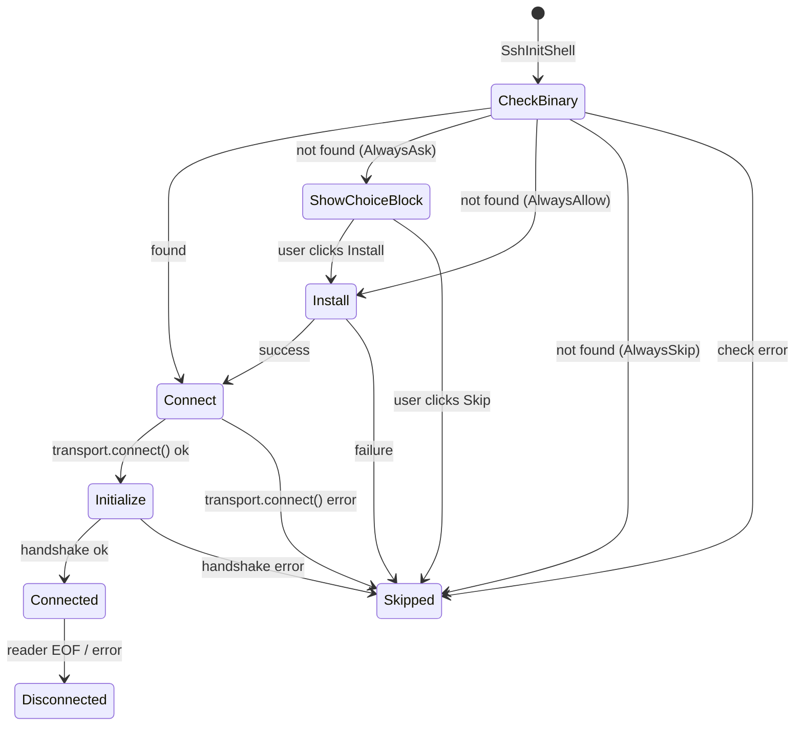

# TECH.md — Remote Server Reliability Telemetry (APP-4217)

## Context

The SSH remote server feature (gated behind `FeatureFlag::SshRemoteServer`) has no
telemetry. Before releasing beyond dogfood we need client-side reliability metrics
covering the full lifecycle: binary check → install → connect → initialize →
steady-state operation → disconnection.

Auth state is not yet passed to the remote server, so all tracking is client-side
via the existing `TelemetryEvent` infrastructure.

### Relevant code

- `crates/remote_server/src/manager.rs` — `RemoteServerManager` singleton; owns
  session lifecycle, emits `RemoteServerManagerEvent`
- `crates/remote_server/src/client/mod.rs` — `RemoteServerClient`; protocol I/O,
  reader/writer tasks, request/response correlation
- `crates/remote_server/src/transport.rs` — `RemoteTransport` trait
  (`check_binary`, `install_binary`, `connect`)
- `app/src/remote_server/ssh_transport.rs` — `SshTransport` implementation
- `app/src/terminal/writeable_pty/remote_server_controller.rs` —
  `RemoteServerController`; per-pane orchestrator for the SSH init flow
- `app/src/terminal/view.rs (4170-4217)` — `TerminalView` subscription to
  `RemoteServerManagerEvent`; converts manager events into terminal events and UI
- `app/src/server/telemetry/events.rs` — `TelemetryEvent` enum; each variant needs
  definition, `name()`, `description()`, `payload()`, `contains_ugc()`,
  `enablement_state()`

### Current lifecycle

Every `Skipped` path falls back to ControlMaster-based command execution.
Today none of these transitions emit telemetry.

## Reliability Metrics

Seven telemetry events covering every stage of the lifecycle:

### 1. Binary check outcome — `RemoteServerBinaryCheck`

Tracks whether the remote binary was found, not found, or the check itself failed
(SSH timeout, unreachable host). This is the entry point for every remote server
session.

| field | type | description |
|-------|------|-------------|
| `found` | `bool` | `true` if binary exists and is executable |
| `error` | `Option<String>` | set when `check_binary` returns `Err` |

Signals: check failure rate (SSH-level issues), install-needed rate.

### 2. Installation outcome — `RemoteServerInstallation`

Tracks whether the install script succeeded or failed.

| field | type | description |
|-------|------|-------------|
| `succeeded` | `bool` | |
| `error` | `Option<String>` | set on failure |

Signals: install success rate, common failure reasons.

### 3. Initialization outcome — `RemoteServerInitialization`

Tracks the two-phase connection flow: `transport.connect()` (SSH/process spawn)
and `client.initialize()` (protocol handshake). Distinguishing the phase helps
diagnose whether failures are transport-level or protocol-level.

| field | type | description |
|-------|------|-------------|
| `succeeded` | `bool` | |
| `phase` | `&'static str` | `"connect"` or `"initialize"` |
| `error` | `Option<String>` | set on failure |

Signals: connection success rate, breakdown of failure by phase.

### 4. Session disconnection — `RemoteServerDisconnection`

Tracks when an *established* connection drops (reader EOF or fatal error). This is
the most important stability signal — it tells us how reliable connections are
after successful setup.

No fields.

Signals: disconnection rate, connection stability.

### 5. Client request error — `RemoteServerClientRequestError`

Tracks when a request to the remote server fails (timeout, disconnect,
unexpected response, server error).

| field | type | description |
|-------|------|-------------|
| `operation` | `&'static str` | e.g. `"navigate_to_directory"`, `"run_command"` |
| `error_type` | `&'static str` | e.g. `"timeout"`, `"disconnected"`, `"server_error"` |

Signals: per-operation failure rate, error distribution.

### 6. Server message decoding error — `RemoteServerMessageDecodingError`

Tracks when the reader task receives a malformed server message with no parseable
`request_id` (messages with a `request_id` surface as `ClientError::Protocol` to
the caller and are captured by metric 5).

No fields.

Signals: protocol-level corruption or version mismatch.

### 7. End-to-end setup duration — `RemoteServerSetupDuration`

Tracks wall-clock time from `check_binary` start to `SessionConnected`. Users
see a shimmer loading footer during this window; tracking duration flags when
setup is too slow.

| field | type | description |
|-------|------|-------------|
| `duration_ms` | `u64` | elapsed time |
| `installed_binary` | `bool` | whether install was needed (affects expected duration) |

Signals: setup latency, install vs no-install performance.

## Proposed Changes

### 1. `TelemetryEvent` variants (`app/src/server/telemetry/events.rs`)

Add seven new variants to the `TelemetryEvent` enum, all gated behind
`EnablementState::Flag(FeatureFlag::SshRemoteServer)`.

Each variant needs entries in:
- `name()` (discriminant → human-readable name)
- `description()` (discriminant → doc string)
- `payload()` (variant → `json!({...})`)
- `contains_ugc()` (all return `false`)
- `enablement_state()` (all → `Flag(FeatureFlag::SshRemoteServer)`)

### 2. Propagate decode errors from `RemoteServerClient`

File: `crates/remote_server/src/client/mod.rs`

- Add `ClientEvent::MessageDecodingError` variant.
- In `reader_task`, on `ProtocolError::Decode(_, None)` (no parseable request_id),
  send the new event through the event channel alongside the existing `log::warn!`.

### 3. New manager events

File: `crates/remote_server/src/manager.rs`

- Add `RemoteServerManagerEvent::ClientRequestFailed { session_id, operation, error }`
- Add `RemoteServerManagerEvent::ServerMessageDecodingError { session_id }`
- Emit `ClientRequestFailed` at existing `log::error!` sites in
  `navigate_to_directory` and `load_repo_metadata_directory`.
- Forward `ClientEvent::MessageDecodingError` in `forward_client_event`.

### 4. Propagate failure phase in `SessionConnectionFailed`

File: `crates/remote_server/src/manager.rs`

Add `phase: &'static str` field to `RemoteServerManagerEvent::SessionConnectionFailed`
(`"connect"` or `"initialize"`), set at the two `Err` arms in `connect_session`
(lines 359 and 342). Update the single downstream consumer in `terminal/view.rs`.

### 5. Track telemetry in `TerminalView` subscription

File: `app/src/terminal/view.rs (4170-4217)`

Expand the existing `RemoteServerManagerEvent` match arms to add
`send_telemetry_from_ctx!` calls:

- `BinaryCheckComplete { Ok(true) }` → `RemoteServerBinaryCheck { found: true, error: None }`
- `BinaryCheckComplete { Ok(false) }` → `RemoteServerBinaryCheck { found: false, error: None }`
- `BinaryCheckComplete { Err(e) }` → `RemoteServerBinaryCheck { found: false, error: Some(e) }`
- `BinaryInstallComplete { Ok(()) }` → `RemoteServerInstallation { succeeded: true, error: None }`
- `BinaryInstallComplete { Err(e) }` → `RemoteServerInstallation { succeeded: false, error: Some(e) }`
- `SessionConnected` → `RemoteServerInitialization { succeeded: true, phase: "initialize", error: None }`
- `SessionConnectionFailed { phase }` → `RemoteServerInitialization { succeeded: false, phase, error: None }`
- `SessionDisconnected` → `RemoteServerDisconnection`
- `ClientRequestFailed` → `RemoteServerClientRequestError { operation, error_type }`
- `ServerMessageDecodingError` → `RemoteServerMessageDecodingError`

### 6. Track setup duration in `RemoteServerController`

File: `app/src/terminal/writeable_pty/remote_server_controller.rs`

- Add `setup_start: Option<Instant>` and `did_install: bool` to `SshInitState` or
  as fields on the controller.
- Record `Instant::now()` at the start of `on_ssh_init_shell_requested`.
- Set `did_install = true` when entering the install path.
- Subscribe to `RemoteServerManagerEvent::SessionConnected` (new subscription).
  On match, compute `duration_ms` and emit `RemoteServerSetupDuration`.

## Testing and Validation

1. **Unit tests for telemetry payload correctness**: verify each new
   `TelemetryEvent` variant produces the expected `name()`, `payload()`, and
   `enablement_state()`. Follow the pattern of existing telemetry tests.

2. **Manual validation on dogfood**: SSH to a remote host and verify each metric
   fires by checking the Rudderstack live event stream (use the `telemetry stream`
   workflow). Scenarios to exercise:
   - Clean install (binary not present) — expect BinaryCheck(not found),
     Installation(success), Initialization(success), SetupDuration.
   - Binary already present — expect BinaryCheck(found),
     Initialization(success), SetupDuration (shorter).
   - Kill the remote server process mid-session — expect Disconnection.
   - SSH to an unreachable host — expect BinaryCheck(error).

3. **Compile check**: run `cargo check --workspace` to confirm the new variants
   are exhaustively handled in all match arms (`name()`, `payload()`,
   `contains_ugc()`, `enablement_state()`, `description()`).

## Parallelism

Steps 1 (telemetry variants) and 2-3 (client/manager event plumbing) touch
independent files and can be worked on in parallel. Steps 4-6 depend on both.

## Follow-ups

- Server-side reliability telemetry once auth state is forwarded.
- Per-request latency tracking (p50/p99 for `navigate_to_directory`, `run_command`, etc.).
- Reconnect success/failure tracking once client-side reconnect is implemented (APP-4068 follow-up).
