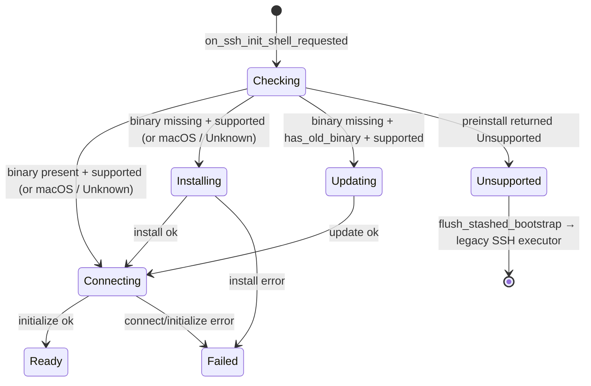

# APP-4281: Gate remote-server install on a remote-side preinstall check

Linear: APP-4281

## Context

The prebuilt Linux `oz` CLI is built on the `namespace-profile-ubuntu-20-04` runner (`.github/workflows/create_release.yml:513`, `:668`, `:839`). That toolchain links against glibc 2.31, so the resulting binary carries glibc 2.29-era symbol versions in its dynamic table. When the install script (`crates/remote_server/src/install_remote_server.sh`) drops that binary onto a Linux host whose runtime glibc is older than ~2.29, the dynamic loader refuses to launch it:

```
/lib64/libm.so.6: version `GLIBC_2.29' not found (required by /home/wasp-dev/.warp-preview/remote-server/oz-preview)
```

This affects long-lived enterprise distros — RHEL/CentOS 7 (glibc 2.17), RHEL/CentOS 8 (glibc 2.28), Amazon Linux 2 (glibc 2.26), Ubuntu 18.04 (glibc 2.27), Debian 10 (glibc 2.28) — as well as non-glibc systems like Alpine (musl) and Termux (bionic).

Today the setup pipeline does not consult the remote host's capabilities. `RemoteServerController::on_binary_check_complete` (`app/src/terminal/writeable_pty/remote_server_controller.rs:202`) decides between install, auto-update, prompt, and fall-back purely from `Result<bool, String>` (binary present?) and `has_old_binary`. Once `install_binary` succeeds the controller advances to `connect_session`, the SSH proxy spawns `oz remote-server-proxy`, and the loader's `GLIBC_…` error surfaces only at connect time as an opaque `SetupFailed`. The product spec (`specs/APP-4281/PRODUCT.md`) calls for surfacing **no** install UI in that case — the user should land directly in the legacy SSH flow.

The legacy SSH/`RemoteCommandExecutor` flow is already a first-class outcome of the controller's state machine: it is reached today via `SshExtensionInstallMode::NeverInstall` and via the `Err(_)` arm of `on_binary_check_complete` (`remote_server_controller.rs:281`, `:286`), both of which call `flush_stashed_bootstrap` to release the stashed bootstrap so `Sessions::initialize_bootstrapped_session` wires up the ControlMaster-backed `RemoteCommandExecutor`. We reuse that path for unsupported hosts.

## Goals

Run a single **preinstall check script** over the existing SSH connection — before any install UI surfaces — that decides whether the host can run the prebuilt remote-server binary, and gate every user-visible install affordance (choice block, `AlwaysInstall` auto-install, `has_old_binary` auto-update) on its result. When the host is positively unsupported, fall back silently to the legacy SSH flow. When the check is inconclusive, fail open and proceed as today.

Make the script the single source of truth for "can this host run the binary?" so future capability checks (additional shared libs, kernel version, free disk, presence of `curl`/`tar`) are an additive, script-only change.

## Non-goals

This spec does not lower the glibc floor of the prebuilt binary, ship multiple Linux artifacts targeting different glibc versions, or expose user-visible UI explaining the fall-back. Those are tracked as follow-ups.

## Relevant code

- `crates/remote_server/src/setup.rs` — `RemoteServerSetupState`, `RemotePlatform`/`RemoteOs`/`RemoteArch`, `parse_uname_output` (`:94`), `binary_check_command`, `install_script`, `CHECK_TIMEOUT`.
- `crates/remote_server/src/install_remote_server.sh` — existing install script template; the new preinstall script lives next to it.
- `crates/remote_server/src/transport.rs` — `RemoteTransport` trait (`:63`).
- `crates/remote_server/src/manager.rs` — `RemoteServerManager::check_binary` (`:452`), `RemoteServerManagerEvent::BinaryCheckComplete` (`:311`), session state machine.
- `crates/remote_server/src/ssh.rs` — `run_ssh_command`, `run_ssh_script` (used by `install_binary`; reused for the preinstall check).
- `app/src/remote_server/ssh_transport.rs` — `SshTransport` impl of `RemoteTransport`.
- `app/src/terminal/writeable_pty/remote_server_controller.rs` — `SshInitState`, `on_binary_check_complete` (`:202`), `flush_stashed_bootstrap` (`:150`).
- `app/src/terminal/prompt_render_helper.rs:248` and `app/src/terminal/view.rs:11491` — UI surfaces that match on `RemoteServerSetupState`.

## Proposed changes

### 1. New `preinstall_check.sh`

A new shell script template alongside `install_remote_server.sh`. It runs **before** any install UI surfaces and emits a structured, machine-parseable summary on stdout. The script is the only place we encode "can this host run the prebuilt binary?" — the client side just reads the verdict.

Output format: one `key=value` pair per line. Unknown keys are ignored on the client, so the script can grow new checks without a coordinated client release. Required keys for v1:

```
status=supported|unsupported|unknown
reason=<short identifier when unsupported, omitted otherwise>
libc_family=glibc|musl|bionic|uclibc|unknown
libc_version=<major.minor when libc_family=glibc, omitted otherwise>
required_glibc=<major.minor>
```

Script (lives at `crates/remote_server/src/preinstall_check.sh`):

```sh
#!/usr/bin/env bash
# Preinstall check for the Warp remote-server binary.
#
# Emits a structured key=value summary on stdout. Exits 0 on success.
# A non-zero exit indicates a probe-level failure; the client treats
# those as `status=unknown` (fail open).

set -u

# The minimum glibc the prebuilt Linux CLI requires. The Linux CLI is
# built on Ubuntu 20.04 (see `.github/workflows/create_release.yml`),
# which ships glibc 2.31. Bump this when the runner image is bumped.
required_glibc="2.31"
echo "required_glibc=${required_glibc}"

# 1. Detect libc family and (when glibc) its version.
libc_family="unknown"
libc_version=""

if version=$(getconf GNU_LIBC_VERSION 2>/dev/null); then
    # Output: "glibc 2.31"
    libc_family="glibc"
    libc_version="${version##* }"
elif ldd_out=$(ldd --version 2>&1 | head -n1); then
    case "$ldd_out" in
        *musl*)   libc_family="musl"   ;;
        *uClibc*) libc_family="uclibc" ;;
        *)
            v=$(printf '%s\n' "$ldd_out" | grep -oE '[0-9]+\.[0-9]+' | head -n1)
            if [ -n "$v" ]; then
                libc_family="glibc"
                libc_version="$v"
            fi
            ;;
    esac
fi

echo "libc_family=${libc_family}"
[ -n "$libc_version" ] && echo "libc_version=${libc_version}"

# 2. Decide status from the gathered facts.
status="unknown"
reason=""

if [ "$libc_family" = "glibc" ] && [ -n "$libc_version" ]; then
    have_major="${libc_version%%.*}"
    have_minor="${libc_version#*.}"
    have_minor="${have_minor%%.*}"
    req_major="${required_glibc%%.*}"
    req_minor="${required_glibc#*.}"
    if [ "$have_major" -gt "$req_major" ] \
       || { [ "$have_major" -eq "$req_major" ] && [ "$have_minor" -ge "$req_minor" ]; }; then
        status="supported"
    else
        status="unsupported"
        reason="glibc_too_old"
    fi
elif [ "$libc_family" = "musl" ] || [ "$libc_family" = "bionic" ] || [ "$libc_family" = "uclibc" ]; then
    status="unsupported"
    reason="non_glibc"
fi

echo "status=${status}"
[ -n "$reason" ] && echo "reason=${reason}"
```

The script is loaded with `include_str!` — no templating, since the floor is hardcoded into the script itself for now:

```rust
pub const PREINSTALL_CHECK_SCRIPT: &str = include_str!("preinstall_check.sh");
```

Keeping the floor inside the script keeps the bash side self-contained and avoids splitting the supported-glibc value across two source files. If we later need to template the script (e.g. to inject the artifact's actual symbol-version floor at release time), we can switch back to a `replace` helper without touching the trait or controller. The `required_glibc` value still rides on the script's stdout (`required_glibc=2.31`) so the Rust parser can populate `UnsupportedReason::GlibcTooOld { required }` directly from the script's report rather than a separate Rust constant.

### 2. `PreinstallCheckResult` and parser

Add to `setup.rs`:

```rust
#[derive(Clone, Debug, PartialEq, Eq)]
pub struct PreinstallCheckResult {
    pub status: PreinstallStatus,
    pub libc: RemoteLibc,
    /// Verbatim script stdout (trimmed). Forwarded to telemetry for
    /// diagnostics on hosts that report `Unknown`.
    pub raw: String,
}

#[derive(Clone, Debug, PartialEq, Eq)]
pub enum PreinstallStatus {
    Supported,
    Unsupported { reason: UnsupportedReason },
    Unknown,
}

#[derive(Clone, Debug, PartialEq, Eq)]
pub enum UnsupportedReason {
    GlibcTooOld { detected: (u32, u32), required: (u32, u32) },
    NonGlibc { name: String },
}

#[derive(Clone, Debug, PartialEq, Eq)]
pub enum RemoteLibc {
    Glibc { major: u32, minor: u32 },
    NonGlibc { name: String },
    Unknown,
}

impl PreinstallCheckResult {
    pub fn is_supported(&self) -> bool {
        match self.status {
            // Fail open on Unknown — see §3.
            PreinstallStatus::Supported | PreinstallStatus::Unknown => true,
            PreinstallStatus::Unsupported { .. } => false,
        }
    }
}

pub fn parse_preinstall_output(stdout: &str) -> PreinstallCheckResult { /* … */ }
```

Parser rules:

- Treat stdout as a list of `key=value` lines; lines without `=` and unknown keys are ignored (forward-compatibility).
- `status=supported` → `PreinstallStatus::Supported`.
- `status=unsupported` + `reason=glibc_too_old` → `Unsupported { GlibcTooOld { detected, required } }` populated from `libc_version` and `required_glibc`. Missing/malformed numbers → `PreinstallStatus::Unknown`.
- `status=unsupported` + `reason=non_glibc` → `Unsupported { NonGlibc { name: libc_family } }`.
- Any other / missing `status` → `PreinstallStatus::Unknown`.
- `libc_family` + `libc_version` populate the `libc` field independently of `status`, so telemetry has the underlying signal even on `Unknown`.

### 3. Fail-open semantics

`is_supported()` returns true for both `Supported` and `Unknown`. Hosts where the script could not classify the libc (no `getconf`, weird `ldd` output, exotic distro, busybox-only environments) keep today's install-and-try behavior. Only positive detection of an incompatible libc — a glibc version below the script's hardcoded floor, or any non-glibc libc — triggers the silent fall-back.

The supported-glibc floor lives in `preinstall_check.sh` itself (currently `required_glibc="2.31"`, matching the Ubuntu 20.04 build runner). Bumping the build image is a script-only change. The Rust side does not duplicate the value; it reads `required_glibc` back out of the script's stdout when constructing telemetry and `UnsupportedReason::GlibcTooOld { required }`.

### 4. `RemoteTransport::run_preinstall_check`

Extend `RemoteTransport` with a single new method (matching the boxed-future style of the existing probes — see `transport.rs:68-96`):

```rust
fn run_preinstall_check(
    &self,
) -> Pin<Box<dyn Future<Output = Result<PreinstallCheckResult, String>> + Send>>;
```

`SshTransport::run_preinstall_check` pipes `setup::PREINSTALL_CHECK_SCRIPT` through the existing ControlMaster socket via `remote_server::ssh::run_ssh_script` (the same helper `install_binary` already uses), with `CHECK_TIMEOUT`. On success it parses stdout into `PreinstallCheckResult` via `parse_preinstall_output`. On SSH-level failure (timeout, broken pipe, non-zero exit with no parseable summary) it returns `Err(_)`, which the manager logs and treats as inconclusive (the controller then falls into the existing fail-open path).

### 5. Run before deciding install UI

`RemoteServerManager::check_binary` (`manager.rs:452`) keeps the existing `futures::join!` over the three concurrent probes and adds the preinstall script call afterwards, gated on Linux:

```rust
let (platform_result, check_result, old_binary_result) = futures::join!(
    transport.detect_platform(),
    transport.check_binary(),
    transport.check_has_old_binary(),
);
let preinstall = match &platform_result {
    Ok(p) if matches!(p.os, RemoteOs::Linux) => match transport.run_preinstall_check().await {
        Ok(r)  => Some(r),
        Err(e) => {
            log::warn!("preinstall check failed for session {session_id:?}: {e}");
            None
        }
    },
    _ => None,
};
```

The result rides on `BinaryCheckComplete`:

```rust
BinaryCheckComplete {
    session_id: SessionId,
    result: Result<bool, String>,
    remote_platform: Option<RemotePlatform>,
    preinstall_check: Option<PreinstallCheckResult>,
    has_old_binary: bool,
}
```

`RemoteServerManager` also caches the preinstall result per-session (mirroring `session_platforms` at `manager.rs:414`) so it is available on later events for telemetry.

Sequencing the preinstall check after `detect_platform` (instead of folding it into the `join!`) keeps macOS hosts at zero extra round-trips. Linux hosts pay one additional ControlMaster channel — same cost class as `check_has_old_binary`, multiplexed through the existing socket.

### 6. Controller: gate the install UI on the preinstall result

This is the user-visible point of the change. `RemoteServerController::on_binary_check_complete` (`remote_server_controller.rs:202`) now performs the preinstall gate **before** any of the existing branches that surface the choice block (`AlwaysAsk` → `request_remote_server_block`), force install (`AlwaysInstall`), auto-update (`has_old_binary`), or connect:

```rust
if let Some(check) = preinstall_check.as_ref() {
    if !check.is_supported() {
        log::info!(
            "Preinstall check returned {:?} for {session_id:?}; \
             falling back to legacy SSH",
            check.status,
        );
        send_telemetry_from_ctx!(
            TelemetryEvent::RemoteServerHostUnsupported { /* … */ },
            ctx,
        );
        RemoteServerManager::handle(ctx).update(ctx, |mgr, ctx| {
            mgr.mark_setup_unsupported(session_id, check.clone(), ctx);
        });
        // Best-effort cleanup of any prior install on this host —
        // it cannot launch and would otherwise force the auto-update
        // path on every reconnect.
        if let Ok(true) = result {
            mgr.schedule_remove_remote_server_binary(session_id, &transport, ctx);
        }
        self.flush_stashed_bootstrap(session_info, ctx);
        return;
    }
}
// Existing branches unchanged below this point:
//   Ok(true)                   -> connect_session
//   Ok(false) + has_old_binary -> install_binary(is_update=true)
//   Ok(false) + AlwaysAsk      -> request_remote_server_block
//   Ok(false) + AlwaysInstall  -> install_binary(is_update=false)
//   Ok(false) + NeverInstall   -> flush_stashed_bootstrap
//   Err(_)                     -> flush_stashed_bootstrap
```

Because this branch runs **before** `request_remote_server_block`, an unsupported host never sees the choice block — exactly what the product spec requires for the "ideal path." The legacy SSH flow is reached via the existing `flush_stashed_bootstrap` exit, so no new fall-back code path is added — only a new entry point into the existing one.

### 7. New `Unsupported` setup state

Extend `RemoteServerSetupState` (`setup.rs:8`) with a non-error terminal variant so the controller can distinguish "the remote is incompatible, fall back silently" from "the install failed, surface a real error":

```rust
pub enum RemoteServerSetupState {
    Checking,
    Installing { progress_percent: Option<u8> },
    Updating,
    Initializing,
    Ready,
    Failed { error: String },
    /// Preinstall check classified the host as incompatible. Treated
    /// as a clean fall-back to the legacy ControlMaster-backed SSH flow.
    Unsupported { reason: UnsupportedReason },
}
```

`is_terminal()` and `is_in_progress()` are extended so `Unsupported` behaves like `Failed` for downstream code that asks "is this still in flight?" The two existing UI sites (`prompt_render_helper.rs:255` and `view.rs:11492`) already fall through to a `_ =>` arm and need no changes; the user sees the same prompt they see on a `NeverInstall` legacy SSH session today.

### 8. Stale-install cleanup

Hosts that connected before this change may have an `oz` binary on disk that can no longer launch. When the controller takes the unsupported branch with `result == Ok(true)`, it asks the manager to schedule a best-effort `transport.remove_remote_server_binary()` (already implemented at `ssh_transport.rs:235`). The call is fire-and-forget: failure is logged and does not block the legacy fall-back. Without this, `check_has_old_binary` would return `true` on every reconnect and the controller would silently re-enter the auto-update path against a host that now reports `Unsupported`.

### 9. Telemetry

Replace the previously-proposed `RemoteServerLibcUnsupported` with a script-shaped event:

```rust
TelemetryEvent::RemoteServerHostUnsupported {
    remote_os: Option<String>,
    remote_arch: Option<String>,
    status: String,                 // "unsupported" | "unknown"
    reason: Option<String>,         // "glibc_too_old" | "non_glibc"
    detected_libc: String,          // "glibc 2.28", "musl", "unknown"
    required_glibc: String,         // "2.31"
    had_old_binary: bool,
    /// First 256 bytes of the script's stdout, for diagnosing
    /// `Unknown` outcomes on exotic distros.
    script_stdout_preview: String,
}
```

Also extend the existing `RemoteServerSetupDuration` (sent from `on_session_connected` at `remote_server_controller.rs:372`) with `remote_libc: Option<String>` so we can correlate setup latency with libc distribution on supported hosts and watch for regressions after future `required_glibc` bumps in the script.

## End-to-end flow

### Supported Linux host (e.g. Ubuntu 22.04, glibc 2.35)

1. SSH session opens; `on_ssh_init_shell_requested` schedules `check_binary`.
2. Manager runs `uname -sm`, `test -x …`, `test -d …`, then on Linux pipes `preinstall_check.sh` through the SSH socket.
3. Script emits `status=supported`, `libc_family=glibc`, `libc_version=2.35`.
4. `BinaryCheckComplete { preinstall_check: Some(Supported), … }` arrives at the controller.
5. The fail-open gate is bypassed; existing branches drive install/auto-update/prompt/connect as today.

### Unsupported Linux host (e.g. RHEL 7, glibc 2.17)

1. SSH session opens; `check_binary` runs as above.
2. Script emits `status=unsupported`, `reason=glibc_too_old`, `libc_version=2.17`.
3. `BinaryCheckComplete { preinstall_check: Some(Unsupported { GlibcTooOld { … } }), … }` arrives.
4. Controller logs, emits `RemoteServerHostUnsupported`, asks the manager to mark the session `Unsupported`, optionally schedules `remove_remote_server_binary`, and calls `flush_stashed_bootstrap`.
5. `Sessions::initialize_bootstrapped_session` wires up `RemoteCommandExecutor` against the existing ControlMaster socket. The user sees the legacy SSH prompt with no modal, no banner, no error.

### Inconclusive Linux host (e.g. minimal busybox container)

1. Script emits `status=unknown` (no `getconf`, `ldd` output unparseable).
2. `is_supported()` returns true; existing branches run as today, including the choice block under `AlwaysAsk`. If the install or connect later fails, the existing `Failed` banner path takes over.

### macOS host

1. `detect_platform` returns `RemoteOs::MacOs`; the preinstall check is skipped.
2. `BinaryCheckComplete { preinstall_check: None, … }` arrives.
3. The unsupported branch is bypassed entirely (the early return is gated on `Some(check)`); existing logic applies unchanged.

## Diagram



## Testing and validation

### Unit

- Bash-level: a small shell harness (`crates/remote_server/src/preinstall_check_test.sh`) that runs `preinstall_check.sh` against a stubbed `getconf` / `ldd` (`PATH`-injected) for each scenario — Ubuntu 20.04, RHEL 7, RHEL 8, Alpine musl, busybox-no-getconf-no-ldd — and asserts the emitted key/value lines exactly. This catches script regressions independently of the Rust parser.
- `setup_tests.rs`: table-driven tests for `parse_preinstall_output` covering each of the script's golden outputs, plus malformed/partial inputs (missing `status`, unknown reason, garbled `libc_version`).
- `setup_tests.rs`: truth table for `PreinstallCheckResult::is_supported` against `Supported`, `Unsupported { GlibcTooOld { … } }`, `Unsupported { NonGlibc { "musl" } }`, and `Unknown` — the last must be reported as supported per the fail-open rule.
- Manager tests: a mock `RemoteTransport::run_preinstall_check` that returns each variant; assert `BinaryCheckComplete.preinstall_check` carries the value, the per-session cache is populated, and the corresponding setup state is reached.
- Controller tests: drive `on_binary_check_complete` with `Some(Unsupported { … })` and assert `flush_stashed_bootstrap` was called, no `request_remote_server_block`/`install_binary`/`connect_session` was issued, and `RemoteServerHostUnsupported` was emitted. Repeat with `result = Ok(true)` to assert `remove_remote_server_binary` is scheduled.

### Manual

- Ubuntu 22.04 / Debian 12 (glibc 2.35+): unchanged install / auto-update / connect path. Choice block still appears under `AlwaysAsk` for first-time hosts.
- RHEL 7 (glibc 2.17), RHEL 8 (glibc 2.28), Amazon Linux 2 (glibc 2.26), Ubuntu 18.04 (glibc 2.27): SSH lands in the legacy flow with no choice block, modal, or error block; `Warp.log` shows the unsupported-host telemetry line.
- Alpine 3.x (musl): legacy fall-back, telemetry tagged `reason=non_glibc`.
- Busybox-only minimal container: `status=unknown`, choice block still appears under `AlwaysAsk`. Confirm that today's install-then-fail behavior is preserved (regression check for fail-open).
- Host with a pre-existing incompatible binary (simulate by `scp`-ing a Linux binary onto an Alpine VM): legacy fall-back; `ssh <host> 'ls ~/.warp-*/remote-server'` afterwards shows the binary was removed.
- macOS remote: unchanged.

### Presubmit

`./script/presubmit` (cargo fmt, clippy, tests). The bash harness from §Unit runs as part of `cargo test` via a `[[bin]]` test wrapper invoked from `setup_tests.rs`.

## Risks and mitigations

### Script behaves badly on an exotic distro

`status=unknown` falls open and the user keeps today's install-and-try path. The script-level `set -u` plus explicit `case` arms keep the interpreter from emitting partial/garbage output that would confuse the parser; truly unparseable stdout maps to `PreinstallStatus::Unknown` in the parser too.

### Script is the new install bottleneck

The script is templated and shipped in-tree under `crates/remote_server/src/preinstall_check.sh`, exactly like `install_remote_server.sh`. Updates ride the normal release train. Because the parser tolerates unknown keys, we can extend the script without coordinating a client release — only behavior that depends on the new keys requires a client bump.

### Hardcoded `required_glibc` drifts from the build environment

The floor is hardcoded in `preinstall_check.sh` and documented to track the runner image in `.github/workflows/create_release.yml`. Bumping the runner means editing the script in the same PR. Follow-up: derive the value at release time from `objdump -T <oz> | grep GLIBC_ | sort -V | tail -1` and inject it into the script during `script/bundle` so the source of truth is the artifact itself.

### Extra round-trip on every Linux SSH connect

One additional ControlMaster channel multiplexed through the existing socket — same cost class as `check_has_old_binary`, well under the human perceptual threshold. macOS hosts pay nothing because the probe is gated on `RemoteOs::Linux`.

### Users on marginal hosts lose the install prompt entirely

Intentional for the prebuilt artifact: installing a binary that crashes on launch is worse than skipping the install. Follow-up considers shipping a lower-glibc artifact and lowering the script's `required_glibc` per-artifact to broaden the supported set.

### Removing a stale binary fails

Best-effort and logged. The session still falls back to legacy SSH; the worst case is a leftover binary on disk that subsequent runs detect again and skip again.

## Follow-ups

- The preinstall script is now the natural place to add additional host capability checks: CPU instruction set requirements, free disk space in `~/.warp-XXXX/remote-server`, presence of `curl`/`tar`. Each new check is an additive script-only change plus a parser key.
- Derive the script's `required_glibc` from the released binary at bundle time instead of a hardcoded value.
- Ship a second prebuilt Linux CLI built against an older glibc (Ubuntu 18.04 / glibc 2.27) and pick the right artifact based on the script's reported libc version; this is what closes APP-4281's stated goal of "support glibc 2.28."
- Once telemetry sizes the affected population, surface a one-time, dismissible explanation in the SSH choice area on unsupported hosts so users understand they are on the legacy SSH path by design.
