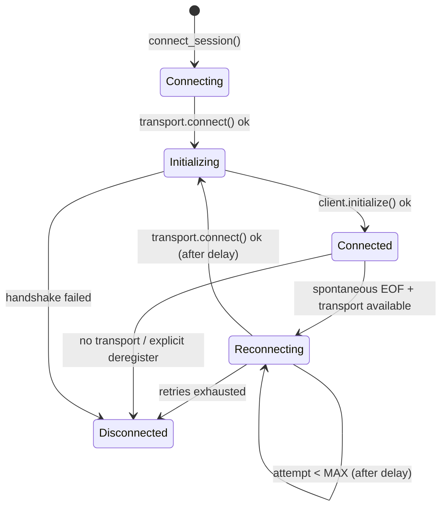

# APP-4283: Remote Server Reconnection on Spontaneous Disconnect

## Context

When the SSH remote server connection drops spontaneously (daemon crash, proxy killed, transient network failure), the `RemoteServerClient` reader task hits EOF and calls `mark_session_disconnected`. Before this change the session transitions straight to `Disconnected` and stays there — completions, repo metadata, and all other remote-server-backed features stop working until the user manually exits and re-SSHes.

The remote server architecture uses a **proxy → daemon** model:

- `SshTransport` (`app/src/remote_server/ssh_transport.rs`) spawns `ssh … remote-server-proxy` whose stdin/stdout become the protocol channel.
- The proxy (`app/src/remote_server/unix/proxy.rs:34`) connects to a long-lived daemon via a local Unix socket. The daemon survives across proxy lifetimes.

The core session lifecycle lives in `RemoteServerManager` (`crates/remote_server/src/manager.rs`), a singleton model with per-session state tracked via `RemoteSessionState`. The state machine before this change:

```
Connecting → Initializing → Connected → Disconnected
```

Key files:

- `crates/remote_server/src/manager.rs` — `RemoteServerManager`, session state machine, connect/disconnect lifecycle
- `crates/remote_server/src/transport.rs` — `RemoteTransport` trait, `Connection` struct
- `app/src/remote_server/ssh_transport.rs` — SSH `RemoteTransport` implementation
- `app/src/terminal/model/session.rs (135-191)` — `Sessions` model, subscribes to manager events, owns the `Session` and its `CommandExecutor`
- `app/src/terminal/model/session.rs (862-1050)` — `Session` struct, holds the `command_executor` used by completions

## Proposed changes

### 1. Object-safe `RemoteTransport` for reconnection

The `RemoteTransport` trait (`crates/remote_server/src/transport.rs:63`) now returns boxed futures (`Pin<Box<dyn Future<…> + Send>>`) for object safety. This allows `RemoteServerManager` to store `Arc<dyn RemoteTransport>` on the `Connected` state and carry it forward through reconnection without knowing the concrete transport type.

`SshTransport` (`app/src/remote_server/ssh_transport.rs:36`) implements the trait directly with `Box::pin(async move { … })`.

### 2. Exit status capture

New `RemoteServerExitStatus` type (`manager.rs:67`) records `code: Option<i32>` and `signal_killed: bool`.

`capture_exit_status()` (`manager.rs:982`) reads `child.try_status()` before the `Child` is dropped on disconnect. The result is carried on `SessionDisconnected.exit_status` for diagnostics and telemetry.

### 3. Reconnection state machine

New state variant `Reconnecting { attempt, host_id, control_path }` (`manager.rs:139`). The state machine becomes:

```
Connecting → Initializing → Connected → Reconnecting → Initializing → Connected
                                      ↘ Disconnected (if retries exhausted)
```

Constants: `MAX_RECONNECT_ATTEMPTS = 2`, `RECONNECT_DELAY = 2s` (`manager.rs:22-24`).

`mark_session_disconnected()` (`manager.rs:1020`) checks whether the session was `Connected` with a stored transport. If so it clears stale host-index and repo-metadata state, then calls `attempt_reconnect()`.

`attempt_reconnect()` (`manager.rs:1100`) transitions to `Reconnecting`, waits `RECONNECT_DELAY` via `async_io::Timer`, then calls the shared `run_connect_and_handshake()`. On success it calls `mark_session_connected()` and emits `SessionReconnected`. On failure, `handle_reconnect_failure()` (`manager.rs:1203`) either increments the attempt and retries, or gives up and emits `SessionDisconnected`.

The retry parameters are bundled in `ReconnectParams` (`manager.rs:28`) to stay under clippy's argument limit.

### 4. Shared connect + handshake helper

`run_connect_and_handshake()` (`manager.rs:546`) is extracted from `connect_session()` so both the initial connect and reconnect share the same two-phase logic: `transport.connect()` → `Initializing` → `client.initialize()` → `HostId`.

### 5. Session bootstrap info persistence

Previously, `notify_session_bootstrapped()` stashed shell info in a `pending_bootstrapped_notifications` map that was consumed on the first connect and wiped on disconnect. After reconnect, the daemon had no executor registered for the session (`SessionNotFound` error on completions).

Fix: renamed to `session_bootstrap_info` (`manager.rs:310`), which persists for the session lifetime (removed only in `deregister_session`). `notify_session_bootstrapped()` (`manager.rs:790`) always stores the info. `mark_session_connected()` (`manager.rs:965`) re-sends the `SessionBootstrapped` notification on every connect/reconnect.

### 6. Command executor swap on reconnect

`Session.command_executor` (`session.rs:867`) changed from `Arc<dyn CommandExecutor>` to `RwLock<Arc<dyn CommandExecutor>>` for interior mutability through `Arc<Session>`. New `Session::set_command_executor()` (`session.rs:1048`).

All read sites (e.g. `execute_command` at `session.rs:1117`, `load_external_commands` at `session.rs:1083`) clone the `Arc` out of the lock before `.await` to avoid holding the guard across await points.

The `Sessions` model subscribes to `SessionReconnected` (`session.rs:178-189`) and swaps in a new `RemoteServerCommandExecutor` backed by the reconnected client.

### 7. Downstream match arm updates

Added exhaustive match arms for `SessionReconnected` in `Sessions` subscriber (`session.rs:178`) and `terminal/view.rs`.

## Diagram



## Testing and validation

Manual E2E (verified):

1. Build Warp from this branch (`cargo run`).
2. SSH into a remote host with the remote server feature flag enabled.
3. Kill the `remote-server-proxy` on the remote side: `ssh <host> "pkill -f remote-server-proxy"`.
4. Observe in `Warp.log`:
   - `"Remote server process exited for session …"` — exit status captured
   - `"Spontaneous disconnect for session …, will attempt reconnect"` — reconnect triggered
   - `"Attempting reconnect for session … (attempt 1/2)"` — delay + retry
   - `"Remote server connected for session …"` — reconnect succeeded
   - `"Sending SessionBootstrapped notification for session …"` — daemon re-registered
   - `"Swapped command executor for session … after reconnect"` — executor swapped
5. Press Tab in the SSH session to trigger completions — should work.
6. Verify `navigate_to_directory` re-fires (repo metadata restored).

Edge cases verified manually:
- Kill the daemon (`pkill -f remote-server-daemon`) — harder reconnect since daemon must restart; proxy's `run()` re-spawns it.
- `deregister_session` during reconnect delay — reconnect aborts cleanly (checked via `sessions.contains_key`).

## Follow-ups

- **User-visible reconnecting indicator**: surface the `Reconnecting` state in the terminal UI so the user knows a retry is in progress.
- **Telemetry**: emit a structured event with `exit_status`, `attempt`, and `reconnect_succeeded` for reconnect outcomes.
- **Exponential backoff**: the current fixed 2s delay works for the proxy-restart case; longer backoffs may be warranted for network-level failures.
