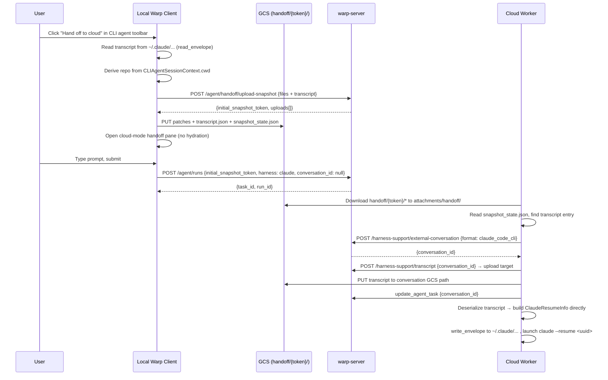

# Local-to-Cloud Handoff for 3rd-Party Harnesses — Tech Spec
Linear: [APP-4423](https://linear.app/warpdotdev/issue/APP-4423)

## Context
REMOTE-1486 shipped local→cloud handoff for Oz conversations. This spec extends it to third-party harness conversations (Claude Code first, then Codex).

The Oz handoff flow forks a server-side `AIConversation` at chip-click time, uploads a workspace snapshot (git patches + orphan files), and spawns a cloud run with `conversation_id` + `initial_snapshot_token`. The cloud agent resumes the forked conversation and applies patches via a system-prompt checklist.

For 3P harnesses, the situation differs in three ways:
1. **No server-side conversation exists.** Local 3P runs don't call `create_external_conversation` — there's a `TODO(REMOTE-1149)` noting this. The transcript lives on disk (e.g. `~/.claude/projects/<encoded_cwd>/<uuid>.jsonl`).
2. **Resume is driver-level, not prompt-level.** The cloud worker rehydrates the transcript onto disk and launches `claude --resume <uuid>`, handled by `ClaudeHarnessRunner` via `ResumePayload::Claude(ClaudeResumeInfo)`. This is code-level, not LLM-prompt-level.
3. **The entry point is the CLI agent toolbar**, not the agent-view footer. The handoff chip is currently `AgentViewOnly`; 3P harnesses run in the terminal with the CLI agent toolbar.

Key files:
- `app/src/ai/agent_sdk/driver/snapshot.rs` — `SnapshotManifest`, `upload_snapshot_for_handoff`
- `app/src/ai/agent_sdk/driver/harness/claude_transcript.rs` — `ClaudeTranscriptEnvelope`, `read_envelope`, `write_envelope`
- `app/src/ai/agent_sdk/driver/harness/claude_code.rs:381-438` — `HarnessRunner::start`, `create_external_conversation` call, `save_conversation`
- `app/src/ai/agent_sdk/driver/harness/mod.rs:48-87` — `ResumePayload`, `ClaudeResumeInfo`, `ThirdPartyHarness` trait
- `app/src/ai/agent_sdk/mod.rs:929-1106` — `fetch_secrets_and_attachments`, `load_conversation_information`
- `app/src/ai/agent_sdk/driver/attachments.rs:68-133` — `fetch_and_download_handoff_snapshot_attachments`
- `app/src/terminal/view/ambient_agent/model.rs:387-441` — `selected_harness` hardcoded to Oz for handoff, `PendingHandoff`
- `app/src/ai/blocklist/agent_view/agent_input_footer/toolbar_item.rs` — `HandoffToCloud` item, `AgentViewOnly`
- `app/src/workspace/view.rs:13010-13271` — `start_local_to_cloud_handoff`, `complete_local_to_cloud_handoff_open`
- `warp-server-5/logic/ai/conversation_transcript/external_conversation.go` — `CreateThirdPartyConversation` (creates DB row + GCS manifest, no blobs)
- `warp-server-5/logic/ai/ambient_agents/handoff_rehydration.go` — `ResolveHandoffRehydrationMetadata`, reads `InitialSnapshotToken`
- `warp-server-5/router/handlers/public_api/harness_support.go:185-233` — `CreateExternalConversationHandler`

## Proposed changes
### 1. Snapshot manifest: add transcript section
Extend `SnapshotManifest` (`snapshot.rs:673`) with an optional `transcript` field so the manifest is the single source of truth for "this snapshot carries a 3P transcript."

```rust path=null start=null
#[derive(serde::Serialize)]
struct SnapshotManifest {
    version: u32,
    repos: Vec<RepoManifestEntry>,
    files: Vec<FileManifestEntry>,
    #[serde(skip_serializing_if = "Option::is_none")]
    transcript: Option<TranscriptManifestEntry>,
}

#[derive(serde::Serialize)]
struct TranscriptManifestEntry {
    file: String,   // e.g. "transcript.json"
    format: String, // e.g. "claude_code_cli"
}
```

The `transcript` field is additive and optional — no version bump needed. Version `1` manifests without the field continue to work unchanged. The worker-side Go struct gets the same optional field.

### 2. Client: read and upload transcript in handoff snapshot
Extend `upload_snapshot_for_handoff` (or add a sibling) to accept an optional transcript payload. The client reads the local transcript (e.g. `read_envelope` for Claude) and includes it as another `SnapshotUploadFile` alongside patches. The transcript is uploaded to `handoff/{token}/transcript.json` via the same presigned-URL path as patches.

```rust path=null start=null
pub(crate) async fn upload_snapshot_for_handoff(
    repo_paths: Vec<PathBuf>,
    orphan_file_paths: Vec<PathBuf>,
    transcript: Option<HandoffTranscript>, // new
    client: Arc<dyn AIClient>,
    http: &http_client::Client,
) -> Result<Option<InitialSnapshotToken>>
```

The transcript parameter is a thin enum over existing envelope types:

```rust path=null start=null
enum HandoffTranscript {
    Claude(ClaudeTranscriptEnvelope),
    Codex(CodexTranscriptEnvelope),
}
```

The function serializes the envelope to JSON bytes and includes it as a `SnapshotUploadFile`. The format string for the manifest entry is derived from the variant. The transcript counts against `MAX_SNAPSHOT_FILES_PER_RUN` like any other file.

### 3. Client: entry point in CLI agent toolbar
Add `HandoffToCloud` to the CLI agent footer for supported harnesses:
- Keep `HandoffToCloud` as `AgentViewOnly` for the agent-view footer (unchanged).
- In the CLI agent footer, conditionally show it when the active CLI agent session's harness supports cloud mode (Claude and Codex today — check `HarnessAvailabilityModel`).
- Hide the chip entirely when the CLI agent plugin is not installed (no `session_id` means we can't locate the transcript).
- Add it to `cli_default_right()` gated on `handoff_to_cloud_available()` + the active harness check.
- The click handler dispatches `WorkspaceAction::OpenLocalToCloudHandoffPane` same as the agent-view chip.

### 4. Client: derive snapshot from terminal cwd (not conversation walks)
For 3P, we can't walk `AIConversation` exchanges (there is no `AIConversation`). Instead, use `CLIAgentSessionContext.cwd` from the active CLI agent session as the single repo to snapshot. This covers the primary case (one repo the agent was working in).

`start_local_to_cloud_handoff` needs a 3P path that:
- Skips the Oz-specific `fork_conversation` call (no server conversation to fork).
- Reads the CLI agent session context to get `cwd` and `session_id`.
- Reads the transcript from disk using harness-specific logic (`read_envelope` for Claude).
- Uploads the snapshot with transcript included.

### 5. Client: harness passthrough on handoff pane
Remove the hardcoded `Harness::Oz` override in `selected_harness()` and `set_harness()` (`model.rs:387-410`). For 3P handoff, `PendingHandoff` should carry the source harness, and the handoff pane should lock to it (not allow switching).

`SpawnAgentRequest` already carries `config.harness` — set it to the source conversation's harness.

### 6. Client: skip conversation fork for 3P
The Oz flow calls `AIClient::fork_conversation` at chip-click time. For 3P, skip this — there's no server conversation to fork. `PendingHandoff.forked_conversation_id` becomes `Option<String>` (None for 3P). The submit path sends `conversation_id: None` on the `SpawnAgentRequest`.

### 7. Worker: materialize conversation and resume from snapshot transcript
In `fetch_secrets_and_attachments` (`agent_sdk/mod.rs:929`), after handoff snapshot files are downloaded to `{attachments_dir}/handoff/`:
1. Read `snapshot_state.json` from the handoff directory.
2. If `manifest.transcript` is present:
   a. Read the transcript file once from `{attachments_dir}/handoff/{manifest.transcript.file}`. Reuse the bytes for both the GCS upload and deserialization.
   b. Call `create_external_conversation(manifest.transcript.format)` — the worker has a workload token, so this is allowed.
   c. Upload the transcript to the new conversation via `get_transcript_upload_target` + `upload_to_target`.
   d. Call `update_agent_task` with the new `conversation_id`.
   e. Deserialize the transcript bytes (e.g. `serde_json::from_slice::<ClaudeTranscriptEnvelope>`) and build `ClaudeResumeInfo { conversation_id, session_id: envelope.uuid, envelope }`. Pass to `ClaudeHarnessRunner::new` → `write_envelope` → `claude --resume <uuid>`.

This keeps `create_external_conversation` behind the workload-token gate. The client only writes to TTL-bounded `handoff/{token}/` staging. The worker skips the `fetch_resume_payload` round-trip since it already has the transcript. No changes needed to the harness runner itself.

### 8. Feature flags
No new flags. Gate on `FeatureFlag::OzHandoff && FeatureFlag::HandoffLocalCloud` (same as Oz handoff). The 3P path is differentiated by the presence of an active CLI agent session, not a separate flag.

## Diagram


## Risks and mitigations
- **Arbitrary blob storage.** The client never calls `create_external_conversation` or the transcript/block-snapshot upload-target endpoints — those remain gated on the workload token, which only cloud workers have. The client only writes to `handoff/{token}/` via presigned URLs with a 15-minute TTL, subject to the same size caps as workspace patches. The worker is the one that creates the external conversation and uploads the transcript to persistent GCS, so a malicious authenticated user can't abuse the handoff flow for free blob storage.
- **Transcript size.** Claude transcripts can be large (subagents, todos).
- **No transcript on disk.** `read_envelope` can fail if the session is very early (no JSONL written yet). Fall back to snapshot-only (no resume) rather than blocking handoff.
- **Concurrent transcript writes.** User may click handoff while Claude is actively appending to the JSONL. `read_envelope` reads synchronously — fine in practice since the JSONL is append-only and we tolerate a partial final line.
- **`create_external_conversation` requires a task.** Today `CreateThirdPartyConversation` checks `info.Task.Owner` and `info.Task.AgentConversationID`. The worker calls it after the task exists, so this works. If we later start tracking local 3P runs as conversations pre-handoff, the conversation would already exist and the worker would skip this step (detected by `manifest.transcript` being absent or `task_conversation_id` being set).
- **No conversation on spawn request.** The `SpawnAgentRequest.conversation_id` is null for 3P handoff. The server creates the task without a conversation; the worker materializes and attaches it post-claim. The task is briefly in a conversation-less state, which is fine — it's identical to fresh cloud runs before `create_external_conversation` is called.

## Testing and validation
- **Unit tests (client):** test `SnapshotManifest` serialization with and without `transcript` field; test that `upload_snapshot_for_handoff` includes the transcript file in the upload request.
- **Unit tests (worker):** test the manifest-reading logic that detects transcript presence; test that `create_external_conversation` is called with the correct format and the `ResumePayload` is constructed directly from the downloaded transcript bytes.
- **Integration / manual:**
  - Run Claude Code locally, make edits, click "Hand off to cloud" → verify transcript + patches upload to `handoff/{token}/`, cloud agent resumes with full conversation history and dirty workspace.
  - Run Claude Code locally with no edits → verify handoff still works (empty patches, transcript only).
  - Verify the cloud agent's `claude --resume` picks up where the local session left off.
  - Verify existing Oz handoff is unaffected (manifest version 1 → no transcript field → existing path).

## Follow-ups
- Codex handoff support (same pattern, different `read_envelope` + format string).
- Gemini handoff support.
- Pre-handoff local 3P conversation tracking (REMOTE-1149) — when local runs get server-side conversations from the start, the handoff flow skips transcript staging and uses fork semantics instead.
- Transcript size limits / compression for large Claude sessions with many subagents.
