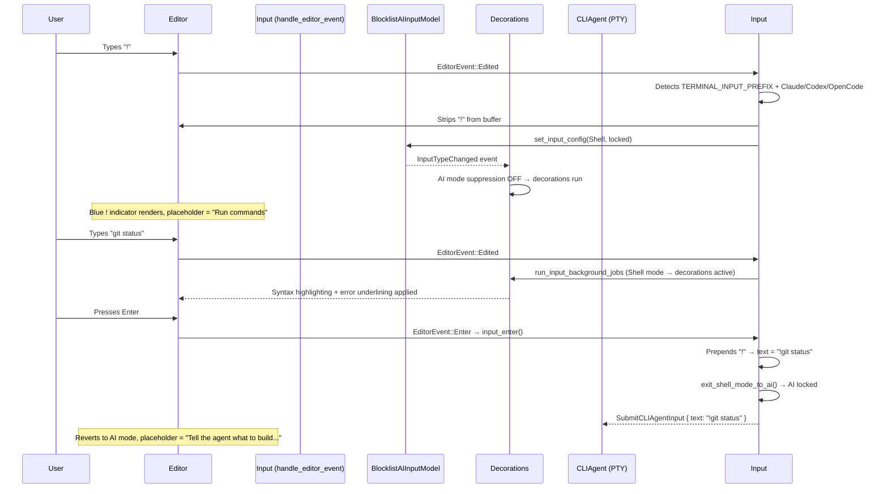

# CLI Agent Rich Input — Shell Command Mode: Tech Spec

## Problem

The CLI agent rich input composer enters AI locked mode when opened, suppressing all shell decorations (syntax highlighting, error underlining, completions). CLI agents like Claude Code use `!` as a mode-switch prefix for shell commands. We need to detect this prefix, activate shell input features, and correctly round-trip the `!` on submit — all by reusing the existing agent view `!` shell mode infrastructure rather than building a parallel system.

## Relevant code

All changes are in a single file:

- `app/src/terminal/input.rs` — the `Input` view, which owns the editor, input mode state, decoration dispatch, completions, and the CLI agent submit path.

Key existing infrastructure reused:

- `TERMINAL_INPUT_PREFIX` (line ~481) — the `"!"` constant.
- `TERMINAL_INPUT_PREFIX` handler (line ~8700) — strips `!`, switches to Shell locked, in the `EditorEvent::Edited` handler. Previously gated to agent view only.
- `maybe_render_ai_input_indicators` (line ~13922) — renders the blue `!` indicator as a left-notch decorator element. Previously gated to `is_agent_view_active`.
- `maybe_backspace_ai_icon` (line ~9814) — handles `BackspaceOnEmptyBuffer` / `BackspaceAtBeginningOfBuffer` to exit shell mode. Previously gated to `is_fullscreen()`.
- `DeleteAllLeft` handler (line ~9206) — same exit-shell-mode behavior for Cmd+Backspace.
- `input_enter` / `SubmitCLIAgentInput` (line ~11392) — the CLI agent submit path.
- `open_completion_suggestions` (line ~10258) — gated by `is_command_grid_active`.
- `set_zero_state_hint_text` (line ~5400) — sets placeholder text.
- `run_input_background_jobs` in `decorations.rs` — suppresses decorations when `is_ai_input_enabled()`.
- `CLIAgentSessionsModel` — singleton tracking CLI agent sessions, provides `is_input_open()` and `session()`.
- `CLIAgent` enum — `Claude`, `Codex`, `OpenCode`, etc.

## Current state

Before this change:

1. CLI agent rich input always enters AI locked mode (PR #23819).
2. The `TERMINAL_INPUT_PREFIX` handler only fires when `is_agent_view_active` — it does not fire for CLI agent input.
3. Decorations are suppressed in AI mode (`run_input_background_jobs` checks `is_ai_input_enabled()`).
4. Completions are blocked during long-running commands (`is_command_grid_active` is false while a CLI agent is executing).
5. The `!` indicator only renders for the agent view.
6. Backspace / DeleteAllLeft shell-mode exit only handles the agent view case.

## Proposed changes

All changes are in `app/src/terminal/input.rs`. No new files, types, or crate-level changes.

### 1. Extend `TERMINAL_INPUT_PREFIX` handler to CLI agent input

**Where**: `handle_editor_event` → `EditorEvent::Edited` branch, the `TERMINAL_INPUT_PREFIX` block (~line 8700).

**What**: The guard condition `(!FeatureFlag::AgentView.is_enabled() || is_agent_view_active)` is extended to `|| is_cli_agent_bash_mode_input_open`, where:

```rust
let is_cli_agent_bash_mode_input_open = CLIAgentSessionsModel::as_ref(ctx)
    .session(self.terminal_view_id)
    .is_some_and(|s| {
        matches!(s.agent, CLIAgent::Claude | CLIAgent::Codex | CLIAgent::OpenCode)
            && matches!(s.input_state, CLIAgentInputState::Open { .. })
    });
```

This is the only place that checks the specific agent type. All downstream code (indicator, backspace, completions) uses the agent-agnostic `is_input_open()` since only supported agents can enter Shell locked mode via this path.

### 2. Guard autodetection re-enable

**Where**: Empty-buffer autodetection re-enable block (~line 8675).

**What**: Add `&& !is_cli_agent_input_open` to the second branch of `should_reenable_autodetection`. Without this, clearing the buffer after `!ls` would unlock Shell mode and let autodetection flip the mode back.

### 3. Prepend `!` on submit + exit shell mode

**Where**: `input_enter` → `SubmitCLIAgentInput` path (~line 11392).

**What**: When `is_locked_in_shell_mode()`, prepend `TERMINAL_INPUT_PREFIX` to the buffer text before emitting the event. Then call `exit_shell_mode_to_ai()` so the next prompt starts in AI mode. The existing `submit_cli_agent_rich_input` in `use_agent_footer/mod.rs` already handles the `!` prefix correctly via `CLI_AGENT_MODE_SWITCH_PREFIXES` (splits it with a delay).

### 4. `exit_shell_mode_to_ai` helper

**Where**: New method on `Input` (~line 12497).

```rust
fn exit_shell_mode_to_ai(&mut self, ctx: &mut ViewContext<Self>) {
    let is_cli_agent_input_open =
        CLIAgentSessionsModel::as_ref(ctx).is_input_open(self.terminal_view_id);
    let new_config = if is_cli_agent_input_open {
        InputConfig { input_type: InputType::AI, is_locked: true }
    } else {
        InputConfig { input_type: InputType::AI, is_locked: true }
            .unlocked_if_autodetection_enabled(true, ctx)
    };
    self.ai_input_model.update(ctx, |m, ctx| {
        m.set_input_config(new_config, true, ctx);
    });
}
```

For CLI agent input, always locks to AI — the `!` prefix is the explicit toggle. For agent view, respects the autodetection setting (existing behavior). Called from three sites: `maybe_backspace_ai_icon`, `DeleteAllLeft`, and `input_enter` submit.

### 5. Show `!` indicator for CLI agent input

**Where**: `maybe_render_ai_input_indicators` (~line 13938).

**What**: Added `terminal_view_id` parameter. The condition is restructured to:

```rust
let is_locked_shell = !is_ai_input_enabled && is_input_type_locked;
let is_cli_agent_input_open = CLIAgentSessionsModel::as_ref(app).is_input_open(terminal_view_id);

if is_locked_shell && (is_agent_view_active || is_cli_agent_input_open) {
    // render blue ! indicator
}
```

This eliminates the previous redundant inner check.

### 6. Backspace / DeleteAllLeft exit shell mode for CLI agent

**Where**: `maybe_backspace_ai_icon` (~line 9814) and `DeleteAllLeft` handler (~line 9220).

**What**: Both now check `|| is_cli_agent_input_open` alongside `is_fullscreen()` and call `exit_shell_mode_to_ai()`. The `maybe_backspace_ai_icon` path also adds an early `return` after the mode switch to prevent fallthrough into the classic AI icon toggle logic.

### 7. Allow completions during long-running CLI agent command

**Where**: `open_completion_suggestions` (~line 10266).

**What**: Added bypass:

```rust
let is_cli_agent_shell_mode = self.is_locked_in_shell_mode(ctx)
    && CLIAgentSessionsModel::as_ref(ctx).is_input_open(self.terminal_view_id);

if (is_command_grid_active || is_cli_agent_shell_mode) && self.can_query_history(ctx) {
```

Note this should NOT be allowed if we're in a Warpified remote host, where we cannot run in-band generators.

### 8. Placeholder text

**Where**: `set_zero_state_hint_text` (~line 5400).

**What**: When CLI agent input is open, check `is_locked_in_shell_mode()` — if true, show `"Run commands"`, otherwise `"Tell the agent what to build..."`.

## End-to-end flow



## Risks and mitigations

- **Agent view regression**: All changes extend existing conditions with `|| is_cli_agent_*` checks. The agent view paths are unchanged. Mitigation: manual regression testing of agent view `!` shell mode.
- **Autodetection fighting locked state**: When exiting shell mode, the helper always locks to AI for CLI agent (not unlocked). This prevents autodetection from re-classifying the next keystroke as Shell. Tested and confirmed.
- **`maybe_backspace_ai_icon` fallthrough**: The classic AI icon toggle logic (`with_toggled_type()`) would flip back to Shell after the Shell→AI switch. Fixed with an early `return` after the mode switch.

## Testing and validation

- **Manual testing**: Primary validation method — open Claude Code / Codex / OpenCode, Ctrl-G, test all behaviors from the product spec success criteria.
- **Regression**: Verify agent view `!` shell mode is unaffected.
- **Edge cases**: `!` → backspace → `!` again; `! pwd` (with space); empty submit; typing for unsupported agents.

## Follow-ups

- "Backspace to exit shell mode" hint text in CLI agent footer (requires message bar plumbing).
