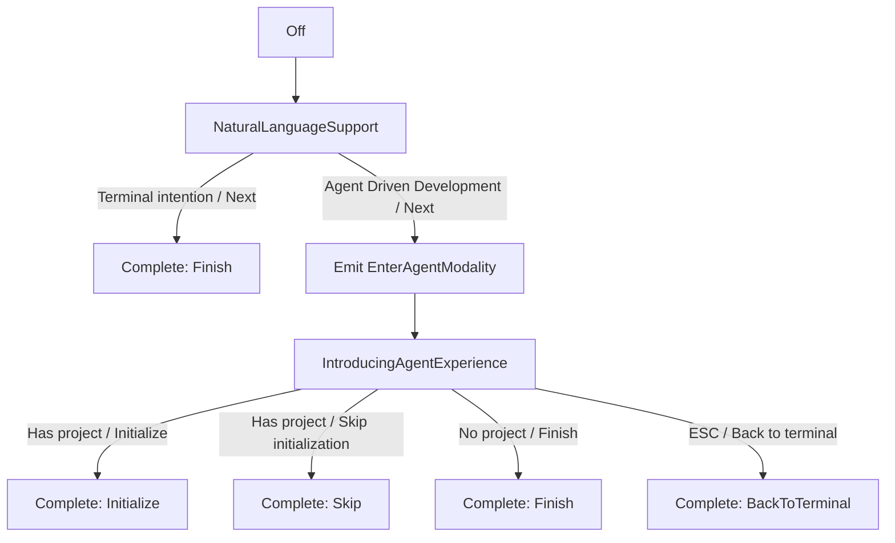

# GH11107: Tech Spec — Reduce first-time agent onboarding callouts
## Context
`specs/GH11107/PRODUCT.md` defines the target behavior: Agent Driven Development onboarding with Agent Modality should show two visible callouts instead of four.
The current flow is implemented as a small model/view state machine in the onboarding crate and consumed by `TerminalView`.
- `crates/onboarding/src/callout/model.rs:64` defines `AgentModalityCalloutState` with four visible states: `MeetTerminalInput`, `NaturalLanguageSupport`, `IntroducingAgentExperience`, and `UpdatedAgentInput`.
- `crates/onboarding/src/callout/model.rs:185` implements `next_agent_modality`, which advances through all four states for `OnboardingIntention::AgentDrivenDevelopment`.
- `crates/onboarding/src/callout/model.rs:302` maps callout states to tutorial prompts via `prompt_for_agent_modality`.
- `crates/onboarding/src/callout/model.rs:345` emits callout display telemetry names for each visible state.
- `crates/onboarding/src/callout/model.rs:476` starts Agent Modality onboarding at `MeetTerminalInput`.
- `crates/onboarding/src/callout/view.rs:99` renders `get_agent_modality_callout_options`, including the current `total_steps = 4` for Agent Driven Development.
- `crates/onboarding/src/callout/view.rs:118` renders `MeetTerminalInput`.
- `crates/onboarding/src/callout/view.rs:136` renders `NaturalLanguageSupport`.
- `crates/onboarding/src/callout/view.rs:178` renders `IntroducingAgentExperience`.
- `crates/onboarding/src/callout/view.rs:190` renders `UpdatedAgentInput`.
- `crates/onboarding/src/callout/view.rs:362` positions `UpdatedAgentInput` differently from earlier callouts by returning `false` from `should_position_above_zero_state`.
- `app/src/terminal/view.rs (13942-14117)` owns callout lifecycle side effects: submitting prompts, entering agent view on `EnterAgentModality`, applying natural language detection changes, clearing input, and exiting agent view.
- `app/src/workspace/view/onboarding.rs (178-195)` chooses `AgentOnboardingVersion::AgentModality` when `FeatureFlag::AgentView` is enabled.
- `app/src/terminal/view/init.rs (876-948)` registers debug keybindings that launch Agent Modality onboarding with project, without project, and with terminal intention.
The existing design already has the right separation of responsibilities:
- The onboarding model decides which state comes next and emits semantic events.
- The onboarding view maps state to callout text/buttons.
- `TerminalView` applies terminal/agent side effects in response to view events.
The implementation should keep that boundary and only shorten the Agent Driven Development state sequence.
## Proposed changes
### 1. Collapse the four visible Agent Driven Development states into two rendered steps
Keep two product concepts:
- Terminal input with natural language support.
- Warp's agent experience.
There are two reasonable implementation approaches:
1. Remove the unused enum variants entirely.
2. Keep the enum variants but skip the obsolete states.
Prefer removing the obsolete variants if the resulting diff stays small. The skipped states are no longer product-visible, and exhaustive matches are easier to reason about when the enum only represents states that can occur.
The resulting Agent Modality visible states should be:
- `NaturalLanguageSupport`
- `IntroducingAgentExperience`
`MeetTerminalInput` and `UpdatedAgentInput` should be removed or made unreachable.
### 2. Start Agent Modality onboarding at the combined terminal/NLD callout
Update `OnboardingCalloutModel::start_onboarding` so Agent Modality starts at `NaturalLanguageSupport` instead of `MeetTerminalInput`.
This preserves the current terminal-first flow while eliminating the separate "meet terminal input" callout. The `NaturalLanguageSupport` view copy will absorb the terminal-input concept.
### 3. Update `next_agent_modality`
For `OnboardingIntention::AgentDrivenDevelopment`:
- `Off` should advance to `NaturalLanguageSupport`.
- `NaturalLanguageSupport` should advance to `IntroducingAgentExperience`.
- Advancing from `NaturalLanguageSupport` should still emit `EnterAgentModality`, because this is the moment the tutorial moves from terminal context into scoped agent context.
- `IntroducingAgentExperience` should complete the flow:
  - `FinalState::Initialize` when `has_project` is true.
  - `FinalState::Finish` when `has_project` is false.
For `OnboardingIntention::Terminal`:
- The flow should remain terminal-only.
- `NaturalLanguageSupport` should complete with `FinalState::Finish`.
- It should not emit `EnterAgentModality`.
### 4. Move final actions from `UpdatedAgentInput` to `IntroducingAgentExperience`
Update `get_agent_modality_callout_options`:
- Agent Driven Development `total_steps` becomes `2`.
- `NaturalLanguageSupport` uses `StepStatus::new(0, 2)` for Agent Driven Development.
- `IntroducingAgentExperience` uses `StepStatus::new(1, 2)` for Agent Driven Development.
`NaturalLanguageSupport` should combine terminal-input and NLD content. It should continue to branch on `initial_natural_language_detection_enabled`:
- If NLD was initially enabled, use shorter override-focused copy and no checkbox.
- If NLD was initially disabled, show the full NLD explanation and checkbox.
`IntroducingAgentExperience` should become the final action surface:
- With project:
  - title should remain agent-experience oriented or otherwise clearly communicate the scoped agent view.
  - primary button: `Initialize`.
  - secondary button: `Skip initialization`.
- Without project:
  - primary button: `Finish`.
  - secondary button: `Back to terminal` with `escape`.
Terminal intention can continue to use the natural language support callout as its final step, with a one- or two-step display depending on the final product copy. The important invariant is that Terminal intention does not show the agent-experience callout.
### 5. Update skip, finish, and back-to-terminal handling
The current model handles these actions on `UpdatedAgentInput`.
Move that behavior to `IntroducingAgentExperience`:
- `skip()` should complete with `FinalState::Skip` when the state is `IntroducingAgentExperience` and `has_project` is true.
- `finish()` should complete with `FinalState::Finish` when the state is `IntroducingAgentExperience` and `has_project` is false.
- `back_to_terminal()` should complete with `FinalState::BackToTerminal` when the state is `IntroducingAgentExperience`, regardless of whether the user selected a project. This keeps the `ESC` behavior aligned with the final callout copy.
Keep logging for invalid actions, but update messages and match arms so valid new-state actions do not log errors.
### 6. Update prompt mapping
Update `prompt_for_agent_modality`:
- `NaturalLanguageSupport` should return a terminal-context sample appropriate for the combined first callout, likely the current `MeetTerminalInput` placeholder (`Run a command...`) or a refined terminal/NLD example.
- `IntroducingAgentExperience` should return:
  - `/init` when `has_project` is true.
  - the current agent-context placeholder when `has_project` is false.
- Completion states should continue to return `OnboardingQuery::None`.
The downstream input application in `TerminalView::apply_onboarding_callout_query_to_input` can remain unchanged because it already locks agent mode for `AgentPrompt` and leaves terminal commands in terminal context.
### 7. Update callout positioning
Today `should_position_above_zero_state` returns `false` only for `UpdatedAgentInput`.
After the final callout moves to `IntroducingAgentExperience`, update this method so the final agent-experience callout uses the intended agent-input positioning.
The expected behavior is:
- first callout: terminal/zero-state positioning.
- second callout: agent-input positioning after `EnterAgentModality`.
### 8. Update telemetry names
Update `send_callout_displayed_telemetry` so it only emits displayed events for callouts that can actually be shown.
Recommended names:
- Keep `natural_language_support` for the combined first callout to preserve continuity with existing telemetry.
- Keep `introducing_agent_experience` for the second callout.
Remove or stop emitting:
- `meet_terminal_input`
- `updated_agent_input`
Completion telemetry in `set_state` can remain unchanged because the existing `FinalState` values still describe user outcomes.
### 9. Keep `TerminalView` side effects mostly unchanged
`app/src/terminal/view.rs` should not need major changes.
The important existing behaviors should continue to be driven by model events:
- `EnterAgentModality` enters agent view without submitting a prompt.
- `NaturalLanguageDetectionToggled` persists the setting immediately.
- `FinalState::Initialize` submits `/init`.
- `FinalState::Skip | FinalState::Finish` clears input and completes onboarding.
- `FinalState::BackToTerminal` exits agent view, clears input, and completes onboarding.
If moving final actions causes `FinalState::Initialize` prompt lookup to differ, prefer keeping the existing hard-coded `/init` submission in the `Initialize` handler rather than relying on prompt state.
### 10. Update debug/demo surfaces and comments
Update comments in:
- `crates/onboarding/src/callout/model.rs`
- `crates/onboarding/src/callout/view.rs`
so they no longer describe a four-step Agent Modality flow.
The debug keybindings in `app/src/terminal/view/init.rs` can stay, but their launched flows should now show only two callouts for Agent Driven Development.
Update `crates/onboarding/examples/callout_flow.rs` only if its demo text or assumptions mention the old four-step sequence.
## State transition diagram

## Testing and validation
### Unit tests
There do not appear to be existing unit tests for `crates/onboarding/src/callout/model.rs`. If adding tests stays lightweight, add model tests covering:
- Agent Driven Development starts at `NaturalLanguageSupport`.
- Agent Driven Development advances from `NaturalLanguageSupport` to `IntroducingAgentExperience` and emits `EnterAgentModality`.
- Agent Driven Development with project completes with `Initialize`.
- Agent Driven Development without project completes with `Finish`.
- Skip and back-to-terminal complete with the correct final states from `IntroducingAgentExperience`.
- Terminal intention completes from `NaturalLanguageSupport` without emitting `EnterAgentModality`.
If adding tests requires too much test harness setup, rely on debug flow manual validation for this small state-machine change.
### Manual validation
Use the existing debug actions registered in `app/src/terminal/view/init.rs`:
- `[Debug] Onboarding Callout: Modality - Project`
- `[Debug] Onboarding Callout: Modality - No Project`
- `[Debug] Onboarding Callout: Modality - Terminal`
Validate:
- Project Agent Driven Development flow shows exactly two dots and two callouts.
- No-project Agent Driven Development flow shows exactly two dots and two callouts.
- First callout appears in terminal context and does not enter agent view.
- Clicking `Next` on the first callout enters agent view and shows the second callout.
- Project flow primary action initializes with `/init`.
- Project flow skip action completes without initialization.
- Project flow `ESC` exits agent view and returns to terminal.
- No-project flow `Finish` completes without submitting.
- No-project flow `Back to terminal` exits agent view and clears input.
- Natural language detection checkbox appears only when initially disabled and updates the setting immediately.
- Terminal-intention debug flow does not enter agent view.
- Universal Input onboarding still follows its existing flow.
### Commands
Run:
- `cargo fmt`
- A targeted check for onboarding/app compilation, such as `cargo check -p onboarding` if supported by workspace dependencies.
- If touching app-side code beyond the onboarding files, run the smallest relevant app check available locally.
Before opening or updating a PR, follow repo policy and run the required `cargo fmt` and `cargo clippy` checks from presubmit guidance.
## Risks and mitigations
### Entering agent view at the wrong time
Risk: If `EnterAgentModality` is emitted too early, the first callout will appear in agent context instead of terminal context.
Mitigation: Keep `EnterAgentModality` on the transition from `NaturalLanguageSupport` to `IntroducingAgentExperience`, not on start.
### Invalid action handling after moving final buttons
Risk: Buttons moved from `UpdatedAgentInput` to `IntroducingAgentExperience` could dispatch actions that the model still considers invalid.
Mitigation: Update `skip`, `finish`, and `back_to_terminal` match arms in the same diff as the view button move.
### Prompt mode mismatch
Risk: The first callout could force agent input mode if it uses `OnboardingQuery::AgentPrompt`.
Mitigation: Return `OnboardingQuery::TerminalCommand` for the first callout if the intended context is terminal input, and keep agent prompts for the second callout.
### Telemetry discontinuity
Risk: Removing two callouts changes telemetry volume and may surprise dashboards that expect the old names.
Mitigation: Preserve the two retained callout names and intentionally stop emitting display events for removed callouts. Call out the expected telemetry change in the PR description.
## Parallelization
Parallel sub-agents are not recommended for this implementation. The change is small and tightly coupled across one state machine, one view mapping, and one parent event consumer. Splitting it would create more coordination overhead than wall-clock savings.
If this expands into visual redesign or new tests, a second local agent could independently add validation coverage in a separate worktree such as `../warp-gh11107-tests` on branch `agent/gh11107-tests`, while the main implementation remains on the feature branch. For the scoped two-callout change, a single branch and single PR is the simplest strategy.
