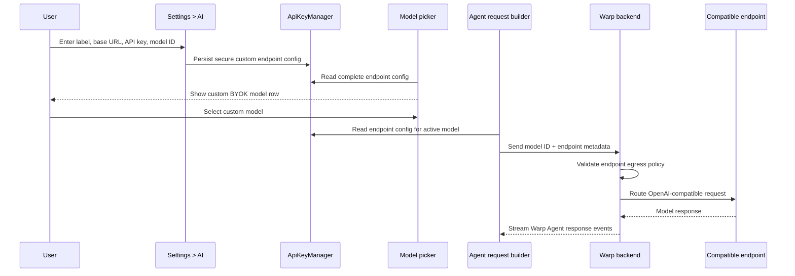

# Tech Spec: OpenAI-compatible BYOK endpoints

Issue: https://github.com/warpdotdev/warp/issues/4687
Product spec: `specs/GH4687/product.md`

## Context

Warp already has the main pieces needed for provider-specific BYOK:

- secure local credential storage
- Settings > AI provider key inputs
- server-provided model choices
- model-picker BYOK affordances
- request-time API key payloads sent with Warp Agent requests

The missing piece for issue #4687 is a custom endpoint model entry that carries a user-provided base URL and model ID, instead of requiring the model to exist in Warp's server-approved model list. V1 is limited to backend-reachable HTTPS endpoints because this spec preserves Warp's current backend-routed BYOK request architecture.

Relevant code in the current client:

- `crates/ai/src/api_keys.rs:20` defines the locally persisted BYOK key shape. It currently contains fixed provider slots, including `google`, `anthropic`, `openai`, and `open_router`.
- `crates/ai/src/api_keys.rs:120` builds the `warp_multi_agent_api::request::settings::ApiKeys` payload for agent requests and returns `None` when no request credentials are present.
- `app/src/settings_view/ai_page.rs:6274` defines `ApiKeysWidget`, the Settings > AI widget that renders fixed provider key editors.
- `app/src/settings_view/ai_page.rs:6417` renders each API key input, and `app/src/settings_view/ai_page.rs:6454` adds the existing OpenAI, Anthropic, and Google inputs.
- `app/src/ai/llms.rs:28` marks a model as using a user API key when BYOK is enabled and the model provider has a matching stored key.
- `app/src/ai/llms.rs:87` defines fixed client-side `LLMProvider` variants.
- `app/src/terminal/input/models/data_source.rs:224` builds model picker rows, clears upgrade disablement for BYOK-capable provider models, and renders BYOK/manage affordances.
- `app/src/terminal/input/models/data_source.rs:494` limits the "bring your own key" upsell to fixed providers.
- `app/src/ai/agent/api.rs:156` creates `RequestParams` for Warp Agent requests.
- `app/src/ai/agent/api.rs:237` pulls BYOK request credentials from `ApiKeyManager`.
- `app/src/ai/agent/api/impl.rs:59` serializes the final `warp_multi_agent_api::Request`, including selected model IDs and request API keys.
- `crates/warp_graphql_schema/api/schema.graphql:1913` lists server `LlmProvider` enum values used for server-provided models.
- `crates/warp_graphql_schema/api/schema.graphql:1927` already has `LlmSettingsInput` fields such as `apiKey` and `baseUrl` for workspace-level LLM settings, but the client workspace conversion currently stores only host-level enablement in `app/src/workspaces/workspace.rs:619`.

## Proposed changes

### 1. Add a custom endpoint config type

Add a client-owned settings type to `crates/ai/src/api_keys.rs`:

```rust
pub struct OpenAICompatibleEndpoint {
    pub label: Option<String>,
    pub base_url: Option<String>,
    pub api_key: Option<String>,
    pub model_id: Option<String>,
}
```

Store it alongside existing provider keys in `ApiKeys`:

```rust
pub openai_compatible_endpoint: Option<OpenAICompatibleEndpoint>
```

Implementation notes:

- Keep this in secure storage with the other BYOK credentials because it includes an API key.
- Treat `label` as optional; the display layer can default to `OpenAI-compatible`.
- Add helper methods such as `is_complete()` and `display_label()` to centralize validation.
- Consider a vector shape later, but keep the initial UI and request payload to one endpoint unless maintainers prefer a list immediately.

### 2. Render the endpoint editor in Settings > AI

Extend `ApiKeysWidget` in `app/src/settings_view/ai_page.rs` with editors for:

- label
- base URL
- API key
- model ID

Use the existing single-line editor pattern from `create_api_key_editor!` for consistency. The API key field should stay password-style; label, base URL, and model ID should be plain text inputs.

Save behavior:

- On blur or Enter, persist the full config via `ApiKeyManager`.
- Empty base URL, API key, or model ID keeps the config incomplete.
- If BYOK is disabled for the workspace, preserve the stored endpoint config but disable endpoint editing and model selection using the same `UserWorkspacesEvent::TeamsChanged` handling as the fixed provider key fields. Do not clear the stored config unless the user explicitly deletes it.

Validation:

- Parse base URL with `url::Url`.
- Accept only absolute `https` URLs in V1.
- Reject obvious local/private hosts client-side, including `localhost`, loopback IPs, and missing hosts.
- Do not send a validation request to the provider while saving settings.

### 3. Add a synthetic custom model choice

Warp's current model picker is built around `LLMInfo` choices. Add a synthetic `LLMInfo` when the custom endpoint config is complete.

Recommended shape:

- `id`: the configured model ID, preferably with a stable custom prefix if the backend needs to distinguish custom endpoint models from server-known models.
- `display_name`: configured label plus model ID, for example `OpenRouter: anthropic/claude-sonnet-4.5`.
- `base_model_name`: configured model ID.
- `provider`: either a new `LLMProvider::OpenAICompatible` client variant or `LLMProvider::Unknown` plus a separate custom-model marker.
- `disable_reason`: `None` when BYOK is enabled and the config is complete.
- `host_configs`: default/direct host configuration unless the backend requires a distinct custom host.

The least surprising model-picker behavior is to inject the synthetic choice at the `LLMPreferences` boundary where server-provided model choices are already cached and exposed to the UI. If maintainers prefer to keep `LLMPreferences` server-only, the alternative is to append the custom row in `app/src/terminal/input/models/data_source.rs`, but that risks duplicating model-selection behavior across surfaces.

### 4. Extend request payloads with endpoint metadata

The selected model ID alone is not enough; the request layer must also know base URL and API key. Use a distinct request settings field instead of overloading fixed provider API keys.

Add an optional `custom_model_endpoint` payload to the agent request settings:

```protobuf
message CustomModelEndpoint {
  string provider_label = 1;
  string base_url = 2;
  string api_key = 3;
  string model_id = 4;
}

message Settings {
  // Existing fields...
  optional CustomModelEndpoint custom_model_endpoint = <next_available_field_number>;
}
```

This is clearer than extending `ApiKeys` because the custom endpoint is routing metadata, not only a credential. It also avoids overloading fixed provider-key semantics.

Versioning and compatibility:

- The field is optional and absent for all existing request paths.
- Older clients continue sending the existing settings payload without `custom_model_endpoint`.
- The backend must deploy support for the optional field before the client starts sending it.
- The client only sends `custom_model_endpoint` when the selected active model is the synthetic custom endpoint model and BYOK is enabled for the workspace.
- If the backend does not support the field or rejects the endpoint, it should return a user-facing custom endpoint error instead of falling back silently to Warp credits.

In the client:

- Extend `RequestParams` in `app/src/ai/agent/api.rs` with optional custom endpoint metadata.
- Populate it from `ApiKeyManager` only when the active model is the custom endpoint model.
- Serialize it in `app/src/ai/agent/api/impl.rs` alongside existing `settings.model_config` and `settings.api_keys`.

### 5. Add backend egress and logging safeguards

Because Warp's backend would route requests to a user-provided URL, syntax-only client validation is insufficient. Backend validation must run before every outbound request, including redirects.

Required backend safeguards:

- Allow only `https` endpoints in V1.
- Reject URLs with embedded credentials, fragments, or query parameters in the configured base URL.
- Resolve the hostname server-side and reject private, loopback, link-local, multicast, carrier-grade NAT, documentation/test, and otherwise non-public IP ranges for both IPv4 and IPv6.
- Explicitly reject cloud metadata endpoints such as `169.254.169.254` and IPv6 link-local metadata equivalents.
- Reject `localhost`, `.local`, and direct IP literals that resolve to non-public ranges.
- Prevent DNS rebinding by pinning the validated address for the outbound connection or re-validating the resolved address immediately before connect.
- Disable redirects by default, or re-run the full validation policy on every redirect target before following it.
- Enforce short connection and total request timeouts, response-size limits, and streaming idle timeouts.
- Redact API keys, authorization headers, and any configured endpoint URL from logs, traces, telemetry, error reporting, and Oz/agent-visible debug output. If an error needs to name the endpoint, use the provider label and model ID instead of the full URL.
- Emit structured, non-secret error categories for invalid endpoint, blocked endpoint, authentication failure, endpoint timeout, and unsupported response shape.

### 6. Error handling and display

Existing invalid-key handling maps provider names for fixed providers in `app/src/ai/blocklist/controller.rs`. Add a custom endpoint path that can show the configured label when available.

Expected user-facing behavior:

- Authentication failure: "Invalid API key for <label>".
- Provider/model failure: endpoint-specific error that names the configured label/model ID when possible.
- Plan/BYOK disabled: existing BYOK upgrade/disabled behavior.

### 7. Keep #9253 compatible

If #9253 lands first, keep its OpenRouter fixed-provider support as a separate convenience path. The generic endpoint should not depend on `LLMProvider::OpenRouter` or server-approved OpenRouter model IDs.

If maintainers prefer to avoid both surfaces, #9253 can become a preset over the generic endpoint:

- label: `OpenRouter`
- base URL: `https://openrouter.ai/api/v1`
- model ID: user-entered
- API key: OpenRouter key

## End-to-end flow



## Testing and validation

Product behavior mapping:

1. Settings editor renders the four custom endpoint fields when BYOK is available.
   - Add settings-view tests if an existing harness covers `ApiKeysWidget`; otherwise validate manually in Settings > AI.
2. Incomplete config does not produce a model picker entry.
   - Unit test `OpenAICompatibleEndpoint::is_complete()`.
   - Unit test synthetic model injection/filtering.
3. Complete config produces one model picker entry with the expected display label and model ID.
   - Unit test the model source or `LLMPreferences` injection point.
4. Selecting the custom model causes request params to include endpoint metadata.
   - Unit test `RequestParams::new` or a focused helper that decides whether a selected model matches the custom endpoint.
5. Existing provider-key behavior is unchanged.
   - Existing `ApiKeyManager::api_keys_for_request` behavior should keep returning fixed provider keys.
   - Add regression coverage that OpenAI/Anthropic/Google/OpenRouter keys are not cleared when custom endpoint config changes.
6. Base URL validation rejects invalid or non-HTTPS values.
   - Unit test accepted examples:
     - `https://openrouter.ai/api/v1`
     - `https://gateway.example.com/v1`
   - Unit test rejected examples:
     - `not a url`
     - `http://localhost:11434/v1`
     - `https://localhost:11434/v1`
     - `https://127.0.0.1:11434/v1`
     - `file:///tmp/model`
7. Backend egress validation rejects unsafe destinations.
   - Unit test private IPv4 and IPv6 ranges.
   - Unit test cloud metadata addresses.
   - Unit test redirects to blocked destinations.
   - Unit test DNS rebinding or re-resolution behavior at the chosen network layer.
8. Logging/redaction tests prove API keys, Authorization headers, and full endpoint URLs are not emitted to logs or telemetry.

Manual validation after implementation:

- Configure OpenRouter with `https://openrouter.ai/api/v1`, an OpenRouter API key, and a known model ID.
- Select the custom model in an execution profile.
- Send a simple Warp Agent prompt.
- Confirm the request uses the custom endpoint path and does not consume Warp credits unless the configured fallback explicitly does so.

## Risks and mitigations

- Risk: custom endpoints may not support the complete Warp Agent protocol or tool expectations.
  Mitigation: scope the first version to OpenAI-compatible chat/model routing and return clear provider/model errors when the endpoint cannot satisfy a request.
- Risk: users may expect local-only execution or `localhost` support.
  Mitigation: V1 explicitly excludes localhost/private-network endpoints and copy should say this follows Warp's backend-routed BYOK request flow.
- Risk: arbitrary endpoint routing creates SSRF and secret-leak exposure.
  Mitigation: backend egress validation, redirect handling, DNS rebinding protection, timeouts, response limits, and log redaction are required before implementation is complete.
- Risk: model IDs collide with server-provided IDs.
  Mitigation: use an internal custom model prefix or a separate marker to distinguish custom endpoint selections.
- Risk: storing routing metadata in `ApiKeys` overloads a fixed-provider key store.
  Mitigation: keep the initial secure-storage location for safety, but model the endpoint as a distinct typed config and prefer a distinct request field.
- Risk: #9253 and the generic endpoint surface duplicate OpenRouter UX.
  Mitigation: keep the generic flow as the base capability and treat OpenRouter-specific UI as a preset or convenience layer.

## Follow-ups

- Multiple saved custom endpoint profiles.
- Client-side/local routing for localhost and private-network endpoints.
- Optional OpenRouter preset that pre-fills the base URL.
- Optional model catalog import for endpoints that expose a compatible `/models` endpoint.
- Per-profile custom endpoint selection if execution profiles need separate endpoint configs.
