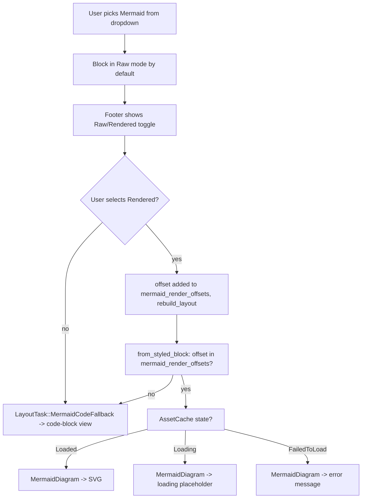

# Notebook editor: Raw/Rendered toggle for Mermaid code blocks — Tech Spec

## Context

See `specs/GH549/PRODUCT.md` for the full user-facing behavior.

Today the notebook editor unconditionally renders Mermaid-labeled code blocks as diagrams when `FeatureFlag::MarkdownMermaid` is enabled and the interaction state is `Selectable` or `Editable` (governed by `NotebooksEditorModel::render_mermaid_diagrams_in_state`). The new behavior requires every Mermaid block to default to Raw (code-block view) and let the user opt in to diagram rendering per block via an explicit toggle, matching the existing Raw/Rendered segmented control used in the markdown file viewer.

Relevant files:
- `crates/editor/src/render/element/mod.rs (880-895)` — `renderable_blocks` match arm for `BlockItem::RunnableCodeBlock` fetches the `runnable_command` via `parent.runnable_command_at(start_offset, ctx)` and passes it to `RenderableRunnableCommand::new` (which calls `render_block_footer`). The `BlockItem::MermaidDiagram` arm does **not** fetch the command, so no footer is rendered — this is the root cause of the toggle disappearing in Rendered mode.
- `crates/editor/src/render/element/runnable_command.rs` — `RenderableRunnableCommand::new` accepts `Option<&dyn RunnableCommandModel>`, creates the footer element, lays it out, and paints it at `content_rect.lower_right()` in a higher z-index layer. The `COMMAND_SPACING` already reserves `BLOCK_FOOTER_HEIGHT` padding at the bottom, so footer space exists.
- `crates/editor/src/content/edit.rs (689-798)` — `LayoutTask::from_styled_block` decides whether a `CodeBlockType::Mermaid` block becomes `LayoutTask::MermaidDiagram` or `LayoutTask::MermaidCodeFallback`, driven by `RenderLayoutOptions::render_mermaid_diagrams` and `AssetCache` state.
- `crates/editor/src/content/edit.rs (501-603)` — `EditDelta::layout_delta` iterates blocks with a `current_offset` counter that tracks each block's start `CharOffset`.
- `crates/editor/src/content/mermaid_diagram.rs` — `mermaid_asset_source` and `mermaid_diagram_layout`; constructs the async `AssetSource` that fetches and caches the SVG.
- `crates/editor/src/render/model/mod.rs (201-204, 1649-1656)` — `RenderLayoutOptions` (currently `Copy`) and `RenderState::set_render_mermaid_diagrams`.
- `crates/editor/src/render/element/mermaid.rs` — `RenderableMermaidDiagram` shows the loading placeholder, SVG, or error state and paints the footer in rendered mode.
- `app/src/notebooks/editor/model.rs (148-161, 337-343)` — `render_mermaid_diagrams_in_state` and the interaction-state handler that sets the global flag.
- `app/src/notebooks/editor/notebook_command.rs (582-686)` — `render_block_footer` renders the language dropdown, copy button, and run button; Mermaid blocks get no special UI today.
- `app/src/notebooks/editor/view.rs` — `EditorViewAction` enum, `RichTextEditorView::handle_action`, and `watch_layout_affecting_asset_loads`, which eagerly watches layout-affecting Mermaid assets and rebuilds layout after they finish loading.
- `app/src/view_components/markdown_toggle_view.rs` — `MarkdownToggleView` wraps `SegmentedControl<MarkdownDisplayMode>` and emits `MarkdownToggleEvent::ModeSelected`; already used by `FileNotebookView`.
- `app/src/notebooks/file/mod.rs (78-81)` — `MarkdownDisplayMode` enum (`Rendered` / `Raw`).

Current layout-time flow (Mermaid language tag, `FeatureFlag::MarkdownMermaid` enabled):
1. `text.rs` classifies the block as `CodeBlockType::Mermaid`.
2. `edit.rs` sees `render_mermaid_diagrams == true` and routes based on `AssetCache` state: `Loaded` → `MermaidDiagram`, `Loading` → `MermaidCodeFallback` with pending asset, `FailedToLoad` → `MermaidCodeFallback`.
3. `RenderableMermaidDiagram` shows "Rendering Mermaid diagram…" while loading, then SVG.
4. `mermaid_diagram_layout` previously used `width = min(available_width, intrinsic_svg_width)` for loaded SVGs, and fell back to the raw code-block height when the SVG was not loaded. This caused rendered blocks to sometimes use the raw source text height and sometimes use SVG aspect-ratio height.

Key properties informing the design:
- `render_mermaid_diagrams` is a global `bool` in `RenderLayoutOptions`; there is no per-block rendering control today.
- `EditDelta::layout_delta` already tracks `current_offset` per block — this can be threaded into `from_styled_block` as a `block_start: CharOffset` param to enable per-block lookup.
- `MarkdownDisplayMode` and `MarkdownToggleView` already exist and are reusable.

## Proposed changes

### 1. Stop auto-rendering Mermaid in notebooks (default Raw)

Change `NotebooksEditorModel::render_mermaid_diagrams_in_state` to always return `false`. Remove (or no-op) the call to `set_render_mermaid_diagrams` in `handle_interaction_state_model_event`. This makes all Mermaid blocks default to code-block (Raw) view (Behavior invariants 3, 5, 8).

Non-notebook surfaces (plans, agent output) use `RenderState` instances that are separate from the notebook editor model. They are unaffected by this change to `NotebooksEditorModel`.

### 2. Add `mermaid_render_offsets` to `RenderLayoutOptions`

`RenderLayoutOptions` in `crates/editor/src/render/model/mod.rs` currently derives `Copy`. Add:
```rust
pub mermaid_render_offsets: std::collections::HashSet<string_offset::CharOffset>,
```

Remove `Copy` from the derive (a `HashSet` is not `Copy`). Change `from_styled_block` to take `layout_options: &RenderLayoutOptions` (reference) instead of by value. Update all call sites accordingly.

Add to `RenderState`:
```rust
pub fn set_mermaid_render_offsets(
    &mut self,
    offsets: std::collections::HashSet<string_offset::CharOffset>,
) -> bool { ... }
```
Returns `true` when the set changed (caller uses this to trigger relayout, same pattern as `set_render_mermaid_diagrams`).

### 3. Thread `block_start` into `from_styled_block`

Add `block_start: CharOffset` as a parameter to `LayoutTask::from_styled_block`. In `EditDelta::layout_delta`, pass the already-tracked `current_offset` as `block_start` when calling `from_styled_block`. Update the test helper `layout_mermaid_block_for_test` to pass `CharOffset::zero()` (or a suitable test offset).

Change the Mermaid routing condition from:
```rust
if layout_options.render_mermaid_diagrams && is_mermaid(...)
```
to:
```rust
if (layout_options.render_mermaid_diagrams
    || layout_options.mermaid_render_offsets.contains(&block_start))
    && is_mermaid(...)
```

### 4. Produce `MermaidDiagram` for all states when user opted in

For blocks in `mermaid_render_offsets`, always produce `LayoutTask::MermaidDiagram` regardless of `AssetCache` state (the render element will display the appropriate UI per state):
- `Loaded` → call `mermaid_diagram_layout`, which uses the full available code-block content width and derives height from the loaded SVG aspect ratio at that width.
- `Loading` → call `mermaid_diagram_layout`, which uses the full available code-block content width and a stable placeholder height that is independent of raw source text height, then emit `MermaidDiagram` (render element shows loading placeholder).
- `FailedToLoad` → call `mermaid_diagram_layout`, which uses the same full-width stable fallback dimensions, then emit `MermaidDiagram` (render element shows error message).

Empty source always falls through to `MermaidCodeFallback` regardless of mode (Behavior invariant 8 — cannot render empty).

For blocks NOT in `mermaid_render_offsets`, keep the existing logic (`Loading` → `MermaidCodeFallback` with pending asset, `FailedToLoad` → `MermaidCodeFallback`), which is the correct Raw behavior.

### 5. Show error message in `RenderableMermaidDiagram`

In `crates/editor/src/render/element/mermaid.rs`, extend `RenderableMermaidDiagram::layout` to check `AssetCache` for the block's `asset_source`:
- `AssetState::Loading` → existing "Rendering Mermaid diagram…" `before_load` placeholder.
- `AssetState::Loaded` → existing `Image` element (SVG render).
- `AssetState::FailedToLoad` → create a text element with "Error rendering Mermaid diagram. Please check syntax." using `code_text` styles and `placeholder_color`, wrapped in `Align::finish()`, stored in `self.image_element` to reuse the same paint path.
Draw the block cursor at the right edge of the rendered diagram when the selection head is on the Mermaid block, matching the existing horizontal rule and image affordance. Do not draw a text cursor over the diagram contents; the rendered frame itself is not text-editable.

### 6. Add `mermaid_display_mode` to `NotebookCommand`

Add to `NotebookCommand`:
```rust
mermaid_display_mode: MarkdownDisplayMode,   // default: Raw
mermaid_toggle: ViewHandle<MermaidDisplayModeToggle>,
```

`MermaidDisplayModeToggle` is a thin new view (in `notebook_command.rs`) that wraps `MarkdownToggleView`. In its view-level subscription to `MarkdownToggleEvent::ModeSelected(mode)`, it dispatches `EditorViewAction::MermaidDisplayModeSelected { start_anchor, mode }` (see §7).

In `render_block_footer`, when `block_style == CodeBlockType::Mermaid`, render two icon buttons directly (no separate view wrapper needed — see §10). This is always visible for Mermaid blocks regardless of editor focus (Behavior invariant 9).

### 7. Add `EditorViewAction::MermaidDisplayModeSelected` and handle it

Add to `EditorViewAction` in `app/src/notebooks/editor/view.rs`:
```rust
MermaidDisplayModeSelected {
    start_anchor: Anchor,
    mode: MarkdownDisplayMode,
},
```

In `RichTextEditorView::handle_action` for this variant:
1. Resolve `start_anchor` to a `CharOffset` via `self.model.as_ref(ctx).buffer_selection_model().as_ref(ctx).resolve_anchor(&start_anchor)`.
2. Call `self.model.update(ctx, |model, ctx| model.set_mermaid_render_mode(offset, mode, ctx))`.

`NotebooksEditorModel::set_mermaid_render_mode(offset, mode, ctx)`:
1. Find the `NotebookCommand` at `offset` via `self.child_models.model_at::<NotebookCommand>(offset)` and update its `mermaid_display_mode`.
2. Recompute `mermaid_render_offsets` by iterating all `NotebookCommand` model handles and collecting offsets where `mermaid_display_mode == Rendered`.
3. Let `changed = self.render_state.update(ctx, |rs, _| rs.set_mermaid_render_offsets(new_offsets))`.
4. If `changed`, call `self.rebuild_layout(ctx)`.

### 8. Keep the Raw/Rendered toggle visible in Rendered mode (fix for toggle disappearing)

When a block switches to `BlockItem::MermaidDiagram`, `renderable_blocks` in `crates/editor/src/render/element/mod.rs` currently creates `RenderableMermaidDiagram::new(item)` with no footer. Fix:

1. In the `MermaidDiagram` arm of `renderable_blocks`, fetch `runnable_command` the same way the `RunnableCodeBlock` arm does:
   ```rust
   BlockItem::MermaidDiagram { .. } => {
       let start_offset = item.block_offset;
       let runnable_command = parent.runnable_command_at(start_offset, ctx);
       RenderableMermaidDiagram::new(item, runnable_command, self.display_options.focused, ctx).finish()
   }
   ```

2. In `RenderableMermaidDiagram` (`crates/editor/src/render/element/mermaid.rs`):
   - Add `footer: Box<dyn Element>` field (same as `RenderableRunnableCommand`).
   - Accept `model: Option<&dyn RunnableCommandModel>`, `editor_is_focused: bool`, `ctx: &AppContext` in `new()`; create the footer via `model.render_block_footer(editor_is_focused, ctx)` or `Empty::new().finish()` when `model` is `None`.
   - In `layout()`, lay out the footer at `SizeConstraint::strict(vec2f(content_width, BLOCK_FOOTER_HEIGHT))`.
   - In `paint()`, paint the footer at `content_rect.lower_right() - vec2f(footer_width, 0)` inside a higher z-index layer, matching `RenderableRunnableCommand`.
   - In `after_layout()` and `dispatch_event()`, delegate to the footer.

`COMMAND_SPACING` (used for Mermaid block layout) already reserves `BLOCK_FOOTER_HEIGHT` as `padding.bottom`, so the footer occupies space that is already accounted for in the block's total height — no layout dimension changes are needed.

This ensures the Raw/Rendered toggle (part of `render_block_footer`) remains visible regardless of whether the block renders as `RunnableCodeBlock` (Raw mode) or `MermaidDiagram` (Rendered mode), satisfying Behavior invariant 6.

### 9. Language icons in the code block dropdown (Behavior invariants 4–5)

Replace `Dropdown::add_items` (plain text labels) with `Dropdown::set_rich_items` (full `MenuItem` items) in `NotebookCommand::new`. Each item is built with `MenuItemFields::new(code_block_type.to_string()).with_icon(icon_for_type(&code_block_type)).with_on_select_action(...).into_item()`.

Language → icon mapping (using existing bundled SVG assets via the `Icon` enum):

| Language | Icon |
|----------|------|
| Shell | `Icon::Terminal` (`terminal.svg`) |
| Mermaid | `Icon::Code1` (placeholder — no branded Mermaid SVG yet) |
| PowerShell | `Icon::Powershell` (`powershell.svg`) |
| Go | new `Icon::GoLang` (`go.svg`) |
| C++ | new `Icon::CppLang` (`cpp.svg`) |
| JavaScript | new `Icon::JavaScriptLang` (`javascript.svg`) |
| Python | new `Icon::PythonLang` (`python.svg`) |
| Rust | new `Icon::RustLang` (`rust.svg`) |
| SQL | new `Icon::SqlLang` (`sql.svg`) |
| JSON | new `Icon::JsonLang` (`json.svg`) |
| PHP | new `Icon::PhpLang` (`php.svg`) |
| Kotlin | new `Icon::KotlinLang` (`kotlin.svg`) |
| C#, Java, Ruby, YAML, Lua, Swift, Elixir, Scala, text | `Icon::Code1` fallback |

Add the new variants (`GoLang`, `CppLang`, etc.) to the `Icon` enum in `crates/warp_core/src/ui/icons.rs` with the corresponding SVG paths.

Also increase the dropdown button width (`set_top_bar_max_width`) and menu width (`set_menu_width`) so language names and icons render without truncation.

### 10. Replace text toggle with icon buttons (Behavior invariants 6–10)

Remove `MermaidDisplayModeToggle` view and the `mermaid_toggle` field from `NotebookCommand`. Instead, render two icon buttons inline inside `render_block_footer` using `block_footer_action_button`-style construction:

```rust
// In render_block_footer, when block_style == CodeBlockType::Mermaid:
let is_raw = matches!(self.mermaid_display_mode, MarkdownDisplayMode::Raw);
let start_anchor_raw = self.start.clone();
let start_anchor_rendered = self.start.clone();

let raw_button = icon_button(appearance, Icon::Code1, is_raw, self.mouse_state_handles.mermaid_raw_button_state.clone())
    .with_cursor(Cursor::Arrow).on_click(move |ctx, _, _| {
        ctx.dispatch_typed_action(&EditorViewAction::MermaidDisplayModeSelected {
            start_anchor: start_anchor_raw.clone(),
            mode: MarkdownDisplayMode::Raw,
        });
    }).finish();

let rendered_button = icon_button(appearance, Icon::Grid, !is_raw, self.mouse_state_handles.mermaid_rendered_button_state.clone())
    .with_cursor(Cursor::Arrow).on_click(move |ctx, _, _| {
        ctx.dispatch_typed_action(&EditorViewAction::MermaidDisplayModeSelected {
            start_anchor: start_anchor_rendered.clone(),
            mode: MarkdownDisplayMode::Rendered,
        });
    }).finish();
```

Add `mermaid_raw_button_state: MouseStateHandle` and `mermaid_rendered_button_state: MouseStateHandle` to `MouseStateHandles`.

Using element-level click handlers that call `ctx.dispatch_typed_action` replaces the previous view-subscription mechanism, simplifying the implementation.

### 11. Mermaid block sizing and relayout (Behavior invariants 15–18)

In `mermaid_diagram_layout` (`crates/editor/src/content/mermaid_diagram.rs`):
- Remove the `default_height` parameter that was supplied from raw code-block layout.
- Compute `max_width = layout.max_width() - spacing.x_axis_offset()` and always use that value as the rendered frame width.
- When the SVG is loaded, compute `height = max_width * intrinsic_svg_height / intrinsic_svg_width`.
- When the SVG is loading, failed, evicted, or lacks valid intrinsic dimensions, use a stable placeholder height equal to `base_line_height * 10.0`.
- Do not clamp loaded SVGs to their intrinsic width; a loaded rendered diagram should use the full available code-block content width.

The resulting shape is:
```rust
let width = max_width;
let height = loaded_svg_height_for_full_width
    .unwrap_or((layout.rich_text_styles().base_line_height().as_f32() * 10.0).into_pixels());
```

In `app/src/notebooks/editor/view.rs`, keep eagerly watching layout-affecting `BlockItem::MermaidDiagram` asset loads and rebuild layout when they complete in `Selectable`, `Editable`, or `EditableWithInvalidSelection`. Rendered Mermaid blocks can now appear while the notebook is in editing mode, so restricting this rebuild to `Selectable` leaves the frame stuck at fallback dimensions until another unrelated layout event.

### 12. Keep markdown storage and classification unchanged

- Do not change `From<&CodeBlockText> for CodeBlockType`. Block stays `CodeBlockType::Mermaid`.
- Do not change `to_markdown_representation`. Block serializes as ```` ```mermaid ````.
- Do not change `CodeBlockType::all()`. `Mermaid` stays in the dropdown.
- `mermaid_display_mode` is transient (not saved to the notebook file); reopening always restores Raw (Behavior invariant 23).

## Diagram



## Risks and mitigations

**Risk: `RenderLayoutOptions` is no longer `Copy` — call sites break**
Mitigation: Change `from_styled_block` to take `&RenderLayoutOptions`. The tasks are built sequentially before the parallel layout step, so a reference lifetime is safe. Update the test helper and any other call sites.

**Risk: `mermaid_render_offsets` becomes stale when blocks are added, removed, or renumbered**
Mitigation: `NotebooksEditorModel::set_mermaid_render_mode` recomputes the full set from current child models on every toggle. Child models' `mermaid_display_mode` defaults to `Raw` when a new `NotebookCommand` is created, so new blocks are always absent from the set. When a block is deleted, its `NotebookCommand` is dropped from `child_models`, and the next call to `set_mermaid_render_mode` (or a full recompute on `rebuild_layout`) will produce a set without the stale offset.

**Risk: Error state blocks are not re-laid out when source changes**
Mitigation: The `MermaidCodeFallback` path for Raw mode already watches pending assets. For Rendered-mode blocks with a failed asset, the block is in `MermaidDiagram` state. When the user edits the source, the buffer changes, `rebuild_layout` is called, and `from_styled_block` re-checks `AssetCache` for the new source hash. No special watcher is needed.

**Risk: Loading rendered blocks keep fallback dimensions after the SVG finishes**
Mitigation: Keep `BlockItem::MermaidDiagram` in `layout_affecting_asset_load` and rebuild layout when a watched asset load resolves in all notebook states where rendered Mermaid can be visible (`Selectable`, `Editable`, and `EditableWithInvalidSelection`).

**Risk: Cost of calling `mermaid_diagram_layout` for Loading/Failed blocks in Rendered mode**
Mitigation: `mermaid_diagram_layout` calls `mermaid_diagram_size` which only checks `AssetCache` state — it does not trigger a new render. If the asset is not loaded, it falls back to the stable placeholder height. There is no extra work.

## Testing and validation

Layout unit tests in `crates/editor/src/content/edit_tests.rs`:
- Behavior invariants 5, 8: Mermaid block not in `mermaid_render_offsets` lays out as `BlockItem::RunnableCodeBlock`, not `BlockItem::MermaidDiagram`.
- Behavior invariants 11–13: Mermaid block in `mermaid_render_offsets` with `AssetState::Loaded` lays out as `BlockItem::MermaidDiagram`.
- Behavior invariant 12: Mermaid block in `mermaid_render_offsets` with `AssetState::Loading` lays out as `BlockItem::MermaidDiagram` (loading placeholder path).
- Behavior invariant 14: Mermaid block in `mermaid_render_offsets` with `AssetState::FailedToLoad` lays out as `BlockItem::MermaidDiagram` (error path).
- Behavior invariants 15–17: loaded Mermaid diagram layout uses full available width and derives height from the loaded SVG's aspect ratio at that width; unloaded Mermaid diagram layout uses full available width with stable placeholder height, not raw code-block height.
- Behavior invariant 22: markdown export for a Mermaid-labeled block emits ```` ```mermaid ```` regardless of `mermaid_render_offsets`.

Notebook model tests in `app/src/notebooks/editor/model_tests.rs`:
- Behavior invariants 3, 5: setting a block's language to `Mermaid` produces a `RunnableCodeBlock` render by default (not `MermaidDiagram`).
- Behavior invariants 11–14: calling `set_mermaid_render_mode(offset, Rendered, ctx)` updates `mermaid_render_offsets` and causes the block to lay out as `MermaidDiagram`.
- Behavior invariants 5, 18: calling `set_mermaid_render_mode(offset, Raw, ctx)` removes the offset and restores code-block layout.
- Behavior invariant 23: `mermaid_display_mode` is `Raw` on a freshly created `NotebookCommand`.

Manual verification per `specs/GH549/PRODUCT.md`:
- Add a code block, set language to Mermaid → block shows as code block with Raw/Rendered toggle defaulting to Raw.
- In Raw mode, place the cursor inside the Mermaid source and press Backspace/Delete → only the adjacent character is removed; the Mermaid block remains in place.
- Select Rendered → full-width diagram frame appears (loading, then SVG, or error if source is invalid). **Toggle must remain visible inside the diagram frame.** The loaded SVG should use the full available block width and derive height from that full-width render.
- While in Rendered mode, click inside the diagram frame → the cursor appears at the right edge of the rendered block, not over the diagram contents.
- Click Raw from the diagram view → code block view restored with toggle visible.
- Edit in Raw mode, then select Rendered again → new source is rendered.
- Save and reopen notebook → toggle resets to Raw.

## Follow-ups

- Persist `mermaid_display_mode` per block in the notebook file format so it survives reopen.
- Consider unifying this toggle with plans/agent-output Mermaid rendering via `specs/mermaid-markdown-in-plans/`.
- Add a proper branded Mermaid SVG icon to the asset bundle and map it via `Icon::MermaidLang`.
- Add branded SVGs for languages currently falling back to `Icon::Code1` (C#, Java, Ruby, YAML, Swift, Elixir, Scala).
