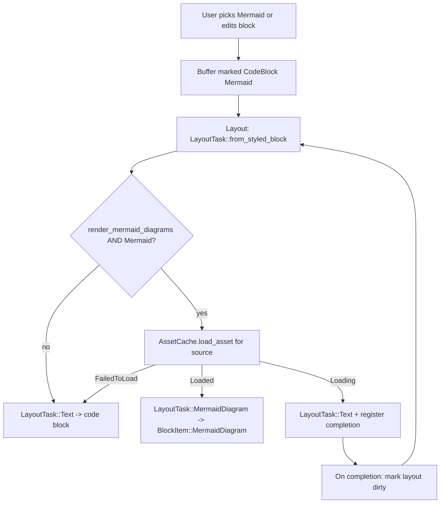

# Problem
The notebook editor classifies a code block as Mermaid as soon as the language tag says `mermaid`, and the layout pipeline unconditionally swaps that block from a text code block into `BlockItem::MermaidDiagram`. The decision to render as a diagram is based entirely on the language tag, not on whether the block's contents are actually parseable Mermaid. Users who pick `Mermaid` on a non-diagram block, or who are mid-way through authoring a diagram, see a broken-looking or empty diagram frame instead of an ordinary code block.
We need the "render as diagram" decision to also depend on whether the current block source can be successfully parsed/rendered by the Mermaid pipeline, and to update automatically as the contents change.
## Relevant code
* `crates/editor/src/content/text.rs (557-602)` — `From<&CodeBlockText> for CodeBlockType` classifies any block with a Mermaid language tag as `CodeBlockType::Mermaid` when `FeatureFlag::MarkdownMermaid` is enabled. Purely language-driven; no content check.
* `crates/editor/src/content/text.rs (535-543, 604-677)` — `CodeBlockType` enum and `CodeBlockType::all()` / `to_markdown_representation`, which define the dropdown entries and markdown round-tripping. Language-set Mermaid must keep behaving as `Mermaid` in the dropdown even when it is not being rendered as a diagram.
* `crates/editor/src/content/edit.rs (712-742)` — `LayoutTask::from_styled_block` is the point that actually switches a Mermaid `StyledTextBlock` into the diagram layout path (`Self::MermaidDiagram { .. }`) versus the text layout path (`Self::Text(text_block)`). This is the primary fork we need to gate on parseability.
* `crates/editor/src/content/edit.rs (1034-1066)` — `layout_mermaid_diagram_block` produces the `BlockItem::MermaidDiagram` that the render layer consumes.
* `crates/editor/src/content/mermaid_diagram.rs` — constructs the `AssetSource` for the Mermaid render and calls `mermaid_to_svg::render_mermaid_to_svg`. This is the only place we actually invoke the Mermaid renderer, and its result (via `AssetCache`) is the ground-truth signal for whether a given source parses.
* `crates/editor/src/render/element/mermaid.rs` — the renderable that draws the diagram and currently shows a `"Rendering Mermaid diagram…"` placeholder while the asset is loading. This also stays visible when the asset ultimately fails.
* `crates/editor/src/render/model/mod.rs (193-204, 1640-1651)` — `RenderLayoutOptions::render_mermaid_diagrams` is the existing boolean gate at the layout-options layer and the setter that re-triggers layout when it changes.
* `app/src/notebooks/editor/notebook_command.rs (142-272)` — `NotebookCommand` builds the language dropdown from `CodeBlockType::all()` and dispatches `EditorViewAction::CodeBlockTypeSelectedAtOffset { code_block_type, .. }`. The current selection is read back via `block_type_to_code_type`. The dropdown label must continue to show `Mermaid` for a `CodeBlockType::Mermaid` block even when we decline to render as a diagram.
* `app/src/ai/agent/util.rs` and `app/src/integration_testing/notebook/assertion.rs` — consumers of `is_mermaid_diagram`. These are out of scope but we must not regress them by changing the language-tag classifier's semantics.
## Current state
Layout-time flow today, for a code block whose language tag is `mermaid` and with `FeatureFlag::MarkdownMermaid` enabled:
1. `text.rs` classifies the block as `CodeBlockType::Mermaid`.
2. `edit.rs` sees `RenderLayoutOptions::render_mermaid_diagrams == true` plus `CodeBlockType::Mermaid` and emits `LayoutTask::MermaidDiagram`.
3. `mermaid_diagram_layout` registers an `AssetSource::Async` whose fetch closure calls `mermaid_to_svg::render_mermaid_to_svg`.
4. `layout_mermaid_diagram_block` produces `BlockItem::MermaidDiagram { content_length, asset_source, config }`.
5. At paint time, `RenderableMermaidDiagram` shows `"Rendering Mermaid diagram…"` until the asset resolves, then paints the SVG. If the asset fails (`AssetState::FailedToLoad`), it silently keeps showing the placeholder inside the diagram frame.
Key properties of the current state that inform the fix:
* The async render already runs every time a Mermaid source is seen, and its success/failure is cached on the shared `AssetCache` keyed by a hash of the source.
* There is no synchronous "parses or not" helper currently reachable from Warp. `is_mermaid_diagram` only inspects the language tag. `render_mermaid_to_svg` is async, returns `Result`, and is the authoritative answer.
* The render layer reacts to `AssetState` changes for paint but does not feed that signal back into the decision of whether to lay out as `BlockItem::MermaidDiagram` vs a text code block in the first place.
* `set_render_mermaid_diagrams` shows that flipping the Mermaid-render decision at the layout-options level is already wired to trigger a re-layout, so changing a per-block decision in a similar way should not require a new invalidation mechanism if we tie it to the same re-layout path.
## Proposed changes
### 1. Introduce a per-block Mermaid renderability check at layout time
Keep `CodeBlockType::Mermaid` classification unchanged so:
* the language dropdown still shows `Mermaid` as the selected value
* markdown export still emits ```` ```mermaid ````
* downstream users of `CodeBlockType::Mermaid` (agent output, integration tests, plans) keep working
Add a separate per-block decision inside `LayoutTask::from_styled_block` for whether a `CodeBlockType::Mermaid` block should be produced as `LayoutTask::MermaidDiagram` or as `LayoutTask::Text`. The new predicate answers the question "is the current source of this block parseable as a Mermaid diagram right now?" and is used alongside the existing `render_mermaid_diagrams` option:
```
if render_mermaid_diagrams && is_mermaid_code_block(text_block) && mermaid_source_is_renderable(&source, app) {
    // existing MermaidDiagram path
} else if is_mermaid_code_block(text_block) {
    // fall through to LayoutTask::Text, producing a normal code-block BlockItem
} else { ... }
```
### 2. Ground the predicate in the existing Mermaid pipeline
The predicate must agree with whatever `mermaid_to_svg` actually accepts. Two options, evaluated for fit:
* Option A: add or expose a synchronous parse-only function in `mermaid_to_svg` (for example `is_valid_mermaid(&str) -> bool` or a lightweight parse that returns `Result<(), ParseError>` without running the full render) and call it from `edit.rs`. Pros: synchronous, no state machine. Cons: requires an upstream change to the pinned `mermaid_to_svg` git revision and a second parse path that must stay in sync with `render_mermaid_to_svg`.
* Option B: drive the decision from the existing `AssetCache` entry keyed on the Mermaid source. The asset fetch already calls `render_mermaid_to_svg` and records success/failure. At layout time we inspect `AssetCache::load_asset::<ImageType>(mermaid_asset_source(&source))`:
  * `AssetState::Loaded { .. }` → render as diagram
  * `AssetState::FailedToLoad(..)` → render as code block
  * `AssetState::Loading { .. }` / `AssetState::Evicted` → render based on the previous resolved state for this source; if there is no previous resolved state, default to code-block view (safe fallback that avoids the current broken-diagram flash)
  Pros: reuses the existing pipeline, keeps the Mermaid parsing rules in one place, works today without upstream changes. Cons: the decision is asynchronous on first sight of a new source, so we need the layout to re-run when the async render resolves.
Preferred direction: Option B, with an optional move to Option A later if we want an eager synchronous answer.
Rationale:
* Option B keeps one Mermaid parser of record and avoids drift.
* The async resolution already runs exactly once per unique source thanks to `AssetCache` keying on the source hash, so there is no extra cost.
* The re-layout wiring needed for Option B is the same wiring `set_render_mermaid_diagrams` uses, and the asset cache already notifies when loads complete.
### 3. Re-layout when Mermaid asset state changes
The new predicate must cause a re-layout when it flips. Concretely:
* When we query `AssetCache::load_asset` in `from_styled_block` for a Mermaid source and get `AssetState::Loading`, register a completion callback on the returned handle (same pattern as the paint-time callers today use implicitly) that invalidates the render model's layout for that buffer version.
* The invalidation target is the existing re-layout path used when `RenderLayoutOptions` changes. We can either:
  * call the same `set_render_mermaid_diagrams`-style hook the render model already uses to dirty its layout state, or
  * add a narrower hook that marks a specific range dirty when a Mermaid asset resolves.
* On asset completion, the next layout pass re-reads `AssetCache` state and either promotes the block into `LayoutTask::MermaidDiagram` (on `Loaded`) or keeps it as `LayoutTask::Text` (on `FailedToLoad`).
Do not trigger a layout-time `render_mermaid_to_svg` call that is not already cached. Always go through `AssetCache`, so we inherit caching, deduplication, and eviction behavior for free.
### 4. Preserve code-block UX for Mermaid blocks in code-block view
A Mermaid block that falls through to `LayoutTask::Text` should look like a regular code block whose language is Mermaid:
* `BufferBlockStyle::CodeBlock { code_block_type: CodeBlockType::Mermaid }` already exists; the text layout path accepts it and lays it out as a styled code block.
* Confirm that syntax highlighting, block spacing, and the code-block frame produced by `layout_text_block` read correctly for `CodeBlockType::Mermaid`. If any code path (syntax highlighting, copy-button wiring in `notebook_command.rs`, block-type-at-point) treats `Mermaid` as "no code-block chrome", extend it to share the generic code-block behavior. The existing `NotebookCommand` already renders code-block chrome around Mermaid source so this should mostly be a verification task.
* The language dropdown continues to show `Mermaid` because `block_type_to_code_type` and `current_dropdown_selection` are based on the buffer's block type, not on whether we actually rendered a diagram.
### 5. Keep markdown storage and classification unchanged
* Do not change `From<&CodeBlockText> for CodeBlockType`. The block remains `CodeBlockType::Mermaid` when the language tag is Mermaid regardless of content.
* Do not change `to_markdown_representation`. The block still serializes as ```` ```mermaid ```` on export.
* Do not change `CodeBlockType::all()`. `Mermaid` stays as an option in the dropdown.
### 6. Feature flag gating
Gate the new behavior under the existing `FeatureFlag::MarkdownMermaid` (same flag that gates Mermaid rendering today). When the flag is off, no Mermaid rendering occurs at all, which already matches the "render as code block" outcome from the user's point of view.
If we want to land the fix before broader rollout, add a narrower flag such as `MermaidRenderIfValid` and default it on for dogfood. This is optional — the change is strictly more conservative than the current behavior, so a separate flag is not required for safety.
### 7. Consider non-notebook surfaces
`LayoutTask::from_styled_block` is shared. Any other surface that enables `render_mermaid_diagrams` (plans, agent output) will automatically get the same "render only if parseable" behavior. That is the desired outcome for those surfaces too (a plan with invalid Mermaid should show code rather than a broken diagram), and matches the intent in `specs/mermaid-markdown-in-plans/PRODUCT.md`. Confirm this during implementation and flag any surface that depends on unconditional Mermaid layout.
## End-to-end flow
1. User opens a notebook and picks `Mermaid` in the code-block language dropdown. `NotebookCommand` dispatches `EditorViewAction::CodeBlockTypeSelectedAtOffset { code_block_type: CodeBlockType::Mermaid, .. }`.
2. The buffer now reports `BufferBlockStyle::CodeBlock { code_block_type: CodeBlockType::Mermaid }` for that block.
3. Layout runs. In `LayoutTask::from_styled_block`, the predicate queries `AssetCache` for the Mermaid asset source derived from the block contents:
   * If the asset is not yet cached, the predicate returns "not currently renderable" and the block goes through `LayoutTask::Text`. A completion callback is registered on the `AssetState::Loading` handle.
   * If the asset previously succeeded, the block goes through `LayoutTask::MermaidDiagram`.
   * If the asset previously failed, the block stays as `LayoutTask::Text`.
4. Paint runs. In the code-block case, the user sees the authored text inside a normal code-block frame with the dropdown still showing `Mermaid`. In the diagram case, the existing `RenderableMermaidDiagram` path runs unchanged.
5. When an asset-completion callback fires, the render model is marked dirty. The next layout pass re-reads `AssetCache` state and either promotes the block to `BlockItem::MermaidDiagram` (on success) or keeps it as text (on failure).
6. User edits the block. The buffer version changes, layout re-runs, and steps 3–5 repeat against the new source. Since `AssetCache` keys on the source hash, each unique source is parsed exactly once and the result is reused.
7. Save/export: the block is emitted as ```` ```mermaid ```` regardless of rendered state.
## Diagrams

## Risks and mitigations
### Risk: flicker between code-block and diagram views during async resolution
If we default to code view while `AssetState::Loading`, a fresh valid Mermaid block will briefly render as code before flipping to a diagram once parsing completes.
Mitigation:
* Accept this as a one-time transition per unique source. The cache prevents re-parsing on subsequent edits with the same source.
* If the flicker is objectionable in practice, fall back to the existing placeholder inside the diagram frame for the `Loading` case but only when there is no prior resolved state for the source. Keep `FailedToLoad` in the code-view branch.
### Risk: layout does not re-run when the Mermaid asset resolves
Mitigation:
* Register completion callbacks on `AssetState::Loading` handles at layout time. On completion, call into the render model's existing re-layout hook (the same hook `set_render_mermaid_diagrams` already uses to dirty layout state).
* Cover the path with a test that transitions from `Loading` → `Loaded` and asserts the resulting `BlockItem` changes from `Text` to `MermaidDiagram`.
### Risk: cost of parsing on every keystroke
Mitigation:
* `AssetSource::Async` with its `AsyncAssetId` is keyed on a hash of the source. Identical sources are not re-parsed. Only unique sources cost a parse, which matches current behavior.
### Risk: other surfaces rely on Mermaid being rendered even when invalid
Mitigation:
* Audit callers of `RenderLayoutOptions::render_mermaid_diagrams` and the `LayoutTask::MermaidDiagram` path before landing. If any caller truly depends on unconditional Mermaid layout, add a narrow override at the layout-options layer instead of scoping the predicate by surface.
### Risk: classification-layer changes break existing consumers
Mitigation:
* Leave `CodeBlockType::Mermaid` and `From<&CodeBlockText> for CodeBlockType` unchanged. The predicate lives in the layout layer only.
## Testing and validation
* Layout unit tests in `crates/editor/src/content/edit_tests.rs`:
  * Mermaid block with non-Mermaid source lays out as `BlockItem::Paragraph` / code-block text, not `BlockItem::MermaidDiagram`, even with `render_mermaid_diagrams` on.
  * Mermaid block with valid Mermaid source continues to lay out as `BlockItem::MermaidDiagram` with the same size/config expectations as today's `test_layout_mermaid_block_uses_loaded_svg_aspect_ratio`.
  * Mermaid block whose asset is `Loading` initially lays out as text and, after driving the asset to `Loaded`, lays out as a Mermaid diagram on the next layout pass.
  * Mermaid block whose asset transitions to `FailedToLoad` stays laid out as text.
* Notebook tests in `app/src/notebooks/editor/model_tests.rs`:
  * Setting an empty or non-Mermaid block's language to `Mermaid` produces a code-block render, and the language dropdown reads `Mermaid`.
  * Typing a valid Mermaid diagram into a newly-Mermaid-labeled block transitions the render tree from a code block to a Mermaid diagram.
  * Editing a valid diagram into invalid Mermaid transitions the render tree back to a code block.
  * Markdown export for a Mermaid-labeled block emits ```` ```mermaid ```` in both states.
* Integration coverage in `app/src/integration_testing/notebook/`:
  * Open a notebook, add a code block, set language to `Mermaid`, assert the block renders as a code block with the raw text visible.
  * Paste a known-valid diagram source, assert the block renders as a Mermaid diagram.
  * Edit to break the diagram, assert it returns to code-block rendering.
* Manual verification: matches the manual steps in `specs/GH549/product.md`.
## Follow-ups
* Consider adding a synchronous Mermaid parse helper in `mermaid_to_svg` so the predicate does not need to round-trip through `AssetCache` on first sight of a new source.
* Consider a lightweight inline error affordance (hover tooltip or gutter marker) that explains why a Mermaid block is not rendering, once the "render only when valid" behavior is in place.
* Consider unifying this behavior with `specs/mermaid-markdown-in-plans/` so plans share the same "render only when parseable" contract end to end.
