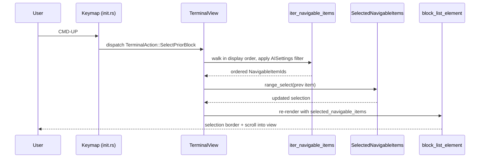

# Block navigation in agent mode — tech spec

Tracking: [#9959](https://github.com/warpdotdev/warp/issues/9959). Behavior is defined in [`product.md`](./product.md); this spec maps it onto the codebase.

## Context

Terminal-mode block navigation is fully wired and the agent view *shares the same `BlockList` / `BlockListElement` surface as terminal mode* — agent exchanges are rendered as items in the same scrollable container that terminal blocks live in (see `app/src/terminal/view.rs:2736` and the agent-view rendering path at `2991-3300`). The work in this spec is therefore not "build a new navigation system", it is "extend the existing one to recognise agent-side items as navigable, and make the set of recognised item kinds configurable".

Relevant code surfaces:

- **Terminal nav action enum** — `TerminalAction::SelectPriorBlock` (`app/src/terminal/view/action.rs:180`) and `SelectNextBlock` (`:187`).
- **Handlers** — `SelectPriorBlock`/`SelectNextBlock` arms in the `TerminalAction` match at `app/src/terminal/view.rs:24670` and `:24694`. These delegate to `select_less_recent_block` (`:18406`) and `select_more_recent_block(is_cmd_down, is_shift_down, ctx)` (`:18456`), which mutate selection through `change_block_selections(|selected| { selected.range_select(…) }, ctx)`.
- **Selection model** — `SelectedBlocks` at `app/src/terminal/model/terminal_model.rs:729-1007`. Public API includes `range_select`, `reset`, `reset_to_single`, `reset_to_block_indices`, `is_selected`, `is_empty`, `is_singleton`, `tail`, `block_indices`, `sorted_ranges`, `cardinality`. Indexed by `BlockIndex` — i.e. terminal-block-only.
- **Selection rendering** — `SelectionBorderWidth { single: 2.0, tail_multi: 3.0, reg_multi: 1.5 }` at `app/src/terminal/block_list_element.rs:110-114`; border colour from `warp_theme.block_selection_as_context_border_color()` (`:3890`) with `accent()` fallback (`:3892`).
- **Keybindings** — `EditableBinding` registration at `app/src/terminal/view/init.rs:558-574`, mapped from `CustomAction::SelectBlockAbove`/`SelectBlockBelow` (`app/src/util/bindings.rs:81-82`) and `ScrollToTopOfSelectedBlocks`/`ScrollToBottomOfSelectedBlocks` (`:101-102`). Context predicate today: `id!("Terminal") & id!("TerminalView_NonEmptyBlockList") & !id!("AltScreen")`.
- **Agent-side data** — `AIConversation::all_exchanges() -> Vec<&AIAgentExchange>` (`app/src/ai/agent/conversation.rs:1065`) walks the conversation in display order. `AIAgentExchange { input: Vec<AIAgentInput>, output_status: AIAgentOutputStatus, … }` (`app/src/ai/agent/mod.rs:2835`); inputs include `AIAgentInput::UserQuery { query, … }` (`:2398`); responses are described by `AIAgentOutputStatus::{Streaming, Finished}` (`:246`); commands the agent ran are surfaced through `AIAgentOutputMessageType` (`:1566`) inside the finished output.
- **Agent view state** — `AgentViewState::Active { conversation_id, origin, display_mode, … }` at `app/src/ai/blocklist/agent_view/controller.rs:230-276`, with `AgentViewDisplayMode::{FullScreen, Inline}` (`:44-59`) and accessors `is_inline()` / `is_fullscreen()`.
- **AI settings** — `define_settings_group!(AISettings, settings: [...])` at `app/src/settings/ai.rs:710-827`. Existing toggles (`is_active_ai_enabled_internal`, `intelligent_autosuggestions_enabled_internal`, etc.) are the pattern to mirror: `field_name: FieldTypeIdent { type: bool, default, supported_platforms, sync_to_cloud, private, toml_path, description }`.
- **AI settings UI** — `app/src/settings_view/ai_page.rs:2186` renders the page; `render_ai_setting_toggle::<S: Setting>(label, action, …)` at `:3065` is the per-toggle helper, with section helpers like `render_prompt_suggestions_section` (`:3760`).
- **Agent shortcuts (existing)** — `app/src/ai/blocklist/agent_view/shortcuts/mod.rs:109-250`: `!`, `/`, `@`, `cmd+shift+y`, `cmd+enter`, toggle-right-panel, toggle-conversation-list, toggle-autoexecute, `ctrl+c`, `escape`. `cmd+shift+k` is unused.

## Proposed changes

### 1. Unified navigable-item identity

Introduce one type that represents a navigable item across both modes. `BlockIndex` cannot be reused because agent items are not addressed by it.

```rust
// app/src/terminal/model/navigable_item.rs (new file)
pub enum NavigableItemId {
    Terminal(BlockIndex),
    AgentPrompt(AIAgentExchangeId),
    AgentResponse(AIAgentExchangeId),
    AgentCommand { exchange: AIAgentExchangeId, command_index: usize },
}
```

`AIAgentExchangeId` is a stable identifier across the lifetime of the exchange (used today for `exchange_with_id` lookup at `conversation.rs:1098`), so a streaming response remains the same logical item as it grows — satisfying invariant §4 of the product spec.

### 2. Iterator that yields the unified display order

Add `TerminalView::iter_navigable_items(&self, ctx) -> impl Iterator<Item = NavigableItemId>` that walks the visible items in screen order. Implementation:

- If `agent_view_controller.display_mode().is_fullscreen()`, walk `AIConversation::all_exchanges()` and emit `AgentPrompt` / `AgentResponse` / `AgentCommand` items per exchange, applying the §7–§10 filter (see settings below).
- Otherwise (inline or pure terminal), interleave terminal `BlockIndex`es from `TerminalModel.block_list()` with agent items in their actual display position. The agent view already knows where it is anchored in the block list (`agent_view/controller.rs` rendering path at `view.rs:2991-3300`); reuse that to weave both streams into one ordered sequence.

This iterator is the single source of truth for "what is navigable right now" — every selection mutation goes through it. Hidden / collapsed items (§6) are filtered out here.

### 3. Selection state

`TerminalView.selected_blocks: SelectedBlocks` continues to exist and continues to govern terminal-only operations (terminal block actions, terminal-side context-attach, etc.) for backwards compatibility. Add a sibling field:

```rust
// TerminalView
selected_navigable_items: SelectedNavigableItems,
```

`SelectedNavigableItems` mirrors `SelectedBlocks`'s API surface (`range_select`, `reset`, `reset_to_single`, `is_selected`, `is_empty`, `is_singleton`, `tail`, `cardinality`, `sorted`) but is keyed by `NavigableItemId`. Internally it stores a `Vec<NavigableItemRange>`; ranges are computed against the iterator from §2 so "extend selection by one" means "advance one position in `iter_navigable_items`".

When the selection contains only `NavigableItemId::Terminal(_)` entries, mirror them into `selected_blocks` so existing terminal-block consumers (copy, context attach, block actions) keep working unchanged. This avoids a sweeping refactor of every call site that reads `selected_blocks` today.

### 4. Handler reuse — broaden the existing actions, do not duplicate them

`TerminalAction::SelectPriorBlock` / `SelectNextBlock` already encode "move selection one block toward older / newer", which is exactly the agent-mode semantic. Modify the handlers at `view.rs:24670` and `:24694` (and the helpers `select_less_recent_block` / `select_more_recent_block`) to:

1. Operate on `SelectedNavigableItems` via `iter_navigable_items` instead of `SelectedBlocks` directly.
2. Skip the `InputMode::PinnedToTop` direction inversion when the agent view is full-screen — satisfies product §41.
3. On reaching the bottom past the last item, clear selection and refocus the agent input when in agent mode (§19), mirroring the existing "refocus terminal input" behaviour.

For `ScrollToTopOfSelectedBlocks` / `ScrollToBottomOfSelectedBlocks`: same treatment — the existing scroll math already targets the bounds of the selection; switching the source-of-truth to `selected_navigable_items` makes it work for agent items too (§22).

### 5. Keybinding context predicate

Update the predicate in `init.rs:564-565` and `:573-574` from:

```
id!("Terminal") & id!("TerminalView_NonEmptyBlockList") & !id!("AltScreen")
```

to:

```
(id!("Terminal") & id!("TerminalView_NonEmptyBlockList") & !id!("AltScreen"))
| id!("TerminalView_AgentMode_Navigable")
```

…where `TerminalView_AgentMode_Navigable` is a new context id raised by `TerminalView` whenever `agent_view_controller.is_active()` and `iter_navigable_items` yields at least one item. The disjunction guarantees agent-mode navigation works regardless of `AltScreen` (§42).

### 6. New action `AttachSelectedBlocksAsContext`

Add `CustomAction::AttachSelectedBlocksAsContext` to `app/src/util/bindings.rs` (default keystroke `cmd+shift+k`) and a corresponding `TerminalAction::AttachSelectedBlocksAsContext`. Handler reads `selected_navigable_items`, materialises each as a context chip via the existing context-chip system in `app/src/context_chips/`, and attaches them to the agent input. Predicate: same `TerminalView_AgentMode_Navigable` & a new `Selection_NonEmpty` context.

### 7. Configurable block-type filter (Settings → AI)

Add three boolean fields to `AISettings` in `app/src/settings/ai.rs:710-827` following the existing pattern:

```rust
agent_block_nav_responses_enabled: AgentBlockNavResponsesEnabled {
    type: bool, default: true, supported_platforms: ALL,
    sync_to_cloud: true, private: false,
    toml_path: "ai.agent_block_navigation.responses_enabled",
    description: "Include agent responses in block navigation",
},
agent_block_nav_commands_enabled: AgentBlockNavCommandsEnabled { … },
agent_block_nav_prompts_enabled: AgentBlockNavPromptsEnabled { … },
```

`iter_navigable_items` reads these and skips kinds that are off (§7–§11). When all three are off it yields nothing for agent items; combined with the `TerminalView_AgentMode_Navigable` predicate, the bindings simply don't fire (§10).

UI: add `render_block_navigation_section(&self, app)` to `app/src/settings_view/ai_page.rs` and call it from the existing AI page render at `:2186`. Three `render_ai_setting_toggle::<…>(…)` calls — labels "Agent responses", "Agent-executed commands", "User prompts", grouped under a "Block navigation" subhead.

### 8. Per-block actions (rerun / retry / fork)

The existing terminal-block action affordance lives alongside `block_list_element.rs`. Mirror it for agent items by:

- For `NavigableItemId::AgentCommand` — wire **Rerun command** to dispatch the same command through the agent's command-execution path.
- For `NavigableItemId::AgentResponse` — wire **Retry from here** to call into `AIConversation` to truncate the conversation at this exchange and restart generation.
- For `NavigableItemId::AgentPrompt` — wire **Fork conversation from here** to create a new `AIConversation` seeded with all exchanges *before* the selected prompt.

These are gated to single-block selections (§28). The hover/keyboard affordance reuses the same UI primitives the terminal-block action menu already uses.

### 9. Selection rendering

`block_list_element.rs:108-134` already paints selection borders using `SelectionBorderWidth` and theme tokens. Extend the per-item rendering to ask `selected_navigable_items.is_selected(item_id)` (in addition to today's `selected_blocks.is_selected(block_index)`) so agent items pick up the identical border treatment — satisfying §24 with no new theme tokens.

### 10. Streaming, deletion, focus

- **Streaming (§37, §38)** — selection is by `AIAgentExchangeId`, which is stable across stream growth; no special handling needed beyond §2.
- **Block deleted while selected (§39)** — wire a hook in `AIConversation` mutation paths (truncation, retraction) to call `selected_navigable_items.invalidate(removed_id)`, which advances the tail to the next-newer then next-older item, then clears.
- **Focus rules (§30, §31, §32)** — wire into the existing agent input focus event handling: clear selection when the input takes a printable character, on Escape, and on prompt-send.

## End-to-end flow



## Testing and validation

Tests are organised per product-spec invariant. Each numbered group lists invariants → test type → location.

**Unit (Rust, `cargo nextest`)**

- `SelectedNavigableItems` API parity with `SelectedBlocks` — invariants §13–§21. New `selected_navigable_items_tests.rs` next to the new module.
- `iter_navigable_items` filter — invariants §7–§11 — table-driven test enumerating every combination of the three setting toggles against a fixture conversation containing at least one prompt, one response, and one agent-run command. Confirm §11 selection-clear on filter change.
- `NavigableItemId::AgentResponse(exchange_id)` selection stability across streaming chunks — invariant §4, §37. Drive an `AIAgentOutputStatus::Streaming` fixture forward and assert selection identity is preserved.
- Iterator skips collapsed items — invariant §6.

**Integration (`crates/integration` Builder/TestStep framework)**

- Cover invariants §13, §16, §17, §18, §19, §20, §21 with a single test that starts an agent conversation, sends three prompts (each producing a response and one agent-run command), and exercises CMD-UP, UP/DOWN, SHIFT-UP/DOWN, CMD-DOWN at the bottom edge, and Escape clearing selection. Use the agent-mode harness already present in `crates/integration` (see `warp-integration-test` skill for conventions).
- Cover invariants §22, §23 (SHIFT-CMD scroll) by selecting a long agent response and asserting viewport top/bottom positions before and after.
- Cover invariants §25, §26 (copy + attach-as-context) via clipboard inspection and agent-input chip inspection.
- Cover invariants §41, §42 by enabling `InputMode::PinnedToTop` then switching to agent mode and confirming CMD-UP still selects the bottom-most item; and by activating AltScreen on the underlying terminal then confirming agent-mode CMD-UP still works.
- Cover invariant §39 (block deleted while selected) by selecting an exchange then triggering a "retry from here" on a *different* exchange that truncates the selected one out.

**Manual**

- Visual parity: screenshot side-by-side of a selected terminal block and a selected agent block, confirming border width, colour, and multi-select rendering match — invariant §24.
- Settings UI: walk through every toggle combination and confirm the on-page description and grouping match the existing AI page conventions.
- Accessibility (§43, §44): VoiceOver pass on macOS confirming the announced name for each block kind and contrast on the selection border using existing theme tokens.

**Cross-mode consistency (§45)** is verified implicitly by the unit test that asserts `TerminalAction::SelectPriorBlock` produces the same `range_select` mutation regardless of whether the current head item is `Terminal(_)` or one of the agent variants.

## Risks and mitigations

- **Broadening the keybinding predicate could regress terminal mode** — mitigated by keeping the existing terminal predicate clause unchanged and adding the agent clause as a disjunction. The terminal-only branch in handlers continues to operate on the legacy `selected_blocks` mirror.
- **Two selection fields can drift** — `selected_navigable_items` is the single writer; `selected_blocks` is mirrored from it for the terminal-only subset. Add a `debug_assert!` in `change_block_selections` that the two agree whenever the navigable selection contains only `Terminal(_)` items.
- **`cmd+shift+k` collision** — confirmed unused in agent shortcuts (`shortcuts/mod.rs:109-250`), but cross-platform check with the global keymap is required before merge; if a collision surfaces, fall back to `cmd+shift+m`.
- **Per-block "Retry from here" cancels in-flight stream** — product §37 makes this explicit; ensure the retry action calls into the existing agent cancellation path before issuing a new generation, or the conversation will end up in an inconsistent state.

## Follow-ups

- The new "block actions" affordance for agent items (§8) is parallel to terminal block actions; once stable, consider unifying the two action menus behind a `NavigableItemId`-keyed action registry.
- Internal navigation *within* a single agent response (heading-to-heading, code-block-to-code-block) is explicitly out of scope (product spec Non-goals); revisit if user feedback asks for it.
- If the inline-mode iteration in §2 turns out to be hot, memoise the unified order and invalidate on block-list / conversation mutation.
