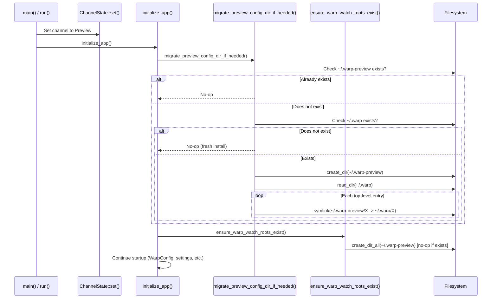

# Tech Spec: Separate Preview Config Directory on macOS

## Problem

On macOS, `macos_config_dir_name()` returns `.warp` for both Stable and Preview channels, causing them to share a single config directory. This needs to change so Preview uses `.warp-preview`, with a one-time symlink migration for existing users.

## Relevant Code

- `crates/warp_core/src/paths.rs:42-51` — `macos_config_dir_name()` maps channels to directory names. The `Channel::Preview` arm currently returns `WARP_CONFIG_DIR` (`.warp`).
- `crates/warp_core/src/paths.rs:57-67` — `data_dir()` uses `macos_config_dir_name()` on macOS.
- `crates/warp_core/src/paths.rs:71-83` — `config_local_dir()` also uses `macos_config_dir_name()` on macOS. On macOS, `data_dir()` and `config_local_dir()` return the same path.
- `app/src/warp_data_directory_watcher.rs:28-46` — `ensure_warp_watch_roots_exist()` creates the data and config directories at startup.
- `app/src/lib.rs:966` — calls `ensure_warp_watch_roots_exist()` during `initialize_app()`.
- `app/src/persistence/sqlite.rs:350-389` — existing migration precedent: migrates the SQLite database from `state_dir()` to `secure_state_dir()` on first launch.
- `crates/warp_core/src/channel/mod.rs:8-15` — `Channel` enum definition.

## Current State

The `macos_config_dir_name()` function in `paths.rs` determines the macOS config directory:

```rust
fn macos_config_dir_name() -> String {
    match ChannelState::channel() {
        Channel::Stable | Channel::Preview => WARP_CONFIG_DIR.to_owned(),
        Channel::Dev => format!("{WARP_CONFIG_DIR}-dev"),
        // ...
    }
}
```

Both `data_dir()` and `config_local_dir()` use this on macOS, so all config paths (`settings.toml`, `keybindings.yaml`, `themes/`, `workflows/`, `tab_configs/`, etc.) resolve under `~/.warp` for both Stable and Preview.

The SQLite database is **not** affected — it is stored under `secure_state_dir()` (App Group container) or `state_dir()` (`~/Library/Application Support/dev.warp.Warp-Preview/`), both of which already use the bundle ID and are channel-specific.

The `WARP_CONFIG_DIR` constant (`.warp`) is also used for per-repository project configs (e.g., `./.warp/workflows`). This is unrelated to the home-directory config and must not change.

## Proposed Changes

### 1. Update `macos_config_dir_name()` — `crates/warp_core/src/paths.rs`

Change the Preview arm to return `.warp-preview`:

```rust
fn macos_config_dir_name() -> String {
    match ChannelState::channel() {
        Channel::Stable => WARP_CONFIG_DIR.to_owned(),
        Channel::Preview => format!("{WARP_CONFIG_DIR}-preview"),
        Channel::Dev => format!("{WARP_CONFIG_DIR}-dev"),
        Channel::Integration => format!("{WARP_CONFIG_DIR}-integration"),
        Channel::Local => format!("{WARP_CONFIG_DIR}-local"),
    }
}
```

This is the only change needed to route Preview to a new directory. All downstream consumers (`data_dir()`, `config_local_dir()`, `themes_dir()`, `workflows_dir()`, etc.) automatically pick up the new path.

### 2. Add migration module — `app/src/preview_config_migration.rs`

Add a new module in the `warp` (app) crate that owns the migration. The migration is app startup logic, not a general path utility, so it lives in the app crate alongside other one-time migrations (e.g., `app/src/persistence/sqlite.rs`). The `warp_core::paths::data_dir()` helper is already channel-aware, so the module does not need access to the private `macos_config_dir_name()` in `warp_core`.

The module exposes two functions:

- `migrate_preview_config_dir_if_needed()` — `pub(crate)` entry point that does the channel check and computes paths from `warp_core::paths::data_dir()`, then delegates to the inner helper.
- `migrate_config_dir_via_symlinks(old_dir, new_dir)` — `pub(crate)` core logic that creates `new_dir`, then symlinks each top-level entry from `old_dir` into `new_dir`. Skips `.DS_Store`, `._*` metadata files, and any file in `MIGRATION_EXCLUDED_FILES` (currently `settings.toml`).

The directory's existence is the migration marker — no separate marker file is needed. Subsequent launches see `~/.warp-preview` already exists and no-op.

### 3. Call migration before directory creation — `app/src/lib.rs`

Call the migration directly in `initialize_app()`, before `ensure_warp_watch_roots_exist()`. This placement ensures the migration runs:
- Before `ensure_warp_watch_roots_exist()` would `create_dir_all` on `~/.warp-preview` (which would make the `new_dir.exists()` check true and skip migration).
- After `ChannelState` is initialized (it is — `initialize_app` runs after `ChannelState::set()`).
- Exactly once per launch.

### 4. Integration testing hook — `app/src/integration_testing/preview_config_migration.rs`

The integration test framework runs under `Channel::Integration`, so the public entry point no-ops. To let integration tests exercise the migration logic, expose the inner helper via `warp::integration_testing::preview_config_migration::run_config_dir_symlink_migration(old_dir, new_dir)`. This follows the existing pattern of keeping app internals private while exposing test hooks through `integration_testing`.

## End-to-End Flow



## Risks and Mitigations

### Symlink breakage if `~/.warp` is deleted
If a user deletes `~/.warp` after migration, all symlinks in `~/.warp-preview` become dangling. Warp's existing directory-creation logic (`ensure_warp_watch_roots_exist`) will recreate `~/.warp-preview` subdirectories as needed, and missing files will be treated as defaults. This is the same behavior as a fresh install.

**Mitigation**: Acceptable degradation. No action needed.

### Filesystem watcher and symlinks
The `notify` crate (used by `BulkFilesystemWatcher`) watches `~/.warp-preview` recursively. For symlinked directories, `notify` with `RecursiveMode::Recursive` follows symlinks by default on macOS (using `kqueue`/`FSEvents`). Changes to the underlying files in `~/.warp` will trigger events on the watched path in `~/.warp-preview`.

**Mitigation**: Verify in manual testing. If events are missed, we may need to also watch `~/.warp` from Preview, but this is unlikely to be needed.

### Concurrent launch race
Two Preview processes launching simultaneously could both attempt the migration. The `create_dir` call will succeed for one and return `AlreadyExists` for the other. The losing process may encounter partially-created symlinks, but since `symlink` on an existing path returns an error (which we log and skip), this is safe.

**Mitigation**: Built into the implementation — `create_dir` + per-entry error handling.

### Entries created between `read_dir` and symlink creation
If Stable creates a new entry in `~/.warp` after Preview's `read_dir` call but before symlinking completes, that entry won't have a symlink. This is a negligible window and the entry would only be visible in Stable.

**Mitigation**: None needed — this is an edge case with no practical impact.

## Testing and Validation

### Unit tests
Add tests in `app/src/preview_config_migration_tests.rs` that call `migrate_config_dir_via_symlinks` with temp directories:
1. **Migration creates symlinks**: Set up a temp dir with mock `.warp` contents, run migration, assert symlinks exist and point to correct targets.
2. **Migration skips when target exists**: Pre-create the target directory, run migration, assert no symlinks are created.
3. **Migration skips when source missing**: Run migration without a `.warp` directory, assert no errors.
4. **Migration skips `.DS_Store`**: Include `.DS_Store` and `._*` files in the source, assert they're not symlinked.
5. **Migration skips `settings.toml`**: Include `settings.toml` in the source, assert it's not symlinked.
6. **Idempotent**: Run twice; second call is a no-op.

### Integration test
Add an integration test in `crates/integration/src/test/preview_config_migration.rs` that verifies the end-to-end symlink creation:

1. In `with_setup`, populate the hermetic home's `.warp/` directory with representative entries (e.g., `keybindings.yaml`, `themes/`, `workflows/`, `settings.toml`, a `.DS_Store`).
2. In `with_setup`, call `warp::integration_testing::preview_config_migration::run_config_dir_symlink_migration` (since the integration channel is `Integration`, not `Preview`, the public entry point would no-op — so we use the integration-testing hook).
3. In a `TestStep`, assert:
   - `~/.warp-preview` exists and is a directory (not a symlink).
   - Each expected entry in `~/.warp-preview` is a symlink pointing to the corresponding entry in `~/.warp`.
   - `.DS_Store`, `._*`, and `settings.toml` were not symlinked.
4. Wire the test into the nextest suite via `crates/integration/tests/integration/ui_tests.rs`.

### Manual validation
- Build a Preview binary, launch with existing `~/.warp`, verify:
  - `~/.warp-preview` is created with symlinks.
  - Settings, keybindings, themes all load correctly.
  - Creating a new tab config in Preview appears in the expected location.
- Launch Stable after, verify `~/.warp` is unmodified.

## Follow-ups

- After this change has been stable for several release cycles, consider whether to add a user-facing setting or migration to break symlinks and fully copy config for users who want complete isolation.
