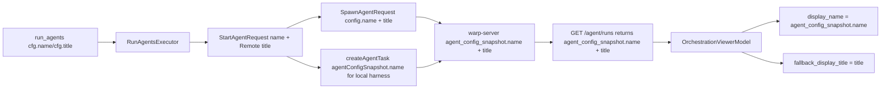

# QUALITY-731 — Agent name round trip client spec
## Context
QUALITY-731 is a shared-session viewer bug: the orchestrator's own client labels children with `agent_run_configs[i].name`, but a viewer reconstructs child conversations from server task records and currently does not have access to that short name. As a result, viewer-side pills, hover cards, breadcrumbs, status cards, and transcript participant labels fall back to `title`, which can be a long descriptive sentence or a truncated prompt.
The fix sources the orchestrator's short label from the existing `agent_config_snapshot.name` field instead of introducing a parallel top-level `name` field on the task or request types. This aligns with the paired warp-server spec, which uses `AgentConfigSnapshot.Name` as the canonical home for the orchestrator-supplied label.
## Scope
This PR delivers the orchestrator → server → viewer round-trip plus the single highest-value display surface: the orchestration pill bar in `OrchestrationViewerModel::apply_children_fetch`. Other surfaces that still render `task.title` (or `entry.display.title`) directly are left for follow-up work, tracked under "Out of scope (follow-ups)" below. The wire contract and `display_name()` helper this PR introduces are the prerequisites those follow-ups will consume.
Relevant existing client surfaces:
- `app/src/server/server_api/ai.rs` — `SpawnAgentRequest.config: Option<AgentConfigSnapshot>` already exists. `CreateAgentTaskInput.agent_config_snapshot: Option<String>` (serialized JSON) already exists. Both REST and GraphQL channels can carry an `AgentConfigSnapshot` payload today.
- `app/src/ai/ambient_agents/task.rs` — `AgentConfigSnapshot.name: Option<String>` (`#[serde(default, skip_serializing_if = "Option::is_none")]`) already exists. `AmbientAgentTask.agent_config_snapshot: Option<AgentConfigSnapshot>` already deserializes from the server.
- `app/src/ai/blocklist/action_model/execute/run_agents.rs` — `RunAgentsExecutor` fans out each `RunAgentsAgentRunConfig`; `cfg.name` is the source of truth on the client side.
- `app/src/pane_group/pane/terminal_pane.rs` — `launch_remote_child` builds a `SpawnAgentRequest` with an `AgentConfigSnapshot` for `config`. `launch_local_no_harness_child` and `launch_local_harness_child` build the local Oz / harness child task via `AIClient::create_agent_task` and the harness's `local_child_task_config(harness)`.
- `app/src/pane_group/pane/local_harness_launch.rs` — `prepare_local_harness_child_launch` constructs the `local_child_task_config` snapshot.
- `app/src/terminal/shared_session/viewer/orchestration_viewer_model.rs` — `apply_children_fetch` calls `task.display_name()` for the child conversation's `agent_name`. That helper currently reads from the QUALITY-731 v1 `AmbientAgentTask.name` field.
- `app/src/ai/blocklist/history_model.rs` — `start_new_child_conversation` writes its `name` argument directly into `AIConversation::agent_name`.
- `app/src/ai/agent/conversation.rs` — `agent_name()` backs orchestration label surfaces; `title()` falls back to `fallback_display_title`.
- `app/src/ai/conversation_details_panel.rs` — `ConversationDetailsData::from_task` reads `task.title` for the side-pane header.
Design options considered:
- Parallel scalar fields on the task (the QUALITY-731 v1 approach: `AmbientAgentTask.name`, `SpawnAgentRequest.name`, `AIClient::create_agent_task` `agent_name`, GraphQL `CreateAgentTaskInput.agentName`). Required two name-like fields on the wire and in the model. Rejected per reviewer.
- Reuse `agent_config_snapshot.name` (selected). No new fields. Outbound paths stamp the orchestrator name inside the existing `AgentConfigSnapshot { ... }` builder. The viewer's `display_name()` reads from `agent_config_snapshot.name`. Backward-compatible with any task that already populates the field through some other means.
## Proposed changes
### Outbound request wiring
Stamp the orchestrator-supplied short name into the existing `AgentConfigSnapshot` payload at request-construction boundaries. Trim whitespace at the construction site; treat empty/whitespace-only as absent.
1. `launch_remote_child` in `app/src/pane_group/pane/terminal_pane.rs` builds the `AgentConfigSnapshot` it puts on `SpawnAgentRequest.config`. Add `name: ...` to that struct literal with the trimmed `request.name`, filtered for empty. No more top-level `request.name` clone or `SpawnAgentRequest.name` field.
2. `launch_local_no_harness_child` (local Oz path) in `terminal_pane.rs` currently passes `None` for the config snapshot to `create_agent_task`. Replace with `Some(AgentConfigSnapshot { name: trimmed(request_name), ..Default::default() })`.
3. `launch_local_harness_child` / `prepare_local_harness_child_launch` in `app/src/pane_group/pane/local_harness_launch.rs` build their snapshot via `local_child_task_config(harness)`. Extend `local_child_task_config` to take `agent_name: Option<String>` and stamp it inside the returned snapshot. Drop the QUALITY-731 v1 `agent_name` parameter on `AIClient::create_agent_task` and the trim inside its impl; the construction site is now the single source.
4. `agent_sdk/ambient.rs` CLI `agent run-cloud` (REST) already sets `config.name = args.name`. No change needed.
5. `build_handoff_spawn_request` (handoff) and `spawn_agent` (standalone cloud-mode) don't supply a name today. No change.
### Inbound response read
Rewrite `AmbientAgentTask::display_name(&self) -> &str` in `app/src/ai/ambient_agents/task.rs`. Lookup order:
1. Trimmed `agent_config_snapshot.as_ref().and_then(|c| c.name.as_deref())` when present and non-empty.
2. Trimmed `title` when non-empty.
3. The literal `"Agent"`.
`OrchestrationViewerModel::apply_children_fetch` keeps its existing `let name = task.display_name().to_string();` line. The downstream `conversation.set_fallback_display_title(task.title.clone())` call remains so the descriptive title stays available via `AIConversation::title()` fallback.
### Removals (QUALITY-731 v1 rollback)
Source code:
- `app/src/server/server_api/ai.rs`: remove `SpawnAgentRequest.name` field and its serde attrs. Remove the `agent_name: Option<String>` parameter from the `AIClient::create_agent_task` trait method and its impl, including the trim block and the `agent_name` line inside `CreateAgentTaskVariables`.
- `app/src/ai/ambient_agents/task.rs`: remove the `AmbientAgentTask.name: Option<String>` field and its serde default. Keep `display_name()` as a helper, but rewrite its body per the above section.
- `app/src/pane_group/pane/terminal_pane.rs`: remove the `request.name.clone()` plumbing in `launch_remote_child`, the `agent_name_for_create = Some(request_name.clone())` line and the corresponding 5th positional arg in `launch_local_no_harness_child`, and the `agent_name_for_task = Some(request_name.clone())` line + 5th arg in `launch_local_harness_child`.
- `app/src/pane_group/pane/local_harness_launch.rs`: remove the `agent_name: Option<String>` parameter from `prepare_local_harness_child_launch` and the 5th positional arg threaded into `create_agent_task`. The `#[allow(clippy::too_many_arguments)]` attribute on this function becomes unnecessary; remove it if so.
- `app/src/ai/conversation_details_panel.rs`: keep the deferral comment QUALITY-731 v1 added on `from_task`; the surface remains on `task.title` (unchanged behavior).
- `crates/warp_graphql_schema/api/schema.graphql`: remove the `agentName: String` field + docstring under `CreateAgentTaskInput`.
- All `name: None` literals on `SpawnAgentRequest { ... }` builders added in QUALITY-731 v1 (in `agent_sdk/ambient.rs`, `terminal/view/ambient_agent/model.rs`, `terminal/view_tests.rs`, `agent_sdk/mcp_config_tests.rs`, `ambient_agents/spawn_tests.rs`, `terminal/view/ambient_agent/model_tests.rs`): remove.
- All `name: None` literals on `AmbientAgentTask { ... }` test fixtures added in QUALITY-731 v1 (in `agent_conversations_model_tests.rs`, `cloud_conversation_continuation_tests.rs`, `conversation_ended_tombstone_view_tests.rs`, `view_impl_tests.rs`, `spawn_tests.rs` `task_with` helper, `pane_group/mod_tests.rs`, `conversation_details_panel_tests.rs`, `orchestration_event_streamer_tests.rs`): remove.
Tests:
- `app/src/server/server_api/ai_tests.rs`: remove `spawn_agent_request_serializes_name_when_present`, `spawn_agent_request_omits_name_when_none`, and the `name: None` line in the `make_spawn_agent_request` fixture.
- `app/src/ai/ambient_agents/task_tests.rs`: rewrite the five `display_name_*` tests to construct an `AmbientAgentTask` with an `agent_config_snapshot.name` value (or `None`) instead of a top-level `name`. Keep the same precedence-coverage shape (name+title, name=None falls back to title, name=whitespace falls back to title, empty title returns "Agent", trimming).
- `app/src/terminal/shared_session/viewer/orchestration_viewer_model_tests.rs`: rewrite the four `registers_child_agent_name_*` tests to populate `task.agent_config_snapshot.name` instead of `task.name`. The `make_task` / `make_task_with_name` helpers move the name into the config snapshot fixture.
- `app/src/pane_group/pane/local_harness_launch_tests.rs`: rewrite `prepare_local_codex_child_forwards_agent_name_to_create_agent_task` and `prepare_local_codex_child_passes_none_agent_name_when_unset` to assert that `local_child_task_config` (or the constructed snapshot) carries `name` correctly. Or drop them in favor of a single test on `local_child_task_config` directly.
## End-to-end flow

## Testing and validation
Unit/client tests:
- `app/src/ai/ambient_agents/task_tests.rs`: `display_name()` precedence (snapshot.name > title > "Agent") and trim behavior, including whitespace-only title.
- `app/src/terminal/shared_session/viewer/orchestration_viewer_model_tests.rs`: viewer registration of orchestrator name via `agent_config_snapshot.name`, fallback to title (using distinct snapshot/title values so the two channels are distinguishable), "Agent" final fallback, whitespace-only title gating of `set_fallback_display_title`.
- `app/src/pane_group/pane/local_harness_launch_tests.rs`: `local_child_task_config` carries the orchestrator name in its snapshot, trims whitespace, returns `None` for Oz/Unknown harnesses. `normalize_orchestrator_agent_name` covers the trim/empty-vs-Some contract.
- The construction-site wiring in `launch_remote_child` (the `SpawnAgentRequest.config.name` field is stamped with the result of `normalize_orchestrator_agent_name(&request.name)`) is covered indirectly by the `normalize_orchestrator_agent_name` unit tests + visible inspection of the struct literal in `terminal_pane.rs::launch_remote_child`. A dedicated test for the assembled `SpawnAgentRequest` would require factoring out a `build_spawn_request` helper, which is deferred as out of scope here (the function takes a `&mut PaneGroup` + `ViewContext<PaneGroup>` and resolves runtime skills + snapshot-disabled flag through them, none of which are unit-testable as-is).
Manual validation:
1. Start or load an orchestrated shared session where the orchestrator's outbound spawn populates `agent_config_snapshot.name = "frontend-tests"` and a long descriptive `title`.
2. Open the session as a viewer.
3. Verify the pill label, hover card participant label, breadcrumb, child status card, and transcript participant all show `frontend-tests`.
4. Verify the long title remains available as `AIConversation::title()` fallback wherever the existing fallback path is used.
5. Verify a child whose orchestrator did not set a name still shows the skill-derived default (provided by the server).
6. The conversation details side pane intentionally remains on `task.title` per the QUALITY-731 v1 deferral.
Commands to run after implementation:
- Targeted Rust tests for any modules touched, for example:
  - `cargo test -p warp -- ai::ambient_agents::task`
  - `cargo test -p warp -- terminal::shared_session::viewer::orchestration_viewer_model_tests`
  - `cargo test -p warp -- pane_group::pane::local_harness_launch_tests`
- `cargo fmt`
- `./script/presubmit` before pushing (skip the `command-signatures-v2` step locally only if the corepack/yarn-4 setup blocks it on this machine; CI is authoritative).
- Manual UI verification against a local client connected to a server with the paired pivot changes.
## Parallelization
Server agent: local, `/Users/matthew/src/roundtrip-agent-name/warp-server`, branch `matthew/roundtrip-agent-name`, base `origin/matthew/restore-remote-orch-conversations`, draft PR target #11223. Owns server-side rollback + helper + REST/GraphQL contract drops.
Client agent: local, `/Users/matthew/src/roundtrip-agent-name/warp`, branch `matthew/roundtrip-agent-name`, base `origin/master`, draft PR target #11090. Owns client-side rollback + outbound snapshot stamping + `display_name()` rewrite.
Sequencing:
- Both PRs can be force-pushed in parallel — the wire contract (use existing `agent_config_snapshot` envelope, drop QUALITY-731 v1 parallel fields) is fully agreed upfront.
- End-to-end manual validation must wait for both branches to be on the pivoted contract.
PR hygiene:
- Force-push removes the QUALITY-731 v1 commits from each PR. Rewrite the PR descriptions to call out the pivot and link to the paired PR.
- Mark the `Warp Agent Mode` checkbox on the client PR template.
- Keep both PRs in draft.
## Out of scope (follow-ups)
The pivot delivers the wire contract and the orchestration viewer pill. The following surfaces still render `task.title` (or the denormalized `entry.display.title`) directly and would benefit from a follow-up that fans `display_name()` through them, but each requires an additional plumbing decision (the entry-based ones in particular don't have access to `agent_config_snapshot` today):
- `app/src/ai/agent_conversations_model/entry.rs` — `AgentConversationEntry` is hydrated from `ListConversationsItem` and only carries `display.title` today. Routing `display_name()` here means denormalizing `agent_config_snapshot.name` onto the entry (or fetching the task) before render time.
- `app/src/ai/conversation_details_panel.rs::from_agent_conversation_entry` — same source as above; downstream of the entry.
- `app/src/terminal/view/shared_session/conversation_ended_tombstone_view.rs` — the tombstone reuses `task.title` for its header and reuses `agent_config_snapshot.name` as `skill_name`; the latter is now mislabeled (an inline `QUALITY-731 follow-up` comment marks this). Splitting orchestrator-supplied agent name from skill-spec rendering belongs to a follow-up.
- `app/src/ai/agent_sdk/ambient.rs` (~line 845) — CLI/SDK-side surface that already reads task records; can adopt `display_name()` once the helper is publicly reachable from that path.
- `app/src/workspace/view/conversation_list/item.rs` and `app/src/workspace/view.rs` — workspace conversation list labels flow from `entry.display.title`; same plumbing decision as the entry-based surfaces.
The `ConversationDetailsData::from_task` side-pane header is intentionally not in scope: product still evaluates whether to show both the short name and the descriptive title. The inline deferral comment remains in place.
## Risks and mitigations
- `display_name()` change: anywhere that read `AmbientAgentTask.name` directly (instead of going through the helper) must be moved to the helper to pick up the new source. Mitigation: deleting the field forces a compile error at every direct read; fix them at the call site.
- Existing test fixtures with explicit `name: None` will no longer compile. Mitigation: blanket-revert the `name: None` lines as part of the same change.
- A future caller that sets both `agent_config.name` and an orchestrator name via some other channel: server enforces the always-override precedence; client only stamps when an orchestrator name is provided. No client-side collision.
- The details panel surface stays on `task.title` per the v1 deferral. Mitigation: the deferral comment in `conversation_details_panel.rs` remains.
- Whitespace-only `task.title` would desync `agent_name()` (trimmed → `"Agent"`) from `title()` (untrimmed) if the viewer fallback gate were not also trimmed. Mitigation: the gate in `OrchestrationViewerModel::apply_children_fetch` calls `task.title.trim().to_string()` before checking and before storing on the conversation. A dedicated test (`registers_child_agent_name_does_not_set_fallback_for_whitespace_only_title`) locks this in.
- Force-push removes the v1 commits from the PR history; existing reviewer comments on those commits stay attached to the orphaned commits. Mitigation: PR description rewrite explains the pivot and links to the v1 review history.
