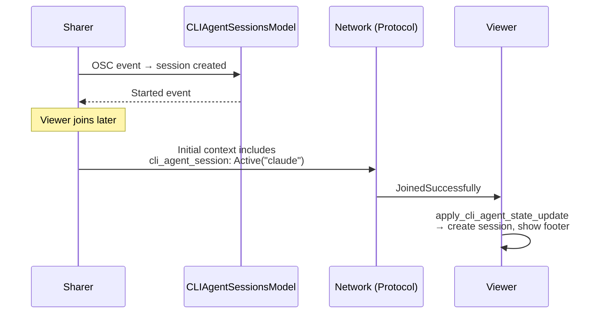
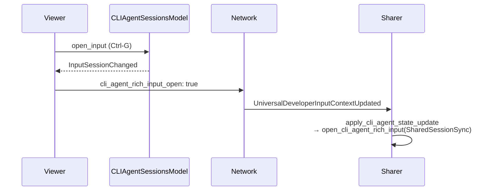

# TECH.md — Sync CLI Agent Session State in Shared Sessions

## 1. Problem

When a sharer has a CLI agent (Claude Code, Gemini, etc.) running in their terminal, viewers joining the shared session don't see the CLI agent footer or rich input composer state. The agent footer and composer are driven entirely by local OSC events from the CLI agent plugin, which only fire on the sharer's machine. Viewers need to see the same footer/composer state so they can interact with the CLI agent through the shared session.

## 2. Relevant code

- `app/src/terminal/cli_agent.rs:113` — `CLIAgent` enum and `command_prefix()` used to identify agents
- `app/src/terminal/cli_agent_sessions/mod.rs:234` — `CLIAgentSessionsModel` singleton: tracks per-pane CLI agent sessions and input state
- `app/src/terminal/cli_agent_sessions/mod.rs:180` — `CLIAgentSessionsModelEvent` variants that drive broadcasts
- `app/src/terminal/local_tty/terminal_manager.rs:2075` — `wire_up_session_sharer_with_view`: where sharer subscribes to view/model events and broadcasts context updates
- `app/src/terminal/shared_session/viewer/terminal_manager.rs:547` — `handle_network_events`: where viewer receives and applies context updates
- `app/src/terminal/shared_session/shared_handlers.rs:353` — shared `apply_*` handlers used by both sharer and viewer
- `session-sharing-server/protocol/src/common/ui_state.rs:88` — `CLIAgentSessionState` protocol type
- `session-sharing-server/protocol/src/common/ui_state.rs:137` — `UniversalDeveloperInputContextUpdate` with new CLI fields
- `app/src/terminal/view/use_agent_footer/mod.rs:647` — `open_cli_agent_rich_input` / `close_cli_agent_rich_input`

## 3. Current state

Shared sessions already sync several pieces of UI state via `UniversalDeveloperInputContext` / `UniversalDeveloperInputContextUpdate`:
- Input mode (shell/AI, locked)
- Selected conversation
- Selected agent model
- Auto-approve toggle
- Long-running command agent interaction state

Each field follows the same pattern:
1. Included in the initial `UniversalDeveloperInputContext` snapshot sent when a session is created.
2. Sent as incremental `UniversalDeveloperInputContextUpdate` messages when state changes.
3. Applied on the receiving side via a shared `apply_*` handler in `shared_handlers.rs`.
4. Echo-suppressed via `RemoteUpdateGuard` to prevent feedback loops.

CLI agent sessions are **not** synced. The footer and composer only appear on the sharer's machine because `CLIAgentSessionsModel` is populated by local OSC events from the CLI agent plugin. Viewers see a bare terminal with no agent affordances.

## 4. Proposed changes

### 4.1 Protocol: two new fields on `UniversalDeveloperInputContext(Update)`

Add to `session-sharing-protocol`:

- `cli_agent_session: Option<CLIAgentSessionState>` — `Active { command_prefix }` or `Inactive`
- `cli_agent_rich_input_open: Option<bool>` — whether the composer is open

`CLIAgentSessionState` is a new enum in the protocol crate. The `command_prefix` string is the only data needed to resolve the `CLIAgent` variant on the receiving side. Status/context enrichment (tool names, summaries, etc.) comes from OSC events and is intentionally **not** synced — only the structural presence of the session and the composer open/close state travel over the wire.

### 4.2 `CLIAgent::from_command_prefix`

New reverse lookup on `CLIAgent` that iterates `enum_iterator::all::<CLIAgent>()` to resolve a prefix string back to a variant. Falls back to `CLIAgent::Unknown` for unrecognised prefixes.

### 4.3 New `CLIAgentInputEntrypoint::SharedSessionSync`

Distinguishes protocol-driven composer opens from user-initiated ones (Ctrl-G, footer button, auto-show) for telemetry and future behaviour gating.

### 4.4 Sharer-side broadcasting

**Initial context** (`start_sharing_session`):
Snapshot `CLIAgentSessionsModel` for the terminal view and populate `cli_agent_session` + `cli_agent_rich_input_open` in the initial `UniversalDeveloperInputContext`. Late-joining viewers see the footer immediately.

**Incremental updates** (`wire_up_session_sharer_with_view`):
Subscribe to `CLIAgentSessionsModel` events, filtered to the sharing terminal's view ID and gated by `RemoteUpdateGuard::should_broadcast()`:
- `Started` → send `CLIAgentSessionState::Active { command_prefix }`
- `InputSessionChanged` → send `cli_agent_rich_input_open` based on new input state
- `Ended` → send `Inactive` + `cli_agent_rich_input_open: false`
- `StatusChanged` / `SessionUpdated` → no-op (enriched by OSC events, not protocol)

**Receiving viewer composer changes**:
In the sharer's `UniversalDeveloperInputContextUpdated` handler, apply `cli_agent_rich_input_open` from viewer updates via `apply_cli_agent_state_update` (passing `cli_agent_session: None` since the viewer doesn't create/end sessions).

### 4.5 Viewer-side application

**On join** (`JoinedSuccessfully`):
If the initial context has `cli_agent_session` or `cli_agent_rich_input_open`, call `apply_cli_agent_state_update`.

**On incremental updates** (`UniversalDeveloperInputContextUpdated`):
Same handler.

**Viewer → sharer broadcasts**:
Subscribe to `CLIAgentSessionsModel::InputSessionChanged` for the viewer's terminal view ID. When the viewer opens/closes the composer locally, broadcast `cli_agent_rich_input_open` back to the sharer. Only `InputSessionChanged` is forwarded — the viewer never creates or ends sessions.

### 4.6 Shared handler: `apply_cli_agent_state_update`

Single function in `shared_handlers.rs` used by both sharer and viewer. Two phases:

1. **Session create/remove** (if `cli_agent_session` is `Some`):
   - `Active` → resolve `CLIAgent` via `from_command_prefix`, create a `CLIAgentSession` in the sessions model with `should_auto_toggle_input: false` (protocol manages toggle, not local OSC), show footer.
   - `Inactive` → remove session, hide footer.

2. **Composer open/close** (if `cli_agent_rich_input_open` is `Some`):
   - Compare with `CLIAgentSessionsModel::is_input_open`, call `open_cli_agent_rich_input(SharedSessionSync)` or `close_cli_agent_rich_input` on delta.

### 4.7 Visibility changes

`open_cli_agent_rich_input` and `close_cli_agent_rich_input` widened from `pub(super)` to `pub(crate)` so `shared_handlers.rs` can call them. New `apply_cli_agent_footer_visibility` helper on `TerminalView` delegates to the existing `maybe_show_use_agent_footer_in_blocklist` / `hide_use_agent_footer_in_blocklist`.

### 4.8 `write_to_pty` → `write_user_bytes_to_pty`

Rich input submission calls in the use-agent footer switched from `write_to_pty` to `write_user_bytes_to_pty`. This ensures bytes written from the composer are attributed as user input (relevant for shared-session permission checks and echo handling).

## 5. End-to-end flow

### Sharer starts CLI agent, viewer joins late

### Sharer opens composer, viewer sees it

### Viewer opens composer, sharer sees it

## 6. Risks and mitigations

**OSC vs protocol session conflict on viewer**: If a viewer somehow receives OSC `SessionStart` events (e.g. warpified SSH where plugin events leak), the local OSC path could clobber the protocol-managed session. Mitigated by an early return in `handle_cli_agent_notification` when `is_shared_session_viewer()` is true — the protocol is the sole source of truth for viewer session lifecycle.

**Echo loops**: Handled by the existing `RemoteUpdateGuard` pattern — all new broadcast subscribers check `guard.should_broadcast()`, and all incoming `apply_*` calls run inside an `ActiveRemoteUpdate` scope.

**Unknown CLI agents**: `from_command_prefix` falls back to `CLIAgent::Unknown`, which still shows a generic footer. No crash or silent failure.

**Auto-toggle disabled for synced sessions**: `should_auto_toggle_input: false` on protocol-created sessions prevents local status-change events from racing with protocol-driven open/close.

## 7. Testing and validation

- Manual: start a CLI agent on sharer, join as viewer → footer visible; open/close composer on either side → state syncs.
- Manual: join a session where CLI agent was already running before join → footer appears immediately.
- Manual: end CLI agent on sharer → footer disappears on viewer.
- Unit test `from_command_prefix` round-trips all known `CLIAgent` variants.
- Existing shared-session integration tests cover `UniversalDeveloperInputContextUpdate` plumbing; new fields are additive.
