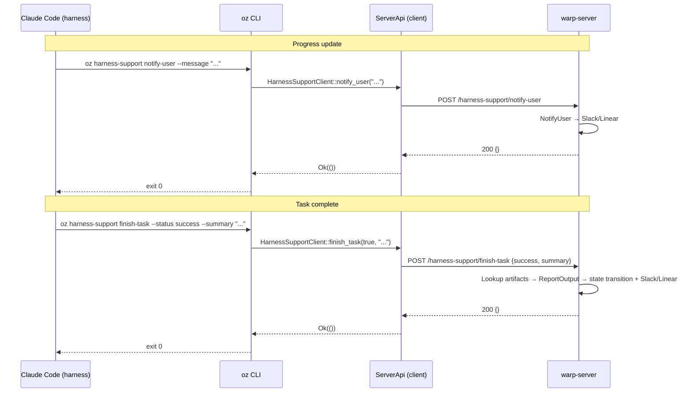

# TECH.md — Client-Side Harness-Support: notify-user & finish-task

## Problem

The server is adding `POST /harness-support/notify-user` and `POST /harness-support/finish-task` endpoints (see `warp-server` spec). Third-party harnesses invoke server APIs through the `oz` CLI, not directly. We need:

1. Two new `oz harness-support` subcommands that call these endpoints.
2. API client methods in the Warp client to make the HTTP calls.
3. Claude Code plugin skills so the harness can invoke the commands at the right time.

## Relevant Code

- `crates/warp_cli/src/harness_support.rs` — CLI arg definitions (`HarnessSupportCommand` enum)
- `app/src/ai/agent_sdk/harness_support.rs` — command dispatch + async runners
- `app/src/server/server_api/harness_support.rs` — `HarnessSupportClient` trait + `ServerApi` impl
- `app/src/ai/agent_sdk/telemetry.rs` — `CliTelemetryEvent` enum
- `app/src/ai/agent_sdk/mod.rs (1193-1202)` — telemetry mapping for harness-support commands
- `../claude-code-warp-internal/plugins/oz-harness-support/` — existing plugin (skills, hooks)

## Current State

`oz harness-support` has two subcommands: `ping` and `report-artifact`. Each follows the same pattern:
1. **CLI layer** (`warp_cli`): clap `Args`/`Subcommand` structs define the command shape.
2. **Handler layer** (`agent_sdk/harness_support.rs`): match on the command, get the `HarnessSupportClient`, spawn an async task, print result / terminate.
3. **API client layer** (`server_api/harness_support.rs`): `HarnessSupportClient` trait method + `ServerApi` impl calling `self.post_public_api(path, body)`.
4. **Telemetry**: each command has a `CliTelemetryEvent` variant.

The Claude Code plugin currently has three skills (`oz-report-pr`, `oz-report-artifact`, `oz-report-plan`) and a hook that auto-reports plans. Skills are either shell scripts calling `$OZ_CLI harness-support ...` or SKILL.md instructions.

## Proposed Changes

### 1. CLI layer (`crates/warp_cli/src/harness_support.rs`)

Add two variants to `HarnessSupportCommand`:

```rust
NotifyUser(NotifyUserArgs),
FinishTask(FinishTaskArgs),
```

**`NotifyUserArgs`**: single required `--message` string.

**`FinishTaskArgs`**:
- `--status <success|failure>` (required `TaskStatus` enum via clap `ValueEnum`)
- `--summary` (required string)

`TaskStatus` is a `#[derive(ValueEnum)]` enum with variants `Success` and `Failure`, converted to `bool` at the CLI boundary before calling the API client.

PR links and branches are *not* passed by the CLI — the server derives them from artifacts already reported via `report-artifact`.

### 2. API client layer (`app/src/server/server_api/harness_support.rs`)

Add request types:

```rust
#[derive(serde::Serialize)]
struct NotifyUserRequest { message: String }

#[derive(serde::Serialize)]
struct FinishTaskRequest {
    success: bool,
    summary: String,
}
```

Add two methods to `HarnessSupportClient` trait:

```rust
async fn notify_user(&self, message: &str) -> Result<()>;
async fn finish_task(&self, success: bool, summary: &str) -> Result<()>;
```

`ServerApi` impl calls `self.post_public_api("harness-support/notify-user", &body)` and `self.post_public_api("harness-support/finish-task", &body)` respectively. Both return empty JSON `{}` — we deserialize to `serde_json::Value` and discard (or use a unit-like response struct).

### 3. Handler layer (`app/src/ai/agent_sdk/harness_support.rs`)

Add two match arms in `run()` dispatching to new `notify_user()` and `finish_task()` functions. Follow the existing `report_artifact` pattern:
- Get `HarnessSupportClient` from `ServerApiProvider`
- Spawn async call
- On success: print confirmation (pretty) or `{}` (JSON), terminate
- On error: `report_fatal_error`

### 4. Telemetry (`app/src/ai/agent_sdk/telemetry.rs`)

Add variants:

```rust
HarnessSupportNotifyUser,
HarnessSupportFinishTask { success: bool },
```

Wire into `command_to_telemetry_event` in `mod.rs` and the `TelemetryEventDesc` impl.

### 5. Claude Code plugin (`../claude-code-warp-internal/plugins/oz-harness-support/`)

**New skill: `oz-notify-user`**

`skills/oz-notify-user/SKILL.md` — instructs Claude Code to call:
```sh
$OZ_CLI harness-support notify-user --message '<message>'
```
when it wants to send a progress update to the user (e.g., after completing a milestone).

**New skill: `oz-finish-task`**

`skills/oz-finish-task/SKILL.md` — instructs Claude Code to call a shell script:
```sh
$OZ_CLI harness-support finish-task --status <success|failure> --summary '<summary>'
```

No PR/branch args needed since the server derives them from reported artifacts.

**Hook wiring**: optionally add a `PostToolUse` hook on a task-completion tool (if Claude Code exposes one) to auto-invoke `finish-task`. If no such hook point exists, rely on the skill instruction to call it manually before exiting.

## End-to-End Flow



## Risks and Mitigations

- **Server endpoints not deployed yet**: the CLI will 404 until the server changes land. Gate behind `FeatureFlag::AgentHarness` (already gating all harness-support commands) so this is fine — both land before flag is widely enabled.
- **finish-task called multiple times**: server handles idempotency via state-transition guards. CLI will surface the server error message if the task is already in a terminal state.
- **Plugin skill discoverability**: Claude Code only sees skills if the plugin is installed. The harness setup already installs this plugin, so no new wiring needed.

## Testing and Validation

- **Unit tests** in `harness_support_tests.rs`: mock `HarnessSupportClient`, verify `notify_user` and `finish_task` are called with correct args, test JSON vs pretty output.
- **CLI parsing tests**: verify clap parsing for the new subcommands (missing required args, `--status success` vs `--status failure`).
- **Manual validation**: run against local server with `--features with_local_server`, verify Slack/Linear messages appear.
- **Plugin skills**: test shell scripts with mock `OZ_CLI` to verify correct arg construction.

## Follow-ups

- Hook-based auto-invocation of finish-task if Claude Code adds a task-completion hook point
