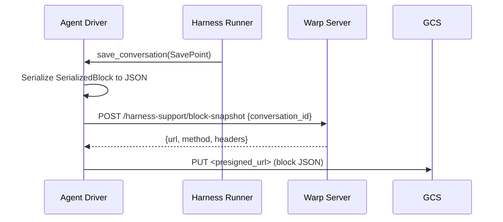
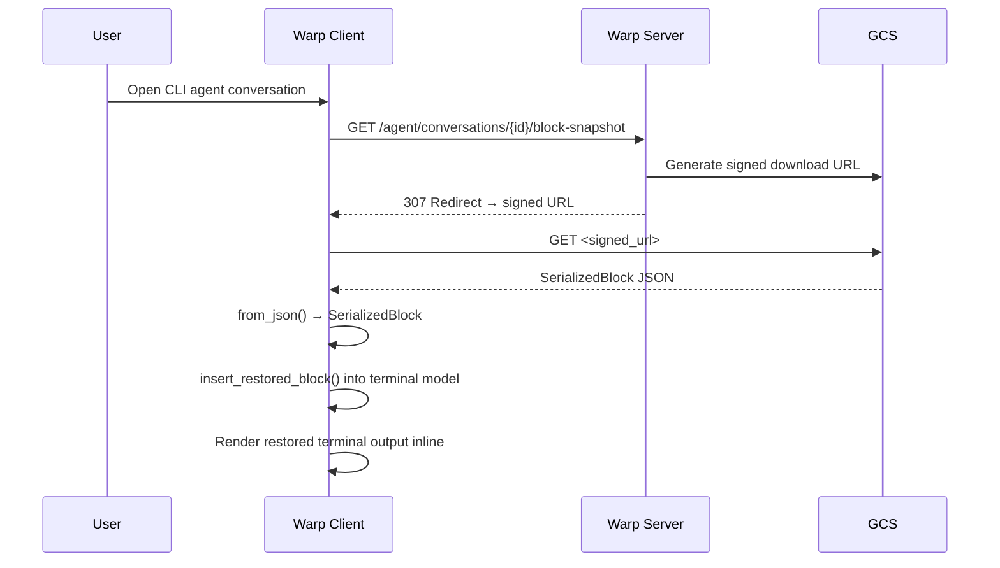

# End-of-Run Snapshot Upload and Client-Side Snapshot Hydration — Tech Spec
Product spec: `specs/REMOTE-1332/PRODUCT.md`

## Problem
Cloud agent runs using third-party harnesses (e.g. Claude Code) produce workspace changes and terminal output, but neither is available to the Warp client after the run completes. The client needs two capabilities:

1. **Workspace snapshot upload**: a driver-managed end-of-run step that captures git diffs and arbitrary files from the agent environment and uploads them to GCS via presigned URLs, keyed by run and execution. Immediately before reading the declarations file, the driver invokes a bash generator script (`snapshot-declarations.sh`, shipped in `warp-agent-docker`) that enumerates all git repositories under the agent's workspace and emits JSONL `repo` entries into the declarations file.
2. **Block snapshot hydration**: client-side logic to download the serialized terminal TUI state of a harness conversation and display it inline when the user opens the conversation.

Both features span the agent SDK driver, the server's public API, GCS storage, and the client's conversation loader and terminal view restoration paths.

## Relevant Code

### Client — end-of-run snapshot upload
- `app/src/ai/agent_sdk/driver.rs` — `AgentDriver::run()` invokes `run_snapshot_upload()` after `run_internal` returns and before signaling the caller; `run_snapshot_upload()` calls `run_declarations_script()` + `upload_snapshot_from_declarations()` before provider cleanup.
- `app/src/ai/agent_sdk/driver/snapshot.rs` — end-of-run snapshot pipeline: declarations-file generation, parsing, repo patching, manifest generation, presigned upload flow.
- `app/src/ai/agent_sdk/retry.rs` — shared retry primitives (`with_bounded_retry`, `is_transient_http_error`, classification constants) used by both upload and download.
- `app/src/server/server_api/harness_support.rs` — `SnapshotUploadRequest`, `SnapshotUploadResponse` (a `Vec<UploadTarget>` aligned by index with the request's `files`), `get_snapshot_upload_targets()`, `upload_to_target()` helper.

### Declarations-file generation and local-dev plumbing
- `../warp-agent-docker/snapshot-declarations.sh` (new) — bash generator invoked at the start of the snapshot step. Walks `$PWD` (the Rust driver sets this via `Command::current_dir` to the agent's `working_dir`) or colon-separated `OZ_SNAPSHOT_SCAN_ROOTS`, finds `.git` directories with `find -type d -name .git -prune`, and appends JSONL `{\"version\":1,\"kind\":\"repo\",\"path\":\"<abs-path>\"}` lines to `$OZ_SNAPSHOT_DECLARATIONS_FILE`. The file path env var is required so standalone invocations cannot clobber a shared fallback. The file is never truncated; dedup is seeded from matching JSONL repo lines already emitted by the script so repeated invocations within a run stay additive.
- `../warp-agent-docker/entrypoint.sh:13` — exports `AGENT_INSTALL_ROOT=...` for existing installation-root consumers and `OZ_SNAPSHOT_DECLARATIONS_SCRIPT=$AGENT_INSTALL_ROOT/snapshot-declarations.sh` so child processes (including the warp agent binary) can invoke the helper by explicit path.
- `../warp-agent-docker/Dockerfile` and `../warp-agent-docker/Dockerfile.local` — new `COPY snapshot-declarations.sh /snapshot-declarations.sh` directive next to the existing `COPY entrypoint.sh`.
- `../warp-server/script/oz-local` — new `--docker-dir <dir>` flag that validates `<dir>/snapshot-declarations.sh` exists, resolves `<dir>` to an absolute path, and appends `OZ_SNAPSHOT_DECLARATIONS_SCRIPT=<abs>/snapshot-declarations.sh` to `WORKER_ENV_FLAGS`, which plumbs through `oz-agent-worker`'s `-e` handling into `DirectBackendConfig.Env` and onto the oz process env.

### Client — handoff snapshot attachment download
- `app/src/ai/agent_sdk/driver/attachments.rs` — `fetch_and_download_handoff_snapshot_attachments()` returns `Option<String>` (the attachments dir iff at least one file landed on disk); per-file outcomes are aggregated into a single INFO/WARN log line. Downloads share the `download_attachment` primitive with `fetch_and_download_attachments`, so both go through the `with_bounded_retry` helper.
- `app/src/server/server_api/ai.rs` — `get_handoff_snapshot_attachments()` on `AIClient`: `GET /agent/tasks/:task_id/snapshot-attachments`, deserializes the list of `HandoffSnapshotAttachmentInfo`

### Client — block snapshot upload during harness run
- `app/src/ai/agent_sdk/driver/harness/mod.rs:168-187` — `upload_block_snapshot()` helper: serializes `SerializedBlock` to JSON, uploads to presigned target
- `app/src/ai/agent_sdk/driver/harness/claude_code.rs:274-288` — Claude Code runner's `save_conversation()` calls `upload_block_snapshot()`
- `app/src/server/server_api/harness_support.rs:110-114` — `get_block_snapshot_upload_target()` on `HarnessSupportClient` trait

### Client — block snapshot hydration
- `app/src/ai/blocklist/history_model/conversation_loader.rs:32-49` — `CLIAgentConversation`, `CloudConversationData::CLIAgent` variant
- `app/src/ai/blocklist/history_model/conversation_loader.rs:96-172` — `load_conversation_from_server()`: dispatches on `AIAgentHarness::ClaudeCode`, fetches block snapshot
- `app/src/server/server_api/ai.rs:557-560` — `get_block_snapshot()` on `AIClient` trait
- `app/src/server/server_api/ai.rs:1303-1320` — `get_block_snapshot()` implementation: `GET /agent/conversations/{id}/block-snapshot`, deserializes via `SerializedBlock::from_json()`
- `app/src/terminal/view/load_ai_conversation.rs:108-113` — `ConversationRestorationInNewPaneType::HistoricalCLIAgent` variant
- `app/src/terminal/view/load_ai_conversation.rs:307-317` — `restore_cli_agent_block_snapshot()`: inserts block into terminal model
- `app/src/terminal/model/block/serialized_block.rs:144-199` — `SerializedBlock` serde with `from_json`/`to_json` for snapshot round-tripping
- `app/src/terminal/model/blocks.rs:2533` — `insert_restored_block()` on `BlockList`
- `app/src/pane_group/mod.rs` — pane creation wiring for `HistoricalCLIAgent`

### Server
- `router/handlers/public_api/harness_support.go:248-324` — `UploadSnapshotHandler`: validates request, calls `PrepareHandoffSnapshotUpload`, returns presigned URLs
- `router/handlers/public_api/harness_support.go:208-246` — `GetBlockSnapshotUploadTargetHandler`: presigned upload target for block snapshot slot
- `router/handlers/public_api/conversation.go` — `GetBlockSnapshotHandler`: `GET /agent/conversations/:conversation_id/block-snapshot`, redirects to signed GCS download URL
- `router/handlers/public_api/agent_attachment_uploads.go:170-249` — `ListHandoffSnapshotAttachmentsHandler`: lists snapshot files from GCS for a task's latest ended execution
- `public_api/openapi.yaml:1443-1709` — OpenAPI definitions for all harness-support endpoints

## Current State

### Before this work
- Third-party harness conversations have a `ClaudeCode` harness type in server metadata, but the client ignores them when loading conversation history.
- `AgentDriver::cleanup()` only tears down cloud providers — there is no workspace snapshot step at end of run.
- The `harness-support` CLI has `ping` and `report-artifact` subcommands; no workspace snapshot capability exists anywhere in the client.
- There is no mechanism for generating the declarations file; `entrypoint.sh` computes `AGENT_INSTALL_ROOT` as a shell-local variable and doesn't export a concrete helper path, so downstream processes can't discover Docker-image-bundled helpers.
- `oz-local` plumbs through `-e KEY=VALUE` flags into `DirectBackendConfig.Env`, but has no dedicated flag for pointing a local-dev run at the `warp-agent-docker` checkout.
- Block snapshots are not uploaded during harness runs.
- The `SerializedBlock` type exists for local persistence but has no JSON round-trip support for cloud storage.
- The conversation loader only handles `AIAgentHarness::Oz` conversations; `ClaudeCode` conversations are logged as warnings and skipped.
- The terminal view restoration path has no `HistoricalCLIAgent` variant.

### Server state before this work
- The harness-support route group exists with endpoints for external-conversation creation, transcript upload, and prompt resolution.
- GCS storage for conversation data is already wired via `gcs.GetConversationDataStore()`.
- No endpoint exists for uploading workspace snapshots or downloading block snapshots.

## Proposed Changes

### 1. Driver: end-of-run snapshot upload

**Trigger site** (`app/src/ai/agent_sdk/driver.rs`):
- `AgentDriver::run()` already runs `run_internal`, sends the result to the caller, then calls `Self::cleanup(foreground)`. We insert `run_snapshot_upload(spawner)` between `run_internal` and the result send so the upload completes before CLI termination can tear down the async runtime, and before provider cleanup may release resources the snapshot depends on (workspace files, mounted dirs). `run_snapshot_upload` skips when `--no-snapshot` was set for the run, otherwise calls `snapshot::run_declarations_script()` then `snapshot::upload_snapshot_from_declarations()`, wrapping the upload with the configured upload timeout so a pathological upload cannot wedge the run tail.
- `AgentDriver` already has `task_id: Option<AmbientAgentTaskId>` on `Self`. The snapshot upload helper pulls only the driver state it needs via `ModelSpawner::spawn` before awaiting the upload future.
- The `ServerApi` on this process already has the task ID set via `ServerApiProvider::set_ambient_agent_task_id` earlier in the driver lifecycle (see `mod.rs:763` and `mod.rs:876`), so the `POST /harness-support/upload-snapshot` request carries the right run context with no extra plumbing.

**Pipeline** (`app/src/ai/agent_sdk/driver/snapshot.rs`):
1. **Gating.** Return early if `FeatureFlag::OzHandoff` is disabled, if `AgentDriver::task_id` is `None`, or if the run was started with `--no-snapshot`. Snapshots only make sense for cloud task runs and must be operator-disableable. `OzHandoff` is the scoped flag for snapshot/handoff behavior; it is decoupled from `FeatureFlag::AgentHarness` (which gates third-party harness CLIs independently).
2. **Generate declarations file.** `run_declarations_script(working_dir, task_id, script_timeout)` resolves `$OZ_SNAPSHOT_DECLARATIONS_SCRIPT`, spawns it via `tokio::task::spawn_blocking(|| Command::new(..).current_dir(working_dir).env(OZ_SNAPSHOT_DECLARATIONS_FILE, resolved_path).output())`, and awaits the result with a timeout via `warpui::r#async::FutureExt::with_timeout`. The timeout defaults to 1 minute and is configurable via `--snapshot-script-timeout <DURATION>`. Setting `current_dir` anchors the bash script's `$PWD` to the agent's workspace even though the driver process's own CWD may have drifted (the macOS startup path in `app/src/terminal/platform.rs:32` `cd`s to `$HOME`). Setting the file path as an env var keeps the script's output and `resolve_declarations_path(task_id)` in sync on one per-run file. Missing script path env var, missing script file, non-zero exit, and timeout are each logged at `log::error!` and return without aborting the upload — if the declarations file already exists from a prior successful invocation the pipeline still reads it; otherwise the upload is a no-op. The helper lives in its own function (independent of `upload_snapshot_from_declarations`) so future code paths can invoke it at other points in the run lifecycle.
3. **Read declarations file.** `resolve_declarations_path(task_id)` delegates to the pure `resolve_declarations_path_with_override(task_id, override_path)` helper so tests can exercise the logic without racing on the process-wide env var. Precedence: `$OZ_SNAPSHOT_DECLARATIONS_FILE` (operator/test override) wins; otherwise `/tmp/oz/<task-id>/snapshot-declarations.jsonl` when `task_id` is `Some`; otherwise `/tmp/oz/snapshot-declarations.jsonl`. If the file is missing, unreadable, or empty, log at WARN and return. Never fail the run tail.
4. **Parse declarations.** One JSON object per non-empty line: `{\"version\":1,\"kind\":\"repo\",\"path\":\"/abs/path\"}` or `{\"version\":1,\"kind\":\"file\",\"path\":\"/abs/path\"}`. Malformed lines (invalid JSON, missing fields, missing or unsupported version, unknown kind, non-absolute path) are logged at WARN and skipped without aborting the upload. Duplicate `(kind, path)` pairs are ignored.
5. **Reserve filenames.** `unique_filename("snapshot_state.json", ...)` reserves the manifest filename up front; patches use `{idx}_{sanitized_repo_name}.patch`; files use their basename. Collisions get numeric suffixes.
6. **Gather blobs and repo metadata, best-effort.** For each `repo` entry, gather repo metadata (`repo_name` from the path basename, branch via `git symbolic-ref --quiet --short HEAD`, and HEAD SHA via `git rev-parse HEAD`) and run `build_repo_patch()`. Metadata commands are best-effort; failures omit the optional metadata fields without failing patch generation. For each `file` entry, run `std::fs::read`. Per-entry gather/read failures are captured as placeholder results with status `gather_failed` / `read_failed` and do not abort the pipeline.
7. **Enforce per-run cap.** Before allocating any presigned URLs, truncate the upload plan to `MAX_SNAPSHOT_FILES_PER_RUN = 100` (blobs + manifest). The manifest reserves one slot, so at most 99 blobs are kept. Dropped blobs are rewritten in the manifest to `status: "skipped", uploaded: false, error: "exceeded per-run snapshot cap of 100 files"` via `mark_capped_manifest_entry`, and a matching `EntryResult` is appended so the summary counts are honest. A single WARN line records the total-declared count and the dropped count.
8. **Request presigned upload targets, chunked.** Split `file_infos` into chunks of `UPLOAD_BATCH_SIZE = 25` (matches the server-side binding cap on `UploadSnapshotRequest.Files`) and issue one `get_snapshot_upload_targets()` call per chunk. The server returns `Vec<UploadTarget>` aligned by index with the request's `files` — it does not echo a filename on each target. The client rebuilds the filename→target map by zipping the chunk it just sent with the response it received, so every request filename is paired with the response entry at the same index. A short response (contract violation) leaves trailing filenames absent from `target_map`; `upload_entry` then marks those files `skipped` with an explicit "no upload target" error and the pipeline continues. The server is stateless per call and assigns a fresh GCS UUID per filename, so N chunks compose into one effective allocation. If any chunk call fails outright, log at WARN and return without uploading (abort-on-first-failure, consistent with the previous single-call behavior).
9. **Upload non-manifest files concurrently.** Each blob is uploaded through the retry helper via `futures::future::join_all`. Results are collected as `{ filename, status, error? }` entries.
10. **Build manifest from real outcomes.** After uploads settle, synthesize `snapshot_state.json` content with each repo/file entry tagged by actual outcome (`status`, `uploaded: true/false`, optional `error`). `clean`, `gather_failed`, `read_failed`, and cap-induced `skipped` entries are preserved in the manifest with no `snapshot_file` or `patch_file`.
11. **Upload manifest.** Sequentially, using the same retry helper and the same 3-attempt cap. Its outcome becomes `manifest_uploaded: bool` in the summary.
12. **Log outcome.** INFO when all entries uploaded; WARN when any entry failed or was skipped, with per-entry summary. No stdout, no process termination — control returns to `Self::cleanup()` which continues to cloud-provider teardown.

**Declarations file format** (machine-generated by `snapshot-declarations.sh`; `file` entries may be added out-of-band by operators or a future tool-call tracker):
```
{\"version\":1,\"kind\":\"repo\",\"path\":\"/workspace/my-repo\"}
{\"version\":1,\"kind\":\"file\",\"path\":\"/workspace/my-repo/logs/output.txt\"}
{\"version\":1,\"kind\":\"file\",\"path\":\"/tmp/agent-output.log\",\"reason\":\"operator-added\"}
```

**Retry helper** — shared module at `app/src/ai/agent_sdk/retry.rs`:
- `async fn with_bounded_retry<T, F, Fut>(f: F) -> Result<T>` — generic exponential-backoff retry used by both the snapshot upload pipeline and the handoff download pipeline. The closure is called repeatedly with a fresh `Future` per attempt, so callers that need per-attempt state (e.g. cloning a request body) own that.
- `fn is_transient_http_error(&anyhow::Error) -> bool` — inspects the formatted error chain for an HTTP status code. 5xx, 408, 429, and errors without a recognizable status (network/timeout/connection) are transient; other 4xx are permanent.
- Constants: `MAX_ATTEMPTS = 3`, `INITIAL_BACKOFF = 500ms`, `BACKOFF_FACTOR = 2.0`, `BACKOFF_JITTER = 0.3`. No unbounded loop anywhere.
- Uses `warpui::r#async::Timer::after` + `warpui::duration_with_jitter` for portable async sleep.
- Snapshot upload calls this wrapping `upload_to_target`. Handoff download calls it wrapping the `GET` + bytes + write sequence.

**Soft local-gather**:
- `build_repo_patch` failures and `std::fs::read` failures are caught at the loop level, turned into `gather_failed` / `read_failed` results, and logged via `log::warn!`. They contribute to the aggregate WARN-level summary log line.
- Snapshot upload never aborts the `AgentDriver` run. All failures — from parsing, gathering, reading, uploading, or manifest upload — are logged and absorbed. The driver signals the caller, continues to cloud-provider cleanup, and then exits via its normal path.

**Timeouts**:
- Script invocation: wrapped with `FutureExt::with_timeout` using `--snapshot-script-timeout <DURATION>` or the 60-second default. On elapsed, the spawned process is not killed (the blocking task will finish when the child eventually exits), but the helper returns immediately and the pipeline proceeds with whatever is already on disk from a prior run — usually nothing.
- Upload pipeline: wrapped at the `run_snapshot_upload` call site with `FutureExt::with_timeout` using `--snapshot-upload-timeout <DURATION>` or the 120-second default. On elapsed, the driver logs an `error!` and proceeds to cloud-provider cleanup.

**Manifest schema** — `snapshot_state.json`:
```
{
  "version": 1,
  "repos": [
    { "path": "/abs/repo",   "repo_name": "repo",   "branch": "feature", "head_sha": "abc123", "patch_file": "1_repo.patch", "status": "uploaded",      "uploaded": true },
    { "path": "/abs/clean",  "repo_name": "clean",  "branch": "main",    "head_sha": "def456", "patch_file": null,           "status": "clean",         "uploaded": null },
    { "path": "/abs/broken", "repo_name": "broken",                         "patch_file": null,           "status": "gather_failed", "uploaded": null, "error": "..." }
  ],
  "files": [
    { "path": "/abs/some.txt",   "snapshot_file": "some.txt", "status": "uploaded",    "uploaded": true },
    { "path": "/abs/unreadable", "snapshot_file": null,       "status": "read_failed", "uploaded": null, "error": "..." },
    { "path": "/abs/puked",      "snapshot_file": "puked",    "status": "failed",      "uploaded": false, "error": "..." }
  ]
}
```
- `repo_name` is always present for repo entries. `branch` and `head_sha` are present when the corresponding git metadata command succeeds.
- Repo statuses are `clean`, `uploaded`, `failed`, `skipped`, and `gather_failed`. File statuses are `uploaded`, `failed`, `skipped`, and `read_failed`.
- `status` is separate from `patch_file` / `snapshot_file` so consumers can distinguish clean entries from incomplete snapshots. `uploaded` is `true` on success, `false` on upload failure after retries, and `null` for entries that never reached upload (clean repos, gather/read failures).
- Manifest is generated only after upload outcomes are known, then uploaded last. A future server-side consumer can diff this against the GCS prefix listing to answer "was this snapshot complete?".

**Concurrent uploads**:
- Non-manifest uploads are driven through `futures::future::join_all` (already used in `driver/attachments.rs`). Each future internally invokes the retry helper, so concurrency and retry compose naturally.
- The manifest upload runs sequentially after the batch completes, so the manifest can reflect the real outcomes.
- The work runs on the driver's background executor via `ctx.spawn` in `AgentDriver::run()`; no extra threading concerns.

### 2. Declarations-file generation (`warp-agent-docker` and `oz-local`)

**`snapshot-declarations.sh`** (new, alongside `entrypoint.sh`):
```bash
#!/bin/bash
set -euo pipefail
SCAN_ROOTS_RAW="${OZ_SNAPSHOT_SCAN_ROOTS:-$PWD}"
IFS=':' read -r -a SCAN_ROOTS <<< "$SCAN_ROOTS_RAW"
if [ -z "${OZ_SNAPSHOT_DECLARATIONS_FILE:-}" ]; then
    echo "OZ_SNAPSHOT_DECLARATIONS_FILE must be set" >&2
    exit 1
fi
DECL_FILE="$OZ_SNAPSHOT_DECLARATIONS_FILE"
mkdir -p "$(dirname "$DECL_FILE")"
touch "$DECL_FILE"
SEEN_FILE="$(mktemp)"
trap 'rm -f "$SEEN_FILE"' EXIT
grep -E '^\{\"version\":1,\"kind\":\"repo\",\"path\":\".*\"\}$' "$DECL_FILE" > "$SEEN_FILE" || true
for root in "${SCAN_ROOTS[@]}"; do
    [ -d "$root" ] || continue
    while IFS= read -r git_dir; do
        repo_root="$(cd "$(dirname "$git_dir")" && pwd)"
        repo_json="$(printf '%s' "$repo_root" | sed 's/\\/\\\\/g; s/"/\\"/g')"
        declaration="{\"version\":1,\"kind\":\"repo\",\"path\":\"$repo_json\"}"
        grep -Fxq -- "$declaration" "$SEEN_FILE" && continue
        printf '%s\n' "$declaration" >> "$SEEN_FILE"
        printf '%s\n' "$declaration" >> "$DECL_FILE"
    done < <(find "$root" -type d -name .git -prune -print 2>/dev/null)
done
```
- Scan root defaults to `$PWD`, which the Rust driver sets to the agent's `working_dir` (the initial workspace root) via `Command::current_dir`. The driver's own process CWD can drift during startup (e.g. `app/src/terminal/platform.rs:32` `cd`s to `$HOME` on macOS), so relying on `current_dir` rather than the inherited CWD is what keeps the scan anchored to the workspace across all run modes (`/workspace` in containers, `/tmp/oz-workspaces/<task-id>` in direct-backend local dev, `--cwd`-specified dirs for local `warp agent run`).
- `OZ_SNAPSHOT_SCAN_ROOTS` is a colon-separated override for unusual operator setups.
- The script appends to the declarations file, seeding its dedup set from JSONL repo declarations already emitted by this script so a re-invocation within the same run doesn't re-emit repos it already discovered. This keeps the pipeline additive as future callers trigger mid-run snapshot refreshes. Scripted `repo` entries do not overlap with operator-authored `file` entries, so hand-editing flows stay composable.
- The Rust driver passes `OZ_SNAPSHOT_DECLARATIONS_FILE=/tmp/oz/<task-id>/snapshot-declarations.jsonl` to the script via `Command::env` so concurrent runs don't clobber each other. The script fails if the env var is absent.

**`entrypoint.sh:13`** — `AGENT_INSTALL_ROOT` assignment remains exported for existing install-root consumers, and `OZ_SNAPSHOT_DECLARATIONS_SCRIPT=$AGENT_INSTALL_ROOT/snapshot-declarations.sh` is exported so the child warp process sees the concrete script path. In containerized runs this resolves to `/snapshot-declarations.sh`.

**`Dockerfile` and `Dockerfile.local`** — both gain:
```
COPY snapshot-declarations.sh /snapshot-declarations.sh
```
placed next to the existing `COPY entrypoint.sh /entrypoint.sh`.

**`oz-local --docker-dir <dir>`** — new optional flag in `warp-server/script/oz-local`:
- Validates `<dir>/snapshot-declarations.sh` exists, fails loudly if not.
- Resolves `<dir>` to an absolute path via `cd ... && pwd`.
- Appends `OZ_SNAPSHOT_DECLARATIONS_SCRIPT=<abs>/snapshot-declarations.sh` to the existing `WORKER_ENV_FLAGS` array.
- The worker's `parseEnvFlags` (`oz-agent-worker/main.go:299`) plumbs it into `DirectBackendConfig.Env`, which `direct.go:140-142` merges onto the oz process env.
- Not required: if the flag is omitted, the snapshot step's script-invocation fails gracefully with an ERROR log and the rest of the cleanup continues.

### 3. Server API: snapshot upload targets

**Endpoint** (`router/handlers/public_api/harness_support.go`):
- `POST /harness-support/upload-snapshot` — accepts `UploadSnapshotRequest` (list of `{filename, mime_type}`), calls `PrepareHandoffSnapshotUpload()` to allocate GCS objects keyed as `snapshots/{run_id}/{execution_id}/{uuid}_{filename}`, returns presigned PUT URLs.
- Registered in `RegisterHarnessSupportRoutes()` with ambient task validation and cloud agent requirement middleware.
- Max 25 files **per request**, enforced by gin binding `binding:"required,min=1,max=25"` on `UploadSnapshotRequest.Files`. The handler is stateless across calls — it looks up the active execution and allocates a fresh `uuid.NewString()`-prefixed GCS object per filename — so the driver chunks declarations that exceed 25 into multiple requests (see driver step 8). The per-run total is enforced on the driver side at `MAX_SNAPSHOT_FILES_PER_RUN = 100`.

### 4. Block snapshot upload/download

**Upload during harness run** (`app/src/ai/agent_sdk/driver/harness/mod.rs`):
- `upload_block_snapshot()` takes a `SerializedBlock`, serializes it via `to_json()`, gets a presigned upload target via `get_block_snapshot_upload_target()`, and uploads it.
- Called by harness runners (e.g. Claude Code) at each `SavePoint`.

**Upload API** (`router/handlers/public_api/harness_support.go`):
- `POST /harness-support/block-snapshot` — allocates a GCS slot for the block snapshot in the conversation manifest, returns presigned PUT URL.

**Download API** (`router/handlers/public_api/conversation.go`):
- `GET /agent/conversations/:conversation_id/block-snapshot` — validates auth, resolves the GCS path from the conversation manifest, returns a 307 redirect to a signed download URL.

**Client download** (`app/src/server/server_api/ai.rs`):
- `get_block_snapshot()` on `AIClient`: GETs the endpoint, reads the response bytes, deserializes via `SerializedBlock::from_json()`.

### 5. SerializedBlock JSON round-trip

**`app/src/terminal/model/block/serialized_block.rs`**:
- `to_json()` serializes the block, encoding `stylized_command` and `stylized_output` as hex strings (via `serde_bytes_repr::ByteFmtSerializer`) for JSON safety.
- `from_json()` deserializes, decoding the hex-encoded byte fields back.
- Unit tests in `serialized_block_tests.rs` verify round-trip fidelity.

### 6. Client-side conversation loading

**Conversation loader** (`app/src/ai/blocklist/history_model/conversation_loader.rs`):
- `load_conversation_from_server()` dispatches on `AIAgentHarness::ClaudeCode`:
  - Fetches the block snapshot via `get_block_snapshot()`.
  - Returns `CloudConversationData::CLIAgent(CLIAgentConversation { metadata, block })`.
- `CLIAgentConversation` wraps `ServerAIConversationMetadata` and `SerializedBlock`.

**Terminal view restoration** (`app/src/terminal/view/load_ai_conversation.rs`):
- `ConversationRestorationInNewPaneType::HistoricalCLIAgent` variant carries the `CLIAgentConversation` and `should_use_live_appearance`.
- `restore_conversations_on_view_creation()` handles the `HistoricalCLIAgent` case by calling `restore_cli_agent_block_snapshot()`.
- `restore_cli_agent_block_snapshot()` locks the terminal model and calls `block_list_mut().insert_restored_block(&block)`.
- Existing conversation-viewer directory restoration remains outside the snapshot handoff contract.

**Pane creation** (`app/src/pane_group/mod.rs`):
- Wiring to create a new pane with `HistoricalCLIAgent` restoration when opening a CLI agent conversation from history or the cloud conversation viewer.

### 7. Server: snapshot download for client

**List snapshot attachments** (`router/handlers/public_api/agent_attachment_uploads.go`):
- `GET /agent/tasks/:task_id/snapshot-attachments` — finds the latest ended execution, lists snapshot files from GCS, generates presigned download URLs.
- Client calls `get_handoff_snapshot_attachments()` on `AIClient` to retrieve the list.

### 8. Handoff snapshot attachment download — resilience

**Pipeline** (`app/src/ai/agent_sdk/driver/attachments.rs` — `fetch_and_download_handoff_snapshot_attachments()`):
1. **List via server** (fatal on failure): call `get_handoff_snapshot_attachments(&task_id)`. If this API call errors, the entire download step is abandoned and the error propagates. The next execution still proceeds — rehydration is best-effort.
2. **Create handoff directory** (fatal on failure): `fs::create_dir_all(attachments_dir.join("handoff"))`.
3. **Download per file with retry** (best-effort): each attachment is downloaded via the shared `download_attachment` helper, which wraps `with_bounded_retry` around the GET + bytes + `fs::write` sequence and emits an [`HttpStatusError`] on non-2xx so the retry classifier can tell transient from permanent failure. Transient failures (5xx, 408, 429, network errors) retry up to 3 times; permanent 4xx fail fast; successes write to `{attachments_dir}/handoff/{filename}`. All downloads run concurrently via `futures::future::join_all`.
4. **Aggregate outcome**: per-file results are folded locally into a `(succeeded count, Vec<(filename, error)>)` pair, summarized in a single INFO (all ok) or WARN (any failure) log line, and the function returns `Option<String>` — `Some(attachments_dir)` iff at least one file landed on disk, `None` otherwise so the rehydration prompt never references a phantom path.

**Shared download primitive**:
- `download_attachment(http_client, download_url, file_path)` is the single source of truth for GET + write-with-retry. Both `fetch_and_download_handoff_snapshot_attachments` and the sibling `fetch_and_download_attachments` (regular task attachments) delegate to it, so transient-failure retry and typed-error classification benefit both call sites uniformly.
- Handoff callers strip `file_id`/`download_url` out of `TaskAttachment` before invoking the retry closure so the closure borrows fields by reference, leaving `file_id` owned by the outer `map_err` that produces the per-file failure tuple.

**Warn-level logging**:
- The aggregate `"Handoff snapshot attachments: X/Y downloaded"` line is bumped from `INFO` to `WARN` when any file failed, and includes `filename: error` for each failure so operator dashboards show partial state without parsing INFO logs.

**Deliberately out of scope for this PR**:
- Client-side manifest-aware consistency check: parsing `snapshot_state.json` post-download and diffing against what's actually on disk. The server remains manifest-blind and the rehydration agent reads the manifest directly from the downloaded file.

## End-to-End Flow

### End-of-run snapshot upload (driver → server)
```mermaid
sequenceDiagram
    participant Driver as AgentDriver::run
    participant Script as snapshot-declarations.sh
    participant FS as Local FS
    participant Server as Warp Server
    participant GCS as GCS

    Note over Driver: Gate on OzHandoff flag + task_id + --no-snapshot
    Driver->>Script: Resolve $OZ_SNAPSHOT_DECLARATIONS_SCRIPT, spawn w/ configured script timeout
    Script->>FS: find .git dirs under $PWD (or OZ_SNAPSHOT_SCAN_ROOTS)
    Script->>FS: Write JSONL repo declarations to $OZ_SNAPSHOT_DECLARATIONS_FILE
    Note over Driver: Missing env/script/exec error/timeout → log::error, continue
    Driver->>FS: Read OZ_SNAPSHOT_DECLARATIONS_FILE (default /tmp/oz/<task-id>/snapshot-declarations.jsonl)
    FS-->>Driver: JSONL repo/file entries (or missing → WARN and return)
    Driver->>Driver: Parse entries, reserve filenames incl. snapshot_state.json
    Driver->>FS: Gather repo metadata + blobs (git diff, file reads) — soft failures
    Driver->>Driver: Apply per-run cap (MAX_SNAPSHOT_FILES_PER_RUN=100); excess → manifest "skipped"
    loop Chunked by UPLOAD_BATCH_SIZE=25 (blobs + manifest)
        Driver->>Server: POST /harness-support/upload-snapshot {≤ 25 filenames}
        Server->>GCS: Allocate presigned URLs (fresh UUID per filename)
        Server-->>Driver: {uploads: [{url, method, headers}, ...]} (index-aligned with request)
        Driver->>Driver: Zip request.files ↔ response.uploads by index to build filename→target map
    end
    par Upload non-manifest files concurrently
        Driver->>GCS: PUT patch/file (retry ≤3× on transient)
    end
    Driver->>Driver: Build manifest from real upload outcomes
    Driver->>GCS: PUT snapshot_state.json (retry ≤3× on transient)
    Note over Driver: Whole upload wrapped in configurable timeout. INFO on full success, WARN on any failure. Continue to cloud-provider cleanup.
```

### Block snapshot upload (during harness run)


### Block snapshot hydration (server → client)


## Risks and Mitigations

### Risk: large repo diffs producing oversized snapshots
A repo with many uncommitted binary changes could produce a very large patch file.

Mitigation:
- GCS presigned URL generation can enforce per-object size limits server-side.
- Follow-up work can add client-side size checks before uploading.

### Risk: runaway declaration counts bloat the run-tail upload
A pathological agent run (many repos, many operator-declared files, or a future tool-call tracker that over-collects) could produce hundreds of blobs, stretching the end-of-run upload well past the driver's configured timeout.

Mitigation:
- The driver enforces `MAX_SNAPSHOT_FILES_PER_RUN = 100` total (blobs + manifest) before any presigned URL allocation. Excess blobs are dropped from upload and marked `skipped` with an explicit cap error in the manifest, so consumers can distinguish capped entries from real upload failures.
- Presigned-URL allocation is chunked at `UPLOAD_BATCH_SIZE = 25` per request to match the server-side binding cap; the server stays stateless across calls and allocates fresh GCS UUIDs per filename, so chunks compose into one effective allocation.
- The whole upload pipeline remains wrapped in `--snapshot-upload-timeout` so even a capped-but-still-large batch can't wedge cleanup.

### Risk: retries lengthen run tail wall-clock time for long-failing uploads
Retrying transient failures means a genuinely broken upload takes longer to surface as a failure than a single-attempt design would, and that time is spent after the harness completes but before the caller is signaled.

Mitigation:
- Retries are strictly bounded at 3 attempts per upload with exponential backoff (500ms base, 2x factor, 0.3 jitter). Worst-case added delay per upload is ~3.5s + per-request time.
- Classification fails fast on permanent errors (non-408/429 4xx) so misconfigurations surface immediately.
- Non-manifest uploads are concurrent, so a single slow retrying upload does not block the batch.
- Upload failures never block the driver: cleanup completes and the process exits even if every upload fails.

### Risk: manifest upload succeeds but reports uploads that actually failed
If a non-manifest upload fails after the manifest is serialized but before the manifest itself is uploaded, the manifest needs to reflect that.

Mitigation:
- The pipeline is explicit: manifest content is built *after* non-manifest uploads complete, with their actual outcomes folded in. The manifest always trails the batch.
- Each manifest entry carries an `uploaded: bool` (or `null` for clean/unattempted) so consumers can tell intent from reality without re-diffing GCS.

### Risk: block snapshot deserialization failures
The `SerializedBlock` format could drift between client versions, causing `from_json()` to fail when downloading a snapshot produced by a different version.

Mitigation:
- `from_json()` uses `serde` with `#[serde(default)]` on optional fields, providing forward compatibility.
- Download failures are logged and handled gracefully — the conversation still shows metadata, just without inline terminal output.

### Risk: race between snapshot upload and conversation metadata
If the block snapshot upload completes but the conversation metadata hasn't propagated, the client might try to download a snapshot that doesn't exist yet.

Mitigation:
- The server returns a 404 if the block snapshot slot is empty, and the client handles this gracefully.
- The metadata merge flow already handles timing gaps via fallback server fetch.

### Risk: partial handoff download blocks workspace rehydration
A patch file failing to download means the rehydration prompt references a path that isn't on disk. The next-execution LLM will try `git apply` and fail.

Mitigation:
- Transient failures are retried automatically, so intermittent network hiccups self-heal.
- Partial success still passes `attachments_dir` downstream, so patches that *did* download are applied.
- WARN-level logs make partial downloads observable without manual inspection.
- Manifest-aware consistency check (follow-up) would let the client preemptively drop references to files it knows are missing, improving the rehydration prompt's accuracy.

## Testing and Validation

### Unit tests
- `serialized_block_tests.rs` — round-trip fidelity for `to_json()`/`from_json()` with various block states.
- `snapshot_tests.rs` at `app/src/ai/agent_sdk/driver/snapshot_tests.rs` — end-to-end pipeline coverage via `mockito::Server` + real `http_client::Client` (no mocks below the trait boundary): happy path including repo metadata in the manifest, clean/dirty/gather_failed repos, read_failed files, 5xx retry → success, permanent 4xx fails fast, retry exhaustion, manifest-upload failure, `get_snapshot_upload_targets` failure, missing-target `skipped`, multi-repo mixed, per-run cap drops excess blobs as `skipped` across chunked presigned-URL calls.
  - Declarations-file coverage: missing file returns early with WARN, empty file returns early, blank lines are skipped, malformed JSONL lines are skipped with WARN (without aborting the rest), missing or unsupported declaration versions are skipped, duplicate entries are deduped, `OZ_SNAPSHOT_DECLARATIONS_FILE` override is honored.
- `attachments_tests.rs` — end-to-end handoff download coverage mirroring the upload-side pattern: happy path, transient 5xx retry → success, permanent 4xx fails fast, retry exhaustion, partial success (mix of OK + failure), empty attachment list, `get_handoff_snapshot_attachments` failure.

### Server tests
- `agent_conversations_test.go` — block snapshot upload and download round-trip.
- `harness_support.go` — upload-snapshot endpoint with valid/invalid payloads.

### Integration validation
- End-to-end test: cloud agent run with Claude Code harness → declarations file present → driver uploads snapshot before signaling completion → open conversation in client → verify inline terminal output.
- Verify handoff snapshot files download into the next execution's attachments directory without local repo switching.
- Verify feature flag gating: all snapshot/handoff paths are inert when `OzHandoff` is disabled (independently of `AgentHarness`).
- Verify `--no-snapshot` skips declarations generation and upload.
- Verify `--snapshot-script-timeout <DURATION>` and `--snapshot-upload-timeout <DURATION>` override the default caps.
- Verify a run with no declarations file completes normally with only a WARN log and no upload.

## Follow-ups
- Tool-call-based file tracking: hook `RequestFileEdits` execution (in `app/src/ai/blocklist/action_model/execute/request_file_edits.rs`) to record absolute paths of files the agent creates/edits, writing them to a companion file that `snapshot-declarations.sh` merges into its output as JSONL `file` entries (dedup against emitted repos). This captures files outside any git repo that would otherwise be missed by the `repo` pipeline. Shell-driven writes (`cat >`, `echo >>`, etc.) remain out of scope because parsing shell commands is brittle.
- Client-side patch application: download the workspace snapshot manifest and `.patch` files, apply them to the local checkout to resume from the agent's state.
- Size limits and validation: enforce per-file and total payload size limits in the driver before uploading.
- Support for additional harness types beyond Claude Code.
- Snapshot cleanup: GCS lifecycle policy or explicit cleanup for old snapshot files.
- Manifest-aware download consistency check: after downloading, parse `snapshot_state.json` and cross-reference with what landed on disk so the rehydration prompt can omit references to missing patches (or flag them to the LLM explicitly).
- Server-side prompt engineering: make sure the `finish_task` tool doc in `../warp-server/logic/ai/multi_agent/utils/output/tool_call/shared/autonomy/report_output.go:14-47` does not tell the LLM to invoke any upload CLI. Snapshot upload is driver-managed and runs after the LLM is done.
- Server-side commit endpoint: consider a future `POST /harness-support/snapshot/finalize` that the driver calls after uploads. It would diff the declared filenames against the GCS prefix listing and record a per-execution `complete|partial|failed` status. Today there is no such gate; a real gate would make server-side enforcement honest. Out of scope for this PR but highlighted for the server-PR owner.
- Extend the declarations format: future declaration versions can add entry kinds (e.g. `diff` for a pre-computed diff file) or per-repo options as extra JSON fields without changing the current v1 parser contract.
