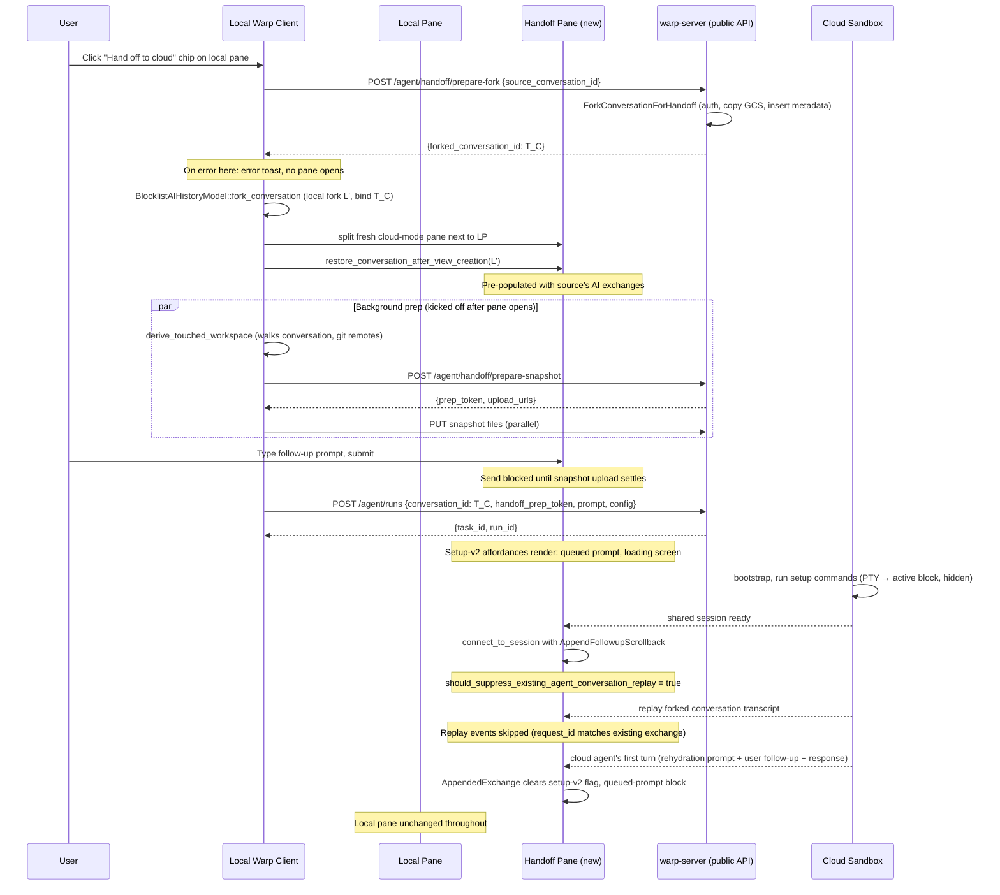

# Local-to-Cloud Handoff: UI Polish — Tech Spec
Product spec: `specs/REMOTE-1519/PRODUCT.md`
Linear: [REMOTE-1519](https://linear.app/warpdotdev/issue/REMOTE-1519/make-ui-better-for-local-cloud-handoff)
## Context
REMOTE-1486 shipped V0 of the local-to-cloud handoff: a chip in the agent input footer (or `/oz-cloud-handoff`) opens a fresh cloud-mode pane next to the local pane; on submit the client snapshots the workspace and spawns a cloud agent forked from the local conversation.
That V0 has two rough edges this spec addresses:
1. **No hydration of the source conversation in the new pane.** The fork is materialized server-side at submit time only. Until the cloud agent's shared session connects and replays the conversation transcript, the new pane is blank. The cloud session's replay then re-broadcasts every exchange the user already saw in the local pane.
2. **Setup-v2 affordances render incorrectly.** A fresh cloud-mode pane shows a "Running setup commands…" collapsible row, a queued-prompt indicator, and a loading screen during the pre-session window (gated by `FeatureFlag::CloudModeSetupV2`). Handoff panes today don't surface those affordances; the environment startup PTY output renders raw instead.
The pieces this spec builds on:
- **Cloud-cloud handoff replay suppression.** When `attach_followup_session` joins a fresh shared session for a follow-up cloud execution, it uses `SharedSessionInitialLoadMode::AppendFollowupScrollback`, which (a) deduplicates blocks by ID via `BlockList::append_followup_shared_session_scrollback` and (b) flips `should_suppress_existing_agent_conversation_replay = true`. That flag drives `BlocklistAIController::should_skip_replayed_response_for_existing_conversation` to skip replayed response streams. We reuse this mechanism for the local→cloud first-session connect.
- **Fork-into-new-pane restoration.** `BlocklistAIHistoryModel::fork_conversation` materializes a forked `AIConversation` locally; `restore_conversation_after_view_creation` feeds it into a freshly-created pane and restores AI blocks for every exchange with live (non-restored) appearance.
- **Server-side fork and conversation-token binding.** `ForkConversationForHandoff` in `../warp-server-2/logic/ai_conversation_fork.go` already implements the server fork end-to-end (auth on source, GCS data copy, metadata insert). The viewer-side `BlocklistAIController::find_existing_conversation_by_server_token` maps a `StreamInit.conversation_id` to a local `AIConversation` by token; binding the local fork's `server_conversation_token` to the server fork's id at chip-click time wires them up automatically when the cloud session arrives.
## Diagram

## Proposed changes
### 1. Server-side: split fork from spawn (`../warp-server-2`)
Forking on chip click (vs at submit time) freezes the cloud's view at the moment the user opted into the handoff and lets the two conversations evolve independently.
**New endpoint** `POST /api/v1/agent/handoff/prepare-fork`:
```go path=null start=null
type PrepareLocalHandoffForkRequest struct {
    SourceConversationID string `json:"source_conversation_id" binding:"required"`
}
type PrepareLocalHandoffForkResponse struct {
    ForkedConversationID string `json:"forked_conversation_id"`
}
```
Add the handler alongside `PrepareLocalHandoffSnapshotHandler` in `router/handlers/public_api/agent_handoff.go`. It gates on `features.LocalToCloudHandoffEnabled()`, resolves the principal, and calls `logic.ForkConversationForHandoff`. Wire the route under the same `aiCheckedGroup` as the existing snapshot prep endpoint.
**Remove `ForkFromConversationID` from `RunAgentRequest`.** The field, validation, and inline fork call all go. The existing `ConversationID *string` field continues to drive `task.AgentConversationID` (resume semantics) — the client now points it at the pre-minted fork id.
**`HandoffPrepToken` stays.** Snapshot prep + upload still flow through `prepare-snapshot` and `attachHandoffSnapshotToTask` post-task-creation; only the timing of when the client triggers them moves (now async on chip click instead of submit time — see §3).
### 2. Client-side API surface (`app/src/server/server_api/ai.rs`)
- Add `prepare_handoff_fork` to the `AIClient` trait, implemented as `POST agent/handoff/prepare-fork`. Mirror the request/response shape pattern of `PrepareHandoffSnapshotRequest`.
- On `SpawnAgentRequest`, replace `fork_from_conversation_id: Option<String>` with `conversation_id: Option<String>` (resume semantics). The client now always pre-mints the fork via the new endpoint and sends the resulting id under `conversation_id`.
### 3. Client-side fork-on-chip-click (`app/src/workspace/view.rs`)
`Workspace::start_local_to_cloud_handoff` becomes a strict-ordering open path:
1. Resolve eligibility synchronously from the active session view's `BlocklistAIHistoryModel::active_conversation`. If the conversation is missing, empty, or has no `server_conversation_token`, surface the shared error toast and return without opening any pane.
2. `ctx.spawn` a future that calls `AIClient::prepare_handoff_fork`. The new pane is **not** split until this returns. On error, surface the same error toast; do not open a pane.
3. On success, on the main thread:
    - Call `BlocklistAIHistoryModel::fork_conversation(&source_conversation, FORK_PREFIX, /* preserve_task_ids */ true, ctx)` to materialize the local fork `L'`. `preserve_task_ids: true` keeps the source's task ids so the cloud agent's `ClientAction`s (which reference those task ids) resolve in `L'`.
    - `pane_group.add_ambient_agent_pane(ctx)` to split the new pane.
    - Pre-fill the prompt input if the slash command supplied one.
    - `terminal_view.restore_conversation_after_view_creation(RestoredAIConversation::new(L'.clone()), /* use_live_appearance */ true, ctx)` so the AI exchanges render immediately.
    - `BlocklistAIHistoryModel::set_server_conversation_token_for_conversation(local_fork_id, T_C)`. Must run **after** restore: `restore_conversations` overwrites `conversations_by_id` with the token-less clone we passed in, so binding earlier would be lost.
    - Seed `PendingHandoff { forked_conversation_id: T_C, touched_workspace: None, snapshot_prep: Pending, submission_state: Idle }`.
4. Kick off async background prep on the new pane: `derive_touched_workspace` → `upload_snapshot_for_handoff`. When derivation completes, call `set_pending_handoff_workspace`. When the upload completes, call `set_pending_handoff_snapshot_prep` with `Uploaded(token)` / `SkippedEmptyWorkspace` / `Failed(err)` as appropriate. The pane is fully interactive throughout.
The send button's gate (`is_handoff_ready_to_submit`) requires `touched_workspace.is_some()`, `snapshot_prep` settled (Uploaded or SkippedEmptyWorkspace), and `submission_state == Idle`. If submit fires while any precondition is unmet, the input layer surfaces a "Preparing handoff" toast and leaves the prompt + attachments intact.
### 4. Submit path uses resume semantics (`app/src/terminal/view/ambient_agent/model.rs`)
With the fork and the snapshot upload both completed during the chip-click open path, `AmbientAgentViewModel::submit_handoff` is a thin shim over `spawn_agent_with_request` that reads cached `forked_conversation_id` and `snapshot_prep` directly off `pending_handoff`. The orchestrator that REMOTE-1486 used is deleted.
### 5. Replay-suppressing initial connect (`app/src/terminal/shared_session/viewer/terminal_manager.rs`)
`TerminalManager::connect_to_session` gains an `append_followup_scrollback: bool` flag. The cloud-mode subscription in `app/src/terminal/view/ambient_agent/mod.rs` passes `view_model.is_local_to_cloud_handoff()` so handoff panes use `AppendFollowupScrollback` instead of the default `ReplaceFromSessionScrollback`.
The append mode handles both pieces of dedup: `BlockList::append_followup_shared_session_scrollback` skips block IDs we already have, and `should_suppress_existing_agent_conversation_replay = true` drives the response-stream filter described in §6.
### 6. Replay-stream filter keys on `request_id` (`app/src/ai/blocklist/controller/shared_session.rs`)
The cloud agent's replay rebroadcasts every exchange in the forked conversation, including ones we've already pre-populated. We need to skip the replayed response streams without skipping the cloud agent's genuinely new turns (which arrive on the same connection after replay finishes).
`should_skip_replayed_response_for_existing_conversation` (called from `on_shared_init`) compares `init_event.request_id` against the `server_output_id`s of the local fork's existing exchanges. The stream is skipped iff:
- the model is in replay mode (`is_receiving_agent_conversation_replay && should_suppress_existing_agent_conversation_replay`), AND
- the incoming `request_id` matches an existing exchange's `server_output_id`.
Replay events for already-known exchanges are dropped; new turns the cloud agent appends after the local fork (e.g. the user's first submitted prompt) carry request_ids we have never seen and flow through normally.
### 7. Feature-flag posture
No new feature flags. All changes are gated on the existing `FeatureFlag::OzHandoff && FeatureFlag::LocalToCloudHandoff` (client) and `features.LocalToCloudHandoffEnabled()` (server) used by REMOTE-1486.
## Risks and mitigations
- **Chip-click latency is now gated on the prepare-fork RPC.** Previously the pane opened instantly; now the user sees nothing until the fork resolves. The fork is a synchronous metadata + GCS-copy round-trip already used at submit time today; expected latency is similar to other authenticated public-API RPCs (<300ms p50). On error we surface a toast immediately.
- **Source conversation not synced to GCS.** `ForkConversationForHandoff` returns `InvalidRequestError` when `BatchDoesConversationDataExist` is false. The client surfaces this as the toast above; the user can wait a moment and click again.
- **Replay suppression skips a genuinely new exchange.** The `request_id` filter scopes skipping to specific known exchanges, so new turns flow through even during the replay window.
- **Snapshot upload still in flight at submit time.** `is_handoff_ready_to_submit` blocks submit until upload settles. The user sees a "Preparing handoff" toast and their prompt + attachments are preserved.
## Testing and validation
### Unit tests
- `app/src/server/server_api/ai_test.rs`: serialization/deserialization tests for `PrepareHandoffForkRequest` / `PrepareHandoffForkResponse`.
- `app/src/ai/blocklist/history_model_test.rs`: test that `set_server_conversation_token_for_conversation` after `fork_conversation` updates the token-to-conversation reverse index so `find_conversation_id_by_server_token(T_C)` finds the fork. Plus a test exercising `preserve_task_ids: true` to confirm task ids are preserved across the fork.
- `app/src/terminal/shared_session/viewer/event_loop_test.rs`: extend the existing append-mode tests to cover the local→cloud connect path.
### Server tests (`../warp-server-2`)
- `router/handlers/public_api/agent_handoff_test.go`: add a `TestPrepareLocalHandoffForkHandler_*` suite covering: feature-flag-off; missing `source_conversation_id`; happy path; auth failure on the source.
- Update existing `agent_webhooks_test.go::TestHandoff_*` cases that exercise `ForkFromConversationID` to instead drive the new `prepare-fork` endpoint and then send `ConversationID` on the run request.
### Integration / manual
- Click the chip on a long Oz conversation; verify the new pane is visibly populated with the AI exchanges before the cloud session connects, with no flicker or duplicate blocks during the connect/replay window.
- Submit a follow-up; verify the queued-prompt indicator + "Setting up environment" loading screen + "Running setup commands…" collapsible block all render the same way they do for a fresh cloud-mode run.
- After the cloud agent's first turn arrives, verify the pre-populated blocks remain in place, the queued-prompt indicator clears, and the new exchange appends below them.
- Click the chip on a non-eligible conversation (no synced server token); verify **no pane opens** and an error toast surfaces in the local window.
- Manually break a network connection during chip click so the prepare-fork RPC fails; verify **no pane opens** and an error toast surfaces in the local window.
## Parallelization
The two-side change is small enough that one engineer/agent can implement it sequentially in two PRs — a server PR for the prepare-fork endpoint + `ForkFromConversationID` removal, then a client PR for the hydration + load mode + replay-stream filter. No sub-agents needed.
## Follow-ups
- Cloud→cloud setup-v2 polish (REMOTE-1290) — out of scope here.
