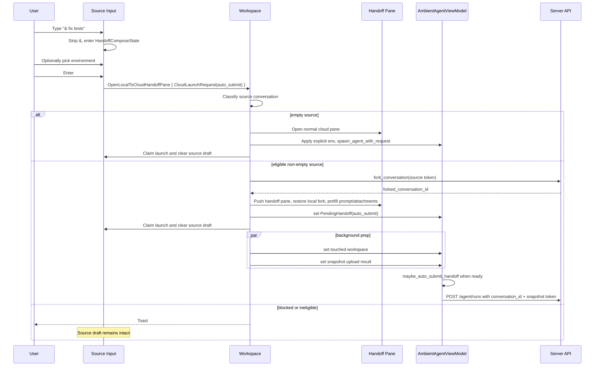

# Local-to-Cloud Handoff: `&` Entrypoint — Tech Spec
Product spec: `specs/REMOTE-1558/PRODUCT.md`
Linear: [REMOTE-1558](https://linear.app/warpdotdev/issue/REMOTE-1558)
## Context
REMOTE-1558 adds a keyboard-first local-to-cloud launch path: local AgentView users type `& query`, optionally choose a cloud environment from the local footer, and press Enter once. The same auto-run path is also exposed through `/move-to-cloud query`; no-query chip and slash-command flows remain compose/open flows.
Current code paths this builds on:
- `app/src/terminal/input.rs:495` defines the existing `!` shell-mode prefix. The typed-only prefix stripping and lock behavior live in `app/src/terminal/input.rs (9087-9200)`, empty-state escape/backspace handling lives in `app/src/terminal/input.rs (9686-9824)`, and the visible `!` indicator is rendered by `maybe_render_ai_input_indicators` in `app/src/terminal/input.rs (14701-14758)`.
- `InputType` is the semantic/classification mode for a buffer: `Shell` or `AI`. It is imported from `input_classifier` and maps directly into the session-sharing protocol's `Shell` / `AI` input mode in `app/src/ai/blocklist/input_model.rs (114-121)`. Do not add a `CloudHandoff` variant to `InputType`; `&` handoff compose is still an AI prompt semantically, with different destination and submit behavior.
- `!` is not stored as a standalone prefix enum today; it is represented by `BlocklistAIInputModel` being locked to `InputType::Shell`. `&` must therefore add explicit guards around the existing shell-lock transitions rather than assuming the two modes are naturally exclusive.
- `app/src/terminal/input.rs (11926-12211)` is the cloud-mode submit path. It collects pending image/file attachments into `AttachmentInput`, clears the editor and pending attachments, then calls either `AmbientAgentViewModel::spawn_agent` or `submit_handoff`. It does not serialize selected text/block/document context; `spawn_agent` and `submit_handoff` both set `referenced_attachments: vec![]` in `app/src/terminal/view/ambient_agent/model.rs (707-786)` and `app/src/terminal/view/ambient_agent/model.rs (1203-1258)`.
- `/move-to-cloud` is registered with an optional argument in `app/src/search/slash_command_menu/static_commands/commands.rs:174`. Slash parsing preserves the text after the first space in `app/src/terminal/input/slash_command_model.rs:416`, and the handler currently dispatches `WorkspaceAction::OpenLocalToCloudHandoffPane { initial_prompt }` from `app/src/terminal/input/slash_commands/mod.rs (880-890)`. The shared slash-command completion path clears the input after a handled command in `app/src/terminal/input/slash_commands/mod.rs (1039-1046)`.
- `WorkspaceAction::OpenLocalToCloudHandoffPane` is defined in `app/src/workspace/action.rs:489` and handled in `app/src/workspace/view.rs:20345`.
- `Workspace::start_local_to_cloud_handoff` in `app/src/workspace/view.rs (12894-12965)` currently requires an active non-empty conversation with a `server_conversation_token`; otherwise it toasts and opens no pane. `complete_local_to_cloud_handoff_open` in `app/src/workspace/view.rs (12967-13155)` materializes a local fork, pushes the cloud-mode pane, pre-fills an optional prompt, restores the forked conversation, binds the fork token, exits the source agent view, seeds `PendingHandoff`, and starts touched-workspace derivation plus snapshot upload.
- `PendingHandoff` and handoff readiness live on `AmbientAgentViewModel` in `app/src/terminal/view/ambient_agent/model.rs (78-138)` and `app/src/terminal/view/ambient_agent/model.rs (397-509)`. `submit_handoff` builds a normal `SpawnAgentRequest` with `conversation_id` set to the forked server conversation id and `initial_snapshot_token` set from the prepared upload.
- `EnvironmentSelector` in `app/src/ai/blocklist/agent_view/agent_input_footer/environment_selector.rs (129-480)` is currently hard-bound to `ModelHandle<AmbientAgentViewModel>`. It persists explicit selections to `CloudAgentSettings::last_selected_environment_id` and only enables while the ambient model is composing. The footer renders it only for ambient cloud panes in `app/src/ai/blocklist/agent_view/agent_input_footer/mod.rs (2014-2039)`.
- `Input::is_cloud_mode_input_v2_composing` already excludes local-to-cloud handoff panes in `app/src/terminal/input/agent.rs:65`, so the new handoff compose path should stay on the existing AgentView input UI.
## Proposed changes
### 1. Add a shared cloud launch request
Introduce a small client-side launch DTO shared by `Input`, slash commands, workspace, and ambient model code. Put it near the ambient-agent launch surface, for example `app/src/terminal/view/ambient_agent/launch.rs`, and re-export it from `app/src/terminal/view/ambient_agent/mod.rs`.
The shape should be explicit about ownership and current cloud-mode attachment scope:
- `CloudLaunchRequestId` — opaque id generated by the source `Input`, used so workspace can tell the source input when a launch has been claimed.
- `CloudLaunchRequest` — `id`, `initial_prompt: Option<String>`, `attachments: CloudLaunchAttachments`, `explicit_environment_id: Option<SyncId>`, `submit_mode: CloudLaunchSubmitMode`, and `entrypoint: CloudLaunchEntrypoint`.
- `CloudLaunchSubmitMode` — `Compose` for chip and `/move-to-cloud` with no query; `AutoSubmit` for `& query` and `/move-to-cloud query`.
- `CloudLaunchEntrypoint` — `Ampersand`, `SlashCommand`, or `FooterChip` for telemetry and failure messages.
- `CloudLaunchAttachments` — the pre-read `Vec<AttachmentInput>` used for `SpawnAgentRequest`, plus a display/restoration snapshot of pending image/file attachments so an opened handoff pane can preserve them for manual retry.
Do not add selected text/block/document serialization in this spec. `&` and `/move-to-cloud query` should match the current cloud-mode submit behavior: prompt plus pending image/file attachments. Pending selected context remains untouched while the source draft is unclaimed, but it is not sent to cloud once workspace claims the launch.
### 2. Add input-local prefix state for `&` and `!`
Do not model `&` by adding a third `InputType`. `InputType` should remain a two-way semantic classification (`Shell` or `AI`) used by autodetection, slash-command gating, UDI controls, and session-sharing serialization. A cloud-handoff draft should continue to report as AI input anywhere that asks whether the buffer is an AI prompt.
Add an `Input`-local prefix-mode layer instead:
```rust path=null start=null
enum InputPrefixMode {
    None,
    Shell,
    CloudHandoff,
}
```
`InputPrefixMode::Shell` should be derived from the existing locked-shell state, not separately stored. `InputPrefixMode::CloudHandoff` should be backed by an `Input`-owned `ModelHandle<HandoffComposeState>` rather than extending `BlocklistAIInputModel`. This keeps normal AI-vs-shell classification independent from the handoff launch draft while still giving prefix rendering and keyboard handling one mutually exclusive parent enum.
`HandoffComposeState` should track:
- whether handoff compose mode is active;
- the selected environment id, if any;
- whether the environment was explicitly selected by the user;
- the active `CloudLaunchRequestId`, if a launch is pending workspace claim.
Activation should mirror the `!` path while defending mutual exclusion:
1. In `handle_editor_event`, recognize `&` only on `EditOrigin::UserTyped`, only when it is the first character of an otherwise empty buffer, and only when the current input is the fullscreen local AgentView input. Do not activate in terminal mode, cloud-mode panes, CLI-agent rich input, pasted input, buffers with leading whitespace, or locked shell mode.
2. If the visible `!` shell-mode indicator is active, typed `&` is normal shell text; the user must exit shell mode before entering handoff compose mode.
3. Strip the literal `&` from the editor buffer, set `HandoffComposeState.active = true`, keep focus in the editor, and notify the footer.
4. While `HandoffComposeState.active` is true, skip the existing `TERMINAL_INPUT_PREFIX` activation branch. Typed `!` is prompt text in the cloud-launch draft; it must not lock the input to shell mode until the user exits `&` mode.
5. Any other path that locks the input to shell mode while `&` is active, such as explicit terminal-mode actions or `DeleteAllLeft`, should call `exit_handoff_compose_mode` before applying the shell lock. Conversely, `&` activation should no-op if the shell lock is already active. This makes `HandoffComposeState.active` and locked-shell input a defended invariant rather than a rendering convention.
6. Add a helper like `current_prefix_mode(ctx) -> InputPrefixMode` and route activation, rendering, hint text, Escape/Backspace, Enter behavior, and tests through it. This helper should derive `Shell` from locked `InputType::Shell`, derive `CloudHandoff` from `HandoffComposeState.active`, and never let both be true from a caller's perspective.
7. Render `&` through `maybe_render_ai_input_indicators` as a sibling of the existing `!` indicator path. Defensively prefer `&` only if `HandoffComposeState.active`; otherwise render `!` from locked-shell state. Tests should assert both cannot render together.
8. In `set_zero_state_hint_text`, use the handoff hint only when `HandoffComposeState.active` and the editor buffer is empty.
9. On `BackspaceOnEmptyBuffer` / `BackspaceAtBeginningOfBuffer`, Escape, or clearing the prompt back to empty, call a single `exit_handoff_compose_mode` helper that clears the handoff state but preserves the prompt for Escape.
On Enter with a non-empty handoff prompt, build a `CloudLaunchRequest::auto_submit` from the current buffer, pre-read cloud-mode-supported image/file attachments using the same logic as `app/src/terminal/input.rs (11926-12131)`, and dispatch the workspace action without clearing the source editor or pending attachments. Workspace claims the launch later on success.
### 3. Generalize `EnvironmentSelector`
Refactor `EnvironmentSelector` so it binds to a small environment-selection target interface instead of directly storing `ModelHandle<AmbientAgentViewModel>`.
The target interface needs only:
- `selected_environment_id(app) -> Option<SyncId>`;
- `set_environment_id(Some(id), ctx)`;
- `is_configuring(app) -> bool`;
- a change event or subscription hook for refreshing menu/button state.
Implement the target for `AmbientAgentViewModel` and for `HandoffComposeState`. Preserve existing selector behavior: selecting an environment from either target persists to `CloudAgentSettings::last_selected_environment_id`, opens the environment-management pane through the existing footer event, and uses the same label/menu/disabled states.
Update `AgentInputFooter` so it can receive the handoff state handle in addition to the optional ambient model. Render the selector in the left footer area when either:
- an ambient cloud pane is composing, preserving current behavior; or
- `HandoffComposeState.active` is true, producing the transient `&` selector.
The transient selector should not be part of the configurable toolbar item list; it is mode chrome like the `&` input indicator.
### 4. Refactor workspace entrypoints around `CloudLaunchRequest`
Replace `WorkspaceAction::OpenLocalToCloudHandoffPane { initial_prompt }` with a launch-aware action, or add a new action used by the new paths and have the old action delegate into it:
- `WorkspaceAction::OpenLocalToCloudHandoffPane { launch: CloudLaunchRequest }`
The footer chip dispatches `CloudLaunchRequest::compose(CloudLaunchEntrypoint::FooterChip)`. `/move-to-cloud` with no query dispatches `Compose` with the parsed prompt absent. `/move-to-cloud query` dispatches `AutoSubmit` with the parsed prompt, collected image/file attachments, and no explicit environment. `& query` dispatches `AutoSubmit` with the stripped prompt, collected image/file attachments, and the explicit environment id from `HandoffComposeState`, if the user chose one.
Workspace should classify the active source before mutating source input:
1. No active conversation or an empty active conversation: fresh cloud run/compose.
2. Non-empty conversation whose status is running or blocked: toast and return without claiming the launch.
3. Non-empty idle conversation without `server_conversation_token`: toast and return without claiming the launch.
4. Non-empty idle conversation with `server_conversation_token`: local-to-cloud handoff.
Claiming the launch means workspace has either opened a target cloud pane or dispatched a fresh cloud spawn. Only after that point should workspace update the source `Input` by `CloudLaunchRequestId` to clear the source draft, pending image/file attachments, and `HandoffComposeState`. If any pre-pane validation or fork request fails, workspace should not send the claim; the source prompt and attachments remain intact because `Input` never cleared them.
### 5. Fresh cloud run/compose path for empty conversations
Add a helper on `Workspace` or `TerminalView` that starts normal cloud mode from a `CloudLaunchRequest`.
For `Compose`, reuse the existing cloud-mode open path and prefill `initial_prompt` when present. For `AutoSubmit`, create the normal cloud-mode pane, apply `explicit_environment_id` to its `AmbientAgentViewModel` before building the spawn config, then call `spawn_agent_with_request` with the collected prompt/attachments. This avoids simulating editor input and keeps fresh-cloud auto-run aligned with the model-level submit API.
If no environment was explicitly selected, rely on the existing selector/defaulting behavior. If no environment exists, let `build_default_spawn_config` send `environment_id: None`, matching current cloud-mode behavior.
### 6. Local-to-cloud auto-submit
Extend `PendingHandoff` with:
- `auto_submit: Option<PendingCloudLaunch>` containing prompt, attachments, and request id;
- `explicit_environment_id: Option<SyncId>` or an equivalent environment-source marker.
When `complete_local_to_cloud_handoff_open` creates the handoff pane:
1. Apply `explicit_environment_id` to the pane model immediately when present.
2. Prefill the handoff pane input and install the pending image/file attachment snapshot when `launch.initial_prompt` is present, even for auto-submit. This is what preserves prompt/attachments if prep fails after the pane opens.
3. Seed `PendingHandoff` with the existing fork/snapshot fields plus the optional `auto_submit` payload.
4. Mark the source launch claimed only after the pane has been pushed and hydrated.
5. Start touched-workspace derivation and snapshot upload as today.
When touched-workspace derivation finishes, keep the current overlap selection behavior only if there was no explicit environment id. This enforces the product priority: explicit `&` selection, then touched-repo overlap, then default.
Move the readiness check into the model by adding `maybe_auto_submit_handoff(ctx)`. Call it after each `PendingHandoff` mutation that can make readiness true. It should:
- require `auto_submit.is_some()`;
- require `is_handoff_ready_to_submit()`;
- take the auto-submit payload exactly once;
- clear the handoff pane input/attachments only immediately before dispatch;
- call `submit_handoff(prompt, attachments.spawn_inputs, ctx)`.
If snapshot upload fails, keep the pane open, keep the prefilled prompt and display attachments, clear or disable the auto-submit payload, and show the existing snapshot failure toast. A subsequent manual Enter should retry snapshot upload for the same touched workspace before calling `submit_handoff`; otherwise the product's retryable failure state is not real.
### 7. Slash command clearing semantics
`execute_slash_command` currently clears every handled slash command after dispatch. `/move-to-cloud` needs a deferred-clear path when it dispatches a `CloudLaunchRequest`; otherwise a pre-pane failure would lose `/move-to-cloud query`.
Add a command-handler result or a small `SlashCommandExecutionEffect` enum so `/move-to-cloud` can say “handled, but source clear is owned by workspace claim.” Other slash commands should keep the existing clear behavior. When workspace claims a slash-command launch, it clears the source buffer through the same `CloudLaunchRequestId` mechanism used by `&`.
### 8. End-to-end flow

## Risks and mitigations
- **Input clears before workspace owns the launch.** The request-id claim protocol keeps source prompt and attachments intact through validation and fork failures. Tests should cover both `&` and `/move-to-cloud query`.
- **Environment overlap overwrites explicit user choice.** Store explicit environment state on `PendingHandoff` and skip `pick_handoff_overlap_env` when it is present.
- **Attachment preservation diverges between auto-submit and manual retry.** Carry both spawn-ready `AttachmentInput`s and a display/restoration snapshot. Install the display snapshot in the handoff pane before background prep can fail.
- **Snapshot failure remains unretryable.** Current handoff readiness blocks submit after `SnapshotUploadStatus::Failed`; this feature should add a manual retry branch so the failure pane can recover.
- **Selected text/block/document context mismatch.** Current cloud-mode submit does not serialize this context. This spec deliberately avoids inventing a one-off path for `&`; general cloud selected-context support should be added once and reused by normal cloud mode, `&`, and `/move-to-cloud query`.
## Testing and validation
### Unit tests
- `app/src/terminal/input_test.rs`: add `&` prefix tests parallel to `run_input_mode_prefix_test` for typed-only activation, paste/system insert non-activation, first-character-only activation, stripping, indicator state, Backspace empty-state exit, Escape preserving prompt text, and automatic exit when the prompt is cleared. Cover local fullscreen AgentView only, and assert terminal mode, cloud-mode panes, and CLI-agent rich input do not activate.
- `app/src/terminal/input_test.rs`: verify Enter in handoff compose builds a `CloudLaunchRequest` without clearing the source buffer or pending image/file attachments until a matching claim is received.
- `app/src/ai/blocklist/agent_view/agent_input_footer/*_test.rs` or existing footer tests in `app/src/terminal/input_test.rs`: verify the transient environment selector renders only while `HandoffComposeState.active`, selection updates the handoff state, and selection persists to `CloudAgentSettings::last_selected_environment_id`.
- `app/src/terminal/input/slash_command_model_tests.rs`: keep optional argument parsing coverage for `/move-to-cloud query`; add coverage for argument text containing spaces.
- `app/src/terminal/input/slash_commands/*`: test that `/move-to-cloud query` uses the deferred-clear launch effect and `/move-to-cloud` without query stays compose.
- `app/src/terminal/view/ambient_agent/model.rs` tests: cover `PendingHandoff` auto-submit firing exactly once when touched workspace and snapshot upload both settle, explicit env preventing overlap replacement, and snapshot failure disabling auto-submit while preserving manual retry.
### Integration / manual
- Product behaviors 1-15: type `&`, observe stripped visible indicator, empty-state hint, transient selector, Backspace/Escape/clear exits, and Enter requiring a non-empty prompt.
- Product behaviors 17 and 29: from an empty local AgentView conversation, `& query` and `/move-to-cloud query` open normal cloud mode and auto-start a fresh run with the prompt and file/image attachments.
- Product behaviors 18 and 30: from an eligible non-empty local conversation, both auto-run entrypoints open the hydrated handoff pane and dispatch the cloud run once fork, overlap/default env selection, and snapshot upload are ready.
- Product behaviors 19-22 and 31-32: running/blocked, missing-token, fork-failure, and snapshot-failure cases preserve the source or pane prompt and image/file attachments according to whether workspace claimed the launch.
- Product behavior 45: `&` and `!` are mutually exclusive in both directions. Verify `&` cannot activate from visible shell mode, typed `!` inside `&` mode remains prompt text, explicit terminal-mode actions exit `&`, and the input never renders both indicators.
- Product behaviors 36-38 and 46: explicit `&` environment wins over touched-repo overlap and persists as the saved cloud environment; slash-command auto-run still allows overlap/default selection.
### Validation commands
- Compile the touched Rust targets after implementation. Prefer the repo's normal Rust check command if available in existing docs/scripts; otherwise use the narrowest `cargo check`/Bazel equivalent that covers `app/src/terminal/input.rs`, `app/src/workspace/view.rs`, and `app/src/terminal/view/ambient_agent/model.rs`.
- Run the focused unit tests added above.
## Parallelization
The implementation touches tightly coupled input, footer, workspace, and ambient-model state. One agent should implement it sequentially to avoid conflicting edits around `Input` and `AgentInputFooter`; validation can be split afterward if compile/test time becomes the bottleneck.
## Follow-ups
- Add general cloud-mode serialization for selected text/block/document context and plumb it through `SpawnAgentRequest.referenced_attachments` or the appropriate server contract. Once that exists, `CloudLaunchRequest` should carry the same selected-context payload for normal cloud mode, `&`, and `/move-to-cloud query`.
- Consider dedicated telemetry for `&` activation, auto-submit success, and blocked/failure reasons if existing slash/cloud telemetry is insufficient for rollout analysis.
