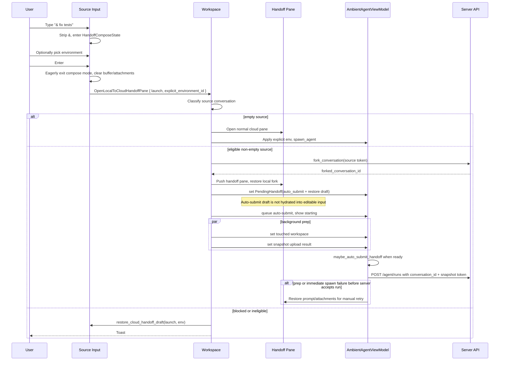

# Local-to-Cloud Handoff: `&` Entrypoint — Tech Spec
Product spec: `specs/REMOTE-1558/PRODUCT.md`
Linear: [REMOTE-1558](https://linear.app/warpdotdev/issue/REMOTE-1558)
## Context
REMOTE-1558 adds a keyboard-first local-to-cloud launch path: local AgentView users type `& query`, optionally choose a cloud environment from the local footer, and press Enter once. The same auto-run path is also exposed through `/handoff query`; no-query `/handoff` and chip flows activate `&` handoff-compose mode.
Current code paths this builds on:
- `app/src/terminal/input.rs:495` defines the existing `!` shell-mode prefix. The typed-only prefix stripping and lock behavior live in `app/src/terminal/input.rs (9087-9200)`, empty-state escape/backspace handling lives in `app/src/terminal/input.rs (9686-9824)`, and the visible `!` indicator is rendered by `maybe_render_ai_input_indicators` in `app/src/terminal/input.rs (14701-14758)`.
- `InputType` is the semantic/classification mode for a buffer: `Shell` or `AI`. It is imported from `input_classifier` and maps directly into the session-sharing protocol's `Shell` / `AI` input mode in `app/src/ai/blocklist/input_model.rs (114-121)`. Do not add a `CloudHandoff` variant to `InputType`; `&` handoff compose is still an AI prompt semantically, with different destination and submit behavior.
- `!` is not stored as a standalone prefix enum today; it is represented by `BlocklistAIInputModel` being locked to `InputType::Shell`. `&` must therefore add explicit guards around the existing shell-lock transitions rather than assuming the two modes are naturally exclusive.
- `app/src/terminal/input.rs (11926-12211)` is the cloud-mode submit path. It collects pending image/file attachments into `AttachmentInput`, clears the editor and pending attachments, then calls either `AmbientAgentViewModel::spawn_agent` or `submit_handoff`. It does not serialize selected text/block/document context; `spawn_agent` and `submit_handoff` both set `referenced_attachments: vec![]` in `app/src/terminal/view/ambient_agent/model.rs (707-786)` and `app/src/terminal/view/ambient_agent/model.rs (1203-1258)`.
- `/handoff` is registered with an optional argument in `app/src/search/slash_command_menu/static_commands/commands.rs:174`. Slash parsing preserves the text after the first space in `app/src/terminal/input/slash_command_model.rs:416`, and the handler dispatches `WorkspaceAction::OpenLocalToCloudHandoffPane` for `/handoff query` and activates `&` handoff-compose mode for `/handoff` with no query.
- `WorkspaceAction::OpenLocalToCloudHandoffPane` is defined in `app/src/workspace/action.rs:489` and handled in `app/src/workspace/view.rs:20345`.
- `Workspace::start_local_to_cloud_handoff` in `app/src/workspace/view.rs (12894-12965)` currently requires an active non-empty conversation with a `server_conversation_token`; otherwise it toasts and opens no pane. `complete_local_to_cloud_handoff_open` in `app/src/workspace/view.rs (12967-13155)` materializes a local fork, pushes the cloud-mode pane, pre-fills an optional prompt, restores the forked conversation, binds the fork token, exits the source agent view, seeds `PendingHandoff`, and starts touched-workspace derivation plus snapshot upload.
- `PendingHandoff` and handoff readiness live on `AmbientAgentViewModel` in `app/src/terminal/view/ambient_agent/model.rs (78-138)` and `app/src/terminal/view/ambient_agent/model.rs (397-509)`. `submit_handoff` builds a normal `SpawnAgentRequest` with `conversation_id` set to the forked server conversation id and `initial_snapshot_token` set from the prepared upload.
- `EnvironmentSelector` in `app/src/ai/blocklist/agent_view/agent_input_footer/environment_selector.rs (129-480)` is currently hard-bound to `ModelHandle<AmbientAgentViewModel>`. It persists explicit selections to `CloudAgentSettings::last_selected_environment_id` and only enables while the ambient model is composing. The footer renders it only for ambient cloud panes in `app/src/ai/blocklist/agent_view/agent_input_footer/mod.rs (2014-2039)`.
- `AgentMessageBar` in `app/src/ai/blocklist/agent_view/agent_message_bar.rs` already owns the shell-mode "backspace to exit shell mode" affordance through `ExitBashModeMessageProducer`; the cloud-prefix affordance should be added there rather than as unrelated input chrome.
- Agent/AI magenta is available through existing AI color helpers such as `ai_brand_color` in `app/src/ai/blocklist/view_util.rs`, and should be used for the `&` indicator and cloud-mode exit affordance instead of shell-mode blue.
- `Input::is_cloud_mode_input_v2_composing` already excludes local-to-cloud handoff panes in `app/src/terminal/input/agent.rs:65`, so the new handoff compose path should stay on the existing AgentView input UI.
## Proposed changes
### 1. Launch payload types
Two types in `app/src/ai/blocklist/handoff/mod.rs` carry the handoff payload from the source input through the workspace action into the cloud pane:
- `HandoffLaunchAttachments` — the pre-read `Vec<AttachmentInput>` for `SpawnAgentRequest`, plus a `Vec<PendingAttachment>` display/restoration snapshot so failure paths can repopulate the source input.
- `PendingCloudLaunch` — `prompt: String` and `attachments: HandoffLaunchAttachments`. Reused by the action variant and by `PendingHandoff.auto_submit`.
The workspace action carries these directly — no wrapper struct or request-id coordination. The source input eagerly clears its compose state on dispatch and workspace restores it on failure (see §4):
```rust path=null start=null
OpenLocalToCloudHandoffPane {
    launch: Option<PendingCloudLaunch>,
    explicit_environment_id: Option<SyncId>,
}
```
Do not add selected text/block/document serialization in this spec. `&` and `/handoff query` should match the current cloud-mode submit behavior: prompt plus pending image/file attachments.
### 2. Add input-local prefix state for `&` and `!`
Do not model `&` by adding a third `InputType`. `InputType` should remain a two-way semantic classification (`Shell` or `AI`) used by autodetection, slash-command gating, UDI controls, and session-sharing serialization. A cloud-handoff draft should continue to report as AI input anywhere that asks whether the buffer is an AI prompt.
Add an `Input`-local prefix-mode layer instead:
```rust path=null start=null
enum InputPrefixMode {
    None,
    Shell,
    CloudHandoff,
}
```
`InputPrefixMode::Shell` should be derived from the existing locked-shell state, not separately stored. `InputPrefixMode::CloudHandoff` should be backed by an `Input`-owned `ModelHandle<HandoffComposeState>` rather than extending `BlocklistAIInputModel`. This keeps normal AI-vs-shell classification independent from the handoff launch draft while still giving prefix rendering and keyboard handling one mutually exclusive parent enum.
`HandoffComposeState` should track:
- whether handoff compose mode is active;
- the selected environment id, if any;
- whether the environment was explicitly selected by the user;
Activation should mirror the `!` path while defending mutual exclusion:
1. In `handle_editor_event`, recognize `&` only on `EditOrigin::UserTyped`, only when it is the first character of an otherwise empty buffer, and only when the current input is the fullscreen local AgentView input. Do not activate in terminal mode, cloud-mode panes, CLI-agent rich input, pasted input, buffers with leading whitespace, or locked shell mode.
2. If the visible `!` shell-mode indicator is active, typed `&` is normal shell text; the user must exit shell mode before entering handoff compose mode.
3. Strip the literal `&` from the editor buffer, set `HandoffComposeState.active = true`, set the input config directly to `InputConfig { input_type: InputType::AI, is_locked: true }`, keep focus in the editor, and notify the footer. Do not call `unlocked_if_autodetection_enabled` for this transition; cloud-prefix mode is intentionally locked AI until exit.
4. While `HandoffComposeState.active` is true, skip the existing `TERMINAL_INPUT_PREFIX` activation branch and any autodetection unlock path. Typed `!` is prompt text in the cloud-launch draft; it must not lock the input to shell mode until the user exits `&` mode.
5. Any other path that locks the input to shell mode while `&` is active, such as explicit terminal-mode actions or `DeleteAllLeft`, should call `exit_handoff_compose_mode` before applying the shell lock. Conversely, `&` activation should no-op if the shell lock is already active. This makes `HandoffComposeState.active` and locked-shell input a defended invariant rather than a rendering convention.
6. Add a helper like `current_prefix_mode(ctx) -> InputPrefixMode` and route activation, rendering, hint text, Escape/Backspace, Enter behavior, and tests through it. This helper should derive `Shell` from locked `InputType::Shell`, derive `CloudHandoff` from `HandoffComposeState.active`, and never let both be true from a caller's perspective.
7. Render `&` through `maybe_render_ai_input_indicators` as a sibling of the existing `!` indicator path. Defensively prefer `&` only if `HandoffComposeState.active`; otherwise render `!` from locked-shell state. The `&` indicator should use Agent/AI magenta (`ai_brand_color` or the equivalent theme magenta), not `ansi_fg_blue`. Tests should assert both indicators cannot render together.
8. In `set_zero_state_hint_text`, use the handoff hint only when `HandoffComposeState.active` and the editor buffer is empty. Keep this hint focused on what the prompt will do; the Backspace exit copy belongs to the message bar.
9. Thread the `HandoffComposeState` handle into the Agent View message bar path by passing it through `BlocklistAIStatusBar::new` and `AgentMessageBar::new`, or by passing a small derived prefix-mode provider if that keeps constructor churn lower. Add an `ExitCloudHandoffModeMessageProducer` parallel to `ExitBashModeMessageProducer` that renders Enter + "to hand off to cloud" and Backspace + "to dismiss". Both labels use Agent/AI magenta when the editor is empty; when prompt text is present, the Backspace label follows the shell-mode muted/disabled behavior while the Enter label stays active-colored.
10. On `BackspaceOnEmptyBuffer` / `BackspaceAtBeginningOfBuffer` or Escape, call a single `exit_handoff_compose_mode` helper that clears the handoff state, restores normal unlocked AI/autodetection behavior for future prompts, but preserves the prompt for Escape. Normal editing that empties the buffer does not exit the mode — the user must backspace on an already-empty buffer to exit, matching the `!` shell-mode two-step exit. Programmatic clears (e.g. `clear_buffer_and_reset_undo_stack`) also call the exit helper.
On Enter with a non-empty handoff prompt, build a `PendingCloudLaunch` from the current buffer, pre-read cloud-mode-supported image/file attachments using the same logic as `app/src/terminal/input.rs (11926-12131)`, read the explicit environment id from `HandoffComposeState`, then eagerly exit compose mode and clear the source buffer and pending attachments. Dispatch `OpenLocalToCloudHandoffPane { launch, explicit_environment_id }`. If workspace fails to open the target pane, it calls `Input::restore_cloud_handoff_draft` to re-activate compose mode, repopulate the buffer with the prompt, and restore the display attachments and environment selection.
### 3. Generalize `EnvironmentSelector`
Refactor `EnvironmentSelector` so it binds to a small environment-selection target interface instead of directly storing `ModelHandle<AmbientAgentViewModel>`.
The target interface needs:
- `selected_environment_id(ctx) -> Option<SyncId>`;
- `set_environment_id(environment_id, is_explicit, ctx)` — the `is_explicit` flag tracks whether the user made a deliberate selection (preventing touched-repo overlap from overwriting it later);
- `ensure_default_environment_id(environment_id, ctx)` — sets a default only when no selection exists yet, and on the `CloudPane` target also respects explicit environment locks from a pending handoff;
- `is_configuring(ctx) -> bool`;
- a change event or subscription hook for refreshing menu/button state.
Implement the target for `AmbientAgentViewModel` and for `HandoffComposeState`. Preserve existing selector behavior: selecting an environment from either target persists to `CloudAgentSettings::last_selected_environment_id`, opens the environment-management pane through the existing footer event, and uses the same label/menu/disabled states.
Update `AgentInputFooter` so it can receive the handoff state handle in addition to the optional ambient model. Render the selector in the left footer area when either:
- an ambient cloud pane is composing, preserving current behavior; or
- `HandoffComposeState.active` is true, producing the transient `&` selector.
The transient selector should not be part of the configurable toolbar item list; it is mode chrome like the `&` input indicator.
### 4. Refactor workspace entrypoints with eager-clear and restore-on-failure
The source input eagerly exits compose mode and clears its buffer/attachments before dispatching. The footer chip and `/handoff` with no query activate `&` handoff-compose mode directly. `/handoff query` builds a `PendingCloudLaunch`, clears the buffer normally with other slash commands, and dispatches. `& query` builds a `PendingCloudLaunch`, eagerly exits compose mode, and dispatches.
Workspace classifies the active source:
1. No active conversation or an empty active conversation: fresh cloud run/compose.
2. Non-empty conversation whose status is running or blocked: restore source input, toast.
3. Non-empty idle conversation without `server_conversation_token`: restore source input, toast.
4. Non-empty idle conversation with `server_conversation_token`: local-to-cloud handoff.
On any failure before the target pane is successfully opened (validation, fork RPC, pane creation), workspace calls `Input::restore_cloud_handoff_draft(launch, explicit_environment_id)` on the source view to re-activate compose mode, repopulate the buffer with the prompt, and restore display attachments and environment selection.
For the async fork path (`start_local_to_cloud_handoff`), the fork RPC callback's error branch calls `restore_cloud_handoff_draft` before showing the toast. The success branch proceeds to `complete_local_to_cloud_handoff_open` as today.
### 5. Fresh cloud run/compose path for empty conversations
Add a helper on `Workspace` or `TerminalView` that starts normal cloud mode from an `OpenLocalToCloudHandoffPane` dispatch.
When `launch` is `None`, reuse the existing cloud-mode open path. When `launch` is `Some`, create the normal cloud-mode pane, apply `explicit_environment_id` to its `AmbientAgentViewModel` before building the spawn config, then call `spawn_agent` with the collected prompt and attachments. This avoids simulating editor input and keeps fresh-cloud auto-run aligned with the model-level submit API.
If no environment was explicitly selected, rely on the existing selector/defaulting behavior. If no environment exists, let `build_default_spawn_config` send `environment_id: None`, matching current cloud-mode behavior.
### 6. Local-to-cloud auto-submit
Extend `PendingHandoff` with:
- `auto_submit: Option<PendingCloudLaunch>` containing prompt and attachments;
- `explicit_environment_id: Option<SyncId>` or an equivalent environment-source marker.
- a submission phase that can distinguish idle manual compose, optimistically queued auto-submit, and active server dispatch. This can be a field on `PendingHandoff`, a small enum on `AmbientAgentViewModel`, or an equivalent representation, but callers need to know whether the user's prompt is hidden because Warp has queued it.
`PendingCloudLaunch` should carry both:
- the spawn-ready prompt and `AttachmentInput`s; and
- a restoration draft containing the prompt plus pending image/file attachment display state for retry.
When `complete_local_to_cloud_handoff_open` creates the handoff pane:
1. Apply `explicit_environment_id` to the pane model immediately when present.
2. For `Compose`, prefill the handoff pane input and install the pending image/file attachment snapshot as today.
3. For `AutoSubmit`, do not hydrate the submitted prompt or pending attachment display into the destination editor before queueing. Instead, seed `PendingHandoff` with the spawn payload and restoration draft, and move the pane into the queued/starting visual state immediately. If preparation later fails before the server accepts the run, restore that saved draft into the destination editor for manual retry.
4. Source input was already cleared eagerly at dispatch time, so no claim step is needed.
5. Start touched-workspace derivation and snapshot upload as today.
When touched-workspace derivation finishes, keep the current overlap selection behavior only if there was no explicit environment id. This enforces the product priority: explicit `&` selection, then touched-repo overlap, then default.
Add a model method such as `queue_auto_submit_handoff(ctx)` and call it immediately after seeding `PendingHandoff` for an `AutoSubmit` launch. It should:
- set the submission phase to optimistically queued;
- put the cloud pane in the same queued/starting visual family used before the first cloud response, so users do not see an editable prompt sitting in an unqueued pane;
- retain the restoration draft internally until the server has accepted the run;
- not call the server yet if touched-workspace derivation or snapshot upload is still pending.
Move the readiness check into the model by adding or updating `maybe_auto_submit_handoff(ctx)`. Call it after each `PendingHandoff` mutation that can make readiness true. It should:
- require an optimistically queued auto-submit payload;
- require `is_handoff_ready_to_submit()`;
- take the spawn payload exactly once;
- transition from queued/preparing to active dispatch;
- call `submit_handoff(prompt, attachments.spawn_inputs, ctx)`.
If any step after the destination pane owns the launch but before the server accepts the run fails, restore the restoration draft into the handoff pane input, restore the pending image/file attachment display state, reset the submission phase to manual compose/retry, and show the existing failure toast. This includes snapshot upload failure and immediate spawn request failure. A subsequent manual Enter should retry snapshot upload for the same touched workspace before calling `submit_handoff`; otherwise the product's retryable failure state is not real.
Once the server accepts the cloud run, discard the restoration draft. Later cloud-run failures should follow normal cloud-agent failure behavior rather than repopulating the input.
### 7. Slash command clearing semantics
`/handoff query` builds a `PendingCloudLaunch` and dispatches the workspace action. The normal slash-command buffer clear proceeds — no deferred-clear flag is needed since workspace restores the source input on failure via `restore_cloud_handoff_draft`. `/handoff` with no query activates `&` compose mode and lets the normal slash-command buffer clear proceed (the buffer is cleared to make room for the compose draft).
### 8. End-to-end flow

## Risks and mitigations
- **Input clears before workspace opens the target pane.** Source input eagerly clears on dispatch; workspace calls `restore_cloud_handoff_draft` on every synchronous failure path to repopulate the prompt, display attachments, and environment selection. The async fork path restores in the error callback. Tests should cover both `&` and `/handoff query` failure restoration.
- **Environment overlap overwrites explicit user choice.** Store explicit environment state on `PendingHandoff` and skip `pick_handoff_overlap_env` when it is present.
- **Auto-submit queueing hides the user's prompt before dispatch.** Carry both spawn-ready `AttachmentInput`s and a restoration snapshot. Keep the restoration draft until the server accepts the run, and restore it on any pre-acceptance failure.
- **Snapshot failure remains unretryable.** Current handoff readiness blocks submit after `SnapshotUploadStatus::Failed`; this feature should add a manual retry branch so the failure pane can recover.
- **Selected text/block/document context mismatch.** Current cloud-mode submit does not serialize this context. This spec deliberately avoids inventing a one-off path for `&`; general cloud selected-context support should be added once and reused by normal cloud mode, `&`, and `/handoff query`.
## Testing and validation
### Unit tests
- `app/src/terminal/input_test.rs`: add `&` prefix tests parallel to `run_input_mode_prefix_test` for typed-only activation, paste/system insert non-activation, first-character-only activation, stripping, indicator state, Backspace empty-state exit (two-step: editing to empty stays in mode, backspace on empty exits), Escape preserving prompt text, and input-mode toggle being disabled while in handoff compose. Cover local fullscreen AgentView only, and assert terminal mode, cloud-mode panes, and CLI-agent rich input do not activate.
- `app/src/terminal/input_test.rs`: verify `&` activation locks the input as AI even when autodetection is enabled, typed `!` remains prompt text while `&` mode is active, and exiting `&` restores normal AI/autodetection behavior for future prompts.
- `app/src/terminal/input_test.rs` or view-rendering coverage for `maybe_render_ai_input_indicators`: verify the `&` indicator uses Agent/AI magenta and does not use shell-mode blue.
- `app/src/terminal/input_test.rs`: verify Enter in handoff compose builds a `PendingCloudLaunch`, eagerly clears the source buffer and compose state, and dispatches `OpenLocalToCloudHandoffPane`. Verify `restore_cloud_handoff_draft` re-activates compose mode, repopulates the buffer, and restores display attachments and environment.
- `app/src/ai/blocklist/agent_view/agent_message_bar*`: verify `ExitCloudHandoffModeMessageProducer` renders Backspace + "to exit cloud mode", uses Agent/AI magenta when the buffer is empty, and follows the shell-mode disabled/muted behavior when the buffer is non-empty.
- `app/src/ai/blocklist/agent_view/agent_input_footer/*_test.rs` or existing footer tests in `app/src/terminal/input_test.rs`: verify the transient environment selector renders only while `HandoffComposeState.active`, selection updates the handoff state, and selection persists to `CloudAgentSettings::last_selected_environment_id`.
- `app/src/terminal/input/slash_command_model_tests.rs`: keep optional argument parsing coverage for `/handoff query`; add coverage for argument text containing spaces.
- `app/src/terminal/input/slash_commands/*`: test that `/handoff query` clears the buffer normally and dispatches `OpenLocalToCloudHandoffPane`; `/handoff` without query activates `&` compose mode.
- `app/src/terminal/view/ambient_agent/model.rs` tests: cover `PendingHandoff` auto-submit entering the optimistically queued phase immediately, firing exactly once when touched workspace and snapshot upload both settle, explicit env preventing overlap replacement, snapshot failure restoring the draft for manual retry, and immediate spawn request failure restoring the draft before server acceptance.
### Integration / manual
- Product behaviors 1-18: type `&`, observe stripped magenta visible indicator, locked AI mode, empty-state cloud hint, magenta Backspace message, transient selector, Backspace-on-empty/Escape exits, and Enter requiring a non-empty prompt.
- Product behaviors 20 and 30-31: from an empty local AgentView conversation, `& query` and `/handoff query` open normal cloud mode and auto-start a fresh run with the prompt and file/image attachments.
- Product behaviors 21 and 30-32: from an eligible non-empty local conversation, both auto-run entrypoints open the handoff pane, immediately show queued/starting without an editable prompt gap, and dispatch the cloud run once fork, overlap/default env selection, and snapshot upload are ready.
- Product behaviors 22-27 and 33-34: running/blocked, missing-token, fork-failure, snapshot-failure, and immediate spawn-failure cases preserve or restore the prompt and image/file attachments according to whether workspace claimed the launch.
- Product behavior 49: `&` and `!` are mutually exclusive in both directions. Verify `&` cannot activate from visible shell mode, typed `!` inside `&` mode remains prompt text, explicit terminal-mode actions exit `&`, and the input never renders both indicators.
- Product behaviors 39-41 and 50: explicit `&` environment wins over touched-repo overlap and persists as the saved cloud environment; slash-command auto-run still allows overlap/default selection.
### Validation commands
- Compile the touched Rust targets after implementation. Prefer the repo's normal Rust check command if available in existing docs/scripts; otherwise use the narrowest `cargo check`/Bazel equivalent that covers `app/src/terminal/input.rs`, `app/src/workspace/view.rs`, and `app/src/terminal/view/ambient_agent/model.rs`.
- Run the focused unit tests added above.
## Parallelization
The implementation touches tightly coupled input, footer, workspace, and ambient-model state. One agent should implement it sequentially to avoid conflicting edits around `Input` and `AgentInputFooter`; validation can be split afterward if compile/test time becomes the bottleneck.
## Follow-ups
- Add general cloud-mode serialization for selected text/block/document context and plumb it through `SpawnAgentRequest.referenced_attachments` or the appropriate server contract. Once that exists, `PendingCloudLaunch` should carry the same selected-context payload for normal cloud mode, `&`, and `/handoff query`.
- Consider dedicated telemetry for `&` activation, auto-submit success, and blocked/failure reasons if existing slash/cloud telemetry is insufficient for rollout analysis.
