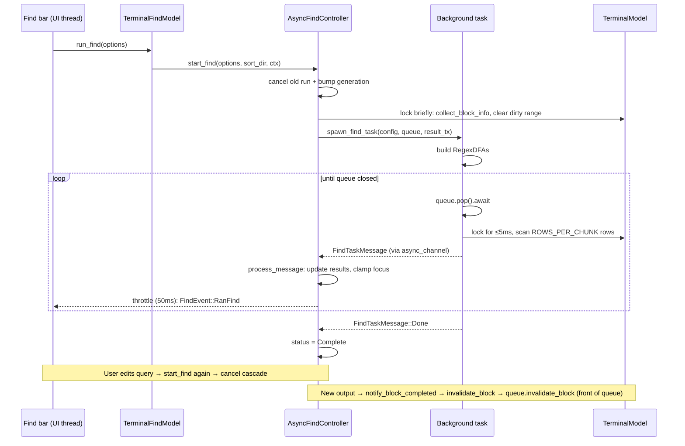

# Async Find — Tech Spec

Companion to `specs/async-find/PRODUCT.md`. This spec is a semantic walkthrough of what changed in the `david/async-find` branch; it should be enough to read the diff in pieces without having to load all ~3k lines into your head at once.

## Context

Sync terminal find lives in `app/src/terminal/find/model/block_list.rs`. `run_find_on_block_list` walks the block height sumtree under `BlockList`, runs `RegexDFAs` against each grid via `GridHandler::find_in_range`, and packs everything into a `BlockListFindRun` (see `app/src/terminal/find/model/block_list.rs (32-114)`). `TerminalFindModel` (in `app/src/terminal/find/model.rs`) is a `ViewHandle`-owned model that holds the latest `BlockListFindRun`, exposes the `FindModel` trait used by `view_components/find.rs`, and is invoked from `TerminalView::run_find` / `rerun_find_on_active_grid` / `focus_next_find_match` / `clear_matches`. Rendering reads matches off the `BlockListFindRun` from `block_list_element.rs` and from `view.rs::scroll_to_match`.

The model is shared across threads as `Arc<FairMutex<TerminalModel>>`, so any background scanner has to coexist with the main thread's writes (ANSI parser appending rows, blocks completing, etc.). Existing `AbsolutePoint` (`app/src/terminal/model/grid/grid_handler.rs (172-233)`) already encodes scrollback-stable row coordinates by adding `num_lines_truncated()` — async find leans on this for incremental updates.

The change introduces an async path that runs alongside the sync one, gated on the `AsyncFind` feature flag. The sync path is left intact and continues to be the only path used when the flag is off; the rendering layer is taught to consume *either* path through a new render-data abstraction.

Most relevant entry points before this branch:

- `app/src/terminal/find/model.rs` — `TerminalFindModel`, the only thing UI code touches
- `app/src/terminal/find/model/block_list.rs` — sync scanner
- `app/src/terminal/block_list_element.rs` — reads `BlockListFindRun` to draw highlights
- `app/src/terminal/view.rs` — `scroll_to_match`, `block_completed_event` handling
- `app/src/view_components/find.rs` — `FindModel` trait + find bar render
- `app/src/terminal/model/grid/grid_handler.rs` — `find_in_range`, `AbsolutePoint`
- `crates/warp_features/src/lib.rs` — feature flag registry

## Proposed changes

### Module layout

A new submodule `app/src/terminal/find/model/async_find/` is added with three files:

- `async_find.rs` — the public API (`AsyncFindController`, `AsyncFindStatus`, `AsyncFindConfig`, `AbsoluteMatch`, `BlockFindResults`, `BlockInfo`).
- `async_find/work_queue.rs` — `FindWorkQueue`, an `Arc<Mutex<…>>` + `event_listener::Event` queue shared between the controller and the background task.
- `async_find/background_task.rs` — the async function spawned via `ctx.spawn(...)` that pulls items off the queue and streams results back over an `async_channel`.

`async_find_tests.rs` (sibling, included via the standard `#[path = "async_find_tests.rs"] mod tests;` pattern) holds 18 unit / integration tests.

### Two find paths in one model

`TerminalFindModel` gains an `async_find_controller: Option<AsyncFindController>` field, populated in `new()` iff `FeatureFlag::AsyncFind.is_enabled()` (`app/src/terminal/find/model.rs:243`). Every existing `TerminalFindModel` method now branches:

```rust path=null start=null
if model.is_alt_screen_active() { /* alt-screen path, unchanged */ }
else if let Some(controller) = &mut self.async_find_controller { /* async path */ }
else { /* legacy sync path, unchanged */ }
```

This keeps the alt-screen and sync paths byte-for-byte identical when the flag is off, and lets the async path be tested independently. Methods updated in this pattern: `match_count`, `active_find_options`, `run_find`, `rerun_find_on_active_grid`, `focus_next_find_match`, `clear_matches`, `update_matches_for_filtered_block` (no-ops on async since invalidation runs through `invalidate_block`). Three new helpers are added: `is_async_find_scanning`, `invalidate_async_find_block`, `notify_block_completed`, plus a `focused_block_list_match()` accessor that abstracts both paths for `view.rs::scroll_to_match`.

### Render data abstraction

`block_list_element.rs` previously reached into `BlockListFindRun` directly. The branch introduces `BlockFindRenderData<'a>` (`app/src/terminal/find/model.rs (44-178)`), an enum with `Sync { run, block_index }` and `Async { command_matches, output_matches, focused_command_range, focused_output_range }` variants. Both expose the same triple of methods (`command_grid_matches`, `output_grid_matches`, `focused_range_for_grid`) so the renderer is path-agnostic. `TerminalFindModel::find_render_data_for_block` produces the right variant based on which controller is present, and pre-converts `AbsoluteMatch → RangeInclusive<Point>` at construction time so the renderer doesn't need a `GridHandler` reference.

This is the only diff in `block_list_element.rs` (besides `GridType` gaining `Hash` for use in `HashMap` keys): replace direct `BlockListFindRun`/`BlockListMatch` usage with `BlockFindRenderData` accessors.

### Controller, queue, background task

`AsyncFindController` owns:

- `terminal_model: Arc<FairMutex<TerminalModel>>` — shared with the background task.
- `block_results: BlockFindResults` — `HashMap<(BlockIndex, GridType), Vec<AbsoluteMatch>>` for terminal matches plus `HashMap<EntityId, Vec<RichContentMatchId>>` for AI matches. Per-block `TotalIndex` maps live alongside so focus traversal can sort by display position.
- `current_config`, `current_find_options`, `block_sort_direction`, `focused_match_index`, `cached_focused_match`, `status`.
- `result_tx`, `throttle_tx`, `task_handle`, `work_queue`, `generation`.

`start_find` (`async_find.rs (607-702)`) is the heart of the controller. It:

1. Cancels any in-flight scan (`cancel_current_find` closes the queue, aborts the future, drops senders).
2. Runs the *query refinement* check (`is_query_refinement` — `new.starts_with(old)` and longer; only triggers when regex is off and case-sensitivity matches). Today this just routes through `filter_results_for_refinement`, which is essentially a clean restart with the new query but is structured so a future commit can swap in true in-place filtering.
3. Builds an `AsyncFindConfig`, takes a brief lock on the terminal model to call `collect_block_info` (newest-first traversal of the block-height sumtree) and to clear stale `find_dirty_rows_range` on the active block's output grid (otherwise the first incremental update would re-scan rows the full scan already covers).
4. Populates the `terminal_total_indices` / `ai_total_indices` maps so `compute_focused_terminal_match` can re-sort results into display order.
5. Creates an unbounded `async_channel` for `FindTaskMessage` results, bumps `generation`, and spawns *two* streams via `ctx.spawn_stream_local`:
   - The result stream calls `process_message` for every message that arrives, but only if its captured `generation` still matches the controller's current `generation` (this is the deduplication mechanism for stale `Done` messages — see Risks).
   - A throttle stream wraps an `async_channel<()>` in `crate::throttle::throttle(50ms)` so rapid result deliveries coalesce into at most one `FindEvent::RanFind` emit every 50 ms.
6. Spawns the background future via `background_task::spawn_find_task`.

`FindWorkQueue` (`work_queue.rs`) is a deliberately small primitive:

- `enqueue_full_scan(blocks)` pushes `FullBlock` / `AIBlock` items at the back, in the newest-first order produced by `collect_block_info`.
- `invalidate_block(idx, dirty_range)` pushes a `DirtyRange` (or `FullBlock` if no range) at the *front*, so reactive work jumps the queue ahead of the initial scan. It is also a no-op if a `FullBlock` for the same block is already pending.
- `pop()` is async and uses `event_listener::Event` to block when empty without busy-waiting. It returns `(item, queue_drained: bool)` so the consumer can decide atomically when to emit `FindTaskMessage::Done` — no separate `is_empty()` call, no TOCTOU race.
- `close()` flips a flag and notifies all listeners so a parked `pop()` returns `Err(QueueClosed)`.

`background_task::run_find_task_loop` (`background_task.rs (56-128)`) builds `RegexDFAs` once from the config, then:

- For `FullBlock { block_index }`: calls `scan_terminal_block_chunked`, which iterates the grid in the block-sort-direction-aware order and delegates each grid to `scan_grid_chunked`.
- For `DirtyRange { … }`: calls `scan_grid_chunked` with the dirty bounds and `ScanResultMode::DirtyRange { num_lines_truncated }` so the controller knows to merge rather than extend.
- For `AIBlock { … }`: forwards the work back to the main thread as a `ScanAIBlock` message — rich content scanning still has to run on the UI thread because it touches `ViewHandle`s.

`scan_grid_chunked` is the only place that holds the terminal-model lock. It scans `ROWS_PER_CHUNK = 1000` rows per pass, converts the resulting `RangeInclusive<Point>`s into `AbsoluteMatch`es while still under the lock (because conversion needs the grid's `num_lines_truncated`), drops the lock, sends a `BlockGridMatches` or `DirtyRangeMatches` message, and yields back to the executor (`futures_lite::yield_now`) if the held lock duration exceeded `MAX_LOCK_DURATION_MS / 2 = 2.5ms`. This is what keeps the main thread responsive — the lock is never held for more than a few hundred microseconds at a time on real workloads.

### `process_message` on the main thread

`AsyncFindController::process_message` (`async_find.rs (708-808)`) handles four message types:

- `BlockGridMatches`: extends the per-grid match vec, lazily fills in `terminal_total_indices` for blocks that arrived after `start_find` (e.g. created mid-scan), auto-focuses index 0 on first arrival, and clamps focus.
- `DirtyRangeMatches`: routes through `BlockFindResults::update_dirty_matches`, which does positional splicing inside the existing match vec (assumes ascending order by end-row, which is guaranteed by `find_in_range` returning non-overlapping descending matches that the task reverses). Then prunes truncated matches and clamps focus.
- `ScanAIBlock`: invokes `FindableRichContentHandle::run_find` on the registered view, stashes results in `ai_matches` + `ai_total_indices`, clamps focus.
- `Done`: flips `status` to `Complete`.

After each message, a `()` is `try_send`-ed into the throttle channel so the find bar gets at most one `FindEvent::RanFind` every 50 ms. The throttle is what produces the streaming-but-not-saturated UI updates.

### Focused match ordering

`compute_focused_terminal_match` (`async_find.rs (506-586)`) is the bit that makes async match traversal match sync match traversal. It builds a unified `(TotalIndex, BlockInfo)` list of every block that has results, sorts descending by `TotalIndex` (newest blocks first), then for each block iterates grids in the order dictated by `block_sort_direction`, reversing within-grid iteration on `MostRecentLast`. The result is cached in `cached_focused_match` and only recomputed when focus or the result set changes — without the cache, `focused_terminal_match()` would re-sort and re-iterate on every render frame. (See commit `32eef7ef31 perf: cache focused_terminal_match() to avoid per-call sorting`.)

### Dirty range plumbing

`GridHandler` gains a `find_dirty_rows_range: Option<RangeInclusive<usize>>` field that accumulates rows touched by ANSI writes between explicit consumes (`grid_handler.rs:1568+`). Existing `dirty_cells_range` is reset every byte-processing pass, so the new field is needed to bridge across many processing passes — find consumes it on its own cadence. `take_find_dirty_rows_range()` is the destructive read used by both `start_find` (to reset stale state) and `notify_block_completed` / `rerun_find_on_active_grid` (to drive incremental updates).

`BlockList::block_at_mut` (`app/src/terminal/model/blocks.rs:1773`) is added to allow `notify_block_completed` to reach into the completed block's grids to consume the dirty range.

### View + UI wiring

Three small changes outside the find module:

- `app/src/terminal/view.rs` — `block_completed_event` now also calls `find_model.notify_block_completed(idx, ctx)` so async find rescans the freshly-finalized block. `scroll_to_match` switches from `block_list_find_run().focused_match()` to the path-agnostic `focused_block_list_match()` accessor.
- `app/src/terminal/block_list_element.rs` — switches highlight rendering to `BlockFindRenderData`. `GridType` gains `Hash` so it can key `BlockFindResults`'s `HashMap`.
- `app/src/view_components/find.rs` — `FindModel` trait gains `is_scanning() -> bool` (default `false`). `render_match_index` checks it and renders `Scanning...` or `<count>+ ...` in place of the `current/total` label.

### Feature flag, build setup

- `crates/warp_features/src/lib.rs` adds `FeatureFlag::AsyncFind` and lists it in `DOGFOOD_FLAGS`.
- `app/Cargo.toml` adds the corresponding `async_find = []` cargo feature, and `app/src/lib.rs::enabled_features()` maps the cargo feature to the runtime flag.
- Top-level `Cargo.toml` bumps `warp_terminal.opt-level = 3` in the `dev` profile because the background task's hot loop (DFA matching against thousands of rows) is intolerably slow under `opt-level = 0`.

### End-to-end flow



## Testing and validation

Tests live in `app/src/terminal/find/model/async_find_tests.rs` and run via `cargo nextest run -p warp_terminal` (or the workspace defaults). Each spec invariant from `PRODUCT.md` is covered:

- **PRODUCT.md (1, 18) — parity with sync find.** `test_async_find_produces_same_results_as_sync_find` runs sync and async over the same mocked block list and asserts identical match counts and ranges. `test_async_focused_order_matches_sync_most_recent_last` and `test_async_focused_order_matches_sync_most_recent_first` lock down focus traversal order against sync for both sort directions.
- **PRODUCT.md (2, 3) — scanning indicator.** `test_async_find_status_display` covers the `AsyncFindStatus` Display impl. `is_scanning()` and `match_count()` thread through the existing `view_components/find.rs` render tests via the `FindModel` trait.
- **PRODUCT.md (5, 6, 7) — focus and wrap.** `test_focus_next_match_wraps_around` covers wrap behavior. `test_message_processing_updates_state` covers auto-focus on first match arrival.
- **PRODUCT.md (8) — cancellation.** `test_async_find_cancellation` starts a scan, cancels it, and asserts `status == Idle` plus that no further messages are processed.
- **PRODUCT.md (9) — query refinement.** `test_is_query_refinement` covers the predicate. End-to-end refinement is exercised implicitly by `start_find` taking the refinement branch.
- **PRODUCT.md (11, 12) — dirty range / block completion.** `test_block_invalidation_with_dirty_range` enqueues an invalidation and asserts the queue receives a `DirtyRange` work item at the front. `test_update_dirty_matches_*` (5 tests: empty / prepend / append / replace_middle / clear_range) lock down `BlockFindResults::update_dirty_matches` since it owns the splicing math.
- **PRODUCT.md (13) — truncation.** `test_absolute_match_is_truncated` covers `AbsoluteMatch::is_truncated`. `prune_truncated_matches` is exercised inside the dirty-range tests.
- **PRODUCT.md (14, 15) — find-in-block + AI blocks.** `test_async_find_config_from_options` covers the option threading; AI block routing is covered by the existing rich-content tests via the `FindableRichContentHandle` trait.
- **PRODUCT.md (16) — alt screen.** Sync alt-screen path is unchanged, covered by existing alt-screen tests.
- **PRODUCT.md (17) — clear / close.** `test_block_find_results_remove_block`, `test_block_find_results_total_count` cover the clearing primitives; the controller-level path is covered in `test_async_find_cancellation`.

Manual validation:

- Build via `cargo run --features async_find` (or rely on the dogfood-flag default-on) on a session with thousands of blocks. Type a query that has matches in old blocks; confirm the input box and block list stay responsive while the count climbs.
- Run a long `find / -name foo` while the find bar is open with an active query; confirm new matches appear in the active block as output streams in.
- Toggle the feature flag off and confirm sync find behavior is bit-identical.

Lint/format:

- `cargo fmt`
- `cargo clippy --workspace --all-targets --all-features --tests -- -D warnings`
- `./script/presubmit`

## Risks and mitigations

1. **Stale `Done` messages from a cancelled scan ending a new one prematurely.** The result stream is created per `start_find` call, but `async_channel`s in flight can outlive the cancel. Each spawn captures the controller's `generation` counter; `process_message` is only called when `controller.generation == captured_generation`. (See commit `b4e69a5390 Avoid explicit polling.`)

2. **Lock contention with the ANSI parser writing to the active block's grid.** Mitigated by the `ROWS_PER_CHUNK = 1000` chunking + `MAX_LOCK_DURATION_MS = 5` budget + `yield_now()` in `scan_grid_chunked`. The terminal model lock is a `FairMutex` so the writer cannot starve. Per `WARP.md`, locking discipline matters: the background task only acquires the lock inside `scan_grid_chunked` and immediately drops it before any await point.

3. **Queue/result race on completion.** The `Done` message is emitted by the background task only when `pop()` returned a drained queue (`queue_drained == true`), checked atomically inside the queue's mutex. This avoids the TOCTOU race of a separate `is_empty()` check.

4. **Match ordering invariants.** `update_dirty_matches` relies on the per-grid match vec being sorted ascending by end-row with non-overlapping ranges. This is asserted with `debug_assert!` after every update. If a future change introduces overlapping matches, the assert fires in dev/test before reaching production.

5. **Truncation during dirty-range scans.** Whenever the active block's output is updated, `prune_truncated_matches` runs on every `DirtyRangeMatches` to drop matches whose start row has been truncated; the focused index is clamped. Without this, `focused_match_index` could point past the end of the result set and `focused_terminal_match()` would return `None` even though there are matches.

6. **Rollout blast radius.** Hidden behind `FeatureFlag::AsyncFind`. The cargo feature `async_find` defaults off; the runtime flag is on for dogfood only. Disabling is a one-line revert (remove from `DOGFOOD_FLAGS`). The sync path is unchanged so the worst-case fallback is "behavior identical to today".

## Follow-ups

- True in-place query refinement (today `filter_results_for_refinement` rescans). The plumbing — `is_query_refinement`, `current_find_options`, the queue's `invalidate_block` — is already in place.
- Move AI block scanning off the main thread (currently still synchronous via `ScanAIBlock` round-trip).
- Promote the flag to `RELEASE_FLAGS` once it has baked in dogfood for a release cycle.
